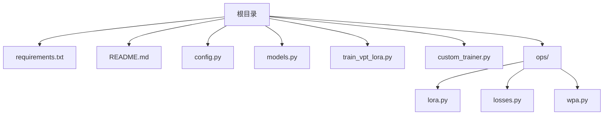
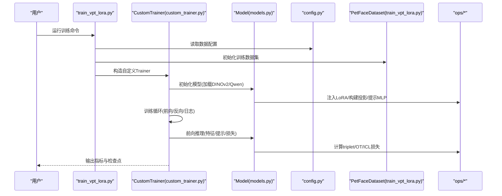
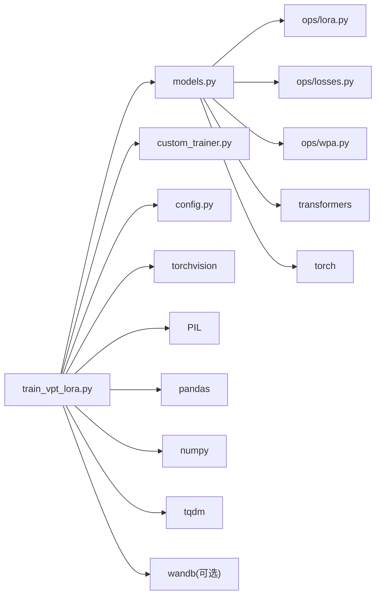
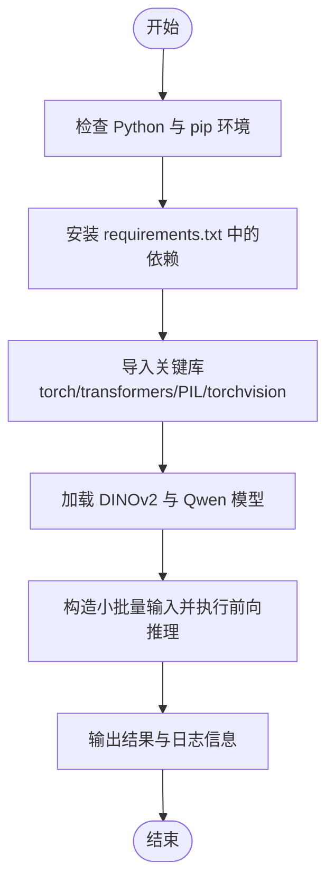

# 安装与环境配置

<cite>
**本文引用的文件**
- [requirements.txt](file://requirements.txt)
- [README.md](file://README.md)
- [config.py](file://config.py)
- [models.py](file://models.py)
- [train_vpt_lora.py](file://train_vpt_lora.py)
- [custom_trainer.py](file://custom_trainer.py)
- [ops/lora.py](file://ops/lora.py)
- [ops/losses.py](file://ops/losses.py)
- [ops/wpa.py](file://ops/wpa.py)
</cite>

## 目录
1. [简介](#简介)
2. [项目结构](#项目结构)
3. [核心组件](#核心组件)
4. [架构总览](#架构总览)
5. [详细组件分析](#详细组件分析)
6. [依赖关系分析](#依赖关系分析)
7. [性能注意事项](#性能注意事项)
8. [故障排查指南](#故障排查指南)
9. [结论](#结论)
10. [附录：最小化验证脚本](#附录最小化验证脚本)

## 简介
本指南面向首次部署 VICP 项目的用户，提供从 Python 环境准备、依赖安装、数据与模型资源准备到 GPU 训练环境配置的完整流程，并给出常见问题排查与最小化验证方法，帮助快速完成本地可用的训练环境搭建。

## 项目结构
仓库采用按功能模块组织的结构：
- 根目录包含入口脚本、配置与训练主程序
- ops 子目录封装了 LoRA、损失函数、评估与 OT 距离计算等可复用组件
- README 提供安装与训练命令示例

图表来源
- [requirements.txt](file://requirements.txt#L1-L2)
- [README.md](file://README.md#L1-L73)
- [config.py](file://config.py#L1-L16)
- [models.py](file://models.py#L1-L291)
- [train_vpt_lora.py](file://train_vpt_lora.py#L1-L295)
- [custom_trainer.py](file://custom_trainer.py#L1-L156)
- [ops/lora.py](file://ops/lora.py#L1-L99)
- [ops/losses.py](file://ops/losses.py#L1-L416)
- [ops/wpa.py](file://ops/wpa.py#L1-L110)

章节来源
- [README.md](file://README.md#L1-L73)

## 核心组件
- 依赖清单与版本约束：通过 requirements.txt 明确 PyTorch 与 Transformers 的版本要求
- 数据配置：通过 config.py 定义数据集根路径、类别划分与默认变换
- 模型定义：models.py 中实现视觉编码器（DINOv2）、LLM（Qwen）与提示注入机制
- 训练入口：train_vpt_lora.py 组织数据加载、模型初始化、训练循环与评估
- 自定义训练器：custom_trainer.py 扩展 Trainer，支持额外损失日志与自定义采样策略
- 可复用组件：ops/lora.py 实现 LoRA 注入；ops/losses.py 提供多种损失；ops/wpa.py 实现最优传输距离

章节来源
- [requirements.txt](file://requirements.txt#L1-L2)
- [config.py](file://config.py#L1-L16)
- [models.py](file://models.py#L1-L291)
- [train_vpt_lora.py](file://train_vpt_lora.py#L1-L295)
- [custom_trainer.py](file://custom_trainer.py#L1-L156)
- [ops/lora.py](file://ops/lora.py#L1-L99)
- [ops/losses.py](file://ops/losses.py#L1-L416)
- [ops/wpa.py](file://ops/wpa.py#L1-L110)

## 架构总览
下图展示训练主流程与关键模块交互关系。

图表来源
- [train_vpt_lora.py](file://train_vpt_lora.py#L1-L295)
- [custom_trainer.py](file://custom_trainer.py#L1-L156)
- [models.py](file://models.py#L1-L291)
- [config.py](file://config.py#L1-L16)
- [ops/lora.py](file://ops/lora.py#L1-L99)
- [ops/losses.py](file://ops/losses.py#L1-L416)
- [ops/wpa.py](file://ops/wpa.py#L1-L110)

## 详细组件分析

### 依赖与安装步骤
- 使用 pip 安装依赖
  - 在项目根目录执行安装命令，自动解析 requirements.txt 并安装指定版本的 PyTorch 与 Transformers
- CUDA 支持
  - 若需 GPU 训练，请确保已正确安装与系统匹配的 CUDA 版本，并在 Python 环境中可用
- 数据集与预训练模型
  - 数据集与检查点可通过提供的链接获取
  - 数据集根路径在 config.py 中配置，训练时会根据该路径读取图像与标注
  - 视觉编码器 DINOv2 与 LLM Qwen 将通过官方 hub 或本地模型路径加载

章节来源
- [requirements.txt](file://requirements.txt#L1-L2)
- [README.md](file://README.md#L14-L54)
- [config.py](file://config.py#L1-L16)
- [models.py](file://models.py#L81-L120)

### 数据集与路径配置
- 数据集名称与划分
  - config.py 中定义了数据集名称、类别划分与根路径
  - 根路径用于定位裁剪后的图像目录
- 训练数据加载
  - train_vpt_lora.py 中的 PetFaceDataset 会按类别读取 CSV 文件并构造样本列表
  - 默认变换由 torchvision.transforms 提供，包含随机裁剪、翻转、颜色抖动、高斯模糊与归一化

章节来源
- [config.py](file://config.py#L1-L16)
- [train_vpt_lora.py](file://train_vpt_lora.py#L85-L130)

### 模型与提示机制
- 视觉编码器（DINOv2）
  - 通过 torch.hub 加载指定变体（如 vitb14），冻结参数并替换部分注意力层为 LoRA
- 大语言模型（Qwen）
  - 使用 AutoModelForCausalLM 与 AutoTokenizer 加载指定权重
- 提示注入与跨模态投影
  - 通过 SimpleQFormer 将视觉特征映射到 LLM 的嵌入空间
  - 通过可学习查询与 prompt_mlp 将语义提示动态注入视觉编码器的多层块中

章节来源
- [models.py](file://models.py#L81-L120)
- [ops/lora.py](file://ops/lora.py#L1-L99)

### 训练流程与日志
- 自定义 Trainer
  - 扩展 Trainer，支持额外损失（如 ICL、ID、OT、STD）的日志聚合
  - 提供自定义采样器，按身份标签重采样以提升训练稳定性
- 训练入口
  - train_vpt_lora.py 解析训练参数，构建数据集与模型，启动训练
  - 支持半精度训练（fp16/bf16），并可选择 W&B 日志

章节来源
- [custom_trainer.py](file://custom_trainer.py#L1-L156)
- [train_vpt_lora.py](file://train_vpt_lora.py#L131-L186)

## 依赖关系分析
- Python 包依赖
  - PyTorch 与 Transformers 为必需依赖，版本在 requirements.txt 中明确
- 运行时依赖
  - torchvision 用于图像变换与数据加载
  - PIL 用于图像读取
  - pandas 用于读取 CSV 列表
  - numpy 用于采样与指标计算
  - tqdm 用于进度条显示
  - wandb（可选）用于实验跟踪
- 外部资源
  - DINOv2 来自 facebookresearch/dinov2
  - Qwen 来自 Hugging Face Hub（如 Qwen/Qwen3-0.6B）

图表来源
- [train_vpt_lora.py](file://train_vpt_lora.py#L1-L295)
- [models.py](file://models.py#L1-L291)
- [custom_trainer.py](file://custom_trainer.py#L1-L156)
- [config.py](file://config.py#L1-L16)
- [ops/lora.py](file://ops/lora.py#L1-L99)
- [ops/losses.py](file://ops/losses.py#L1-L416)
- [ops/wpa.py](file://ops/wpa.py#L1-L110)

章节来源
- [requirements.txt](file://requirements.txt#L1-L2)
- [train_vpt_lora.py](file://train_vpt_lora.py#L1-L295)
- [models.py](file://models.py#L1-L291)
- [custom_trainer.py](file://custom_trainer.py#L1-L156)

## 性能注意事项
- 半精度训练
  - 通过 fp16/bf16 参数启用混合精度，可显著降低显存占用并提升吞吐
- 数据加载优化
  - 建议合理设置 num_workers/persistent_workers/pin_memory，结合数据集规模与磁盘 I/O 调优
- 训练批大小与梯度累积
  - 结合显存上限调整 per_device_train_batch_size 与 gradient_accumulation_steps
- 设备与并行
  - 确保单卡或多卡环境与分布式策略匹配，必要时开启 DDP 并设置 unused_parameters 行为

[本节为通用建议，无需特定文件引用]

## 故障排查指南
- 依赖冲突
  - 现象：安装或导入时报错
  - 排查：核对 requirements.txt 中的版本号；优先使用虚拟环境隔离依赖；尝试先安装 PyTorch 再安装 Transformers
- CUDA 版本不兼容
  - 现象：运行时报 CUDA 不匹配或无法加载 GPU
  - 排查：确认 Python 环境中的 PyTorch 与 CUDA 版本匹配；若使用 conda，确保安装的是与 CUDA 对应的 torch 包
- 模型下载失败
  - 现象：加载 DINOv2/Qwen 时网络超时或权限错误
  - 排查：检查网络代理；手动下载至缓存目录后重试；或在离线环境中提供本地模型路径
- 数据路径错误
  - 现象：找不到图像或 CSV 文件
  - 排查：核对 config.py 中的 root 路径与实际数据布局；确认 split 与 images 子目录存在
- 训练崩溃或显存不足
  - 现象：OOM 或训练中断
  - 排查：减小 batch size、关闭不必要的日志、禁用 bf16/fp16 或切换到 CPU 测试

章节来源
- [README.md](file://README.md#L14-L54)
- [config.py](file://config.py#L1-L16)
- [models.py](file://models.py#L81-L120)

## 结论
通过本指南，您可以在本地完成 VICP 项目的依赖安装、数据与模型资源准备以及 GPU 训练环境配置。建议先进行最小化验证，再逐步扩展到完整训练流程。

[本节为总结性内容，无需特定文件引用]

## 附录：最小化验证脚本
以下脚本用于快速验证环境是否可用，包括依赖导入、模型加载与简单前向推理。请将以下内容保存为独立文件并在项目根目录运行。

图表来源
- [requirements.txt](file://requirements.txt#L1-L2)
- [models.py](file://models.py#L81-L120)
- [train_vpt_lora.py](file://train_vpt_lora.py#L131-L186)

操作步骤
- 准备虚拟环境并激活
- 在项目根目录执行安装命令以安装依赖
- 运行最小化验证脚本，观察是否成功导入库、加载模型并完成前向推理
- 如遇报错，参考“故障排查指南”逐项检查

章节来源
- [requirements.txt](file://requirements.txt#L1-L2)
- [models.py](file://models.py#L81-L120)
- [train_vpt_lora.py](file://train_vpt_lora.py#L131-L186)