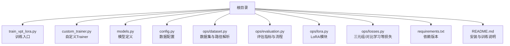
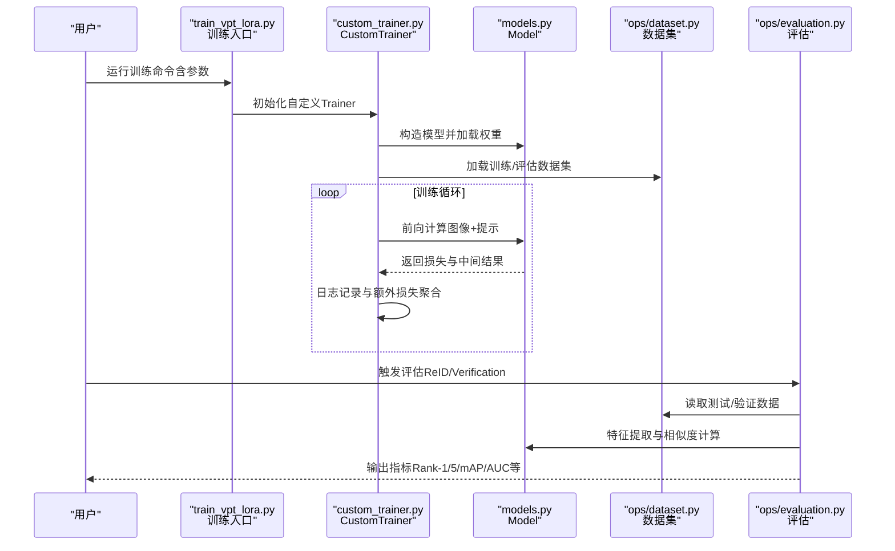
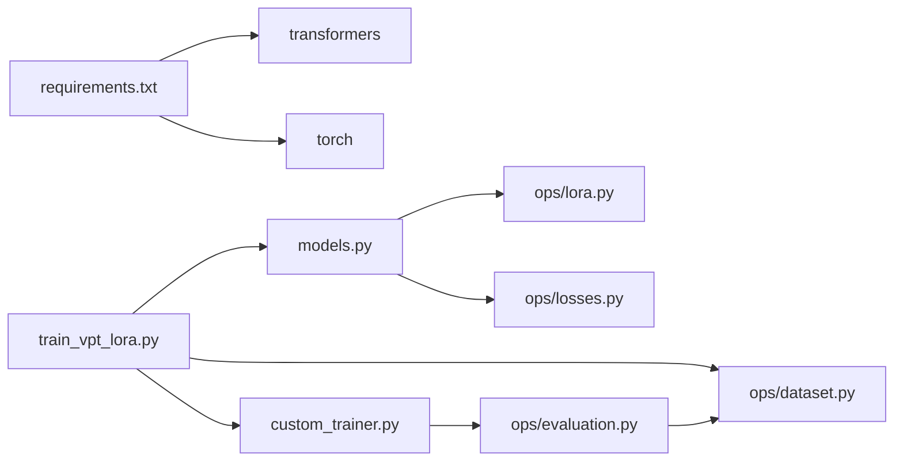

# 常见问题与故障排除

<cite>
**本文引用的文件**
- [README.md](file://README.md)
- [requirements.txt](file://requirements.txt)
- [config.py](file://config.py)
- [train_vpt_lora.py](file://train_vpt_lora.py)
- [custom_trainer.py](file://custom_trainer.py)
- [models.py](file://models.py)
- [ops/dataset.py](file://ops/dataset.py)
- [ops/evaluation.py](file://ops/evaluation.py)
- [ops/lora.py](file://ops/lora.py)
- [ops/losses.py](file://ops/losses.py)
</cite>

## 目录
1. [简介](#简介)
2. [项目结构](#项目结构)
3. [核心组件](#核心组件)
4. [架构总览](#架构总览)
5. [详细组件分析](#详细组件分析)
6. [依赖关系分析](#依赖关系分析)
7. [性能考虑](#性能考虑)
8. [故障排除指南](#故障排除指南)
9. [结论](#结论)
10. [附录](#附录)

## 简介
本指南面向使用 VICP 的研究者与工程师，系统整理训练、评估与推理阶段常见的问题与解决方法。内容覆盖环境配置、显存与内存问题、训练异常（损失不下降、梯度爆炸/消失）、评估失败（数据路径错误、类别匹配失败）等，并提供基于仓库代码的错误日志分析方法与可操作的调试步骤。同时给出性能优化建议（如梯度累积、数据加载器 worker 数量、混合精度等），并鼓励通过 GitHub Issues 提交新问题以持续完善。

## 项目结构
- 根目录包含训练入口、配置、模型与自定义训练器等核心模块。
- ops 子目录封装数据集、评估、LoRA 适配层与损失函数等通用能力。
- README 提供安装与训练命令示例；requirements.txt 明确依赖版本。

图表来源
- [train_vpt_lora.py](file://train_vpt_lora.py#L1-L295)
- [custom_trainer.py](file://custom_trainer.py#L1-L156)
- [models.py](file://models.py#L1-L291)
- [config.py](file://config.py#L1-L16)
- [ops/dataset.py](file://ops/dataset.py#L1-L178)
- [ops/evaluation.py](file://ops/evaluation.py#L1-L482)
- [ops/lora.py](file://ops/lora.py#L1-L99)
- [ops/losses.py](file://ops/losses.py#L1-L416)
- [requirements.txt](file://requirements.txt#L1-L2)
- [README.md](file://README.md#L1-L73)

章节来源
- [README.md](file://README.md#L1-L73)
- [requirements.txt](file://requirements.txt#L1-L2)

## 核心组件
- 训练入口与参数：训练脚本定义了训练参数、数据集选择、评估策略、混合精度、梯度累积步数等关键配置项。
- 自定义Trainer：扩展了日志记录、额外损失聚合、自定义采样器等功能。
- 模型：包含视觉编码器（DINOv2）、LLM（Qwen/Qwen3）、跨模态投影与提示注入（VPT）机制，以及多种损失（ID、OT、ICL、标准差正则）。
- 数据集与评估：提供训练/验证/测试数据集读取、特征提取与 ReID 指标计算（Rank-1/5、mAP）。
- LoRA 与损失：LoRA 低秩适配注入到视觉编码器注意力 QKV；损失包括三元组损失等。

章节来源
- [train_vpt_lora.py](file://train_vpt_lora.py#L131-L295)
- [custom_trainer.py](file://custom_trainer.py#L34-L156)
- [models.py](file://models.py#L81-L269)
- [ops/dataset.py](file://ops/dataset.py#L1-L178)
- [ops/evaluation.py](file://ops/evaluation.py#L360-L482)
- [ops/lora.py](file://ops/lora.py#L1-L99)
- [ops/losses.py](file://ops/losses.py#L279-L348)

## 架构总览
训练与评估的关键交互如下：

图表来源
- [train_vpt_lora.py](file://train_vpt_lora.py#L131-L295)
- [custom_trainer.py](file://custom_trainer.py#L34-L156)
- [models.py](file://models.py#L159-L269)
- [ops/dataset.py](file://ops/dataset.py#L1-L178)
- [ops/evaluation.py](file://ops/evaluation.py#L165-L223)

## 详细组件分析

### 训练入口与参数（train_vpt_lora.py）
- 关键参数（来自 README 示例命令与脚本定义）：
  - 混合精度：fp16/bf16
  - 批大小：per_device_train_batch_size
  - 梯度累积：gradient_accumulation_steps
  - 数据加载器：num_workers/persistent_workers/pin_memory
  - 优化器与调度器：Adam/constant scheduler
  - 日志与保存：logging_strategy/save_strategy/eval_strategy
  - ICL/OT/ID 损失权重：icl_loss_weight/ot_loss_weight
- 训练时序：
  - 构造 MyTrainTask（继承自 CustomTrainer）
  - 初始化模型（支持半精度与设备迁移）
  - 定义优化器与额外损失列表
  - 调用 Trainer.train() 开始训练

章节来源
- [README.md](file://README.md#L24-L54)
- [train_vpt_lora.py](file://train_vpt_lora.py#L131-L187)
- [train_vpt_lora.py](file://train_vpt_lora.py#L283-L295)

### 自定义Trainer（custom_trainer.py）
- 功能要点：
  - 额外损失聚合：在训练开始时初始化 extra_losses 字典，在每步累加并按步均值化后写入日志。
  - 日志与保存：在_should_log阶段汇总 loss、grad_norm、学习率与额外损失；在_should_save阶段保存检查点。
  - 评估：调用 ops.evaluation.evaluate_verification 或 ReID 评估流程。
  - 自定义采样器：按 PID 重采样，保证批次内类别分布与批大小可控。

章节来源
- [custom_trainer.py](file://custom_trainer.py#L25-L156)

### 模型（models.py）
- 组件：
  - 视觉编码器：从 facebookresearch/dinov2 加载指定变体，冻结参数。
  - LoRA 注入：对最后若干块的注意力 QKV 使用 LoRA 层替换。
  - ICL 生成提示：基于少量样本与 LLM 的 few-shot 推理生成提示向量。
  - VPT 注入：将提示拼接至视觉特征序列，逐层注入到编码器 blocks。
  - 损失：ID 损失（三元组）、OT 损失（Wasserstein Pairwise Alignment）、ICL 损失、特征标准差正则。
- 前向流程：
  - 若提供 labels 且无 prompts：抽取少量图像特征，构造 ICL 输入，前向 LLM 得到提示 hidden states，映射为提示嵌入。
  - 将提示按层拼接回视觉特征序列，逐层前向编码器，得到 patch 与 cls 特征，归一化后用于下游任务。

章节来源
- [models.py](file://models.py#L81-L269)
- [ops/lora.py](file://ops/lora.py#L58-L99)
- [ops/losses.py](file://ops/losses.py#L279-L348)

### 数据集与评估（ops/dataset.py, ops/evaluation.py）
- 数据集：
  - PetFaceTrainDataset/PetFaceDataset：从 split/train.csv 读取文件名，构建 label2images 映射，支持按 ID 采样双图。
  - PetFaceReIDEvalDataset：从 split/test.txt 读取测试样本，返回图像与 PID。
  - PetFaceEvalDataset：从 verification.csv 读取成对样本与标签。
- 评估：
  - ReID 评估：对每个类别构造数据集，提取特征并计算 Rank-1/5 与 mAP。
  - Verification 评估：对成对样本计算特征并 ROC/AUC/ACC。
  - compute_rank1_rank5_map：逐查询计算相似度并统计指标。

章节来源
- [ops/dataset.py](file://ops/dataset.py#L1-L178)
- [ops/evaluation.py](file://ops/evaluation.py#L165-L223)
- [ops/evaluation.py](file://ops/evaluation.py#L360-L482)

## 依赖关系分析
- Python 依赖版本要求明确（transformers==4.57.0，torch==2.6.0），建议严格遵循以避免兼容性问题。
- 训练入口依赖自定义Trainer与模型；模型依赖 LoRA 与损失模块；评估依赖数据集与指标计算。

图表来源
- [requirements.txt](file://requirements.txt#L1-L2)
- [train_vpt_lora.py](file://train_vpt_lora.py#L131-L187)
- [custom_trainer.py](file://custom_trainer.py#L34-L156)
- [models.py](file://models.py#L81-L269)
- [ops/lora.py](file://ops/lora.py#L1-L99)
- [ops/losses.py](file://ops/losses.py#L1-L416)
- [ops/dataset.py](file://ops/dataset.py#L1-L178)
- [ops/evaluation.py](file://ops/evaluation.py#L165-L223)

章节来源
- [requirements.txt](file://requirements.txt#L1-L2)
- [train_vpt_lora.py](file://train_vpt_lora.py#L131-L187)
- [custom_trainer.py](file://custom_trainer.py#L34-L156)
- [models.py](file://models.py#L81-L269)
- [ops/dataset.py](file://ops/dataset.py#L1-L178)
- [ops/evaluation.py](file://ops/evaluation.py#L165-L223)

## 性能考虑
- 混合精度与设备：
  - 使用 fp16 或 bf16 可显著降低显存占用与加速训练；注意部分参数在构建模型时被强制转为 float32。
- 梯度累积：
  - 通过 gradient_accumulation_steps 放大有效批大小，缓解单卡显存不足。
- 数据加载器：
  - num_workers 建议设置为较高值（如 16）以提升吞吐；persistent_workers 在多轮训练中保持 worker 进程可减少开销。
  - pin_memory 可在 GPU 内存充足时启用以加速主机到设备传输。
- 批大小与采样：
  - per_device_train_batch_size 与梯度累积共同决定实际 batch size；自定义采样器按 PID 重采样，有助于稳定训练。
- ICL 与 OT 损失：
  - ICL 样本数与 batch size（num_icl_bs/num_icl_samples）影响显存与时间；OT 损失涉及成对样本采样，注意控制规模。
- 评估阶段：
  - ReID 评估使用较大的 batch size（如 256）与高 num_workers，确保特征提取效率。

章节来源
- [README.md](file://README.md#L24-L54)
- [train_vpt_lora.py](file://train_vpt_lora.py#L131-L187)
- [custom_trainer.py](file://custom_trainer.py#L121-L156)
- [ops/evaluation.py](file://ops/evaluation.py#L165-L223)

## 故障排除指南

### 环境配置类问题
- 依赖冲突或版本不匹配
  - 现象：导入 transformers/torch 报错或运行时报错。
  - 解决：严格安装 requirements.txt 中的版本，确保 Python 环境隔离。
  - 参考路径：[requirements.txt](file://requirements.txt#L1-L2)
- CUDA out of memory（显存不足）
  - 现象：OOM 错误，训练中断。
  - 解决步骤：
    - 降低 per_device_train_batch_size 或增大 gradient_accumulation_steps，保持有效 batch size 不变。
    - 关闭 fp16/bf16 或切换到 bf16（若硬件支持）。
    - 减少 num_workers 或关闭 persistent_workers/pin_memory。
    - 降低 ICL 样本数（num_icl_samples/num_icl_bs）。
    - 评估阶段适当降低 batch size（如 128）。
  - 参考路径：
    - [README.md](file://README.md#L24-L54)
    - [train_vpt_lora.py](file://train_vpt_lora.py#L131-L187)
    - [custom_trainer.py](file://custom_trainer.py#L121-L156)
    - [ops/evaluation.py](file://ops/evaluation.py#L165-L223)

### 训练异常类问题
- 损失不下降或停滞
  - 现象：训练日志显示 loss 不变化或波动很小。
  - 可能原因与排查：
    - 学习率过小或过大：尝试调整 learning_rate。
    - 梯度爆炸/消失：检查 max_grad_norm 设置；必要时启用梯度裁剪。
    - ICL/OT 损失权重不当：调整 icl_loss_weight、ot_loss_weight。
    - 数据不平衡：检查自定义采样器是否按 PID 平衡。
  - 参考路径：
    - [train_vpt_lora.py](file://train_vpt_lora.py#L131-L187)
    - [custom_trainer.py](file://custom_trainer.py#L60-L103)
    - [ops/losses.py](file://ops/losses.py#L279-L348)
- 梯度爆炸
  - 现象：grad_norm 异常增大，loss NaN。
  - 解决步骤：
    - 设置合理的 max_grad_norm（如 1.0）。
    - 降低学习率或启用梯度累积。
    - 检查输入数据是否归一化与尺寸一致。
  - 参考路径：
    - [custom_trainer.py](file://custom_trainer.py#L60-L103)

### 评估失败类问题
- 数据路径错误
  - 现象：打开文件失败、找不到 split/test.txt/verification.csv。
  - 解决步骤：
    - 检查 config.py 中 dataset_name 对应的 root 路径是否正确。
    - 确认 split/train.csv、split/test.txt、split/verification.csv 是否存在。
    - 确认 images 目录下文件路径与 CSV 中记录一致。
  - 参考路径：
    - [config.py](file://config.py#L1-L16)
    - [ops/dataset.py](file://ops/dataset.py#L1-L178)
- 类别匹配失败
  - 现象：评估指标为空或类别未覆盖。
  - 解决步骤：
    - 确认评估类别列表与训练类别一致，且不在交叉验证屏蔽范围内。
    - 检查 cluster_index 参数是否导致类别过滤。
  - 参考路径：
    - [train_vpt_lora.py](file://train_vpt_lora.py#L196-L205)
    - [ops/evaluation.py](file://ops/evaluation.py#L433-L482)

### 错误日志分析方法
- 如何根据 traceback 定位问题源头：
  - 训练阶段：关注 CustomTrainer._maybe_log_save_evaluate 中的日志输出，结合 compute_loss 的额外损失聚合，定位异常损失项。
  - 数据阶段：关注 ops/dataset.py 的 __getitem__ 与路径拼接逻辑，确认文件是否存在。
  - 模型阶段：关注 models.py 的 forward 流程，尤其是 ICL 生成提示与 VPT 注入位置。
- 建议的最小复现步骤：
  - 固定随机种子，使用小批量数据与较小 num_workers 快速复现。
  - 逐步注释掉 ICL/OT 损失，判断是哪一部分导致异常。
- 参考路径：
  - [custom_trainer.py](file://custom_trainer.py#L60-L103)
  - [ops/dataset.py](file://ops/dataset.py#L1-L178)
  - [models.py](file://models.py#L159-L269)

### 其他常见问题
- 多进程/分布式相关
  - 若使用 DDP，注意 ddp_find_unused_parameters 的设置与 num_processes 的一致性。
- 权重保存格式
  - save_safetensors 影响保存格式，建议在需要跨平台兼容时开启。
- W&B 日志
  - report_to=wandb 需要正确配置环境变量与项目名称。

章节来源
- [README.md](file://README.md#L24-L54)
- [custom_trainer.py](file://custom_trainer.py#L60-L103)
- [ops/dataset.py](file://ops/dataset.py#L1-L178)
- [models.py](file://models.py#L159-L269)

## 结论
本指南基于 VICP 代码库梳理了训练与评估过程中的高频问题与解决思路。建议优先从环境版本、显存与批大小、数据路径与类别匹配入手排查，再结合日志与最小复现定位具体模块。对于性能优化，建议综合使用混合精度、梯度累积、合理设置数据加载器参数与损失权重。

## 附录
- 提交新问题：欢迎通过 GitHub Issues 提交未在此文档覆盖的新问题，以便持续完善本指南。
- 参考命令：训练命令与参数示例请参考 README 的“Training”部分。

章节来源
- [README.md](file://README.md#L24-L54)