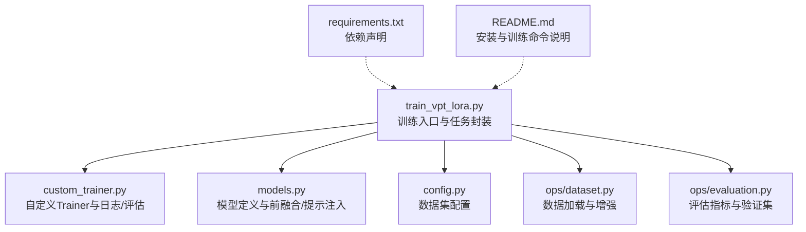
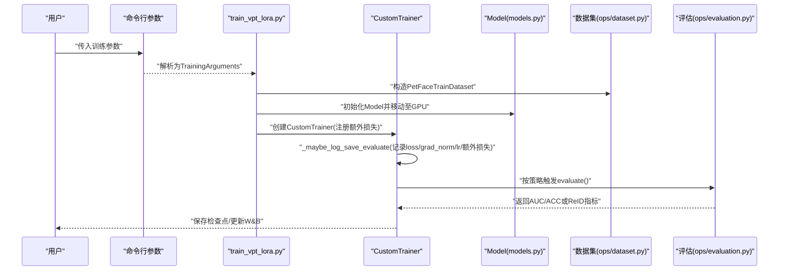
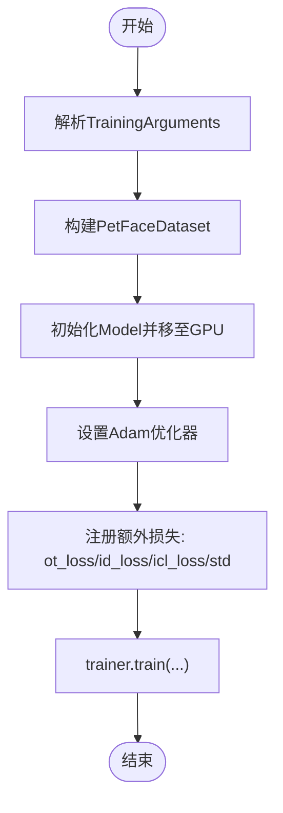
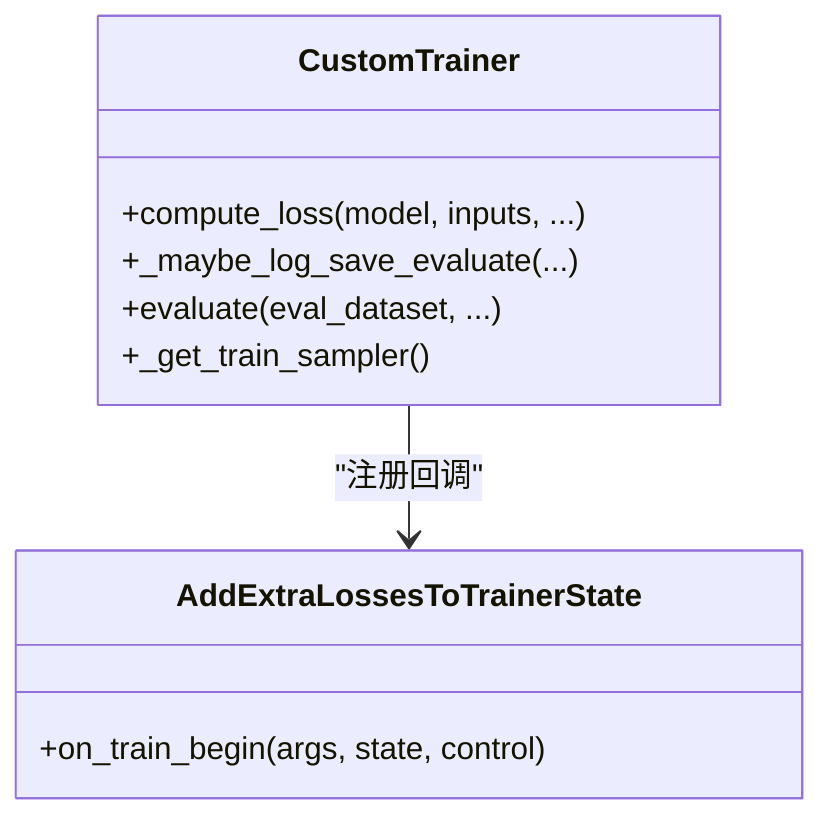
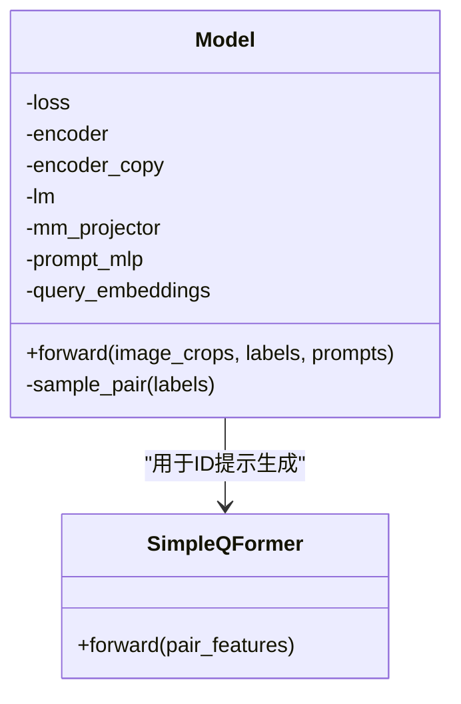
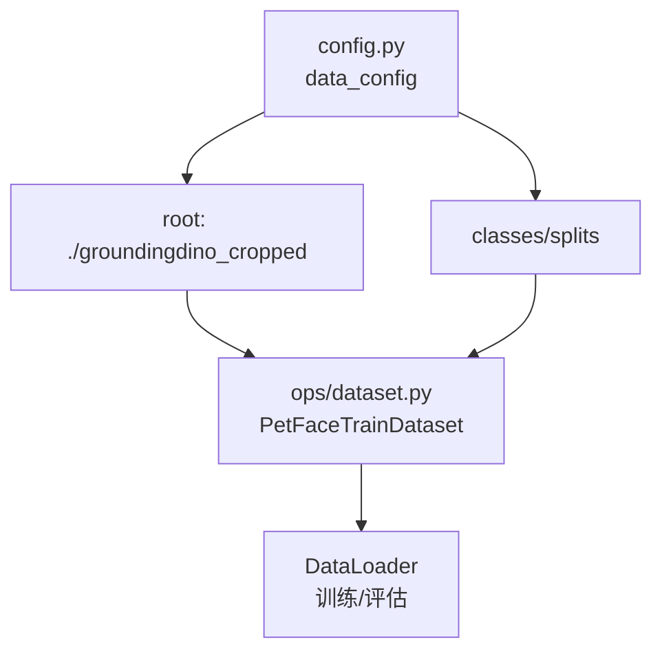
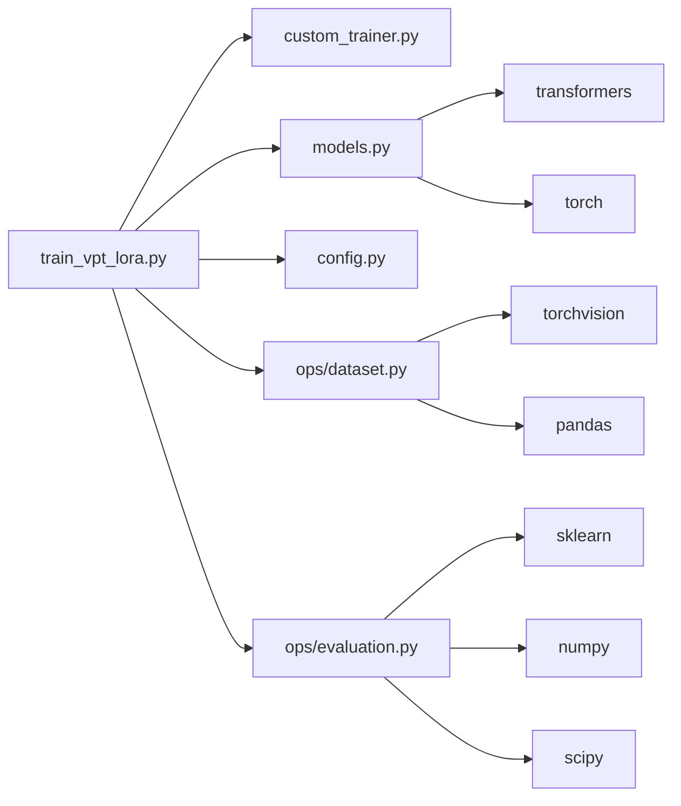

# 快速入门指南

<cite>
**本文引用的文件**
- [README.md](file://README.md)
- [requirements.txt](file://requirements.txt)
- [train_vpt_lora.py](file://train_vpt_lora.py)
- [config.py](file://config.py)
- [custom_trainer.py](file://custom_trainer.py)
- [models.py](file://models.py)
- [ops/dataset.py](file://ops/dataset.py)
- [ops/evaluation.py](file://ops/evaluation.py)
</cite>

## 目录
1. [简介](#简介)
2. [项目结构](#项目结构)
3. [核心组件](#核心组件)
4. [架构总览](#架构总览)
5. [详细组件分析](#详细组件分析)
6. [依赖关系分析](#依赖关系分析)
7. [性能与资源要求](#性能与资源要求)
8. [快速开始：一键式命令](#快速开始一键式命令)
9. [训练日志与指标解读](#训练日志与指标解读)
10. [监控训练进度（WandB）](#监控训练进度wandb)
11. [模型保存与输出路径](#模型保存与输出路径)
12. [最小化测试案例](#最小化测试案例)
13. [故障排查](#故障排查)
14. [结论](#结论)

## 简介
本指南面向首次接触 VICP 训练流程的新用户，帮助你在最短时间内完成环境准备、数据准备与训练启动，并理解关键日志指标与监控方式。VICP 是一种通过“视觉上下文提示”实现跨类别的可泛化目标重识别方法，训练脚本基于 Hugging Face Transformers 的 Trainer 进行扩展，结合 LoRA 微调与 Dinov2 视觉编码器，支持在 Amazon 数据集上进行端到端训练。

## 项目结构
- 根目录包含训练入口、配置、自定义 Trainer、模型定义与若干工具模块。
- 数据集组织遵循特定目录结构（见下节），训练脚本会从配置中读取类别划分与根路径。

图表来源
- [train_vpt_lora.py](file://train_vpt_lora.py#L1-L295)
- [custom_trainer.py](file://custom_trainer.py#L1-L156)
- [models.py](file://models.py#L1-L291)
- [config.py](file://config.py#L1-L16)
- [ops/dataset.py](file://ops/dataset.py#L1-L178)
- [ops/evaluation.py](file://ops/evaluation.py#L1-L482)
- [requirements.txt](file://requirements.txt#L1-L2)
- [README.md](file://README.md#L1-L73)

章节来源
- [README.md](file://README.md#L1-L73)
- [requirements.txt](file://requirements.txt#L1-L2)
- [train_vpt_lora.py](file://train_vpt_lora.py#L1-L295)
- [config.py](file://config.py#L1-L16)
- [custom_trainer.py](file://custom_trainer.py#L1-L156)
- [models.py](file://models.py#L1-L291)
- [ops/dataset.py](file://ops/dataset.py#L1-L178)
- [ops/evaluation.py](file://ops/evaluation.py#L1-L482)

## 核心组件
- 训练入口与任务封装：负责解析参数、构建数据集、实例化模型与优化器、启动训练循环。
- 自定义 Trainer：扩展日志记录，聚合额外损失项（如 icl_loss、ot_loss、id_loss、std），并按策略保存检查点。
- 模型定义：基于 Dinov2 编码器与 LoRA 注入，结合 Q-Former 与 LLM 提示生成，实现动态视觉提示。
- 数据配置与加载：从配置中读取类别划分与根路径，构造训练/评估数据集。
- 评估模块：提供验证集与 ReID 指标计算（AUC/ACC、Rank-1/Rank-5/mAP）。

章节来源
- [train_vpt_lora.py](file://train_vpt_lora.py#L131-L295)
- [custom_trainer.py](file://custom_trainer.py#L34-L156)
- [models.py](file://models.py#L81-L269)
- [config.py](file://config.py#L3-L16)
- [ops/dataset.py](file://ops/dataset.py#L1-L178)
- [ops/evaluation.py](file://ops/evaluation.py#L165-L219)

## 架构总览
训练流程从命令行参数解析开始，构建数据集与模型，随后进入自定义 Trainer 的训练循环。Trainer 在每次日志步长时汇总主损失与额外损失，并根据策略触发评估与保存。

图表来源
- [train_vpt_lora.py](file://train_vpt_lora.py#L131-L295)
- [custom_trainer.py](file://custom_trainer.py#L60-L120)
- [models.py](file://models.py#L81-L269)
- [ops/dataset.py](file://ops/dataset.py#L92-L160)
- [ops/evaluation.py](file://ops/evaluation.py#L165-L219)

## 详细组件分析

### 训练入口与任务封装（train_vpt_lora.py）
- 参数解析：使用 HfArgumentParser 解析 TrainingArguments，包含数据集名称、学习率、批次大小、梯度累积、保存策略、W&B 报告等。
- 数据集构建：依据 config 中的 classes/splits 与 root 路径，构造 PetFaceDataset（按 ID 采样正负对）。
- 模型与优化器：实例化 Model 并设置 Adam 优化器；注册额外损失项（ot_loss、id_loss、icl_loss、std）。
- 训练循环：调用 Trainer.train(resume_from_checkpoint=...) 启动训练。

图表来源
- [train_vpt_lora.py](file://train_vpt_lora.py#L131-L186)
- [train_vpt_lora.py](file://train_vpt_lora.py#L283-L295)

章节来源
- [train_vpt_lora.py](file://train_vpt_lora.py#L131-L186)
- [train_vpt_lora.py](file://train_vpt_lora.py#L283-L295)

### 自定义 Trainer（custom_trainer.py）
- compute_loss 扩展：当模型输出为字典时，自动收集额外损失项并按梯度累积步数平均。
- 日志记录：在_should_log 时，记录 loss、grad_norm、learning_rate，并聚合额外损失项。
- 评估与保存：按策略触发 evaluate 与 _save_checkpoint，支持 resume_from_checkpoint。

图表来源
- [custom_trainer.py](file://custom_trainer.py#L25-L120)

章节来源
- [custom_trainer.py](file://custom_trainer.py#L34-L120)

### 模型定义（models.py）
- 编码器：加载 Facebook Research 的 Dinov2 模型，冻结参数并在最后若干块中以 LoRA 替换注意力 QKV。
- ICL 与提示：使用 LLM 与 Q-Former 生成 ID 提示与视觉提示，拼接至视觉特征序列中。
- 损失函数：HardTripletLoss（id_loss）、WPA（ot_loss）、对比学习损失（icl_loss）组合为总损失。

图表来源
- [models.py](file://models.py#L81-L269)

章节来源
- [models.py](file://models.py#L81-L269)

### 数据配置与加载（config.py, ops/dataset.py）
- config.py：定义数据集名称、类别划分、根路径等。
- ops/dataset.py：PetFaceTrainDataset 支持按 ID 采样正负对，提供图像增强与标签映射。

图表来源
- [config.py](file://config.py#L3-L16)
- [ops/dataset.py](file://ops/dataset.py#L92-L160)

章节来源
- [config.py](file://config.py#L3-L16)
- [ops/dataset.py](file://ops/dataset.py#L1-L178)

### 评估模块（ops/evaluation.py）
- evaluate_verification：对多类别验证集计算 AUC/ACC。
- evaluate_reid：对 ReID 测试集计算 Rank-1/Rank-5/mAP。

章节来源
- [ops/evaluation.py](file://ops/evaluation.py#L165-L219)
- [ops/evaluation.py](file://ops/evaluation.py#L433-L482)

## 依赖关系分析
- train_vpt_lora.py 依赖 custom_trainer、models、config 与 ops 下的数据与评估模块。
- custom_trainer.py 继承自 transformers.Trainer，扩展日志与评估逻辑。
- models.py 依赖 transformers（AutoModelForCausalLM）、torch、torchvision 等。
- ops/dataset.py 依赖 torchvision.transforms、PIL、pandas 等。
- ops/evaluation.py 依赖 sklearn、scipy、torch 等。

图表来源
- [train_vpt_lora.py](file://train_vpt_lora.py#L1-L60)
- [custom_trainer.py](file://custom_trainer.py#L1-L20)
- [models.py](file://models.py#L1-L20)
- [ops/dataset.py](file://ops/dataset.py#L1-L20)
- [ops/evaluation.py](file://ops/evaluation.py#L1-L20)

章节来源
- [train_vpt_lora.py](file://train_vpt_lora.py#L1-L60)
- [custom_trainer.py](file://custom_trainer.py#L1-L20)
- [models.py](file://models.py#L1-L20)
- [ops/dataset.py](file://ops/dataset.py#L1-L20)
- [ops/evaluation.py](file://ops/evaluation.py#L1-L20)

## 性能与资源要求
- Python 版本：建议使用与依赖匹配的 Python 环境（参考 requirements.txt）。
- PyTorch 版本：与 requirements.txt 中声明的版本一致。
- GPU：训练需要可用的 CUDA 设备；训练脚本默认将模型与张量移动至 GPU。
- 内存：大批次与高分辨率输入会增加显存占用，建议根据显存调整 per_device_train_batch_size。
- 数据集：需准备符合 config.py 中 root 与 split/train.csv 结构的数据集目录。

章节来源
- [requirements.txt](file://requirements.txt#L1-L2)
- [train_vpt_lora.py](file://train_vpt_lora.py#L169-L175)
- [config.py](file://config.py#L13-L16)

## 快速开始：一键式命令
以下命令序列可在本地环境中直接执行，完成依赖安装、数据准备与训练启动。请先确认已安装 Python 与 pip，并具备可用的 CUDA 环境。

- 安装依赖
  - 使用 requirements.txt 安装指定版本的 transformers 与 torch
  - 参考路径：[requirements.txt](file://requirements.txt#L1-L2)

- 准备数据集
  - 将数据集解压至根目录下的 groundingdino_cropped 目录
  - 目录结构应包含 split/<类别>/train.csv 与 images 子目录
  - 参考路径：[config.py](file://config.py#L13-L16)

- 启动训练
  - 使用 README 中提供的训练命令模板，替换 output_dir 为你的实际保存路径
  - 参考路径：[README.md](file://README.md#L24-L54)

- 可选：使用 W&B 监控
  - 在训练命令中添加 --report_to wandb，并确保已在本地配置好 W&B
  - 参考路径：[README.md](file://README.md#L38-L38)

章节来源
- [README.md](file://README.md#L14-L54)
- [requirements.txt](file://requirements.txt#L1-L2)
- [config.py](file://config.py#L13-L16)

## 训练日志与指标解读
训练过程中，自定义 Trainer 会在日志步长输出以下关键指标：
- loss：主损失值（由 Trainer 计算），反映整体训练误差。
- grad_norm：梯度范数，用于监控梯度爆炸/消失风险。
- learning_rate：当前学习率，通常为常数调度。
- 额外损失项：icl_loss（提示一致性损失）、ot_loss（最优传输损失）、id_loss（ID三元组损失）、std（特征标准差）。

这些指标由自定义 Trainer 的日志记录逻辑输出，便于快速定位训练稳定性与收敛情况。

章节来源
- [custom_trainer.py](file://custom_trainer.py#L60-L94)

## 监控训练进度（WandB）
- 在训练命令中添加 --report_to wandb，即可将 loss、grad_norm、learning_rate 以及额外损失项上传至 W&B。
- 训练入口会设置 WANDB_PROJECT 为 ObjectReID，便于在 W&B 项目中查看实验。
- 若未配置 W&B，可跳过该选项或安装并登录 W&B 后再运行。

章节来源
- [README.md](file://README.md#L38-L38)
- [train_vpt_lora.py](file://train_vpt_lora.py#L287-L287)

## 模型保存与输出路径
- 输出目录由 --output_dir 指定，Trainer 会在此目录下保存检查点与日志。
- 保存策略由 --save_strategy 与 --save_steps 控制，默认每 1000 步保存一次。
- 可通过 --resume_from_checkpoint 恢复训练，继续从断点处继续训练。

章节来源
- [README.md](file://README.md#L39-L54)
- [train_vpt_lora.py](file://train_vpt_lora.py#L292-L294)
- [custom_trainer.py](file://custom_trainer.py#L99-L102)

## 最小化测试案例
为验证环境正确性，建议使用小规模数据与极短训练步数进行一轮快速训练：
- 将 per_device_train_batch_size 调整为较小值（如 8 或 16）。
- 将 max_steps 设置为较小值（如 10-50）。
- 将 dataloader_num_workers 适当降低（如 2）。
- 保持 fp16=True 以节省显存。
- 使用 --report_to wandb 可观察指标变化。

上述参数均可在 README 的训练命令模板中找到对应位置进行修改。

章节来源
- [README.md](file://README.md#L24-L54)

## 故障排查
- 依赖不匹配
  - 确认 transformers 与 torch 版本与 requirements.txt 一致
  - 参考路径：[requirements.txt](file://requirements.txt#L1-L2)
- 数据路径错误
  - 确认 config.py 中 root 指向正确的数据根目录
  - 确认 split/<类别>/train.csv 与 images 目录存在
  - 参考路径：[config.py](file://config.py#L13-L16)
- GPU 显存不足
  - 降低 per_device_train_batch_size 或关闭 fp16
  - 减少 dataloader_num_workers
  - 参考路径：[README.md](file://README.md#L39-L54)
- 训练中断后恢复
  - 使用 --resume_from_checkpoint 指向已有检查点目录
  - 参考路径：[train_vpt_lora.py](file://train_vpt_lora.py#L292-L294)
- 指标异常
  - 关注 grad_norm 是否过大（梯度爆炸）或过小（梯度消失）
  - 检查学习率与损失权重设置是否合理
  - 参考路径：[custom_trainer.py](file://custom_trainer.py#L60-L94)

## 结论
通过本指南，你可以在本地快速完成 VICP 训练环境搭建与一次完整的训练流程。建议先以小批量与短步数进行测试，确认数据与依赖无误后再扩大规模。训练期间可通过 W&B 实时监控关键指标，训练完成后在 output_dir 查看保存的检查点与日志。