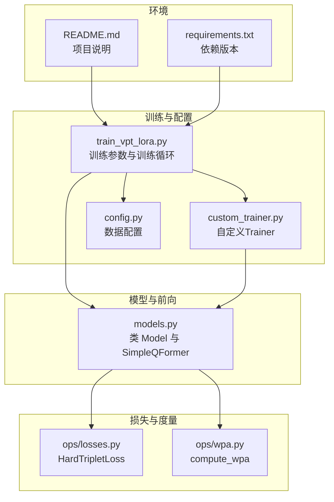
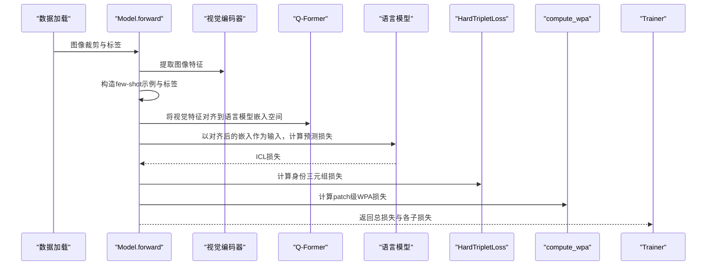
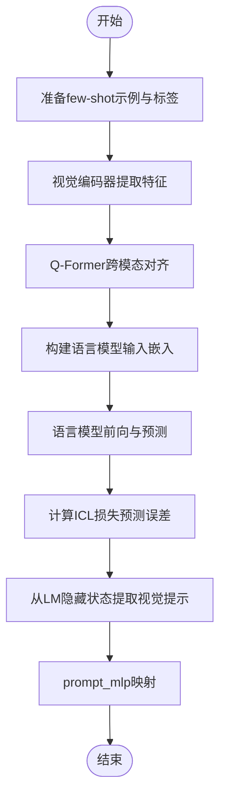
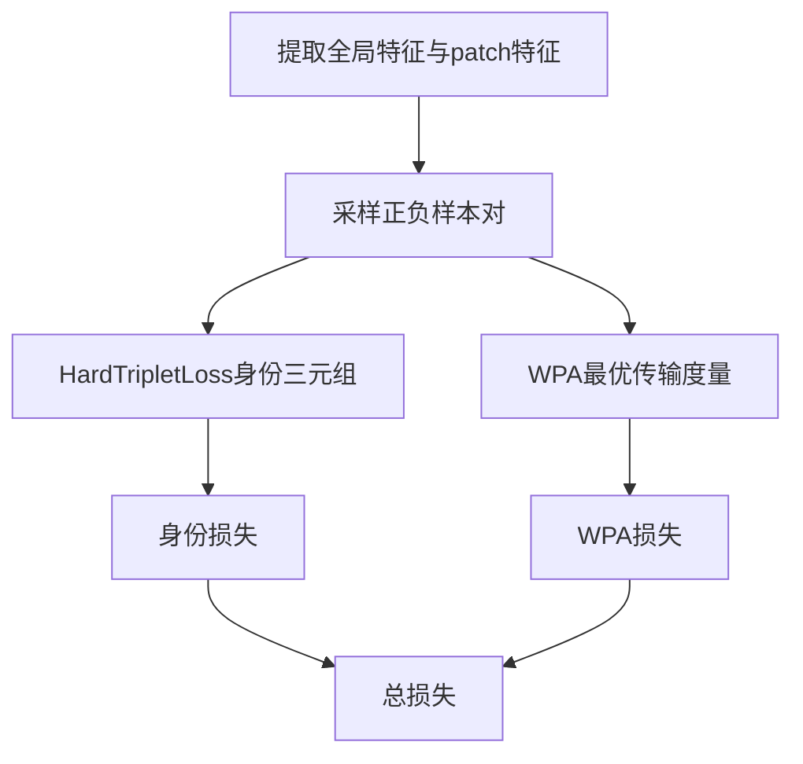
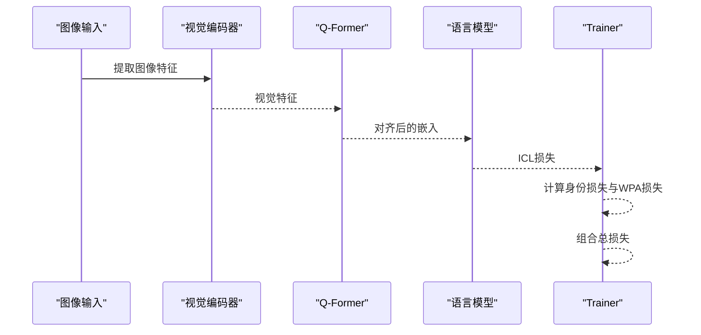
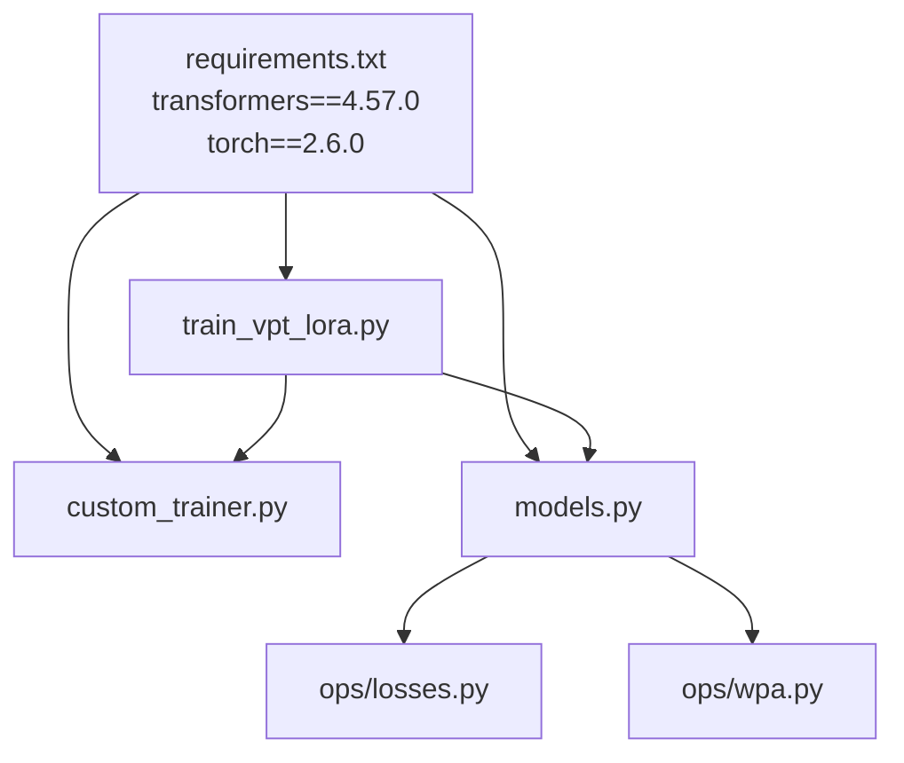

# ICL损失

<cite>
**本文引用的文件**
- [models.py](file://models.py)
- [ops/losses.py](file://ops/losses.py)
- [ops/wpa.py](file://ops/wpa.py)
- [train_vpt_lora.py](file://train_vpt_lora.py)
- [custom_trainer.py](file://custom_trainer.py)
- [README.md](file://README.md)
- [config.py](file://config.py)
- [requirements.txt](file://requirements.txt)
</cite>

## 目录
1. [简介](#简介)
2. [项目结构](#项目结构)
3. [核心组件](#核心组件)
4. [架构总览](#架构总览)
5. [详细组件分析](#详细组件分析)
6. [依赖分析](#依赖分析)
7. [性能考虑](#性能考虑)
8. [故障排查指南](#故障排查指南)
9. [结论](#结论)
10. [附录](#附录)

## 简介
本文件围绕ICL（In-Context Learning，上下文学习）损失展开，系统解析其设计原理、实现方式与训练流程。ICL损失通过语言模型对少量示例的预测误差，反向引导视觉特征学习，使视觉编码器的表征与语言模型生成的语义规则对齐。文档重点说明：
- ICL损失如何利用语言模型的预测误差作为损失信号，驱动视觉特征学习；
- icl_loss_weight参数如何调节ICL损失在总损失中的权重；
- 训练中如何通过对比学习机制（三元组损失与Wasserstein Pairwise Alignment）将视觉特征与语言模型的语义规则对齐；
- 损失计算全流程：从视觉编码器提取特征，到Q-Former进行跨模态对齐，再到语言模型预测输出，最后计算预测误差作为损失信号；
- 少样本场景下的性能表现与调参建议。

## 项目结构
本仓库采用“模块化+分层”的组织方式：
- 核心模型与前向逻辑位于 models.py；
- 损失函数（三元组损失、WPA等）位于 ops/losses.py 与 ops/wpa.py；
- 训练脚本与参数配置位于 train_vpt_lora.py 与 config.py；
- 自定义Trainer用于日志与评估统计位于 custom_trainer.py；
- README提供背景介绍与使用说明；
- requirements.txt声明依赖版本。

图表来源
- [models.py](file://models.py#L81-L269)
- [ops/losses.py](file://ops/losses.py#L279-L348)
- [ops/wpa.py](file://ops/wpa.py#L86-L110)
- [train_vpt_lora.py](file://train_vpt_lora.py#L131-L187)
- [custom_trainer.py](file://custom_trainer.py#L34-L103)
- [config.py](file://config.py#L1-L16)
- [requirements.txt](file://requirements.txt#L1-L2)
- [README.md](file://README.md#L1-L73)

章节来源
- [models.py](file://models.py#L81-L269)
- [train_vpt_lora.py](file://train_vpt_lora.py#L131-L187)
- [custom_trainer.py](file://custom_trainer.py#L34-L103)
- [config.py](file://config.py#L1-L16)
- [README.md](file://README.md#L1-L73)
- [requirements.txt](file://requirements.txt#L1-L2)

## 核心组件
- 模型主体 Model：包含视觉编码器（冻结）、LoRA适配的注意力层、语言模型（冻结）、Q-Former跨模态投影、可学习提示嵌入与prompt_mlp映射。
- ICL前向流程：在有标签但无显式提示时，构造few-shot示例，经Q-Former对齐后喂入语言模型，得到预测损失作为ICL损失；同时从语言模型隐藏状态提取视觉提示，用于后续动态注入视觉编码器。
- 对比学习分支：Identity损失（三元组损失）与WPA（Wasserstein Pairwise Alignment）损失，分别约束全局特征与patch级特征的判别性与一致性。
- 总损失：总损失由ICL损失、身份损失与WPA损失按权重线性组合而成，其中ICL损失权重由参数 icl_loss_weight 控制。

章节来源
- [models.py](file://models.py#L81-L269)
- [ops/losses.py](file://ops/losses.py#L279-L348)
- [ops/wpa.py](file://ops/wpa.py#L86-L110)
- [train_vpt_lora.py](file://train_vpt_lora.py#L131-L187)

## 架构总览
下图展示ICL损失在训练中的端到端流程：从图像输入，到视觉编码器特征提取，再到Q-Former跨模态对齐，随后喂入语言模型得到预测损失，最后与身份损失、WPA损失共同组成总损失。

图表来源
- [models.py](file://models.py#L159-L269)
- [ops/losses.py](file://ops/losses.py#L279-L348)
- [ops/wpa.py](file://ops/wpa.py#L86-L110)
- [train_vpt_lora.py](file://train_vpt_lora.py#L131-L187)
- [custom_trainer.py](file://custom_trainer.py#L34-L103)

## 详细组件分析

### ICL损失设计与实现
- 设计动机：利用语言模型在few-shot示例上的预测误差，作为对视觉特征的监督信号，促使视觉编码器提取更有利于身份判别的特征。
- 实现要点：
  - 在有标签但无显式提示时，自动构造正负示例对，形成few-shot上下文；
  - 使用Q-Former将视觉特征映射到语言模型嵌入维度，实现跨模态对齐；
  - 将对齐后的视觉表示替换到语言模型输入嵌入中对应位置，得到语言模型输出与标签的交叉熵损失，即ICL损失；
  - 同时从语言模型隐藏状态中抽取视觉提示，经prompt_mlp映射后注入视觉编码器，形成动态视觉提示。

图表来源
- [models.py](file://models.py#L159-L225)

章节来源
- [models.py](file://models.py#L159-L225)

### ICL损失权重 icl_loss_weight 的作用
- 参数位置：总损失计算处，将ICL损失乘以权重系数 icl_loss_weight。
- 调参策略：
  - 若权重过大，ICL信号主导，可能抑制其他损失（如身份损失、WPA），导致特征分布偏向语言模型偏好；
  - 若权重过小，ICL信号弱，视觉特征学习受语言模型影响有限，泛化能力不足。
- 建议：
  - 初期可设较小权重（如0.0~0.1），观察ICL损失与其它损失的平衡；
  - 结合下游任务指标（如mAP、Rank-1）动态调整，逐步增大至0.5~1.0以强化ICL信号。

章节来源
- [models.py](file://models.py#L257-L269)
- [train_vpt_lora.py](file://train_vpt_lora.py#L131-L187)

### 对比学习机制：三元组损失与WPA
- 三元组损失（HardTripletLoss）：
  - 目标：最大化同类间距离、最小化异类间距离，提升全局特征的判别性；
  - 在模型中用于身份一致性约束。
- Wasserstein Pairwise Alignment（WPA）：
  - 目标：在patch级特征上，通过最优传输度量衡量两组特征之间的分布差异；
  - 通过对正负样本对计算平均距离差，形成WPA损失，促进patch级特征与语言模型语义规则的一致性。

图表来源
- [models.py](file://models.py#L246-L256)
- [ops/losses.py](file://ops/losses.py#L279-L348)
- [ops/wpa.py](file://ops/wpa.py#L86-L110)

章节来源
- [models.py](file://models.py#L246-L256)
- [ops/losses.py](file://ops/losses.py#L279-L348)
- [ops/wpa.py](file://ops/wpa.py#L86-L110)

### 损失计算流程详解
- 视觉编码器：冻结的视觉编码器负责提取图像特征，作为ICL与对比学习的基础。
- Q-Former：将视觉特征映射到语言模型嵌入空间，实现跨模态对齐。
- 语言模型：以对齐后的嵌入作为输入，仅计算预测损失作为ICL损失。
- 动态提示：从语言模型隐藏状态抽取视觉提示，经prompt_mlp映射后注入视觉编码器，形成动态视觉提示。
- 对比学习：在全局特征上计算三元组损失，在patch特征上计算WPA损失。
- 总损失：总损失为ICL损失×权重 + 身份损失 + WPA损失×权重。

图表来源
- [models.py](file://models.py#L159-L269)
- [custom_trainer.py](file://custom_trainer.py#L34-L103)

章节来源
- [models.py](file://models.py#L159-L269)
- [custom_trainer.py](file://custom_trainer.py#L34-L103)

### 少样本学习场景下的性能表现与调参建议
- 性能表现：
  - ICL损失在few-shot示例上提供强监督信号，有助于在类别不平衡或样本稀疏时稳定收敛；
  - 结合三元组损失与WPA，可在全局与局部尺度上同时提升判别性与一致性。
- 调参建议：
  - icl_loss_weight：从0.0~0.1起步，结合验证集指标逐步增大；
  - ot_loss_weight：与WPA损失权重相关，建议从0.01~0.1范围尝试；
  - num_icl_samples/num_icl_bs：根据显存与收敛稳定性调整，保证few-shot上下文质量；
  - num_id_tokens/num_vpt_tokens：控制跨模态对齐与动态提示的容量，避免过拟合。

章节来源
- [train_vpt_lora.py](file://train_vpt_lora.py#L131-L187)
- [models.py](file://models.py#L111-L124)

## 依赖分析
- 外部依赖：transformers 与 torch 版本固定，确保语言模型与视觉编码器的兼容性。
- 内部依赖：
  - Model 依赖 Q-Former、语言模型、三元组损失与WPA；
  - 训练脚本提供参数与训练循环，自定义Trainer负责日志与评估；
  - 数据配置提供数据集划分与根路径。

图表来源
- [requirements.txt](file://requirements.txt#L1-L2)
- [train_vpt_lora.py](file://train_vpt_lora.py#L131-L187)
- [custom_trainer.py](file://custom_trainer.py#L34-L103)
- [models.py](file://models.py#L81-L124)
- [ops/losses.py](file://ops/losses.py#L279-L348)
- [ops/wpa.py](file://ops/wpa.py#L86-L110)

章节来源
- [requirements.txt](file://requirements.txt#L1-L2)
- [train_vpt_lora.py](file://train_vpt_lora.py#L131-L187)
- [custom_trainer.py](file://custom_trainer.py#L34-L103)
- [models.py](file://models.py#L81-L124)
- [ops/losses.py](file://ops/losses.py#L279-L348)
- [ops/wpa.py](file://ops/wpa.py#L86-L110)

## 性能考虑
- 计算开销：
  - ICL损失涉及语言模型前向与嵌入替换，显存占用较高，需合理设置批大小与few-shot样本数；
  - Q-Former跨模态对齐与WPA计算均为可微分操作，注意在大批次下的内存与吞吐平衡。
- 收敛稳定性：
  - 初始阶段降低icl_loss_weight与ot_loss_weight，避免ICL信号过强导致特征漂移；
  - 通过三元组损失与WPA形成互补约束，提升鲁棒性。
- 可扩展性：
  - LoRA适配的注意力层减少可训练参数，便于在多类别场景下扩展；
  - 动态视觉提示机制无需重训练即可泛化到新类别。

## 故障排查指南
- ICL损失异常：
  - 检查few-shot示例构造是否正确（正负样本比例、标签映射）；
  - 确认Q-Former输出维度与语言模型嵌入维度一致；
  - 核对输入嵌入替换逻辑，确保视觉特征被正确注入。
- 训练不稳定：
  - 降低icl_loss_weight与ot_loss_weight，观察总损失波动；
  - 检查三元组损失的标签分布，避免极端类别不平衡。
- 显存不足：
  - 减少num_icl_samples与num_icl_bs；
  - 关闭autocast或提高梯度累积步数以降低显存峰值。

章节来源
- [models.py](file://models.py#L159-L225)
- [ops/losses.py](file://ops/losses.py#L279-L348)
- [ops/wpa.py](file://ops/wpa.py#L86-L110)
- [train_vpt_lora.py](file://train_vpt_lora.py#L131-L187)

## 结论
ICL损失通过语言模型的预测误差为视觉特征学习提供强监督信号，结合三元组损失与WPA，实现了从全局到局部的多尺度对齐与判别。参数icl_loss_weight在总损失中起关键调节作用，应与下游指标联动调优。该框架在少样本与跨域场景下具备良好泛化潜力，适合在对象重识别等任务中进一步探索。

## 附录
- 项目背景与框架图见 README.md；
- 数据配置与划分见 config.py；
- 训练参数与权重初始化见 train_vpt_lora.py。

章节来源
- [README.md](file://README.md#L1-L73)
- [config.py](file://config.py#L1-L16)
- [train_vpt_lora.py](file://train_vpt_lora.py#L131-L187)