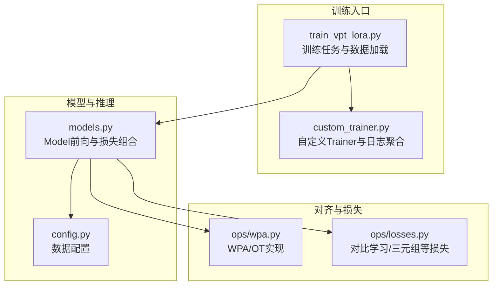
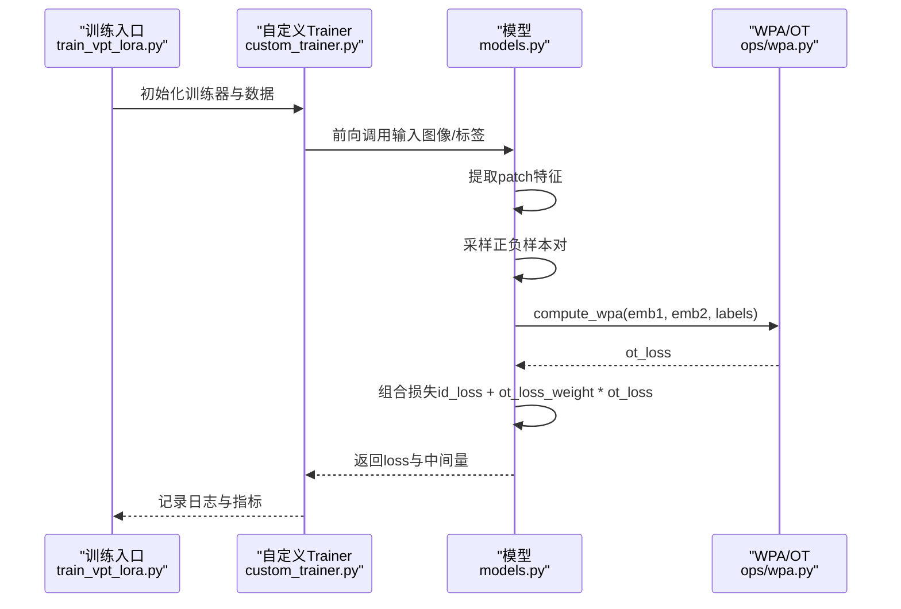
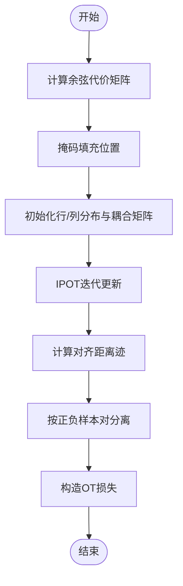
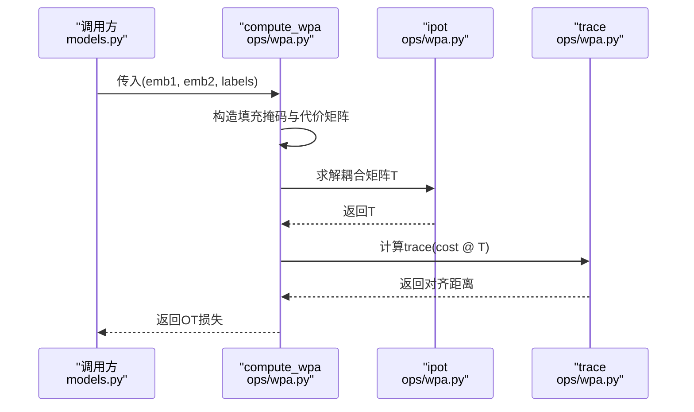
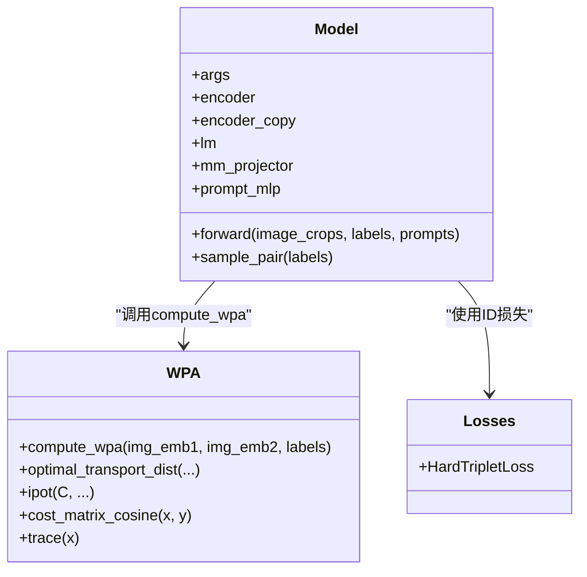
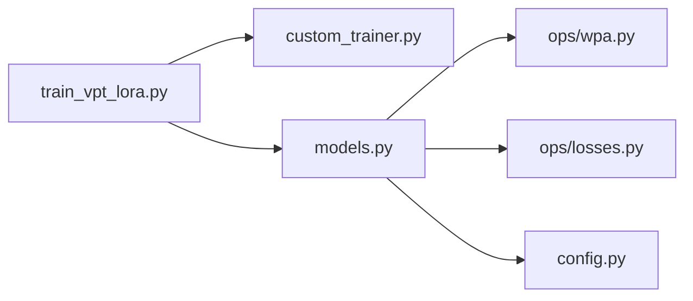

# OT/WPA损失

<cite>
**本文引用的文件**
- [README.md](file://README.md)
- [config.py](file://config.py)
- [models.py](file://models.py)
- [ops/wpa.py](file://ops/wpa.py)
- [ops/losses.py](file://ops/losses.py)
- [train_vpt_lora.py](file://train_vpt_lora.py)
- [custom_trainer.py](file://custom_trainer.py)
</cite>

## 目录
1. [简介](#简介)
2. [项目结构](#项目结构)
3. [核心组件](#核心组件)
4. [架构总览](#架构总览)
5. [详细组件分析](#详细组件分析)
6. [依赖关系分析](#依赖关系分析)
7. [性能考量](#性能考量)
8. [故障排查指南](#故障排查指南)
9. [结论](#结论)
10. [附录](#附录)

## 简介
本文件围绕OT（最优传输）损失与WPA（词-补丁对齐）的关系展开，系统阐释以下内容：
- WPA如何在patch级实现视觉-语义对齐代价矩阵的构建；
- 该代价矩阵如何作为最优传输问题的成本矩阵；
- OT损失如何通过求解最优传输方案最小化整体对齐代价，实现跨模态精细对齐；
- ot_loss_weight参数对训练动态的调节作用；
- 在细粒度视觉差异场景下的优势；
- 可视化示例思路与不同数据集上的权重调优建议。

本项目面向通用对象重识别（ReID），通过LLM引导的视觉提示（VPT）与视觉编码器（如DINOv2）协同，利用WPA对齐patch特征，结合OT损失进行联合优化，以提升对未见类别的泛化能力。

## 项目结构
项目采用模块化组织：训练入口、模型定义、损失与对齐算法、训练器封装与数据配置等分层清晰。OT/WPA相关逻辑集中在ops/wpa.py与模型前向流程中，训练器负责日志与指标统计。

图表来源
- [train_vpt_lora.py](file://train_vpt_lora.py#L140-L190)
- [custom_trainer.py](file://custom_trainer.py#L34-L100)
- [models.py](file://models.py#L81-L269)
- [ops/wpa.py](file://ops/wpa.py#L12-L110)
- [ops/losses.py](file://ops/losses.py#L1-L120)
- [config.py](file://config.py#L1-L16)

章节来源
- [README.md](file://README.md#L1-L20)
- [train_vpt_lora.py](file://train_vpt_lora.py#L140-L190)
- [models.py](file://models.py#L81-L269)
- [ops/wpa.py](file://ops/wpa.py#L12-L110)
- [ops/losses.py](file://ops/losses.py#L1-L120)
- [config.py](file://config.py#L1-L16)

## 核心组件
- WPA/OT实现（ops/wpa.py）
  - 计算余弦距离代价矩阵；
  - IPOT迭代求解最优传输耦合矩阵；
  - 基于正负样本对的OT损失构造。
- 模型前向与联合优化（models.py）
  - 从视觉编码器提取patch特征；
  - 采样正负样本对；
  - 调用WPA计算OT损失并与ID损失加权融合。
- 训练器与日志（custom_trainer.py）
  - 收集额外损失项（ot_loss、id_loss、icl_loss、std）；
  - 定期记录与重置。
- 训练脚本与数据配置（train_vpt_lora.py, config.py）
  - 提供ot_loss_weight等超参入口；
  - 数据集划分与评估流程。

章节来源
- [ops/wpa.py](file://ops/wpa.py#L12-L110)
- [models.py](file://models.py#L224-L269)
- [custom_trainer.py](file://custom_trainer.py#L34-L100)
- [train_vpt_lora.py](file://train_vpt_lora.py#L131-L146)
- [config.py](file://config.py#L1-L16)

## 架构总览
下图展示了OT/WPA在端到端训练中的位置与交互：模型前向提取patch特征，采样正负对，WPA计算OT损失，最终与ID损失按权重融合。

图表来源
- [train_vpt_lora.py](file://train_vpt_lora.py#L140-L190)
- [custom_trainer.py](file://custom_trainer.py#L34-L100)
- [models.py](file://models.py#L224-L269)
- [ops/wpa.py](file://ops/wpa.py#L86-L110)

## 详细组件分析

### WPA/OT实现与代价矩阵构建
- 代价矩阵
  - 使用余弦距离衡量每对patch之间的相似性差异，得到批内成对代价矩阵。
  - 对填充位置进行掩码，保证对齐仅在有效区域进行。
- 最优传输耦合
  - IPOT通过迭代更新行/列归一化因子，求解耦合矩阵T，使行/列质量守恒。
  - 通过指数核与温度参数控制耦合强度与平滑性。
- OT损失
  - 通过对代价矩阵与耦合矩阵的迹运算得到对齐距离；
  - 基于正负样本对分别求和，构造OT损失，用于拉近同类、推远异类。

图表来源
- [ops/wpa.py](file://ops/wpa.py#L12-L110)

章节来源
- [ops/wpa.py](file://ops/wpa.py#L12-L110)

### compute_wpa函数的工作流
- 输入：两组patch特征（可视为同一图像的不同视角或增强），以及对应标签（1表示正样本对，0表示负样本对）。
- 步骤：
  - 构造零填充掩码（无填充时为全False）；
  - 计算代价矩阵并掩码无效位置；
  - 计算有效长度（非填充元素数）；
  - 调用IPOT求解耦合矩阵；
  - 计算对齐距离并对正负样本分别求和；
  - 归一化后得到OT损失。

图表来源
- [models.py](file://models.py#L248-L256)
- [ops/wpa.py](file://ops/wpa.py#L86-L110)

章节来源
- [models.py](file://models.py#L248-L256)
- [ops/wpa.py](file://ops/wpa.py#L86-L110)

### 模型前向中的联合优化
- 前向阶段：
  - 从视觉编码器提取patch特征；
  - 采样正负样本对（基于标签一致性）；
  - 调用WPA计算OT损失；
  - 与ID损失（此处为三元组损失）按权重融合；
  - 输出包含总损失与各子损失的字典。
- 关键点：
  - OT损失仅在有标签时参与；
  - ot_loss_weight控制OT对总损失的贡献程度。

图表来源
- [models.py](file://models.py#L81-L269)
- [ops/wpa.py](file://ops/wpa.py#L12-L110)
- [ops/losses.py](file://ops/losses.py#L279-L348)

章节来源
- [models.py](file://models.py#L224-L269)
- [ops/wpa.py](file://ops/wpa.py#L86-L110)
- [ops/losses.py](file://ops/losses.py#L279-L348)

### 训练器与日志聚合
- 自定义Trainer在每次训练步收集额外损失项（ot_loss、id_loss、icl_loss、std），并在日志周期重置，便于监控OT对训练动态的影响。

章节来源
- [custom_trainer.py](file://custom_trainer.py#L34-L100)

## 依赖关系分析
- 模块耦合
  - models.py依赖ops/wpa.py进行OT损失计算；
  - 训练入口train_vpt_lora.py通过自定义Trainer驱动训练循环；
  - config.py提供数据集配置，间接影响训练样本分布。
- 外部依赖
  - Transformers（LLM）、DINOv2（视觉编码器）、LoRA层（低秩适配）等。

图表来源
- [train_vpt_lora.py](file://train_vpt_lora.py#L140-L190)
- [custom_trainer.py](file://custom_trainer.py#L34-L100)
- [models.py](file://models.py#L81-L269)
- [ops/wpa.py](file://ops/wpa.py#L12-L110)
- [ops/losses.py](file://ops/losses.py#L1-L120)
- [config.py](file://config.py#L1-L16)

章节来源
- [train_vpt_lora.py](file://train_vpt_lora.py#L140-L190)
- [custom_trainer.py](file://custom_trainer.py#L34-L100)
- [models.py](file://models.py#L81-L269)
- [ops/wpa.py](file://ops/wpa.py#L12-L110)
- [ops/losses.py](file://ops/losses.py#L1-L120)
- [config.py](file://config.py#L1-L16)

## 性能考量
- 计算复杂度
  - 代价矩阵计算为批内成对距离，复杂度与patch数量的平方相关；
  - IPOT迭代次数与k值影响收敛速度与稳定性。
- 内存与数值稳定
  - 代价矩阵与耦合矩阵均为批维×M×N，需关注显存占用；
  - 归一化与掩码有助于避免无效对的干扰。
- 训练稳定性
  - ot_loss_weight过大可能主导梯度方向，导致ID判别能力退化；
  - 建议先以较小权重训练，观察ot_loss与id_loss平衡后再逐步增大。

[本节为一般性指导，不直接分析具体文件]

## 故障排查指南
- OT损失为NaN或不稳定
  - 检查输入特征是否归一化、是否存在全零向量；
  - 调整温度参数与迭代次数，避免数值溢出。
- 正负样本比例失衡
  - 采样策略应保证正负样本数量均衡，避免OT损失偏向某一类。
- 日志缺失
  - 确认Trainer回调已注册并启用额外损失记录。

章节来源
- [custom_trainer.py](file://custom_trainer.py#L34-L100)
- [ops/wpa.py](file://ops/wpa.py#L34-L83)

## 结论
- WPA通过patch级代价矩阵与OT耦合，实现了精细化的跨模态对齐；
- OT损失在保持ID判别能力的同时，增强了细粒度视觉差异的区分；
- ot_loss_weight是连接语义对齐与判别学习的关键纽带，需要依据数据集与类别分布进行调优。

[本节为总结性内容，不直接分析具体文件]

## 附录

### 可视化示例（概念性说明）
- 展示patch级对齐过程的思路：
  - 将两张同属一类的图像的patch特征投影到同一语义空间；
  - 可视化代价矩阵热力图，突出高代价区域；
  - 可视化IPOT迭代后的耦合矩阵，显示最优匹配路径；
  - 对比不同类别间的对齐强度，验证OT损失的判别性。

[本图为概念性示意，不映射到具体源码文件]

### 不同数据集上的ot_loss_weight最佳实践
- Amazon数据集（多品类电商商品）
  - 初值建议：0.01~0.05；
  - 若类别间外观差异较大，可适度提高至0.1；
  - 观察ot_loss与id_loss的相对大小，动态调整。
- 其他ReID数据集
  - 以验证集mAP/Rank-1为基准，逐步增减权重；
  - 注意防止过拟合，必要时配合早停与学习率调度。

章节来源
- [train_vpt_lora.py](file://train_vpt_lora.py#L131-L146)
- [config.py](file://config.py#L1-L16)