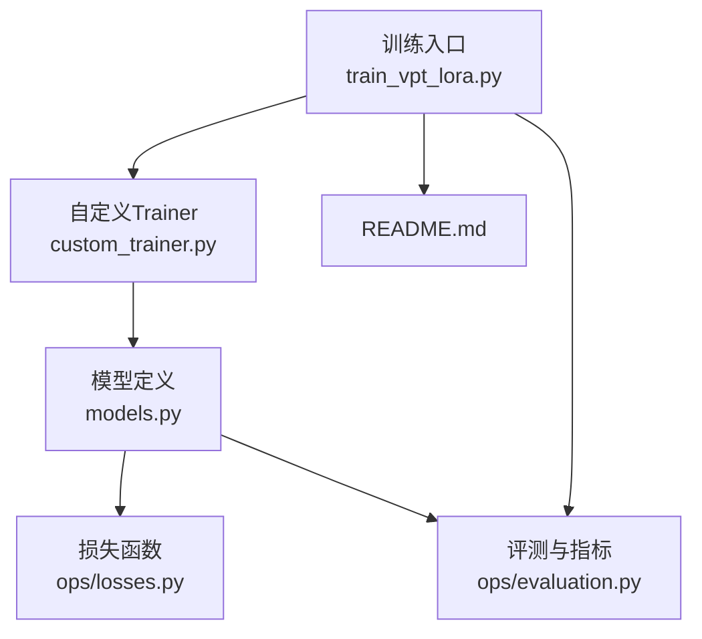
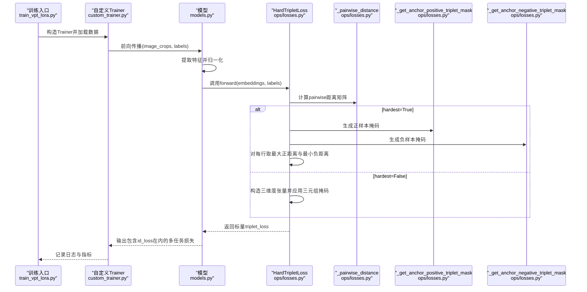
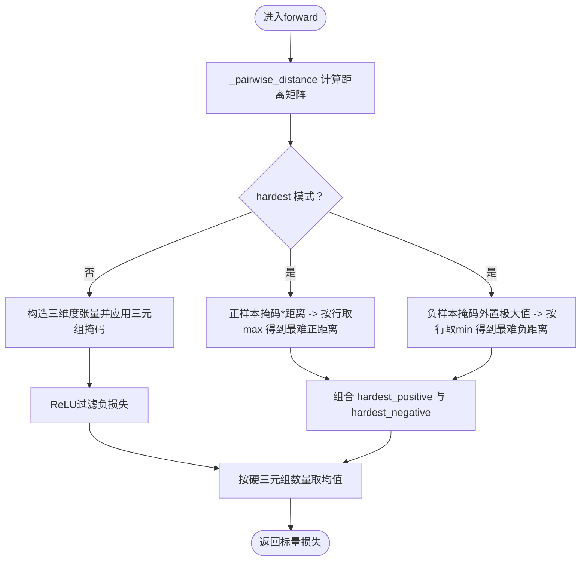
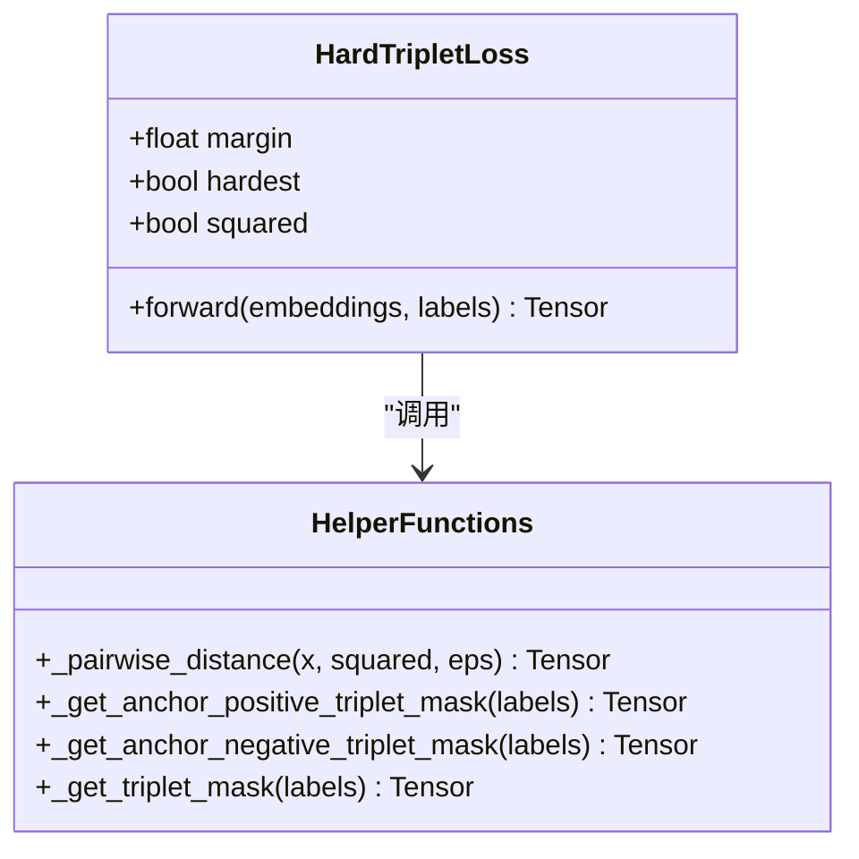
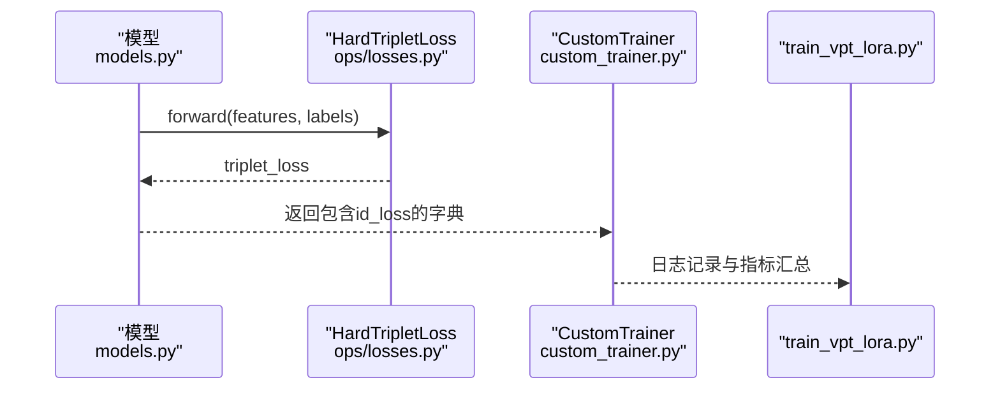
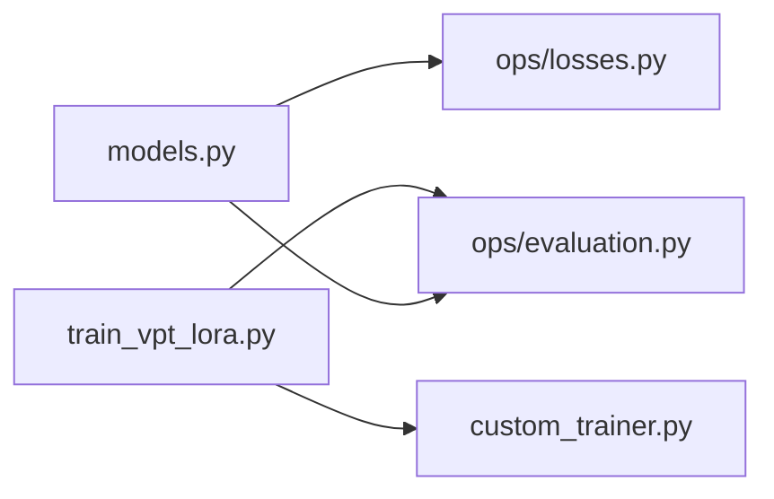

# 三元组损失

<cite>
**本文引用的文件列表**
- [ops/losses.py](file://ops/losses.py)
- [models.py](file://models.py)
- [train_vpt_lora.py](file://train_vpt_lora.py)
- [custom_trainer.py](file://custom_trainer.py)
- [README.md](file://README.md)
</cite>

## 目录
1. [简介](#简介)
2. [项目结构](#项目结构)
3. [核心组件](#核心组件)
4. [架构总览](#架构总览)
5. [详细组件分析](#详细组件分析)
6. [依赖关系分析](#依赖关系分析)
7. [性能考量](#性能考量)
8. [故障排查指南](#故障排查指南)
9. [结论](#结论)
10. [附录：细粒度图像识别使用示例与建议](#附录细粒度图像识别使用示例与建议)

## 简介
本文件围绕 HardTripletLoss 类展开深入解析，重点阐述在 hardest=True 的情况下如何挖掘“最难”的正样本与最难的负样本，以及其与 margin 的协同工作机制。文档同时解释 _pairwise_distance 如何高效计算嵌入向量间的欧氏距离矩阵，以及 _get_anchor_positive_triplet_mask、_get_anchor_negative_triplet_mask 如何生成正负样本掩码；并结合模型在细粒度图像识别任务中的使用方式，说明该损失对特征空间分布的优化作用及 margin 参数对收敛行为的影响。

## 项目结构
本仓库采用模块化组织，训练入口、模型定义、损失函数与评估脚本分别位于不同文件中：
- 训练入口与数据集：train_vpt_lora.py、custom_trainer.py
- 模型定义与损失使用：models.py 引入 HardTripletLoss 并在前向中调用
- 损失函数实现：ops/losses.py 中包含 HardTripletLoss 及其辅助函数
- 评估与指标：ops/evaluation.py、train_vpt_lora.py 中的评测流程
- 项目说明：README.md

图表来源
- [train_vpt_lora.py](file://train_vpt_lora.py#L1-L120)
- [custom_trainer.py](file://custom_trainer.py#L1-L120)
- [models.py](file://models.py#L80-L120)
- [ops/losses.py](file://ops/losses.py#L279-L348)
- [ops/evaluation.py](file://ops/evaluation.py#L433-L482)
- [README.md](file://README.md#L1-L73)

章节来源
- [README.md](file://README.md#L1-L73)
- [train_vpt_lora.py](file://train_vpt_lora.py#L1-L120)
- [custom_trainer.py](file://custom_trainer.py#L1-L120)
- [models.py](file://models.py#L80-L120)
- [ops/losses.py](file://ops/losses.py#L279-L348)
- [ops/evaluation.py](file://ops/evaluation.py#L433-L482)

## 核心组件
- HardTripletLoss：三元组损失的核心实现，支持 hardest 模式与非 hardest 模式两种策略，提供 margin 控制与可选的平方距离输出。
- 辅助函数：
  - _pairwise_distance：计算嵌入向量两两之间的欧氏距离矩阵（支持平方距离）。
  - _get_anchor_positive_triplet_mask：生成正样本掩码（同标签且非自身）。
  - _get_anchor_negative_triplet_mask：生成负样本掩码（异标签）。
  - _get_triplet_mask：生成三维三元组有效掩码（三者互不相同且满足正负标签约束）。

章节来源
- [ops/losses.py](file://ops/losses.py#L279-L348)
- [ops/losses.py](file://ops/losses.py#L350-L416)

## 架构总览
HardTripletLoss 在模型前向中被调用，输入为归一化后的特征向量与标签，返回标量损失值。在 hardest=True 时，损失仅考虑每个锚点对应的“最难”正样本与“最难”负样本；在 hardest=False 时，损失基于所有满足约束的有效三元组进行平均。

图表来源
- [models.py](file://models.py#L240-L260)
- [ops/losses.py](file://ops/losses.py#L298-L347)
- [ops/losses.py](file://ops/losses.py#L350-L416)

章节来源
- [models.py](file://models.py#L240-L260)
- [ops/losses.py](file://ops/losses.py#L298-L347)
- [ops/losses.py](file://ops/losses.py#L350-L416)

## 详细组件分析

### HardTripletLoss 类与 hardest 模式
- 初始化参数
  - margin：三元组间隔，控制正负距离差的最小阈值。
  - hardest：是否仅考虑“最难”三元组（即每个锚点的最难正样本与最难负样本）。
  - squared：是否输出平方距离矩阵。
- forward 流程
  - 计算嵌入向量的成对距离矩阵。
  - 若 hardest=True：
    - 正样本：通过正样本掩码筛选有效距离，按行取最大值作为“最难正样本距离”。
    - 负样本：先对每行取全局最大距离，再用掩码将非负样本位置重置为极大值，从而在每行取最小值得到“最难负样本距离”。
    - 最终损失为 ReLU( hardest_positive - hardest_negative + margin ) 的均值。
  - 若 hardest=False：
    - 构造三维度张量，逐元素计算 anc_pos_dist - anc_neg_dist + margin，并乘以三元组有效掩码。
    - 过滤掉负损失（即“容易三元组”），统计硬三元组数量后取平均。

图表来源
- [ops/losses.py](file://ops/losses.py#L298-L347)

章节来源
- [ops/losses.py](file://ops/losses.py#L285-L347)

### _pairwise_distance：欧氏距离矩阵计算
- 输入：嵌入向量张量 x，形状为 (batch_size, embed_dim)。
- 实现要点：
  - 使用矩阵运算 cor_mat = x @ x^T，利用范数 diag 来构造距离平方项，得到 distances = x_i^2 + x_j^2 - 2⟨x_i, x_j⟩。
  - 若 squared=False，则对零距离处加极小值并开方，同时将对角线置零，保证数值稳定与语义正确。
- 复杂度：O(B^2·D) 或 O(B^2)（忽略嵌入维度 D 的常数影响），在大批次场景下计算成本较高，但可通过批内采样或硬件加速缓解。

章节来源
- [ops/losses.py](file://ops/losses.py#L350-L364)

### 掩码生成函数
- _get_anchor_positive_triplet_mask
  - 逻辑：排除自身（非对角为真），并与标签相等条件相乘，得到正样本掩码。
  - 用途：在 hardest 模式下，仅从同标签且非自身的候选中选择“最难正样本”。
- _get_anchor_negative_triplet_mask
  - 逻辑：标签不相等条件取反，得到负样本掩码。
  - 用途：在 hardest 模式下，仅从异标签候选中选择“最难负样本”。
- _get_triplet_mask
  - 逻辑：三者互不相同（由非等索引张量构造）与正负标签约束（标签相等与不等）共同构成有效三元组掩码。
  - 用途：在非 hardest 模式下，一次性筛选所有有效三元组并进行平均。

图表来源
- [ops/losses.py](file://ops/losses.py#L279-L348)
- [ops/losses.py](file://ops/losses.py#L350-L416)

章节来源
- [ops/losses.py](file://ops/losses.py#L367-L416)

### 在模型中的使用与训练流程
- 模型中实例化 HardTripletLoss（例如 margin=0.1，hardest=True），并在前向中对归一化后的特征调用该损失。
- 训练入口通过自定义 Trainer 统计并记录 id_loss 等额外损失，便于监控三元组损失对整体目标的贡献。
- 评测阶段可使用 compute_rank1_rank5_map 等指标评估特征质量。

图表来源
- [models.py](file://models.py#L240-L260)
- [ops/losses.py](file://ops/losses.py#L298-L347)
- [custom_trainer.py](file://custom_trainer.py#L43-L95)
- [train_vpt_lora.py](file://train_vpt_lora.py#L170-L190)

章节来源
- [models.py](file://models.py#L240-L260)
- [custom_trainer.py](file://custom_trainer.py#L43-L95)
- [train_vpt_lora.py](file://train_vpt_lora.py#L170-L190)

## 依赖关系分析
- 模块耦合
  - models.py 依赖 ops/losses.HardTripletLoss，用于身份一致性约束。
  - train_vpt_lora.py 与 custom_trainer.py 共同负责训练循环与日志记录。
  - ops/evaluation.py 提供评测指标，间接验证损失对特征分布的优化效果。
- 外部依赖
  - PyTorch 核心张量运算与激活函数。
  - Transformers 与 TorchVision（训练入口与数据增强）。

图表来源
- [models.py](file://models.py#L80-L120)
- [ops/losses.py](file://ops/losses.py#L279-L348)
- [train_vpt_lora.py](file://train_vpt_lora.py#L1-L120)
- [custom_trainer.py](file://custom_trainer.py#L1-L120)
- [ops/evaluation.py](file://ops/evaluation.py#L433-L482)

章节来源
- [models.py](file://models.py#L80-L120)
- [ops/losses.py](file://ops/losses.py#L279-L348)
- [train_vpt_lora.py](file://train_vpt_lora.py#L1-L120)
- [custom_trainer.py](file://custom_trainer.py#L1-L120)
- [ops/evaluation.py](file://ops/evaluation.py#L433-L482)

## 性能考量
- 计算复杂度
  - _pairwise_distance 的时间复杂度近似 O(B^2·D)，在大批量时可能成为瓶颈。
  - hardest 模式通过按行取 max/min 将三元组枚举限制在每行范围内，显著降低计算量。
- 数值稳定性
  - 在非平方模式下，对零距离处添加极小值并开方，避免 NaN 传播。
  - 在 hardest 模式中，负样本掩码通过加上全局最大值再取最小值的方式，确保“最难负样本”不会误选为自身或无效样本。
- 批处理与内存
  - 大批量训练时建议减小 batch size 或采用梯度累积，以平衡收敛速度与显存占用。
  - 可结合混合精度训练减少显存压力。

[本节为通用性能讨论，无需特定文件引用]

## 故障排查指南
- 损失为 NaN 或不稳定
  - 检查输入特征是否已归一化，确保范数稳定。
  - 检查标签数量是否过少导致无有效三元组（尤其在 hardest=False 时）。
- 收敛缓慢或不收敛
  - 调整 margin：过大可能导致三元组难以满足，过小可能使边界模糊。
  - 调整学习率与优化器设置，必要时启用梯度裁剪。
- 硬三元组数量过少
  - 减小 margin 或切换至 hardest=False 以扩大有效样本范围，随后再逐步收紧。

[本节为通用排查建议，无需特定文件引用]

## 结论
HardTripletLoss 在 hardest=True 时通过“按行取最值”的策略高效地挖掘最具挑战性的正负样本对，结合 margin 实现稳定的边界约束；在非 hardest 模式下则覆盖全部有效三元组并进行平均。配合模型中的特征归一化与自定义 Trainer 的日志记录，该损失能够有效优化特征空间分布，提升细粒度图像识别任务的判别能力。合理设置 margin 与 batch size 是获得稳定收敛的关键。

[本节为总结性内容，无需特定文件引用]

## 附录：细粒度图像识别使用示例与建议
- 使用建议
  - 在模型前向中对特征进行归一化后再传入 HardTripletLoss，有助于提升距离度量的稳定性。
  - 在 hardest=True 下，建议 batch size 不要过大，以避免距离矩阵计算开销过高。
  - 可结合自定义 Trainer 的日志系统观察 id_loss 的变化趋势，辅助调整超参。
- margin 参数对收敛的影响
  - 较大的 margin 会提高三元组难度，可能带来更清晰的类别边界，但也可能导致训练初期难以满足约束，需配合较小的学习率与预热策略。
  - 较小的 margin 更易满足约束，有利于早期稳定，但可能牺牲边界锐度。
- 代码路径参考
  - 模型中损失调用与日志记录：[models.py](file://models.py#L240-L260)
  - 自定义 Trainer 的日志与指标记录：[custom_trainer.py](file://custom_trainer.py#L43-L95)
  - 训练入口与数据集准备：[train_vpt_lora.py](file://train_vpt_lora.py#L170-L190)
  - README 中的训练命令与环境说明：[README.md](file://README.md#L1-L73)

章节来源
- [models.py](file://models.py#L240-L260)
- [custom_trainer.py](file://custom_trainer.py#L43-L95)
- [train_vpt_lora.py](file://train_vpt_lora.py#L170-L190)
- [README.md](file://README.md#L1-L73)