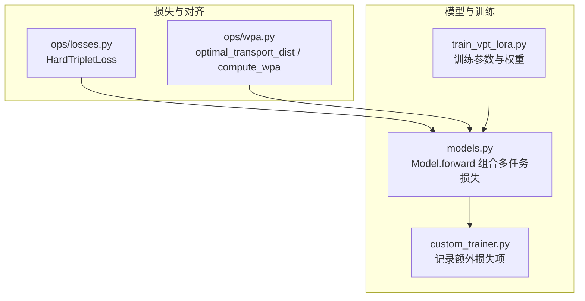
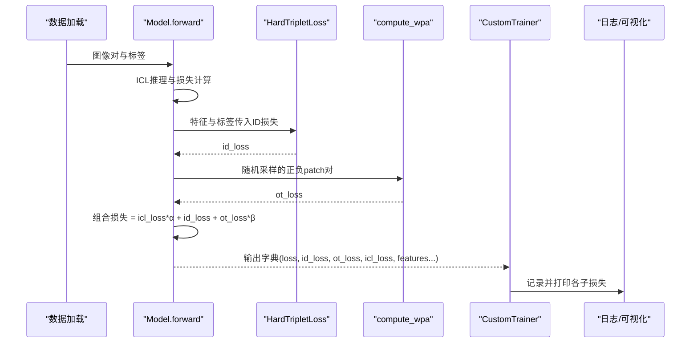
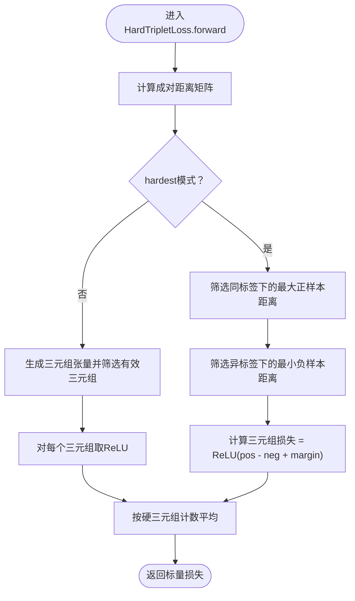
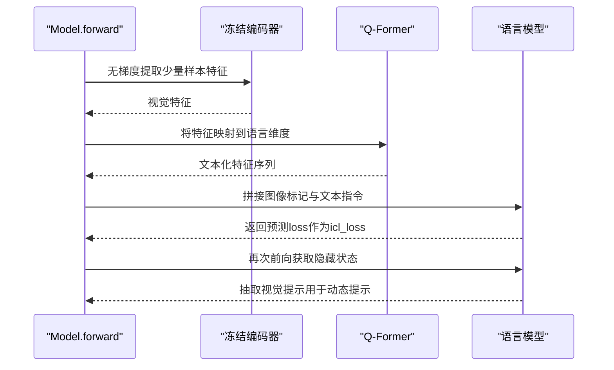
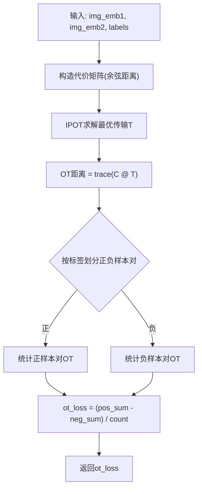
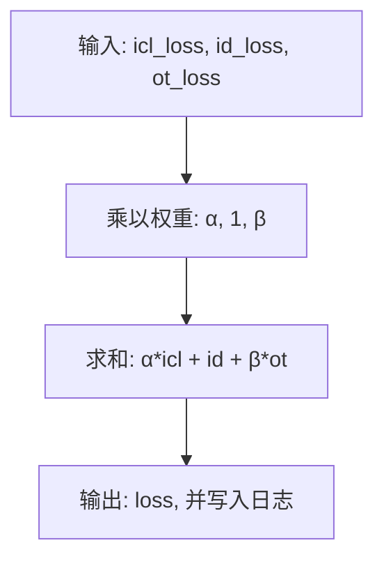
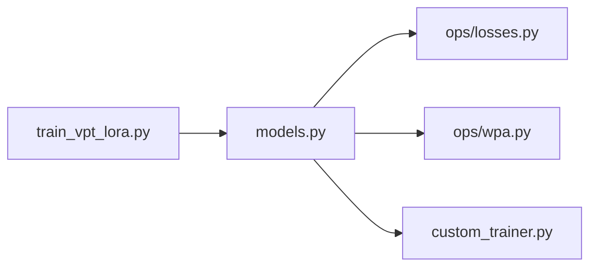

# 损失函数体系

<cite>
**本文引用的文件**
- [ops/losses.py](file://ops/losses.py)
- [ops/wpa.py](file://ops/wpa.py)
- [models.py](file://models.py)
- [train_vpt_lora.py](file://train_vpt_lora.py)
- [custom_trainer.py](file://custom_trainer.py)
- [README.md](file://README.md)
</cite>

## 目录
1. [简介](#简介)
2. [项目结构](#项目结构)
3. [核心组件](#核心组件)
4. [架构总览](#架构总览)
5. [详细组件分析](#详细组件分析)
6. [依赖关系分析](#依赖关系分析)
7. [性能考量](#性能考量)
8. [故障排查指南](#故障排查指南)
9. [结论](#结论)
10. [附录](#附录)

## 简介
本文件系统性解析VICP框架中的多任务损失函数设计，重点覆盖：
- HardTripletLoss的实现机制与“最难”正负样本挖掘策略（hardest=True）及其对特征空间优化的影响
- ICL（In-Context Learning）损失如何通过语言模型的预测误差来指导视觉特征学习
- OT（Optimal Transport）损失与WPA（Word-Patch Alignment）的关系，以及compute_wpa函数如何计算patch-level的对齐代价
- 各损失项的加权策略（icl_loss_weight、ot_loss_weight）及其对训练动态的调节作用
- 提供损失曲线分析指南，帮助诊断训练过程中的收敛问题

## 项目结构
本仓库围绕“视觉-语言联合学习”的目标组织代码，损失函数相关的核心位置如下：
- 损失定义：ops/losses.py（包含HardTripletLoss等）
- 对齐与OT：ops/wpa.py（包含OT与WPA相关函数）
- 模型前向与多任务损失聚合：models.py（在forward中组合ICL、ID、OT三项）
- 训练器与日志：custom_trainer.py（记录额外损失项）
- 训练入口与参数：train_vpt_lora.py（含icl_loss_weight、ot_loss_weight等）

图表来源
- [ops/losses.py](file://ops/losses.py#L279-L416)
- [ops/wpa.py](file://ops/wpa.py#L67-L110)
- [models.py](file://models.py#L159-L269)
- [custom_trainer.py](file://custom_trainer.py#L25-L100)
- [train_vpt_lora.py](file://train_vpt_lora.py#L131-L180)

章节来源
- [README.md](file://README.md#L1-L73)
- [ops/losses.py](file://ops/losses.py#L279-L416)
- [ops/wpa.py](file://ops/wpa.py#L67-L110)
- [models.py](file://models.py#L159-L269)
- [custom_trainer.py](file://custom_trainer.py#L25-L100)
- [train_vpt_lora.py](file://train_vpt_lora.py#L131-L180)

## 核心组件
- HardTripletLoss：基于三元组距离的对比学习损失，支持“最难”正负样本挖掘（hardest=True），用于拉近同类别内样本、推远不同类别样本，提升判别性特征分布。
- ICL损失（In-Context Learning）：通过语言模型对少量示例的预测误差引导视觉特征学习，使视觉特征与语言语义对齐。
- OT损失（Optimal Transport）与WPA（Word-Patch Alignment）：通过最优传输计算文本与图像patch之间的对齐代价，实现跨模态对齐；compute_wpa返回正负样本对上的OT差异作为损失。
- 多任务损失聚合：在模型前向中按权重组合ICL、ID（HardTripletLoss）、OT三项，并输出各子损失便于训练监控。

章节来源
- [ops/losses.py](file://ops/losses.py#L279-L416)
- [ops/wpa.py](file://ops/wpa.py#L67-L110)
- [models.py](file://models.py#L159-L269)
- [train_vpt_lora.py](file://train_vpt_lora.py#L131-L180)

## 架构总览
下图展示从输入到多任务损失的端到端流程，以及各模块间的依赖关系。

图表来源
- [models.py](file://models.py#L159-L269)
- [ops/losses.py](file://ops/losses.py#L279-L416)
- [ops/wpa.py](file://ops/wpa.py#L67-L110)
- [custom_trainer.py](file://custom_trainer.py#L43-L100)

## 详细组件分析

### HardTripletLoss：最难样本挖掘与特征空间优化
- 实现要点
  - 支持两种模式：hard模式（仅考虑最难正负样本对）与全集模式（遍历所有三元组）。本项目默认使用hardest=True，聚焦于最困难的样本，加速收敛并提升判别力。
  - 距离矩阵：通过内积构造成对距离，支持平方或非平方形式。
  - 最难正样本：在同标签约束下，选择最大锚-正样本距离。
  - 最难负样本：在异标签约束下，选择最小锚-负样本距离。
  - 三元组损失：对每个锚点，计算 hardest_pos - hardest_neg + margin 的正值部分，再平均。
- 对特征空间的影响
  - 强化类内紧凑性与类间分离性，促使特征在判别性方向上移动，减少易分样本带来的“冗余梯度”，提升边界清晰度。
  - 在hardest=True时，训练更关注“最难分类”的样本，有助于在复杂场景下稳定收敛。

图表来源
- [ops/losses.py](file://ops/losses.py#L279-L416)

章节来源
- [ops/losses.py](file://ops/losses.py#L279-L416)

### ICL（In-Context Learning）损失：语言模型预测误差指导视觉特征
- 实现要点
  - 前向中当提供标签但未提供提示时，会进行一次无梯度的推理，构造少量示例（正/负对）并喂给语言模型，得到预测损失作为icl_loss。
  - 该损失通过语言模型的预测误差，引导视觉特征与语义概念对齐，从而在下游任务中获得更强的泛化能力。
- 关键路径
  - 使用冻结的视觉编码器提取少量样本的特征，经Q-Former映射到语言模型嵌入空间，拼接图像标记后送入语言模型，得到loss作为icl_loss。
  - 同时可从语言模型隐藏状态中抽取视觉提示（prompt），用于后续动态提示视觉编码器。

图表来源
- [models.py](file://models.py#L159-L269)

章节来源
- [models.py](file://models.py#L159-L269)

### OT（Optimal Transport）与WPA（Word-Patch Alignment）：patch级对齐代价
- 关系说明
  - OT损失衡量文本与图像patch之间的最优匹配代价，WPA强调词与patch的对齐程度。compute_wpa直接返回正负样本对上的OT差异，作为对齐损失。
- compute_wpa工作流
  - 输入两组patch特征（来自同一图像的不同视图或随机配对），构造代价矩阵（余弦距离）。
  - 使用IPOT（Sinkhorn迭代）求解最优传输矩阵T，计算trace(cost.matmul(T))得到OT距离。
  - 按标签区分正负样本对，计算正样本对的OT之和减去负样本对的OT之和，再除以样本数，得到ot_loss。
- 对特征空间的影响
  - 促进视觉patch与语言语义在特征空间中对齐，增强跨模态一致性，有利于下游检索与泛化。

图表来源
- [ops/wpa.py](file://ops/wpa.py#L67-L110)

章节来源
- [ops/wpa.py](file://ops/wpa.py#L67-L110)

### 多任务损失聚合与权重调节
- 聚合公式
  - 总损失 = icl_loss × α + id_loss + ot_loss × β
  - 其中α为icl_loss_weight，β为ot_loss_weight，分别控制语言引导与对齐约束的强度。
- 权重策略与训练动态
  - α较大：强化ICL对视觉特征的引导，适合语言语义信息丰富的场景，可能更快收敛但需注意过拟合风险。
  - β较大：强化OT对齐，提升跨模态一致性，适合patch级语义对齐需求高的任务。
  - 训练器会记录ot_loss、id_loss、icl_loss与std等指标，便于观察各子损失贡献与稳定性。

图表来源
- [models.py](file://models.py#L257-L269)
- [custom_trainer.py](file://custom_trainer.py#L43-L100)
- [train_vpt_lora.py](file://train_vpt_lora.py#L131-L180)

章节来源
- [models.py](file://models.py#L257-L269)
- [custom_trainer.py](file://custom_trainer.py#L43-L100)
- [train_vpt_lora.py](file://train_vpt_lora.py#L131-L180)

## 依赖关系分析
- 模块耦合
  - 模型前向依赖HardTripletLoss与compute_wpa，二者分别来自ops/losses.py与ops/wpa.py。
  - 训练器通过回调记录额外损失项，便于统一观测与可视化。
- 外部依赖
  - 语言模型与视觉编码器均为外部库加载，模型前向中对它们进行冻结或轻度微调。

图表来源
- [train_vpt_lora.py](file://train_vpt_lora.py#L131-L180)
- [models.py](file://models.py#L159-L269)
- [ops/losses.py](file://ops/losses.py#L279-L416)
- [ops/wpa.py](file://ops/wpa.py#L67-L110)
- [custom_trainer.py](file://custom_trainer.py#L25-L100)

章节来源
- [train_vpt_lora.py](file://train_vpt_lora.py#L131-L180)
- [models.py](file://models.py#L159-L269)
- [ops/losses.py](file://ops/losses.py#L279-L416)
- [ops/wpa.py](file://ops/wpa.py#L67-L110)
- [custom_trainer.py](file://custom_trainer.py#L25-L100)

## 性能考量
- 计算复杂度
  - HardTripletLoss：距离矩阵O(N^2)，hardest模式仍需逐样本筛选，整体约O(N^2)；全集模式为O(N^3)。
  - OT/ WPA：代价矩阵O(MN)，IPOT迭代k次，整体约O(kMN)；k通常较小（如1~5），实际开销可控。
- 内存与显存
  - 距离矩阵与三元组张量可能占用较多显存，建议合理设置batch大小与N值。
  - OT计算中T矩阵与代价矩阵均为批处理，注意pad掩码与trace操作的内存使用。
- 训练稳定性
  - ICL损失为无梯度推理，避免了额外反传开销，但需保证示例构造与拼接逻辑正确。
  - OT损失对正负样本平衡敏感，建议在采样阶段保持正负样本数量均衡。

[本节为通用性能讨论，不直接分析具体文件]

## 故障排查指南
- ICL损失异常
  - 症状：icl_loss过高或不稳定
  - 排查：确认示例构造逻辑（正/负对标签是否正确）、token拼接是否覆盖图像标记、语言模型是否处于冻结状态。
  - 参考路径：[models.py](file://models.py#L168-L224)
- OT损失异常
  - 症状：ot_loss为NaN或极小/极大
  - 排查：检查patch特征是否归一化、pad掩码是否正确、IPOT迭代是否收敛、beta/iteration/k参数是否合适。
  - 参考路径：[ops/wpa.py](file://ops/wpa.py#L67-L110)
- ID损失异常
  - 症状：id_loss不降或震荡
  - 排查：确认标签与特征形状一致、hardest模式下正负样本是否充分、margin是否过大或过小。
  - 参考路径：[ops/losses.py](file://ops/losses.py#L279-L416)
- 日志与可视化
  - 症状：无法看到ot_loss/id_loss/icl_loss
  - 排查：确认训练器回调已注册额外损失项、日志记录频率设置合理。
  - 参考路径：[custom_trainer.py](file://custom_trainer.py#L25-L100)

章节来源
- [models.py](file://models.py#L168-L224)
- [ops/wpa.py](file://ops/wpa.py#L67-L110)
- [ops/losses.py](file://ops/losses.py#L279-L416)
- [custom_trainer.py](file://custom_trainer.py#L25-L100)

## 结论
VICP的多任务损失体系通过HardTripletLoss强化判别性特征、通过ICL损失将语言语义引入视觉表征、通过OT/WPA实现跨模态对齐，三者在模型前向中以可调权重融合，形成稳定且高效的训练闭环。合理设置权重与监控各子损失，是取得良好收敛与泛化效果的关键。

[本节为总结性内容，不直接分析具体文件]

## 附录
- 训练参数与权重
  - ICL权重：icl_loss_weight（默认在训练参数中定义）
  - OT权重：ot_loss_weight（默认在训练参数中定义）
  - 参考路径：[train_vpt_lora.py](file://train_vpt_lora.py#L131-L180)

章节来源
- [train_vpt_lora.py](file://train_vpt_lora.py#L131-L180)