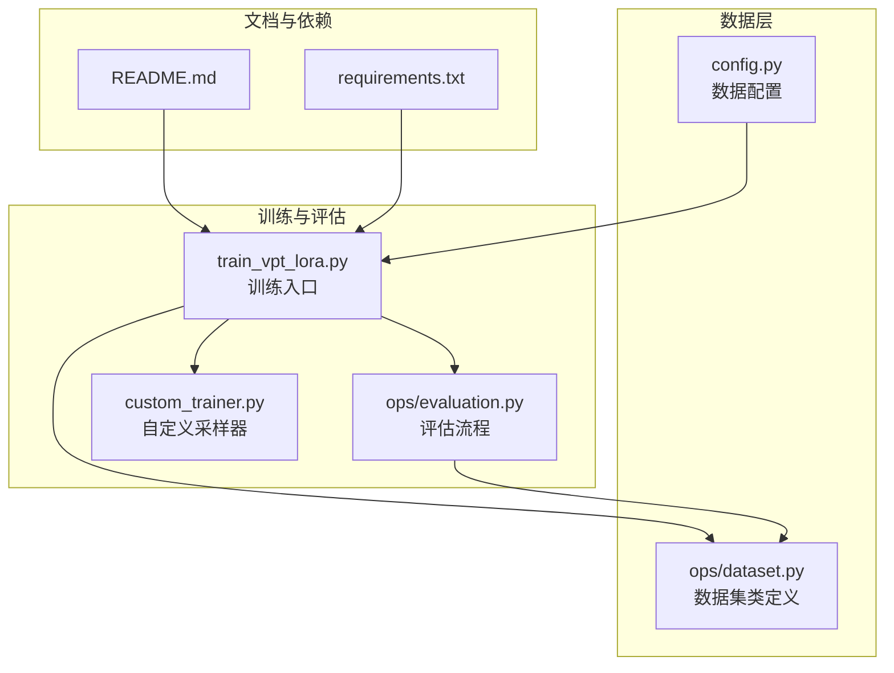
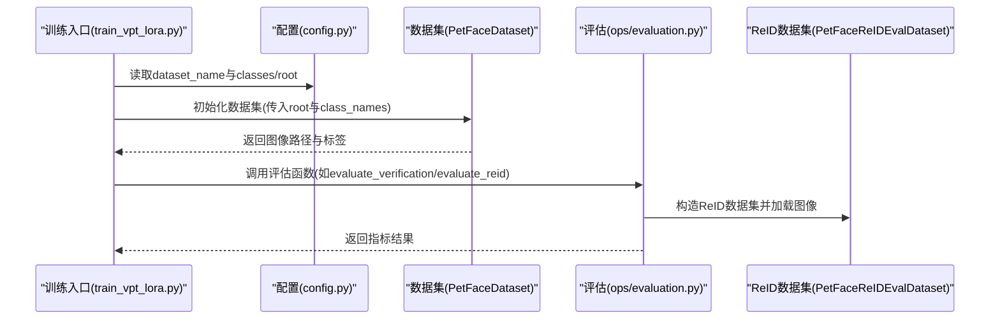
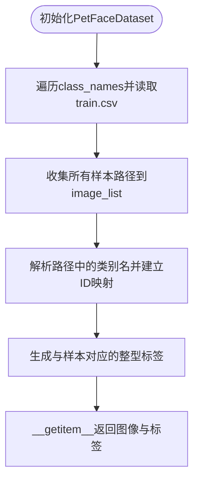
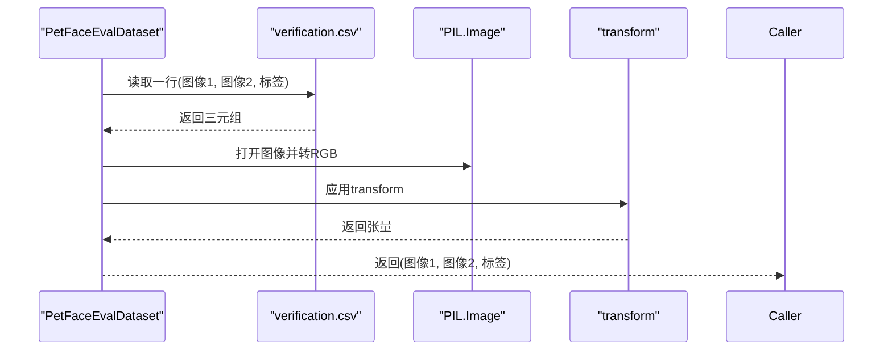
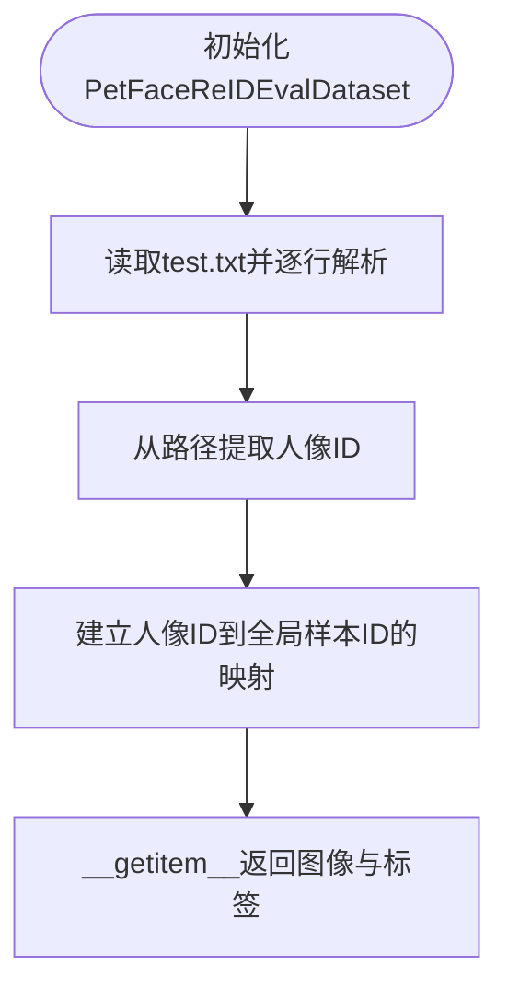
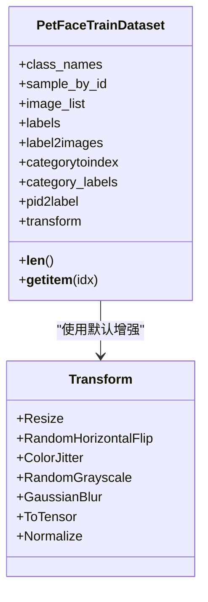
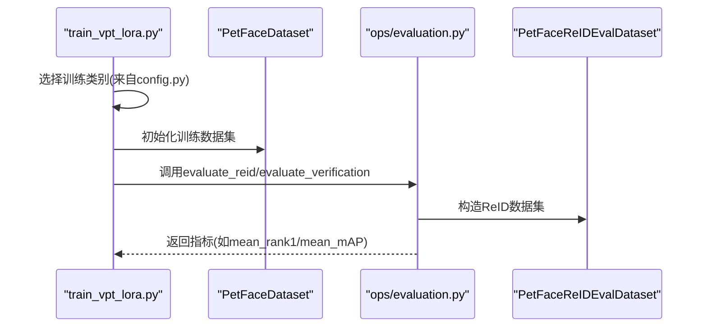
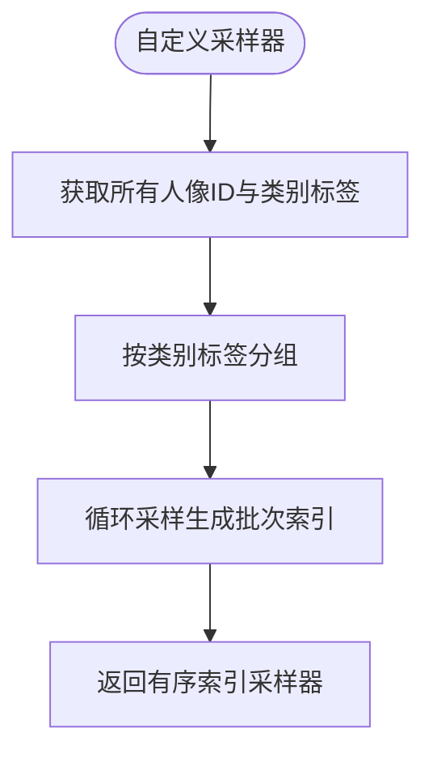
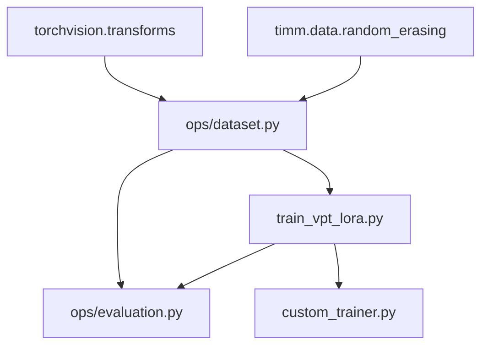

# 数据处理流程

<cite>
**本文引用的文件**
- [ops/dataset.py](file://ops/dataset.py)
- [ops/evaluation.py](file://ops/evaluation.py)
- [config.py](file://config.py)
- [train_vpt_lora.py](file://train_vpt_lora.py)
- [custom_trainer.py](file://custom_trainer.py)
- [README.md](file://README.md)
- [requirements.txt](file://requirements.txt)
</cite>

## 目录
1. [引言](#引言)
2. [项目结构](#项目结构)
3. [核心组件](#核心组件)
4. [架构总览](#架构总览)
5. [详细组件分析](#详细组件分析)
6. [依赖分析](#依赖分析)
7. [性能考虑](#性能考虑)
8. [故障排查指南](#故障排查指南)
9. [结论](#结论)
10. [附录：数据目录结构与扩展指南](#附录数据目录结构与扩展指南)

## 引言
本文件系统化梳理VICP项目的数据加载与预处理机制，重点解析以下内容：
- PetFaceDataset类的实现细节：图像路径组织、标签映射、类别划分逻辑
- 数据增强策略在transform中的应用方式及其对模型鲁棒性的提升作用
- PetFaceReIDEvalDataset在评估阶段的数据组织形式
- 结合config.py中的root路径与classes定义，说明数据目录结构要求
- 自定义数据集接入的扩展指南，包括如何定义新的dataset_name及其对应的类别配置
- 强调数据格式一致性与预处理流水线的可复现性

## 项目结构
项目采用模块化设计，数据加载与评估逻辑集中在ops子目录，训练入口位于根目录。核心文件如下：
- ops/dataset.py：定义多种数据集类，负责从CSV/文本文件读取样本路径并生成标签
- ops/evaluation.py：包含验证与ReID评估流程，以及特征提取与指标计算
- config.py：提供数据配置字典，包含root路径、类别划分与默认transform
- train_vpt_lora.py：训练入口，使用PetFaceDataset构建训练集，并在评估时调用评估函数
- custom_trainer.py：自定义采样器，按“人像ID”粒度进行批次重排，提升训练稳定性
- README.md：项目背景与使用说明
- requirements.txt：运行所需的核心依赖版本

图表来源
- [ops/dataset.py](file://ops/dataset.py#L1-L178)
- [ops/evaluation.py](file://ops/evaluation.py#L1-L220)
- [config.py](file://config.py#L1-L16)
- [train_vpt_lora.py](file://train_vpt_lora.py#L145-L186)
- [custom_trainer.py](file://custom_trainer.py#L120-L156)
- [README.md](file://README.md#L1-L73)
- [requirements.txt](file://requirements.txt#L1-L2)

章节来源
- [README.md](file://README.md#L1-L73)
- [requirements.txt](file://requirements.txt#L1-L2)

## 核心组件
本节聚焦数据加载与预处理的关键组件，包括数据集类、transform定义、评估数据组织与训练采样策略。

- PetFaceDataset：从CSV中读取训练样本路径，基于路径中的类别名生成标签映射，返回图像与整型标签
- PetFaceEvalDataset：读取配对验证集CSV，返回成对图像与二分类标签
- PetFaceReIDEvalDataset：读取测试文本列表，按行解析图像路径并生成全局样本ID作为标签
- PetFaceTrainDataset：在训练场景下，支持按“人像ID”采样，构造正负样本对或单样本批次
- 自定义采样器：按类别标签重排批次索引，确保同类别ID在批次内均匀覆盖

章节来源
- [ops/dataset.py](file://ops/dataset.py#L12-L178)
- [custom_trainer.py](file://custom_trainer.py#L120-L156)

## 架构总览
训练与评估的数据流如下：
- 训练阶段：根据config.py中的dataset_name选择类别集合，构建PetFaceDataset；若未显式传入transform，则使用默认增强流水线
- 评估阶段：针对每个类别分别提取特征，使用ops/evaluation.py中的评估函数计算指标
- ReID评估：使用PetFaceReIDEvalDataset组织查询样本，计算Rank-1/5与mAP

图表来源
- [train_vpt_lora.py](file://train_vpt_lora.py#L145-L186)
- [config.py](file://config.py#L3-L16)
- [ops/evaluation.py](file://ops/evaluation.py#L165-L219)
- [ops/dataset.py](file://ops/dataset.py#L66-L91)

## 详细组件分析

### PetFaceDataset：图像路径组织、标签映射与类别划分
- 图像路径组织
  - 通过遍历class_names，读取每个类别的split/{class}/train.csv，提取filename列
  - 将所有样本路径拼接为image_list
- 标签映射
  - 遍历image_list，从路径中解析类别名（例如路径中倒数第二段），建立类别到整数ID的映射
  - 生成与样本一一对应的整型标签列表
- 类别划分逻辑
  - 训练入口根据dataset_name从config.py读取classes或按splits划分训练/测试类别
  - PetFaceDataset不直接参与类别划分，仅依据传入的class_names加载对应样本

图表来源
- [ops/dataset.py](file://ops/dataset.py#L12-L43)
- [config.py](file://config.py#L3-L16)

章节来源
- [ops/dataset.py](file://ops/dataset.py#L12-L43)
- [config.py](file://config.py#L3-L16)

### PetFaceEvalDataset：配对验证集的数据组织
- 读取split/{class}/verification.csv，每行包含两个图像路径与一个二分类标签
- __getitem__返回两幅图像与标签，用于对比学习或相似度任务

图表来源
- [ops/dataset.py](file://ops/dataset.py#L45-L65)

章节来源
- [ops/dataset.py](file://ops/dataset.py#L45-L65)

### PetFaceReIDEvalDataset：ReID评估阶段的数据组织
- 读取split/{class}/test.txt，逐行解析图像路径
- 从路径中提取人像ID并生成全局样本ID作为标签
- __getitem__返回单幅图像与标签，供特征提取与排序评估

图表来源
- [ops/dataset.py](file://ops/dataset.py#L66-L91)

章节来源
- [ops/dataset.py](file://ops/dataset.py#L66-L91)

### PetFaceTrainDataset：训练场景下的增强与采样
- 增强流水线（默认）
  - Resize至固定尺寸
  - RandomHorizontalFlip
  - ColorJitter、RandomGrayscale、GaussianBlur等（注释掉的增强在默认transform中未启用）
  - ToTensor与Normalize
- 采样策略
  - 支持按“人像ID”采样，每次随机选择同一ID内的两张图像组成正样本对
  - 提供按样本索引的常规采样模式

图表来源
- [ops/dataset.py](file://ops/dataset.py#L92-L160)

章节来源
- [ops/dataset.py](file://ops/dataset.py#L92-L160)

### 训练入口与评估流程
- 训练入口
  - 从config.py读取dataset_name，构建训练类别集合
  - 使用PetFaceDataset加载训练数据
  - 在评估阶段，针对每个类别提取提示向量并调用评估函数
- 评估函数
  - evaluate_verification：对配对验证集提取特征并计算ROC/AUC与准确率
  - evaluate_reid：对ReID测试集提取特征并计算Rank-1/5与mAP

图表来源
- [train_vpt_lora.py](file://train_vpt_lora.py#L145-L186)
- [ops/evaluation.py](file://ops/evaluation.py#L165-L219)
- [ops/dataset.py](file://ops/dataset.py#L66-L91)

章节来源
- [train_vpt_lora.py](file://train_vpt_lora.py#L145-L186)
- [ops/evaluation.py](file://ops/evaluation.py#L165-L219)

### 自定义采样器：按类别ID重排批次
- 从训练数据集中获取所有人像ID及其类别标签
- 按类别标签分组，随机重复采样以生成大量批次索引
- 返回OrderedSampler，按顺序输出索引，保证批次内类别分布稳定

图表来源
- [custom_trainer.py](file://custom_trainer.py#L120-L156)

章节来源
- [custom_trainer.py](file://custom_trainer.py#L120-L156)

## 依赖分析
- 外部库
  - torchvision.transforms：提供Resize、ToTensor、Normalize等基础变换
  - timm.data.random_erasing：提供随机擦除增强（当前未在默认transform中启用）
- 内部模块
  - ops/dataset：定义数据集类与辅助函数
  - ops/evaluation：封装评估流程与指标计算
  - train_vpt_lora：训练入口，组合数据集与评估
  - custom_trainer：自定义采样器

图表来源
- [ops/dataset.py](file://ops/dataset.py#L122-L139)
- [train_vpt_lora.py](file://train_vpt_lora.py#L109-L119)
- [custom_trainer.py](file://custom_trainer.py#L120-L156)

章节来源
- [ops/dataset.py](file://ops/dataset.py#L122-L139)
- [train_vpt_lora.py](file://train_vpt_lora.py#L109-L119)
- [custom_trainer.py](file://custom_trainer.py#L120-L156)

## 性能考虑
- 数据加载
  - 使用多进程DataLoader（num_workers=16）提升吞吐
  - 评估阶段按类别拼接数据集，避免重复加载
- 变换效率
  - 默认transform中包含Resize、ToTensor、Normalize，减少额外转换开销
  - 增强策略（ColorJitter、GaussianBlur等）在默认transform中被注释，实际训练中可按需启用
- 特征提取
  - 评估时对图像进行翻转增强并融合特征，提高特征稳健性
  - 使用归一化与距离度量计算指标，避免数值不稳定

[本节为通用性能建议，不直接分析具体代码文件]

## 故障排查指南
- 图像路径错误
  - 症状：读取不到图像或标签不匹配
  - 排查：确认split/{class}/train.csv与test.txt中的路径是否与root一致
- 类别映射异常
  - 症状：标签越界或类别数量不符
  - 排查：检查路径中类别名的提取规则（基于路径分隔符）
- transform不一致
  - 症状：训练与评估图像尺寸不一致导致报错
  - 排查：确保训练与评估均使用相同的Resize尺寸与Normalize参数
- 评估指标为空
  - 症状：某些类别无样本导致评估跳过
  - 排查：确认split文件夹与CSV/文本文件存在且非空

章节来源
- [ops/dataset.py](file://ops/dataset.py#L12-L43)
- [ops/dataset.py](file://ops/dataset.py#L66-L91)
- [ops/evaluation.py](file://ops/evaluation.py#L165-L219)

## 结论
VICP项目的数据处理流程围绕统一的路径组织与标签映射展开，通过清晰的配置与数据集类实现，确保了训练与评估的一致性。默认transform提供了基础的预处理与增强能力，评估阶段则通过特征融合与标准化进一步提升鲁棒性。自定义采样器与评估函数共同保障了训练稳定性与指标可靠性。

[本节为总结性内容，不直接分析具体代码文件]

## 附录：数据目录结构与扩展指南

### 数据目录结构要求
- 根目录由config.py中的root指定，应包含以下结构：
  - images/：存放所有图像文件
  - split/{class}/：每个类别一个子目录，包含
    - train.csv：训练样本路径列表（列名为filename）
    - verification.csv：配对验证样本（两列图像路径与一列标签）
    - test.txt：ReID测试样本路径列表（每行一个路径）

章节来源
- [config.py](file://config.py#L3-L16)
- [ops/dataset.py](file://ops/dataset.py#L12-L43)
- [ops/dataset.py](file://ops/dataset.py#L45-L65)
- [ops/dataset.py](file://ops/dataset.py#L66-L91)

### 数据增强策略与鲁棒性提升
- 默认transform（未启用的增强已注释）
  - RandomResizedCrop、RandomHorizontalFlip、ColorJitter、RandomGrayscale、GaussianBlur等
  - ToTensor与Normalize
- 作用
  - 随机裁剪与翻转提升模型对几何变化的不变性
  - 颜色抖动与灰度化增强对光照与色彩变化的鲁棒性
  - 高斯模糊降低噪声敏感性
- 实践建议
  - 在默认transform中启用需要的增强，保持训练与评估transform一致
  - 对不同数据集可定制不同的增强强度

章节来源
- [ops/dataset.py](file://ops/dataset.py#L122-L139)
- [train_vpt_lora.py](file://train_vpt_lora.py#L109-L119)

### 自定义数据集接入步骤
- 定义新的dataset_name
  - 在config.py中新增键值，设置root、classes与splits
- 准备数据目录
  - 按上述目录结构放置images与split文件
- 数据集类适配
  - 若路径组织与现有类不一致，可在ops/dataset.py中新增类或修改现有类的路径解析逻辑
- 训练入口集成
  - 在train_vpt_lora.py中读取新dataset_name并构建数据集
- 评估流程
  - 确保评估函数能够加载对应split文件并正确提取特征

章节来源
- [config.py](file://config.py#L3-L16)
- [ops/dataset.py](file://ops/dataset.py#L12-L43)
- [ops/dataset.py](file://ops/dataset.py#L45-L65)
- [ops/dataset.py](file://ops/dataset.py#L66-L91)
- [train_vpt_lora.py](file://train_vpt_lora.py#L145-L186)