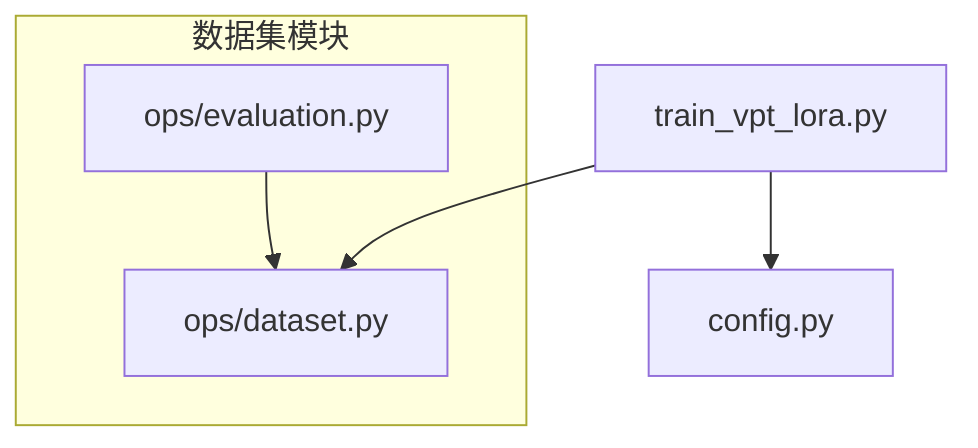
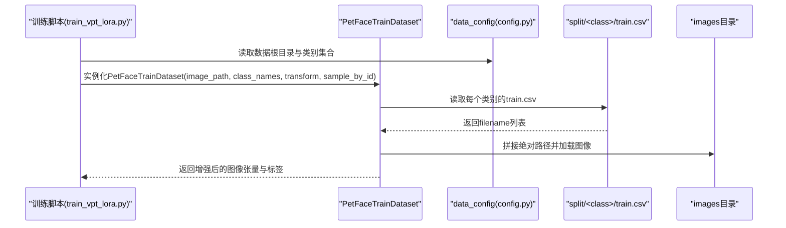
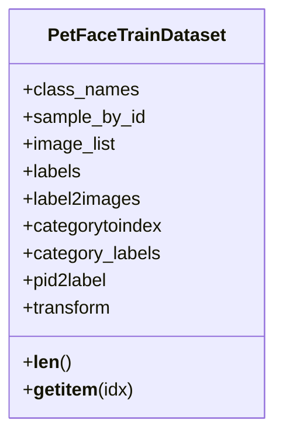
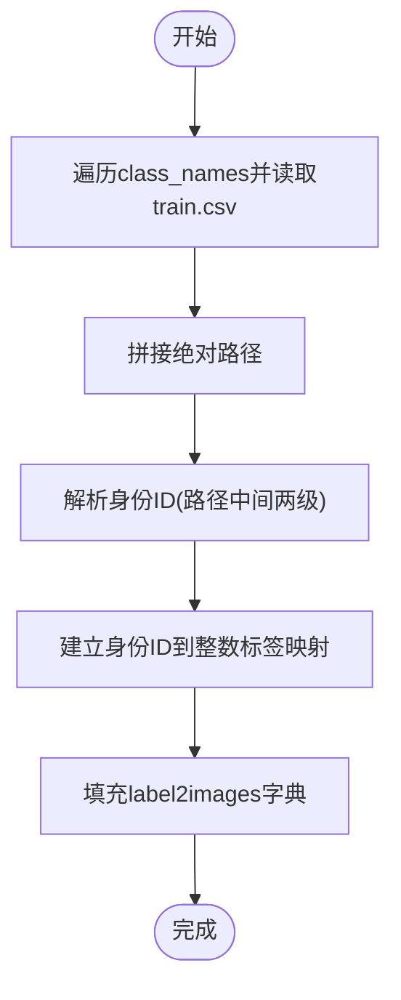
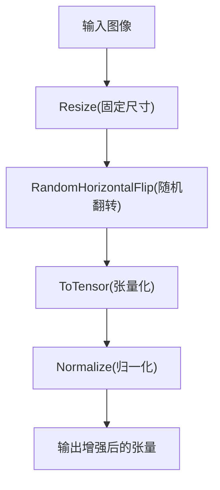
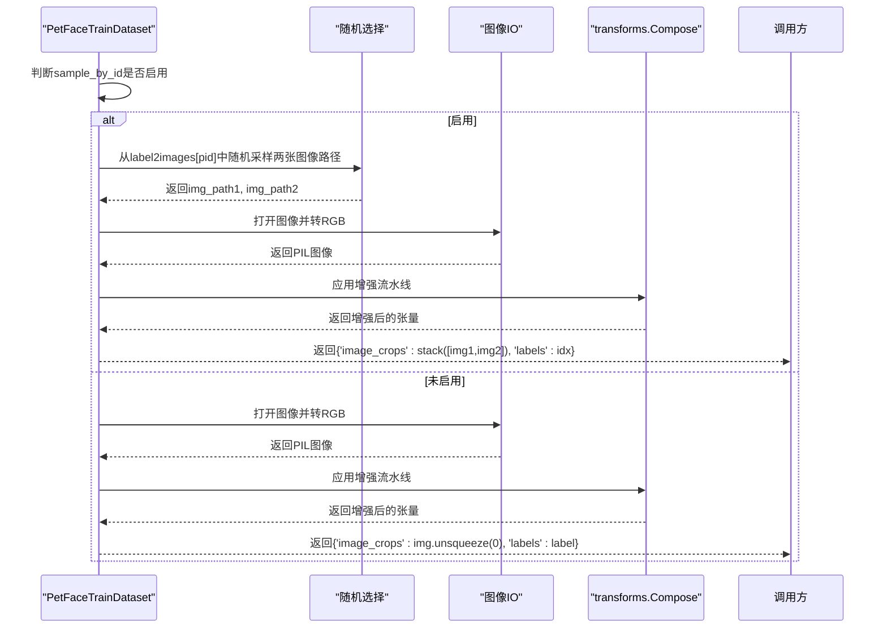
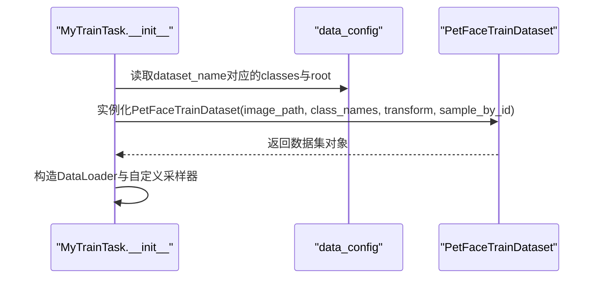
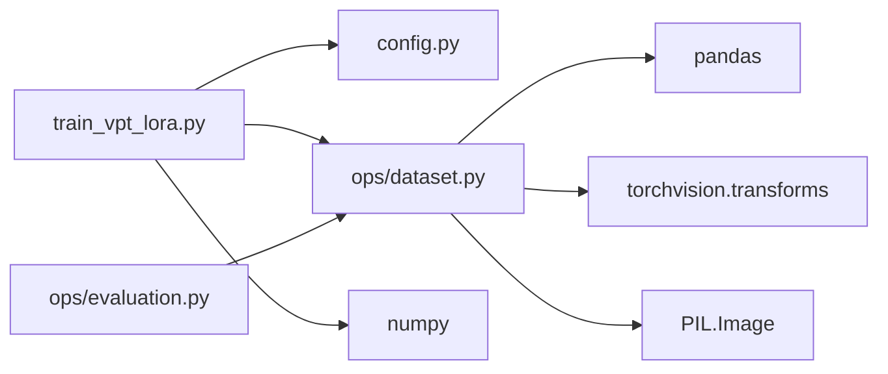

# 训练数据构建

<cite>
**本文引用的文件**
- [ops/dataset.py](file://ops/dataset.py)
- [train_vpt_lora.py](file://train_vpt_lora.py)
- [config.py](file://config.py)
- [ops/evaluation.py](file://ops/evaluation.py)
</cite>

## 目录
1. [简介](#简介)
2. [项目结构](#项目结构)
3. [核心组件](#核心组件)
4. [架构总览](#架构总览)
5. [详细组件分析](#详细组件分析)
6. [依赖关系分析](#依赖关系分析)
7. [性能考量](#性能考量)
8. [故障排查指南](#故障排查指南)
9. [结论](#结论)
10. [附录](#附录)

## 简介
本文件聚焦于VICP项目中用于模型训练的数据构建流程，重点解析PetFaceTrainDataset类的设计与实现，涵盖以下关键点：
- 在sample_by_id模式下如何按身份（ID）采样图像对，以及在常规模式下的随机采样策略；
- 如何从CSV文件加载图像路径，并构建label2images字典以支持高效同类样本检索；
- 内置的transforms.Compose数据增强流水线及其对模型泛化能力的作用；
- 结合train_vpt_lora.py中的实例化代码，说明如何通过class_names参数加载特定类别的训练数据；
- 扩展该数据集类以支持新数据格式或增强策略的实践建议。

## 项目结构
本仓库与训练数据构建直接相关的文件如下：
- ops/dataset.py：包含PetFaceTrainDataset、PetFaceDataset、PetFaceEvalDataset、PetFaceReIDEvalDataset等数据集类定义，以及通用图像列表数据集与重采样辅助函数；
- train_vpt_lora.py：训练入口脚本，展示如何实例化数据集、配置class_names、构造DataLoader与自定义采样器；
- config.py：数据集配置，提供数据根目录、类别划分与默认变换；
- ops/evaluation.py：评估流程中对数据集的使用示例，体现数据增强的一致性与复用。

**图表来源**
- [ops/dataset.py](file://ops/dataset.py#L1-L178)
- [train_vpt_lora.py](file://train_vpt_lora.py#L1-L295)
- [config.py](file://config.py#L1-L16)
- [ops/evaluation.py](file://ops/evaluation.py#L1-L200)

**章节来源**
- [ops/dataset.py](file://ops/dataset.py#L1-L178)
- [train_vpt_lora.py](file://train_vpt_lora.py#L1-L295)
- [config.py](file://config.py#L1-L16)
- [ops/evaluation.py](file://ops/evaluation.py#L1-L200)

## 核心组件
- PetFaceTrainDataset：面向训练的图像数据集，支持两类采样模式：
  - 常规模式：按索引顺序返回单张图像；
  - sample_by_id模式：按身份ID采样一对来自同一ID的图像，用于对比学习或相似度学习任务。
- PetFaceDataset：面向验证/测试的图像数据集，提供基础的图像读取与标签映射逻辑；
- PetFaceEvalDataset/PetFaceReIDEvalDataset：分别用于验证与重识别评估的数据集；
- 数据增强流水线：统一采用Resize、RandomHorizontalFlip、ToTensor、Normalize等步骤，部分场景可选ColorJitter、GaussianBlur等。

**章节来源**
- [ops/dataset.py](file://ops/dataset.py#L92-L160)
- [ops/dataset.py](file://ops/dataset.py#L1-L91)
- [ops/evaluation.py](file://ops/evaluation.py#L165-L219)

## 架构总览
训练数据构建的整体流程如下：
- 通过config.py提供的data_config确定数据根目录与类别集合；
- 在train_vpt_lora.py中根据训练需求选择class_names并实例化PetFaceTrainDataset；
- 数据集内部从split/<class>/train.csv加载图像相对路径，拼接为绝对路径并建立label2images字典；
- 使用内置或传入的transforms.Compose对图像进行增强与归一化；
- 训练时可通过sample_by_id模式按ID采样图像对，或在常规模式下按索引返回单图；
- 自定义采样器_myTrainTask._get_train_sampler基于label2images的ID集合进行批量采样。

**图表来源**
- [train_vpt_lora.py](file://train_vpt_lora.py#L145-L186)
- [ops/dataset.py](file://ops/dataset.py#L92-L160)
- [config.py](file://config.py#L1-L16)

## 详细组件分析

### PetFaceTrainDataset设计与实现
- 类职责
  - 加载CSV文件中的图像路径，构建图像列表与标签映射；
  - 建立label2images字典，键为身份ID，值为该ID对应的图像路径列表；
  - 提供两种采样模式：
    - 常规模式：返回单张图像与对应标签；
    - sample_by_id模式：按ID采样两个来自同一ID的图像，返回图像堆叠与ID索引作为标签。
- 关键字段
  - image_list：所有训练图像的绝对路径列表；
  - labels：每张图像对应的整数标签；
  - label2images：身份ID到图像路径列表的映射；
  - categorytoindex/category_labels：类别名到索引的映射及每张图像所属类别的标签；
  - pid2label：身份ID到类名的映射。
- 数据增强流水线
  - 默认增强包含：Resize、RandomHorizontalFlip、ToTensor、Normalize；
  - 可选增强（注释）：RandomResizedCrop、ColorJitter、RandomGrayscale、GaussianBlur；
  - 若传入transform，则优先使用外部传入的增强流水线。
- 采样逻辑
  - 常规模式：按索引访问image_list，打开图像并应用transform；
  - sample_by_id模式：遍历label2images的keys，随机从同一ID的图像列表中采样两张，返回堆叠后的张量与ID索引作为标签。

**图表来源**
- [ops/dataset.py](file://ops/dataset.py#L92-L160)

**章节来源**
- [ops/dataset.py](file://ops/dataset.py#L92-L160)

### CSV加载与label2images构建
- 路径加载
  - 遍历class_names，读取split/<class>/train.csv中的filename列；
  - 将相对路径拼接到image_path/images下形成绝对路径。
- 标签与ID映射
  - 通过解析图像路径的中间两级目录（通常为类别与身份），生成身份ID；
  - 使用字典d维护身份ID到连续整数标签的映射；
  - 同时记录类别标签与身份ID到类名的映射，便于后续分类或聚类任务。
- 效率考虑
  - label2images字典使得按ID检索同类样本的时间复杂度近似O(1)，查询同类样本列表为O(1)平均时间。

**图表来源**
- [ops/dataset.py](file://ops/dataset.py#L98-L119)

**章节来源**
- [ops/dataset.py](file://ops/dataset.py#L98-L119)

### 数据增强流水线与泛化能力
- 默认增强组成
  - Resize：统一输入尺寸，保证批次内形状一致；
  - RandomHorizontalFlip：引入左右翻转，提升模型对视角变化的鲁棒性；
  - ToTensor：将PIL图像转为张量；
  - Normalize：使用ImageNet均值与标准差进行归一化，加速收敛并稳定训练。
- 可选增强（注释）
  - RandomResizedCrop：模拟尺度变化；
  - ColorJitter：模拟光照与色彩变化；
  - RandomGrayscale：模拟灰度变化；
  - GaussianBlur：模拟模糊噪声。
- 泛化能力作用
  - 通过随机几何与颜色扰动，减少过拟合，提升模型对不同拍摄条件的适应性；
  - 归一化确保特征分布稳定，有利于优化器收敛。

**图表来源**
- [ops/dataset.py](file://ops/dataset.py#L122-L139)

**章节来源**
- [ops/dataset.py](file://ops/dataset.py#L122-L139)

### sample_by_id模式下的图像对采样
- 适用场景
  - 对比学习、相似度学习或三元组损失等需要正负样本对的任务；
  - 通过同一ID内的多张图像构造正样本对，不同ID之间构造负样本对。
- 采样策略
  - 常规模式：返回单张图像与整数标签；
  - sample_by_id模式：遍历label2images的keys，随机从同一ID的图像列表中采样两张图像，返回堆叠后的张量与ID索引作为标签；
  - 该模式下__len__返回的是身份ID的数量，而非图像总数。

**图表来源**
- [ops/dataset.py](file://ops/dataset.py#L140-L160)

**章节来源**
- [ops/dataset.py](file://ops/dataset.py#L140-L160)

### 在train_vpt_lora.py中配置class_names
- 数据集配置
  - 通过data_config读取数据根目录与类别集合；
  - 支持按聚类划分排除某些类别，仅加载训练所需的类别集合。
- 实例化PetFaceTrainDataset
  - 传入image_path与class_names，即可加载指定类别的训练数据；
  - 可选传入自定义transform覆盖默认增强流水线；
  - 可设置sample_by_id为True以启用按ID采样的图像对模式。
- 训练采样器
  - 自定义_myTrainTask._get_train_sampler基于label2images的ID集合，按类别标签进行批量采样，确保训练时的类别均衡与稳定性。

**图表来源**
- [train_vpt_lora.py](file://train_vpt_lora.py#L145-L186)
- [config.py](file://config.py#L1-L16)

**章节来源**
- [train_vpt_lora.py](file://train_vpt_lora.py#L145-L186)
- [config.py](file://config.py#L1-L16)

### 评估与一致性
- 评估脚本中对数据增强的一致性要求
  - 验证与重识别评估同样使用Resize、ToTensor、Normalize等增强，确保特征提取与评估阶段的一致性；
  - 评估流程中对图像进行翻转后特征融合，进一步提升特征稳定性。
- 与训练数据集的协同
  - 训练阶段的增强与评估阶段保持一致，避免域偏移导致的性能下降。

**章节来源**
- [ops/evaluation.py](file://ops/evaluation.py#L165-L219)
- [ops/evaluation.py](file://ops/evaluation.py#L270-L288)

## 依赖关系分析
- 组件耦合
  - PetFaceTrainDataset依赖Pandas读取CSV、PIL加载图像、Torchvision transforms进行增强；
  - 训练脚本train_vpt_lora.py依赖config.py提供的数据配置，并实例化数据集；
  - 评估脚本ops/evaluation.py依赖ops/dataset.py中的评估数据集类。
- 外部依赖
  - pandas：读取CSV文件；
  - torchvision.transforms：图像增强；
  - PIL.Image：图像解码与转换；
  - numpy：采样器中的数组操作。

**图表来源**
- [train_vpt_lora.py](file://train_vpt_lora.py#L145-L186)
- [ops/dataset.py](file://ops/dataset.py#L1-L178)
- [ops/evaluation.py](file://ops/evaluation.py#L165-L219)
- [config.py](file://config.py#L1-L16)

**章节来源**
- [train_vpt_lora.py](file://train_vpt_lora.py#L145-L186)
- [ops/dataset.py](file://ops/dataset.py#L1-L178)
- [ops/evaluation.py](file://ops/evaluation.py#L165-L219)
- [config.py](file://config.py#L1-L16)

## 性能考量
- I/O与内存
  - CSV读取与路径拼接在初始化阶段完成，避免训练循环中重复I/O；
  - label2images字典在内存中存储，查询效率高，但会占用一定内存空间。
- 增强策略
  - 默认增强组合已覆盖常见扰动；如需更强的鲁棒性，可取消注释ColorJitter、GaussianBlur等增强；
  - 注意增强强度与训练稳定性之间的平衡，避免过度扰动导致收敛困难。
- 批次采样
  - 自定义采样器基于ID集合进行批量采样，有助于类别均衡与训练稳定性；
  - 可根据数据规模调整批大小与采样轮数，以获得更稳定的梯度估计。

[本节为通用性能讨论，不直接分析具体文件]

## 故障排查指南
- CSV路径错误
  - 确认split/<class>/train.csv存在且filename列有效；
  - 确认image_path与images目录匹配，路径拼接正确。
- 图像读取失败
  - 检查图像文件是否损坏或权限问题；
  - 确保PIL能够正确解码图像。
- 标签映射异常
  - 检查身份ID解析逻辑（路径中间两级目录）是否符合预期；
  - 确认类别与身份ID映射正确，避免标签冲突。
- 增强流水线问题
  - 若自定义transform，请确保与评估阶段保持一致；
  - 检查Resize尺寸与ToTensor/Normalize的顺序是否正确。
- 采样器与DataLoader
  - 确认sample_by_id模式下DataLoader的batch_size与采样器逻辑匹配；
  - 若出现内存不足，适当降低batch_size或减少增强强度。

**章节来源**
- [ops/dataset.py](file://ops/dataset.py#L98-L160)
- [ops/evaluation.py](file://ops/evaluation.py#L165-L219)

## 结论
PetFaceTrainDataset通过从CSV加载图像路径、构建label2images字典与统一的增强流水线，实现了高效且灵活的训练数据构建。其sample_by_id模式为对比学习提供了天然支持，而默认增强组合则在提升模型泛化能力方面发挥了重要作用。结合train_vpt_lora.py中的实例化与采样器配置，可在不同任务中灵活切换采样策略与增强强度，满足多样化的训练需求。

[本节为总结性内容，不直接分析具体文件]

## 附录

### 扩展建议
- 支持新数据格式
  - 在初始化阶段增加对JSON/TXT等格式的支持，读取相应字段并拼接绝对路径；
  - 保持label2images字典结构不变，确保与现有采样与评估流程兼容。
- 增强策略扩展
  - 新增或调整transforms.Compose中的增强项，注意与评估阶段保持一致；
  - 可引入更多几何与颜色扰动，或根据任务特性定制增强强度。
- 采样策略扩展
  - 支持多模态或多视角采样，例如从同一ID的不同视角或不同时间点采样；
  - 引入难样本挖掘（如基于距离或相似度）以提升训练效率。

[本节为通用扩展建议，不直接分析具体文件]