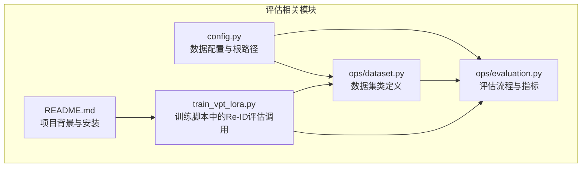
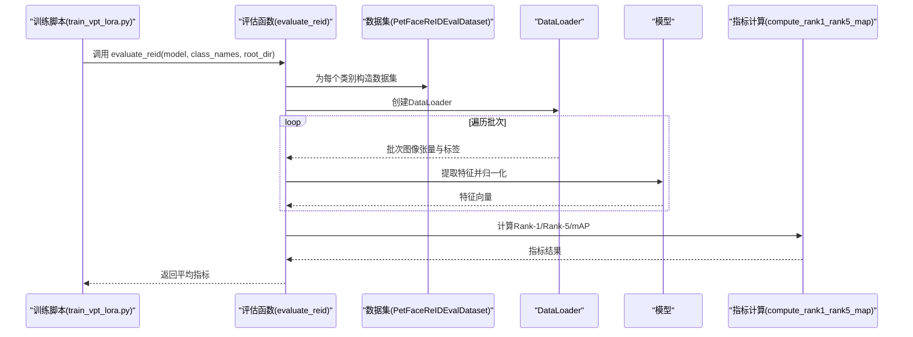
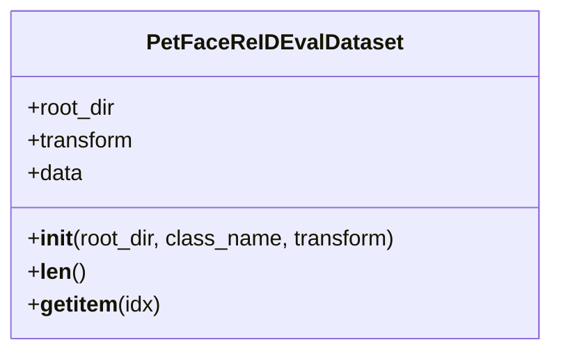
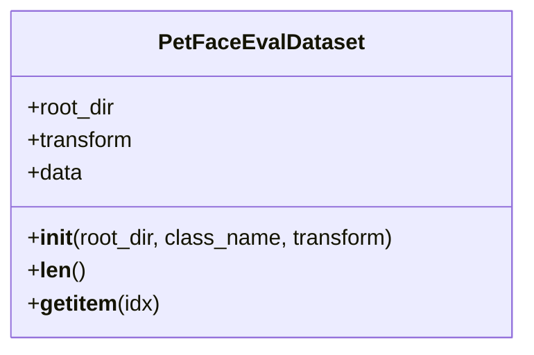
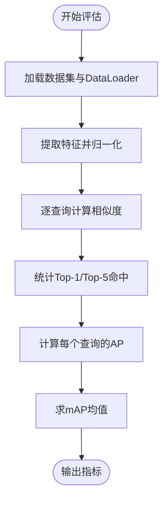
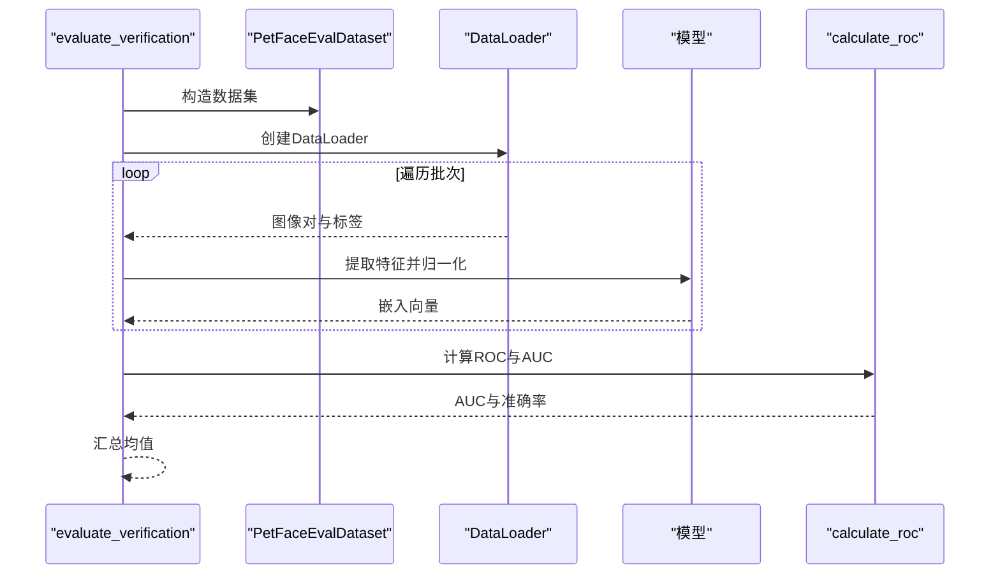
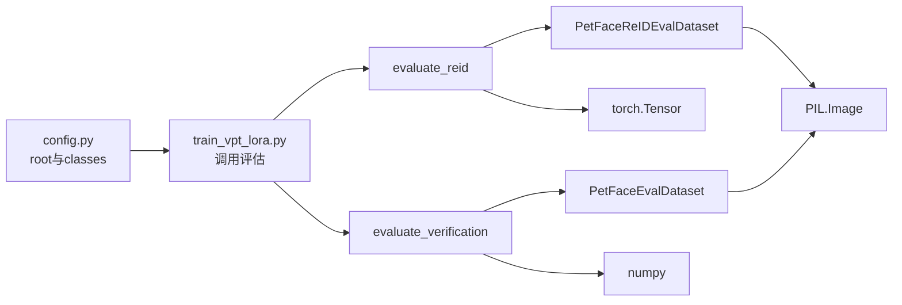

# 评估数据加载

<cite>
**本文引用的文件**
- [ops/dataset.py](file://ops/dataset.py)
- [ops/evaluation.py](file://ops/evaluation.py)
- [config.py](file://config.py)
- [README.md](file://README.md)
- [train_vpt_lora.py](file://train_vpt_lora.py)
</cite>

## 目录
1. [引言](#引言)
2. [项目结构](#项目结构)
3. [核心组件](#核心组件)
4. [架构总览](#架构总览)
5. [详细组件分析](#详细组件分析)
6. [依赖关系分析](#依赖关系分析)
7. [性能考量](#性能考量)
8. [故障排查指南](#故障排查指南)
9. [结论](#结论)
10. [附录](#附录)

## 引言
本文件聚焦VICP项目在模型评估阶段的数据加载机制，系统性阐述以下内容：
- PetFaceReIDEvalDataset类如何从test.txt读取测试图像列表，并基于个体标识(person ID)为每个样本分配唯一整数标签，用于Re-ID评估。
- 该类在Re-ID任务中的作用：提取查询图像特征并与图库图像进行相似度匹配，计算Rank-1、Rank-5与mAP等指标。
- PetFaceEvalDataset类在视觉验证任务中的应用：加载图像对及其二元标签（匹配/不匹配），用于计算AUC等验证指标。
- 结合config.py中定义的root路径与classes配置，明确评估数据集的目录结构要求，确保数据路径解析正确。

## 项目结构
围绕评估相关的代码主要分布在以下模块：
- 数据集定义与加载：ops/dataset.py
- 评估流程与指标计算：ops/evaluation.py
- 配置与根路径：config.py
- 训练脚本中对Re-ID评估的调用示例：train_vpt_lora.py
- 项目背景与安装说明：README.md

图表来源
- [ops/dataset.py](file://ops/dataset.py#L1-L178)
- [ops/evaluation.py](file://ops/evaluation.py#L1-L482)
- [config.py](file://config.py#L1-L16)
- [train_vpt_lora.py](file://train_vpt_lora.py#L200-L250)
- [README.md](file://README.md#L1-L73)

章节来源
- [ops/dataset.py](file://ops/dataset.py#L1-L178)
- [ops/evaluation.py](file://ops/evaluation.py#L1-L482)
- [config.py](file://config.py#L1-L16)
- [README.md](file://README.md#L1-L73)

## 核心组件
- PetFaceReIDEvalDataset：面向Re-ID评估的数据集，读取每个类别下的test.txt，按person ID生成连续整数标签，返回图像与其标签。
- PetFaceEvalDataset：面向视觉验证的数据集，读取verification.csv，返回图像对及二元标签（匹配/不匹配）。
- evaluate_reid：封装Re-ID评估流程，加载数据、提取特征、归一化后计算Rank-1、Rank-5与mAP。
- evaluate_verification：封装视觉验证流程，加载数据、提取特征、计算ROC曲线与AUC。
- compute_rank1_rank5_map：在给定特征矩阵与标签的情况下，逐查询计算Top-1命中、Top-5命中与mAP。

章节来源
- [ops/dataset.py](file://ops/dataset.py#L45-L91)
- [ops/evaluation.py](file://ops/evaluation.py#L433-L482)
- [ops/evaluation.py](file://ops/evaluation.py#L165-L219)
- [ops/evaluation.py](file://ops/evaluation.py#L361-L432)

## 架构总览
评估数据加载与指标计算的整体流程如下：

图表来源
- [ops/evaluation.py](file://ops/evaluation.py#L433-L482)
- [ops/dataset.py](file://ops/dataset.py#L66-L91)
- [train_vpt_lora.py](file://train_vpt_lora.py#L221-L245)

## 详细组件分析

### PetFaceReIDEvalDataset 类分析
- 数据来源与路径解析
  - 从根目录下“split/{class_name}/test.txt”读取测试样本路径列表。
  - 每行包含一个相对路径，类名由路径中倒数第二段决定（即person ID）。
- 标签映射策略
  - 使用字典pid记录首次出现的person ID及其顺序编号，形成从person ID到连续整数标签的映射。
  - 将每个样本的路径与其对应的标签组成元组，存储于内部列表。
- 数据访问接口
  - __len__返回样本数量。
  - __getitem__打开图像并应用变换，返回图像张量与整数标签。

图表来源
- [ops/dataset.py](file://ops/dataset.py#L66-L91)

章节来源
- [ops/dataset.py](file://ops/dataset.py#L66-L91)

### PetFaceEvalDataset 类分析
- 数据来源与路径解析
  - 从根目录下“split/{class_name}/verification.csv”读取图像对与二元标签。
  - 每行包含两个图像路径与一个整型标签（匹配/不匹配）。
- 数据访问接口
  - __len__返回样本数量。
  - __getitem__打开两张图像并应用变换，返回图像对与标签。

图表来源
- [ops/dataset.py](file://ops/dataset.py#L45-L65)

章节来源
- [ops/dataset.py](file://ops/dataset.py#L45-L65)

### Re-ID评估流程与指标计算
- evaluate_reid
  - 为每个类别构建PetFaceReIDEvalDataset实例，拼接为ConcatDataset。
  - 使用DataLoader批量加载，禁用打乱与多进程，避免排序混淆。
  - 对每批图像提取特征并归一化，收集所有特征与标签。
  - 分类别调用compute_rank1_rank5_map计算指标，并汇总均值。
- compute_rank1_rank5_map
  - 对每个查询，计算与所有样本的内积相似度，排除自匹配。
  - 基于排序后的索引统计Top-1与Top-5命中，并计算mAP。

图表来源
- [ops/evaluation.py](file://ops/evaluation.py#L433-L482)
- [ops/evaluation.py](file://ops/evaluation.py#L361-L432)

章节来源
- [ops/evaluation.py](file://ops/evaluation.py#L433-L482)
- [ops/evaluation.py](file://ops/evaluation.py#L361-L432)

### 视觉验证流程与AUC计算
- evaluate_verification
  - 为每个类别构建PetFaceEvalDataset实例，拼接为ConcatDataset。
  - 使用DataLoader批量加载，禁用打乱与多进程。
  - 对每批图像对提取特征并归一化，得到两列嵌入。
  - 使用calculate_roc计算阈值扫描下的TPR/FPR与AUC，并汇总均值。

图表来源
- [ops/evaluation.py](file://ops/evaluation.py#L165-L219)
- [ops/dataset.py](file://ops/dataset.py#L45-L65)

章节来源
- [ops/evaluation.py](file://ops/evaluation.py#L165-L219)
- [ops/dataset.py](file://ops/dataset.py#L45-L65)

### 训练脚本中的Re-ID评估调用
- 在训练脚本中，通过data_config提供的root路径与类别列表，调用evaluate_reid完成评估。
- 该调用展示了评估数据加载与指标计算在实际训练流程中的集成方式。

章节来源
- [train_vpt_lora.py](file://train_vpt_lora.py#L221-L245)
- [config.py](file://config.py#L1-L16)

## 依赖关系分析
- 数据集类依赖
  - PetFaceReIDEvalDataset与PetFaceEvalDataset均依赖PIL.Image进行图像解码、torchvision.transforms进行预处理。
  - 两者都依赖os.path.join进行路径拼接，依赖根目录结构约定。
- 评估函数依赖
  - evaluate_reid依赖compute_rank1_rank5_map与DataLoader。
  - evaluate_verification依赖calculate_roc与DataLoader。
- 配置依赖
  - config.py提供root路径与类别列表，训练脚本据此调用评估函数。

图表来源
- [config.py](file://config.py#L1-L16)
- [train_vpt_lora.py](file://train_vpt_lora.py#L221-L245)
- [ops/evaluation.py](file://ops/evaluation.py#L165-L219)
- [ops/evaluation.py](file://ops/evaluation.py#L433-L482)
- [ops/dataset.py](file://ops/dataset.py#L45-L91)

章节来源
- [config.py](file://config.py#L1-L16)
- [train_vpt_lora.py](file://train_vpt_lora.py#L221-L245)
- [ops/evaluation.py](file://ops/evaluation.py#L165-L219)
- [ops/evaluation.py](file://ops/evaluation.py#L433-L482)
- [ops/dataset.py](file://ops/dataset.py#L45-L91)

## 性能考量
- 批大小与设备：评估时使用较大的batch_size（如256）与GPU推理，有助于加速特征提取。
- 归一化：对特征进行L2归一化，有利于相似度计算与指标稳定性。
- 数据加载：DataLoader禁用打乱与多进程，确保排序一致性；num_workers设置较高可提升吞吐。
- 计算复杂度：compute_rank1_rank5_map对每个查询计算与全部样本的相似度，时间复杂度近似O(N^2)，建议在小规模或分块场景下使用。

[本节为通用性能讨论，不直接分析具体文件]

## 故障排查指南
- 路径错误
  - 症状：无法找到split/{class_name}/test.txt或verification.csv。
  - 排查：确认config.py中root路径指向正确的数据根目录，且split目录存在。
- 文件格式问题
  - 症状：test.txt或verification.csv格式异常导致解析失败。
  - 排查：检查文件编码与分隔符，确保路径列与标签列格式一致。
- 标签不连续或重复
  - 症状：标签缺失或重复导致指标异常。
  - 排查：确认test.txt中每行person ID首次出现时被赋予新序号，且无重复路径。
- 设备内存不足
  - 症状：GPU显存溢出。
  - 排查：降低batch_size或减少类别数量，或在评估前对数据集进行子采样。
- 多进程与打乱
  - 症状：排序结果不稳定。
  - 排查：确保DataLoader禁用shuffle并合理设置num_workers。

章节来源
- [ops/dataset.py](file://ops/dataset.py#L45-L91)
- [ops/evaluation.py](file://ops/evaluation.py#L165-L219)
- [ops/evaluation.py](file://ops/evaluation.py#L433-L482)

## 结论
本文件系统梳理了VICP项目在评估阶段的数据加载机制，重点阐明：
- PetFaceReIDEvalDataset通过test.txt按person ID生成唯一标签，支撑Re-ID评估。
- evaluate_reid与compute_rank1_rank5_map共同实现Rank-1、Rank-5与mAP的计算。
- PetFaceEvalDataset通过verification.csv提供图像对与二元标签，支撑AUC等验证指标。
- config.py中的root与classes配置决定了数据路径解析与类别枚举范围。
建议在部署评估时严格遵循上述目录结构与配置约定，确保数据加载与指标计算稳定可靠。

[本节为总结性内容，不直接分析具体文件]

## 附录

### 目录结构要求（基于代码约定）
- 根目录(root)
  - split/{class_name}/test.txt：每行包含一个图像相对路径，类名为路径倒数第二段。
  - split/{class_name}/verification.csv：包含两列图像路径与一列二元标签（匹配/不匹配）。
  - images：存放所有图像文件，路径与test.txt/verification.csv中的相对路径对应。

章节来源
- [ops/dataset.py](file://ops/dataset.py#L45-L91)
- [config.py](file://config.py#L1-L16)