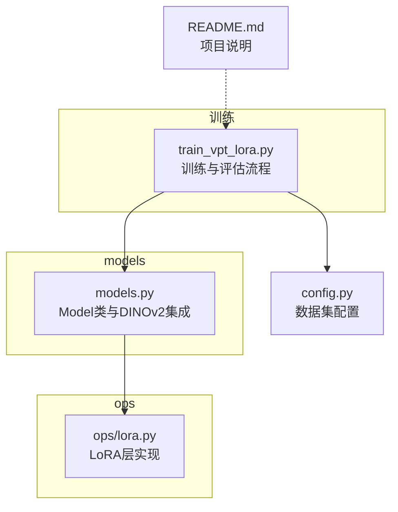
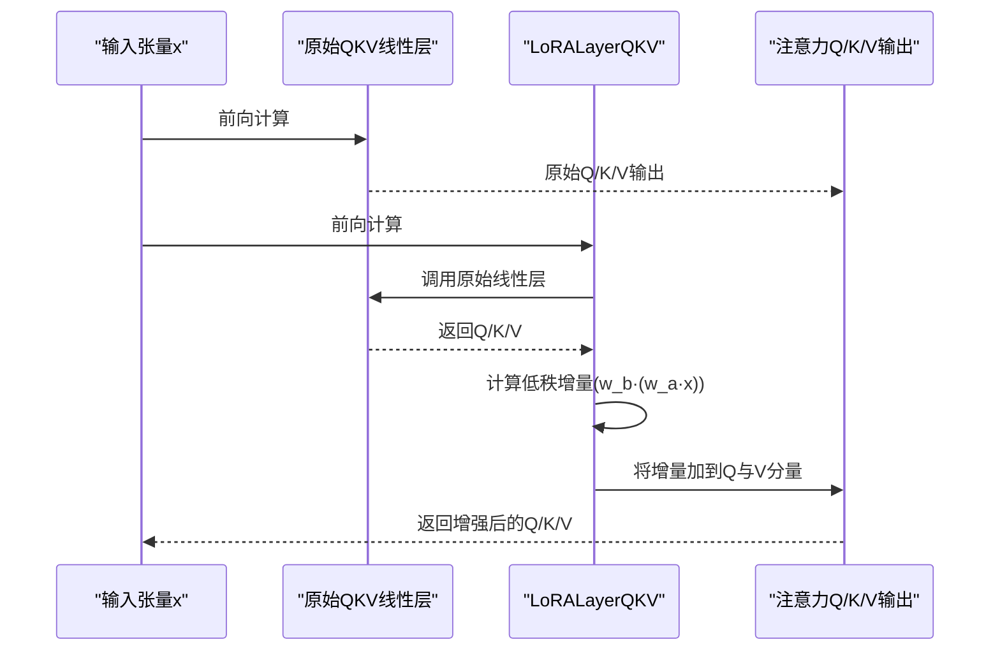
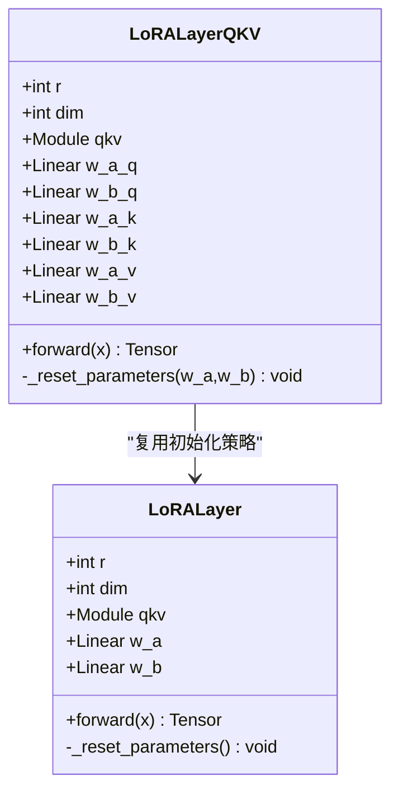
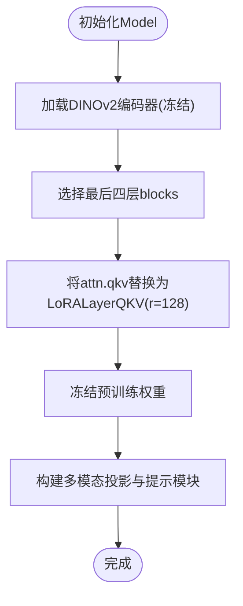
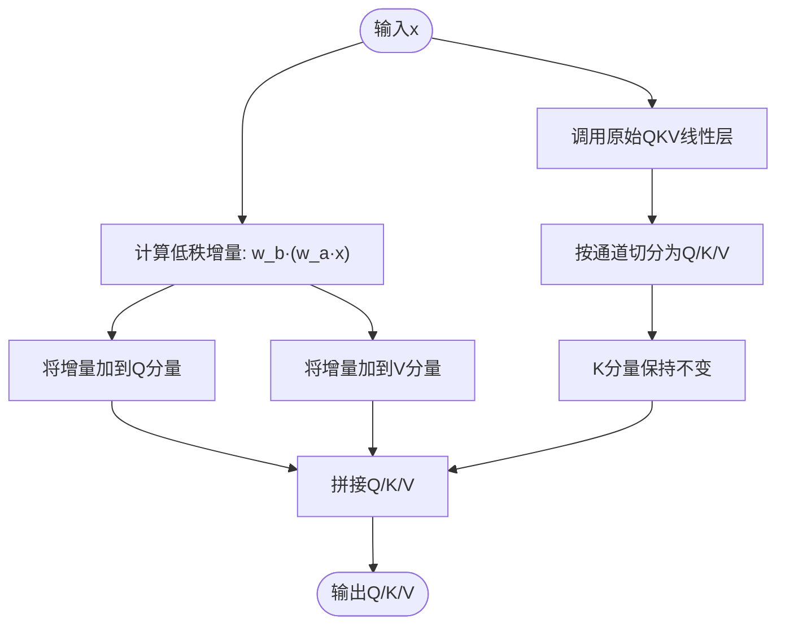
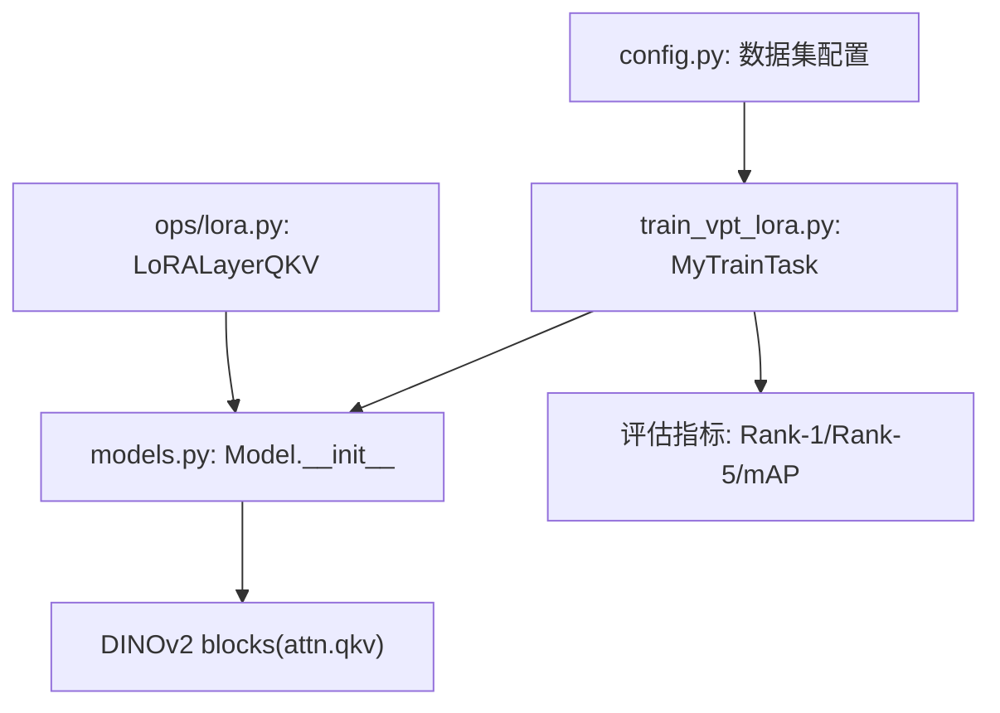

# LoRA适配机制

<cite>
**本文引用的文件**
- [ops/lora.py](file://ops/lora.py)
- [models.py](file://models.py)
- [train_vpt_lora.py](file://train_vpt_lora.py)
- [README.md](file://README.md)
- [config.py](file://config.py)
</cite>

## 目录
1. [简介](#简介)
2. [项目结构](#项目结构)
3. [核心组件](#核心组件)
4. [架构总览](#架构总览)
5. [详细组件分析](#详细组件分析)
6. [依赖关系分析](#依赖关系分析)
7. [性能考量](#性能考量)
8. [故障排查指南](#故障排查指南)
9. [结论](#结论)
10. [附录](#附录)

## 简介
本文件围绕仓库中的LoRA（低秩适配）技术展开，重点解析ops/lora.py中LoRALayerQKV类如何在DINOv2编码器最后四层的自注意力QKV投影层中注入可训练的低秩矩阵（w_a_q/w_b_q等），并通过前向传播函数将增量更新叠加到原始权重输出上。结合models.py中Model类的初始化逻辑，说明LoRA仅在最后四层应用的设计意图及其对模型容量与计算效率的权衡；深入分析r=128的秩选择对参数量、显存占用和微调效果的影响，并给出LoRA权重初始化策略（Kaiming均匀分布与零初始化）的实现细节。最后提供典型应用场景下的调参建议与故障排查指南。

## 项目结构
本项目采用“功能模块化+分层组织”的方式：
- ops：包含LoRA、损失、数据集等通用能力模块
- models：定义视觉-语言多模态模型主体结构
- 训练脚本：train_vpt_lora.py负责训练流程与评估指标
- 配置：config.py提供数据集划分配置
- README：项目背景、安装与训练命令说明

图表来源
- [ops/lora.py](file://ops/lora.py#L1-L99)
- [models.py](file://models.py#L81-L120)
- [train_vpt_lora.py](file://train_vpt_lora.py#L145-L186)
- [config.py](file://config.py#L1-L16)
- [README.md](file://README.md#L1-L73)

章节来源
- [README.md](file://README.md#L1-L73)
- [config.py](file://config.py#L1-L16)

## 核心组件
- LoRA基础层：LoRALayer封装单个线性层的低秩适配，通过两层线性变换（w_a、w_b）实现低秩增量，并将其加回到原Q/K/V输出的Q与V分量。
- LoRA-QKV层：LoRALayerQKV针对Q/K/V三个投影分别注入低秩权重（w_a_q/w_b_q、w_a_k/w_b_k、w_a_v/w_b_v），在前向时分别对Q、K、V分量进行增量叠加。
- 初始化策略：使用Kaiming均匀初始化w_a，w_b使用零初始化，保证适配权重从零开始学习，避免破坏预训练权重的稳定性。
- 应用范围：在DINOv2编码器最后四层的自注意力QKV投影处替换为LoRALayerQKV，以最小改动获得更强的可塑性与更少的参数开销。

章节来源
- [ops/lora.py](file://ops/lora.py#L5-L37)
- [ops/lora.py](file://ops/lora.py#L58-L99)

## 架构总览
下图展示了LoRA在DINOv2编码器中的注入位置与数据流路径。LoRA层包裹原始QKV线性层，前向时先执行原线性变换，再叠加低秩增量，最终得到增强后的Q/K/V输出。

图表来源
- [ops/lora.py](file://ops/lora.py#L80-L94)
- [models.py](file://models.py#L93-L100)

## 详细组件分析

### LoRA基础层与QKV层实现
- LoRALayer：对单个线性层进行低秩适配，w_a维度为(in_features, r)，w_b维度为(r, in_features)，前向时先执行原线性变换，再叠加低秩增量到Q与V分量。
- LoRALayerQKV：对Q/K/V三个投影分别建立低秩子模块，前向时分别计算低秩增量并叠加到对应分量，保持Q/K/V通道对齐。

图表来源
- [ops/lora.py](file://ops/lora.py#L5-L37)
- [ops/lora.py](file://ops/lora.py#L58-L99)

章节来源
- [ops/lora.py](file://ops/lora.py#L5-L37)
- [ops/lora.py](file://ops/lora.py#L58-L99)

### 在DINOv2编码器中的应用与初始化
- 应用范围：在Model类初始化时，遍历DINOv2编码器最后四层的block，将每个block的attn.qkv替换为LoRALayerQKV实例，秩r=128。
- 设计意图：仅在最后四层引入LoRA，既能保留浅层特征的稳定性和泛化能力，又能在深层增强对任务相关的判别能力，从而在参数量与效果之间取得平衡。
- 参数量估算：每层Q/K/V各新增2×(dim×r)参数，共约4×dim×r（忽略bias）。以r=128为例，若dim≈384（ViT-B/14），则每层新增参数约约29万；四层合计约116万，远小于全模型参数规模。

图表来源
- [models.py](file://models.py#L81-L120)
- [models.py](file://models.py#L93-L100)

章节来源
- [models.py](file://models.py#L81-L120)
- [models.py](file://models.py#L93-L100)

### 前向传播与增量叠加逻辑
- 原始Q/K/V输出形状为(B, N, 3×dim)，其中前dim为Q，中间dim为K，后dim为V。
- 低秩增量形状为(B, N, dim)，分别加到Q与V分量，K分量保持不变。
- 这种设计使得LoRA仅对Q与V的投影进行可训练扰动，不改变K的投影，从而减少对注意力强度的直接干扰。

图表来源
- [ops/lora.py](file://ops/lora.py#L80-L94)

章节来源
- [ops/lora.py](file://ops/lora.py#L80-L94)

### 权重初始化策略
- w_a：使用Kaiming均匀分布初始化，有助于在反向传播时保持方差稳定，加速收敛。
- w_b：使用零初始化，使初始阶段不引入额外扰动，保证预训练权重主导，降低灾难性遗忘风险。
- AffineLoRA变体：通过beta/gamma对低秩子空间进行仿射调制，但本文主要使用LoRALayerQKV。

章节来源
- [ops/lora.py](file://ops/lora.py#L33-L37)
- [ops/lora.py](file://ops/lora.py#L96-L99)

## 依赖关系分析
- LoRA层依赖于torch.nn.Module与nn.Linear，通过替换DINOv2块中的attn.qkv实现无侵入式适配。
- Model类在初始化时动态替换QKV层，同时冻结预训练编码器权重，仅训练LoRA参数。
- 训练脚本负责构建数据集、优化器与训练循环，评估指标包括Rank-1、Rank-5与mAP。

图表来源
- [ops/lora.py](file://ops/lora.py#L58-L99)
- [models.py](file://models.py#L93-L100)
- [train_vpt_lora.py](file://train_vpt_lora.py#L145-L186)
- [config.py](file://config.py#L1-L16)

章节来源
- [ops/lora.py](file://ops/lora.py#L58-L99)
- [models.py](file://models.py#L93-L100)
- [train_vpt_lora.py](file://train_vpt_lora.py#L145-L186)
- [config.py](file://config.py#L1-L16)

## 性能考量
- 参数量与显存
  - r=128时，每层新增参数约29万，四层合计约116万；与DINOv2整体参数相比占比很小，对显存压力有限。
  - 由于仅训练LoRA参数，优化器状态与梯度存储显著减少，适合资源受限场景。
- 计算效率
  - 增量计算为两层线性变换，开销与r成正比；r越大，计算越重，但通常收益也更大。
  - 仅在最后四层注入LoRA，避免对浅层大量计算的干扰，整体推理时间增加有限。
- 收敛与稳定性
  - Kaiming初始化w_a与零初始化w_b有助于稳定训练初期，降低梯度爆炸或消失风险。
  - 若出现收敛困难，可考虑降低学习率、增大批次或减小r值。

[本节为通用性能讨论，无需特定文件引用]

## 故障排查指南
- 梯度消失/爆炸
  - 症状：loss震荡或停滞，梯度范数异常。
  - 排查：检查学习率是否过高；确认w_a使用了合适的初始化；必要时启用梯度裁剪。
  - 参考初始化策略：[ops/lora.py](file://ops/lora.py#L33-L37)、[ops/lora.py](file://ops/lora.py#L96-L99)
- 过拟合迹象
  - 症状：训练集表现好但验证集下降。
  - 排查：增加正则（如weight_decay）、减少r或降低学习率；检查数据增强强度。
  - 训练配置参考：[train_vpt_lora.py](file://train_vpt_lora.py#L170-L176)
- 训练不稳定
  - 症状：loss剧烈波动。
  - 排查：降低学习率；检查优化器参数；确认冻结预训练权重正确生效。
  - 参考冻结逻辑：[models.py](file://models.py#L85-L91)
- 评估指标异常
  - 症状：Rank-1/Rank-5偏低或mAP异常。
  - 排查：检查类别不平衡、提示构造与特征归一化；确认评估流程正确。
  - 参考评估指标：[train_vpt_lora.py](file://train_vpt_lora.py#L32-L84)

章节来源
- [ops/lora.py](file://ops/lora.py#L33-L37)
- [ops/lora.py](file://ops/lora.py#L96-L99)
- [train_vpt_lora.py](file://train_vpt_lora.py#L170-L176)
- [models.py](file://models.py#L85-L91)
- [train_vpt_lora.py](file://train_vpt_lora.py#L32-L84)

## 结论
LoRALayerQKV通过在DINOv2最后四层的Q/K/V投影处注入低秩增量，在几乎不改变预训练权重的前提下，显著增强了模型对下游任务的适应能力。r=128的秩选择在参数量、显存与微调效果之间取得了良好平衡；配合Kaiming均匀与零初始化策略，有效提升了训练稳定性。该方案适合资源受限且需要快速适配新任务的场景，是轻量化微调的有效手段。

[本节为总结性内容，无需特定文件引用]

## 附录

### 典型应用场景与调参建议
- 学习率设置
  - 建议从较小学习率开始（例如1e-4），若收敛慢可逐步提升；过大易导致发散。
  - 参考训练脚本中的学习率设置：[train_vpt_lora.py](file://train_vpt_lora.py#L49-L54)
- 秩大小调整
  - r=128已能带来明显增益；若显存紧张可降至64，若任务复杂可尝试256，但需权衡显存与收敛速度。
- 与其他微调方法对比
  - 全量微调：效果更好但参数量大、显存高。
  - Adapter/Prefix Tuning：类似LoRA的模块化适配，LoRA在参数量与效率上更具优势。
  - P-Tuning/VPT：侧重提示注入，LoRA更关注注意力投影的可塑性。
- 数据与评估
  - 使用Rank-1、Rank-5与mAP作为主要评估指标，注意特征归一化与类别平衡。
  - 参考评估流程：[train_vpt_lora.py](file://train_vpt_lora.py#L210-L251)

章节来源
- [train_vpt_lora.py](file://train_vpt_lora.py#L49-L54)
- [train_vpt_lora.py](file://train_vpt_lora.py#L210-L251)