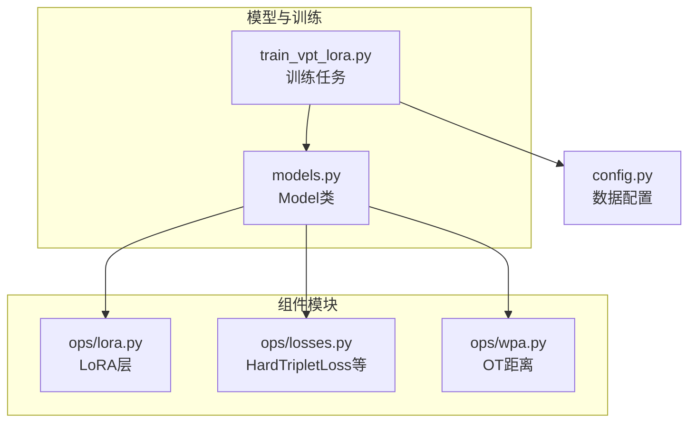
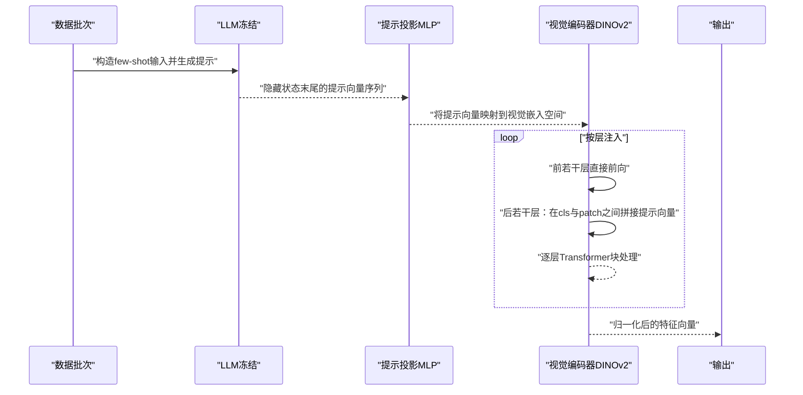
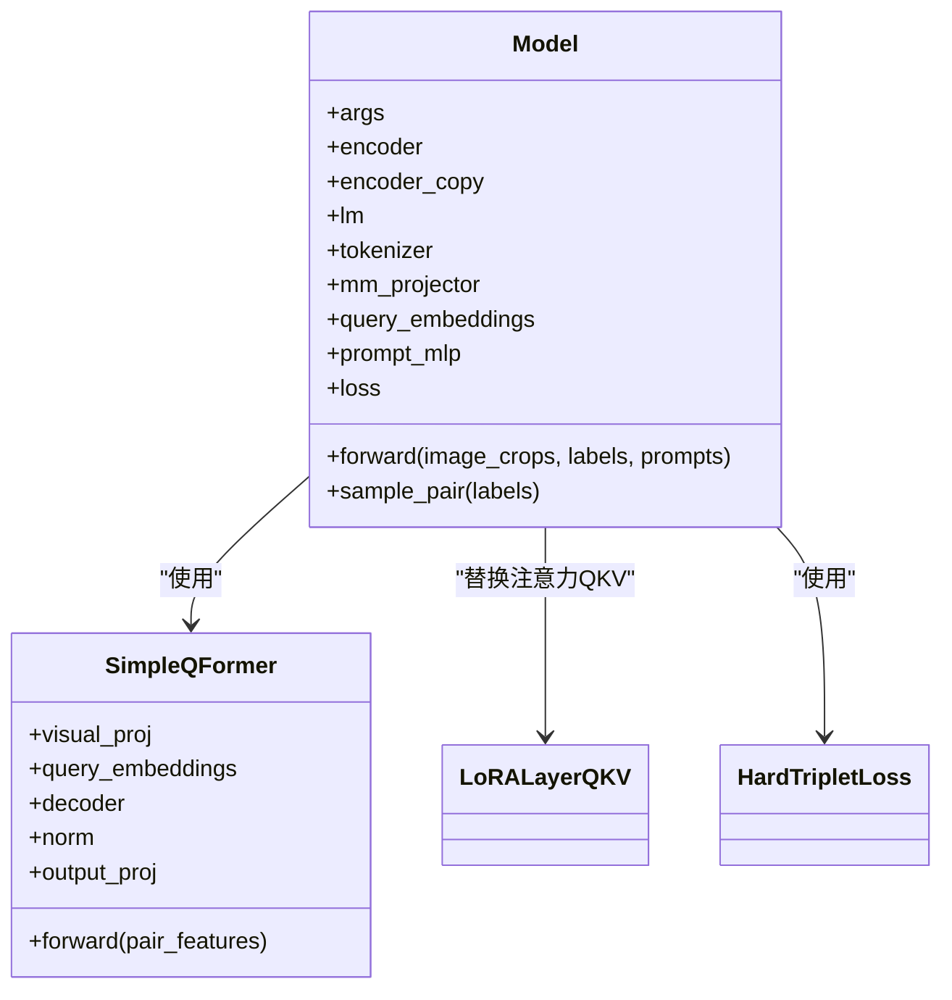
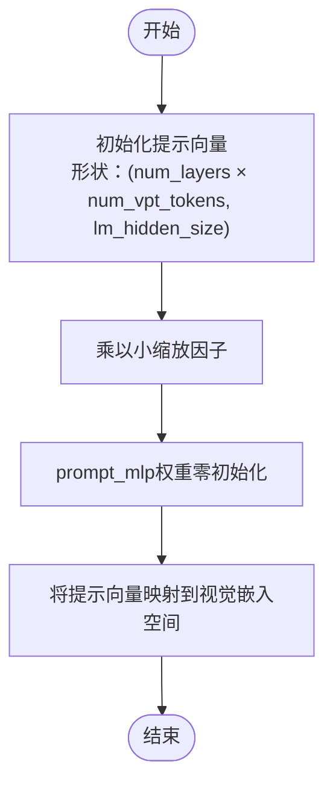
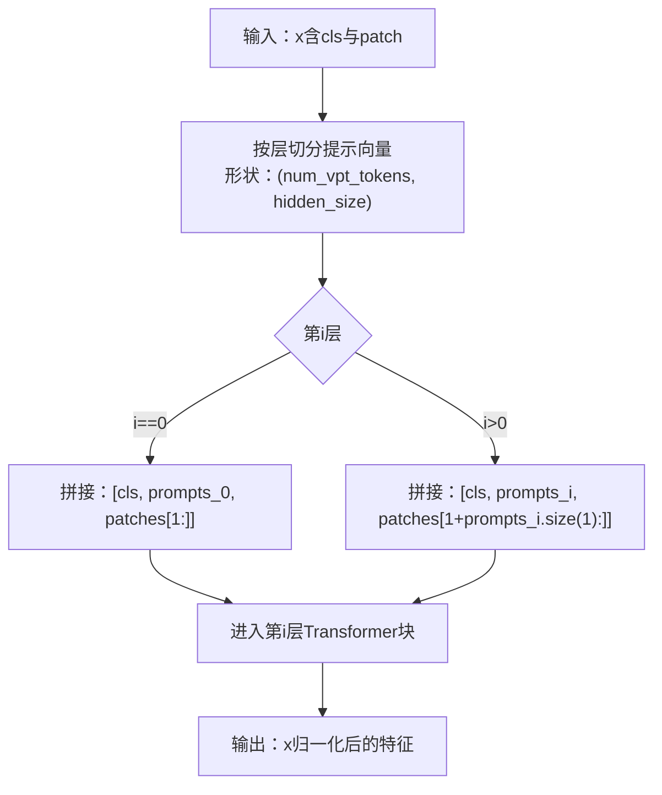
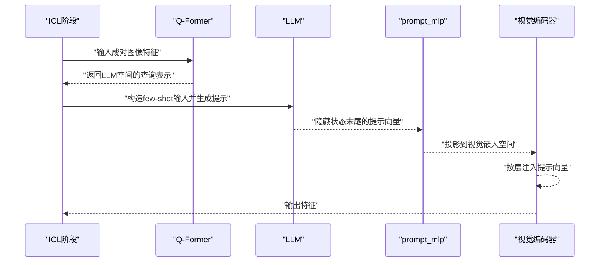
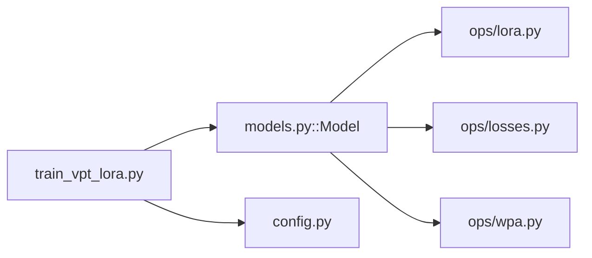

# VPT提示调优

<cite>
**本文引用的文件**
- [models.py](file://models.py)
- [README.md](file://README.md)
- [train_vpt_lora.py](file://train_vpt_lora.py)
- [ops/lora.py](file://ops/lora.py)
- [ops/losses.py](file://ops/losses.py)
- [ops/wpa.py](file://ops/wpa.py)
- [config.py](file://config.py)
</cite>

## 目录
1. [简介](#简介)
2. [项目结构](#项目结构)
3. [核心组件](#核心组件)
4. [架构总览](#架构总览)
5. [详细组件分析](#详细组件分析)
6. [依赖关系分析](#依赖关系分析)
7. [性能考量](#性能考量)
8. [故障排查指南](#故障排查指南)
9. [结论](#结论)
10. [附录](#附录)

## 简介
本文件系统性介绍VICP框架中的视觉提示调优（Visual Prompt Tuning, VPT）机制，聚焦于models.py中Model类的query_embeddings与prompt_mlp组件。文档解释可学习提示向量如何以随机噪声初始化，并经由MLP投影层适配到视觉编码器的嵌入空间；详述在forward方法中，提示向量如何与cls_token及图像块特征拼接，形成扩展输入序列并参与Transformer深层特征变换；强调提示向量按层分配的设计（num_layers × num_vpt_tokens），以及其在不同网络深度注入语义先验的能力；分析prompt_mlp的零初始化策略对训练稳定性的贡献；最后给出提示数量与层数范围选择建议，并提供常见问题（如提示向量退化、训练震荡）的诊断与优化方法。

## 项目结构
- 核心模型：models.py定义了视觉-语言融合的主模型，包含可学习提示向量与提示投影模块。
- 训练脚本：train_vpt_lora.py负责训练与评估流程，包含超参配置与数据加载。
- 组件模块：
  - ops/lora.py：低秩适配（LoRA）模块，用于轻量化调整视觉编码器注意力QKV。
  - ops/losses.py：包含三元组损失等训练损失函数。
  - ops/wpa.py：图像patch间最优传输距离计算，作为一致性约束项。
- 配置：config.py提供数据集划分与根路径等配置。

**图表来源**
- [models.py](file://models.py#L81-L270)
- [train_vpt_lora.py](file://train_vpt_lora.py#L135-L222)
- [ops/lora.py](file://ops/lora.py#L58-L99)
- [ops/losses.py](file://ops/losses.py#L279-L348)
- [ops/wpa.py](file://ops/wpa.py#L86-L110)
- [config.py](file://config.py#L1-L16)

**章节来源**
- [models.py](file://models.py#L81-L270)
- [train_vpt_lora.py](file://train_vpt_lora.py#L135-L222)
- [config.py](file://config.py#L1-L16)

## 核心组件
- 可学习提示向量（query_embeddings）
  - 在Model.__init__中以高斯噪声初始化，形状为(num_layers × num_vpt_tokens, lm_hidden_size)，随后通过prompt_mlp映射到视觉嵌入维度。
- 提示投影MLP（prompt_mlp）
  - 将LLM空间的提示向量映射到视觉编码器嵌入空间，采用零初始化权重，保证初始阶段不引入偏移。
- 视觉编码器（DINOv2）
  - 使用prepare_tokens_with_masks准备输入，分两段执行：前若干层直接前向，后若干层按层注入提示向量。
- ICL提示生成
  - 通过少量示例（few-shot）在LLM上生成提示，再从最后一层隐藏状态提取提示向量，经prompt_mlp投影后注入视觉编码器。

**章节来源**
- [models.py](file://models.py#L118-L124)
- [models.py](file://models.py#L159-L270)

## 架构总览
下图展示VPT在模型中的工作流：LLM通过ICL生成提示，prompt_mlp将其投影到视觉嵌入空间，随后按层注入到视觉编码器的Transformer块中，最终输出特征用于下游任务。

**图表来源**
- [models.py](file://models.py#L159-L270)

## 详细组件分析

### 组件A：Model类与VPT机制
- 初始化阶段
  - 加载预训练DINOv2编码器与冻结的LLM，替换部分注意力QKV为低秩适配层以降低参数量。
  - 定义可学习提示向量与提示投影MLP，其中提示向量按层×数量展开，投影MLP零初始化。
- 前向传播
  - ICL阶段：构造few-shot示例，将图像特征经Q-Former映射到LLM空间，再从LLM隐藏状态末尾抽取提示向量，经prompt_mlp投影得到视觉空间提示。
  - 注入阶段：将提示向量按层分配，分别与对应层的cls_token与图像块特征拼接，再进入该层Transformer块。
  - 特征聚合：对最终特征进行归一化，计算身份损失与patch间一致性损失，组合为总损失。

**图表来源**
- [models.py](file://models.py#L81-L270)
- [ops/lora.py](file://ops/lora.py#L58-L99)
- [ops/losses.py](file://ops/losses.py#L279-L348)

**章节来源**
- [models.py](file://models.py#L81-L270)

### 组件B：提示向量初始化与投影
- 初始化策略
  - 可学习提示向量以高斯噪声初始化，缩放因子较小，有助于稳定训练初期的梯度更新。
- 投影策略
  - prompt_mlp将提示向量从LLM嵌入维度映射到视觉嵌入维度，采用零初始化权重，避免在训练早期引入显著偏移，有利于保持视觉编码器的预训练表征稳定。

**图表来源**
- [models.py](file://models.py#L118-L124)

**章节来源**
- [models.py](file://models.py#L118-L124)

### 组件C：提示向量按层注入与序列拼接
- 层分配设计
  - 提示向量按层×数量展开，每层注入固定数量的提示向量，使语义先验在不同网络深度逐步注入，增强深层特征的判别能力。
- 序列拼接
  - 在每层中，将提示向量与cls_token及后续patch特征拼接，形成扩展序列，再进入该层Transformer块进行特征变换。

**图表来源**
- [models.py](file://models.py#L231-L241)

**章节来源**
- [models.py](file://models.py#L231-L241)

### 组件D：ICL提示生成与提示使用
- ICL生成
  - 通过构造few-shot示例，将图像特征经Q-Former映射到LLM空间，再从LLM隐藏状态末尾抽取提示向量，完成提示生成。
- 提示使用
  - 将生成的提示向量经prompt_mlp投影到视觉嵌入空间，按层分配后注入视觉编码器，参与特征提取。

**图表来源**
- [models.py](file://models.py#L159-L225)

**章节来源**
- [models.py](file://models.py#L159-L225)

## 依赖关系分析
- 模型依赖
  - Model依赖LoRA模块替换视觉编码器注意力QKV，以减少参数量并提升效率。
  - Model依赖HardTripletLoss进行身份判别损失，依赖WPA模块计算patch间一致性损失。
- 训练脚本依赖
  - train_vpt_lora.py通过自定义Trainer封装训练流程，读取config.py中的数据配置，设置超参并驱动训练。

**图表来源**
- [train_vpt_lora.py](file://train_vpt_lora.py#L135-L222)
- [models.py](file://models.py#L81-L270)
- [ops/lora.py](file://ops/lora.py#L58-L99)
- [ops/losses.py](file://ops/losses.py#L279-L348)
- [ops/wpa.py](file://ops/wpa.py#L86-L110)
- [config.py](file://config.py#L1-L16)

**章节来源**
- [train_vpt_lora.py](file://train_vpt_lora.py#L135-L222)
- [models.py](file://models.py#L81-L270)
- [config.py](file://config.py#L1-L16)

## 性能考量
- 训练稳定性
  - prompt_mlp零初始化避免在训练早期引入显著偏移，有助于保持视觉编码器的预训练表征稳定。
- 参数效率
  - 仅训练query_embeddings与prompt_mlp，其余模块冻结，显著降低参数量与显存占用。
- 注入深度与提示数量
  - 提示按层注入，可在不同深度注入语义先验；提示数量与层数共同决定注入强度与灵活性。
- 对比基线
  - 全参数微调：参数量大、易过拟合，但可能获得更强拟合能力。
  - Adapter：在注意力或前馈层插入小型适配模块，参数量适中，但需额外设计适配位置与结构。
  - VPT：仅训练少量提示向量，参数量最小，适合快速部署与跨域泛化。

[本节为通用指导，无需特定文件引用]

## 故障排查指南
- 提示向量退化
  - 现象：提示向量在训练过程中趋于相同或接近零向量，导致注入无效。
  - 排查要点：
    - 检查提示向量初始化是否过小或过大，适当调整缩放因子。
    - 检查prompt_mlp权重初始化是否被意外覆盖。
    - 检查ICL生成阶段的few-shot构造是否合理，确保提示向量有明确语义信号。
  - 优化建议：
    - 增加num_vpt_tokens或num_layers，提升注入容量。
    - 调整学习率与正则项，避免梯度过大导致退化。
- 训练震荡
  - 现象：损失波动较大，收敛不稳定。
  - 排查要点：
    - 检查max_grad_norm设置与梯度裁剪策略。
    - 检查batch size与学习率是否匹配。
    - 检查LoRA秩r设置是否合适，避免过大导致不稳定。
  - 优化建议：
    - 降低学习率或增加权重衰减。
    - 使用更稳定的优化器或调度策略。
    - 减少num_vpt_tokens或num_layers，降低注入强度。
- 注入效果不佳
  - 现象：注入后特征判别性无明显提升。
  - 排查要点：
    - 检查提示向量是否正确映射到视觉嵌入空间。
    - 检查拼接位置是否正确（cls与patches的顺序）。
    - 检查是否按层注入，且每层注入数量一致。
  - 优化建议：
    - 调整提示向量与视觉嵌入维度的对齐策略。
    - 增加ICL示例数量或提高few-shot质量。

**章节来源**
- [models.py](file://models.py#L118-L124)
- [models.py](file://models.py#L231-L241)
- [ops/lora.py](file://ops/lora.py#L58-L99)
- [ops/losses.py](file://ops/losses.py#L279-L348)

## 结论
VICP中的VPT机制通过可学习提示向量与prompt_mlp实现对视觉编码器的轻量级语义注入。提示向量以随机噪声初始化并通过零初始化的投影MLP映射到视觉嵌入空间，在后若干层按层注入，从而在不同网络深度注入语义先验。该设计在参数效率、训练稳定性与跨域泛化方面具有优势。结合ICL生成提示与多任务损失，模型在ReID等任务上取得良好表现。实践中应根据任务复杂度与资源限制合理选择num_vpt_tokens与num_layers，并注意初始化与注入细节以避免退化与震荡。

[本节为总结性内容，无需特定文件引用]

## 附录
- 超参建议
  - num_vpt_tokens：中小规模任务可从4–16起步，复杂任务可尝试32以上；若出现震荡可下调。
  - num_layers：通常选择编码器后若干层（如后2–4层），以平衡深度与稳定性；可根据层数调整提示总量。
  - prompt_mlp：保持零初始化，避免额外偏移；若出现收敛困难，可尝试较小学习率与正则。
- 数据配置
  - config.py提供数据集划分与根路径，训练时可据此加载不同类别集合。

**章节来源**
- [config.py](file://config.py#L1-L16)
- [train_vpt_lora.py](file://train_vpt_lora.py#L135-L143)