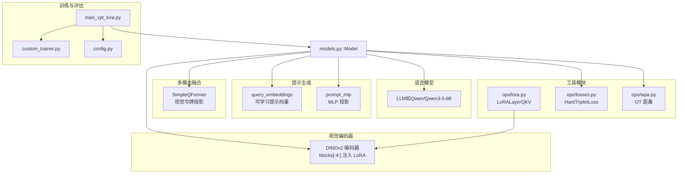
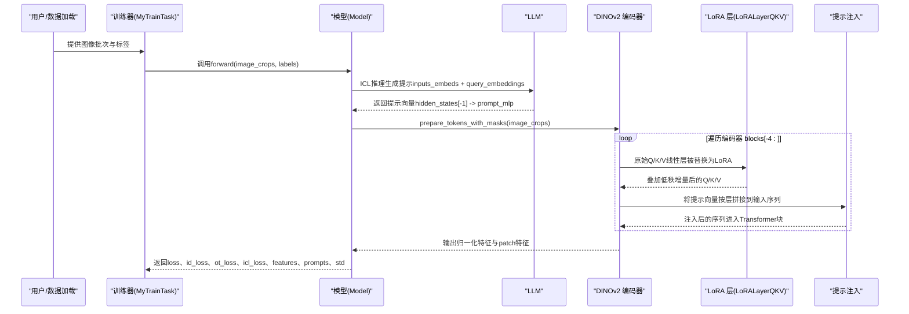
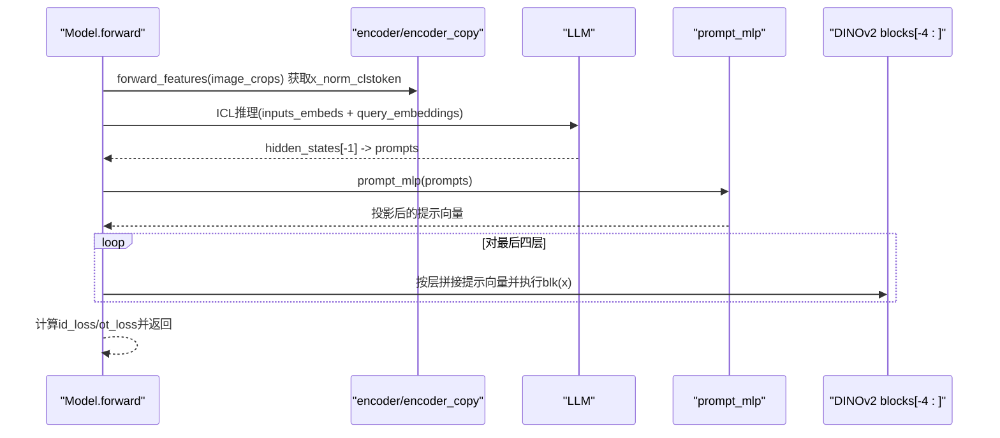
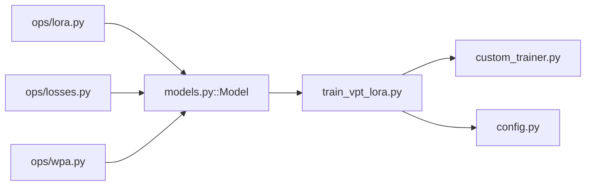

# 微调机制

<cite>
**本文引用的文件**
- [ops/lora.py](file://ops/lora.py)
- [models.py](file://models.py)
- [train_vpt_lora.py](file://train_vpt_lora.py)
- [README.md](file://README.md)
- [ops/losses.py](file://ops/losses.py)
- [ops/wpa.py](file://ops/wpa.py)
- [custom_trainer.py](file://custom_trainer.py)
- [config.py](file://config.py)
</cite>

## 目录
1. [简介](#简介)
2. [项目结构](#项目结构)
3. [核心组件](#核心组件)
4. [架构总览](#架构总览)
5. [详细组件分析](#详细组件分析)
6. [依赖关系分析](#依赖关系分析)
7. [性能考量](#性能考量)
8. [故障排除指南](#故障排除指南)
9. [结论](#结论)
10. [附录](#附录)

## 简介
本文件系统性介绍VICP框架中采用的参数高效微调技术，重点覆盖：
- LoRA（低秩适配）：基于ops/lora.py中的LoRALayerQKV实现，解释其在DINOv2编码器最后四层的Q/K/V注意力线性层中注入低秩适配矩阵（w_a_q/w_b_q等），并通过前向传播将增量更新叠加到原始权重上；同时讨论r=128的秩选择对模型容量与计算开销的权衡。
- VPT（视觉提示调优）：结合models.py中的query_embeddings与prompt_mlp，阐述其如何生成可学习的提示向量，并通过MLP投影注入到Transformer块的输入序列中；描述在forward方法中，提示向量如何与cls_token和图像块特征拼接，并参与深层特征变换。

此外，提供两种微调技术的协同工作流程图、超参数调优建议以及典型故障排除方案。

## 项目结构
仓库采用“模块化+功能分层”的组织方式：
- ops：包含LoRA、损失函数、最优传输等工具模块
- models：定义主模型结构（编码器替换、提示注入、多模态投影等）
- 训练入口与评估：train_vpt_lora.py负责训练与评估流程
- 配置与训练器：config.py提供数据集配置；custom_trainer.py扩展Trainer以记录额外损失



图表来源
- [models.py](file://models.py#L81-L124)
- [ops/lora.py](file://ops/lora.py#L58-L99)
- [ops/losses.py](file://ops/losses.py#L279-L348)
- [ops/wpa.py](file://ops/wpa.py#L86-L110)
- [train_vpt_lora.py](file://train_vpt_lora.py#L145-L198)
- [custom_trainer.py](file://custom_trainer.py#L34-L103)
- [config.py](file://config.py#L1-L16)

章节来源
- [README.md](file://README.md#L1-L73)
- [models.py](file://models.py#L81-L124)
- [ops/lora.py](file://ops/lora.py#L58-L99)
- [ops/losses.py](file://ops/losses.py#L279-L348)
- [ops/wpa.py](file://ops/wpa.py#L86-L110)
- [train_vpt_lora.py](file://train_vpt_lora.py#L145-L198)
- [custom_trainer.py](file://custom_trainer.py#L34-L103)
- [config.py](file://config.py#L1-L16)

## 核心组件
- LoRA层（LoRALayerQKV）：在Q/K/V三个子分支分别注入低秩适配矩阵，将增量更新叠加到原始Q/K/V输出中，保持原线性层不变，仅新增可训练参数。
- 视觉提示（VPT）：使用可学习的query_embeddings生成提示向量，经prompt_mlp映射到视觉嵌入维度后，按层注入到DINOv2的Transformer块输入序列中。
- 主模型（Model）：完成编码器替换、提示生成、提示注入、损失计算与日志输出。
- 训练器（CustomTrainer）：扩展标准Trainer，支持记录额外损失项（如ot_loss、id_loss、icl_loss、std）。

章节来源
- [ops/lora.py](file://ops/lora.py#L58-L99)
- [models.py](file://models.py#L81-L124)
- [custom_trainer.py](file://custom_trainer.py#L34-L103)

## 架构总览
下图展示LoRA与VPT在VICP中的协同工作流程：先由LLM通过few-shot示例生成提示，再将提示向量投影到视觉空间并逐层注入到DINOv2的最后四层；同时，LoRA在这些层的Q/K/V线性层中注入低秩适配，增强注意力的判别能力。



图表来源
- [models.py](file://models.py#L159-L269)
- [ops/lora.py](file://ops/lora.py#L58-L99)
- [train_vpt_lora.py](file://train_vpt_lora.py#L188-L251)

## 详细组件分析

### LoRA（低秩适配）实现与前向传播
- LoRA层封装：LoRALayerQKV在Q/K/V三个分支分别维护低秩适配矩阵（w_a_q/w_b_q、w_a_k/w_b_k、w_a_v/w_b_v），并在forward中将低秩增量叠加到原始Q/K/V输出对应通道。
- 注入位置：在模型初始化时，对DINOv2编码器最后四层的block.attn.qkv进行替换，注入LoRA层，从而仅对高层注意力进行参数高效调整。
- 初始化策略：w_a采用kaiming均匀初始化，w_b零初始化，保证初始状态接近恒等映射，便于训练稳定。

```mermaid
classDiagram
class LoRALayerQKV {
+int r
+int dim
-nn.Linear w_a_q
-nn.Linear w_b_q
-nn.Linear w_a_k
-nn.Linear w_b_k
-nn.Linear w_a_v
-nn.Linear w_b_v
+forward(x) Tensor
-_reset_parameters(w_a, w_b) void
}
class Model {
+encoder
+encoder_copy
+forward(image_crops, labels, prompts) dict
}
Model --> LoRALayerQKV : "替换 blocks[-4 : ] 的 qkv"
```

图表来源
- [ops/lora.py](file://ops/lora.py#L58-L99)
- [models.py](file://models.py#L93-L100)

章节来源
- [ops/lora.py](file://ops/lora.py#L58-L99)
- [models.py](file://models.py#L93-L100)

### VPT（视觉提示调优）生成与注入
- 提示生成：通过LLM的few-shot推理，将query_embeddings与输入文本拼接后得到提示向量；随后经prompt_mlp映射到视觉嵌入维度。
- 注入策略：在每层Transformer块开始前，将提示向量按层拼接到输入序列中，其中cls_token保持在首位，随后是该层的提示向量，再接后续图像块特征。
- 多层提示：query_embeddings长度为num_vpt_tokens * num_layers，按层切分后分别注入到对应层。

```mermaid
flowchart TD
Start(["开始 forward"]) --> Prep["prepare_tokens_with_masks(image_crops)"]
Prep --> LoopBLK{"遍历 blocks[-num_layers:]"}
LoopBLK --> |第0层| Cat0["拼接: [cls, prompts_0, rest]"]
LoopBLK --> |第i层(i>0)| CatI["拼接: [cls, prompts_i, rest]"]
Cat0 --> Block0["blk(x)"]
CatI --> BlockI["blk(x)"]
Block0 --> Next["继续下一层或归一化"]
BlockI --> Next
Next --> Out["输出: cls 特征 + patch_features"]
Out --> End(["结束"])
```

图表来源
- [models.py](file://models.py#L231-L245)

章节来源
- [models.py](file://models.py#L159-L269)

### 主模型（Model）的协同工作
- 编码器替换：对DINOv2的最后四层block.attn.qkv替换为LoRA层，r=128。
- ICL提示生成：当提供labels但未提供prompts时，使用encoder_copy提取图像特征，构造few-shot示例，经LLM推理得到提示向量，再经prompt_mlp映射。
- 特征提取与损失：将提示向量按层注入到编码器最后四层，输出归一化特征与patch特征；使用HardTripletLoss进行身份区分，使用OT距离（WPA）约束patch特征分布一致性。



图表来源
- [models.py](file://models.py#L159-L269)
- [ops/losses.py](file://ops/losses.py#L279-L348)
- [ops/wpa.py](file://ops/wpa.py#L86-L110)

章节来源
- [models.py](file://models.py#L81-L124)
- [ops/losses.py](file://ops/losses.py#L279-L348)
- [ops/wpa.py](file://ops/wpa.py#L86-L110)

## 依赖关系分析
- LoRA依赖：ops/lora.py独立实现LoRA层，不依赖其他模块，仅需传入原始QKV线性层与秩r。
- 模型依赖：models.py依赖LoRA层、损失函数与OT距离模块；同时依赖外部库（DINOv2、LLM）。
- 训练依赖：train_vpt_lora.py依赖自定义Trainer与数据集配置；CustomTrainer负责记录额外损失。



图表来源
- [ops/lora.py](file://ops/lora.py#L58-L99)
- [models.py](file://models.py#L81-L124)
- [ops/losses.py](file://ops/losses.py#L279-L348)
- [ops/wpa.py](file://ops/wpa.py#L86-L110)
- [train_vpt_lora.py](file://train_vpt_lora.py#L145-L198)
- [custom_trainer.py](file://custom_trainer.py#L34-L103)
- [config.py](file://config.py#L1-L16)

章节来源
- [ops/lora.py](file://ops/lora.py#L58-L99)
- [models.py](file://models.py#L81-L124)
- [ops/losses.py](file://ops/losses.py#L279-L348)
- [ops/wpa.py](file://ops/wpa.py#L86-L110)
- [train_vpt_lora.py](file://train_vpt_lora.py#L145-L198)
- [custom_trainer.py](file://custom_trainer.py#L34-L103)
- [config.py](file://config.py#L1-L16)

## 性能考量
- LoRA秩r的选择
  - r=128：在本实现中作为默认秩，平衡了参数效率与表达能力。较大的r能提升拟合能力，但会增加额外参数与计算开销；较小r则更节省资源，但可能限制适配能力。
  - 计算复杂度：LoRA在Q/K/V分支各引入两层线性层（w_a_q/w_b_q等），前向时对每个token进行两次矩阵乘法，叠加到原始Q/K/V输出上，整体开销与原线性层相当，但仅新增可训练参数。
- VPT提示数量
  - num_vpt_tokens与num_layers共同决定提示向量总量，直接影响输入序列长度与注意力计算量。建议根据显存与速度需求折中设置。
- 训练稳定性
  - LoRA初始化采用kaiming均匀初始化w_a，w_b零初始化，有助于训练初期保持稳定。
  - ICL阶段的提示生成与prompt_mlp权重初始化为零，有助于从LLM推理结果中学习动态提示。

章节来源
- [models.py](file://models.py#L93-L100)
- [ops/lora.py](file://ops/lora.py#L58-L99)

## 故障排除指南
- 训练指标异常
  - 若ot_loss、id_loss、icl_loss或std出现异常波动，检查CustomTrainer是否正确记录额外损失；确认compute_loss与_log_save_evaluate路径正常。
- 提示向量无效
  - 确认query_embeddings与prompt_mlp初始化与形状匹配；检查forward中提示向量reshape与拼接逻辑是否与num_layers一致。
- LoRA层未生效
  - 确认模型初始化时对blocks[-4:]的qkv已成功替换为LoRALayerQKV；检查r参数是否正确传入。
- 显存不足
  - 降低num_vpt_tokens或num_layers；减少per_device_train_batch_size；必要时关闭fp16/bf16混合精度。
- 数据加载问题
  - 确认PetFaceDataset输出格式与train_vpt_lora.py期望一致；检查data_config中类别划分与根目录路径。

章节来源
- [custom_trainer.py](file://custom_trainer.py#L34-L103)
- [models.py](file://models.py#L159-L269)
- [ops/lora.py](file://ops/lora.py#L58-L99)
- [train_vpt_lora.py](file://train_vpt_lora.py#L145-L198)
- [config.py](file://config.py#L1-L16)

## 结论
VICP通过LoRA与VPT的协同，实现了对DINOv2高层注意力的参数高效微调与动态视觉提示注入。LoRA在Q/K/V分支引入低秩增量，r=128在参数效率与表达能力之间取得平衡；VPT通过LLM生成提示并逐层注入，增强了模型对身份判别的敏感性。配合HardTripletLoss与OT距离（WPA），在ReID任务上实现了对新类别的良好泛化能力。

## 附录
- 训练命令参考见README中的训练部分。
- 关键参数建议
  - LoRA：r=128（默认），可根据显存与效果微调
  - VPT：num_vpt_tokens与num_layers按显存与速度权衡
  - 学习率与优化器：Adam（可选权重衰减），学习率常设为1e-4
  - 损失权重：icl_loss_weight、ot_loss_weight按实验效果调节

章节来源
- [README.md](file://README.md#L24-L54)