# 核心架构设计

<cite>
**本文引用的文件**
- [models.py](file://models.py)
- [ops/lora.py](file://ops/lora.py)
- [ops/wpa.py](file://ops/wpa.py)
- [ops/losses.py](file://ops/losses.py)
- [train_vpt_lora.py](file://train_vpt_lora.py)
- [custom_trainer.py](file://custom_trainer.py)
- [config.py](file://config.py)
- [README.md](file://README.md)
</cite>

## 目录
1. [简介](#简介)
2. [项目结构](#项目结构)
3. [核心组件](#核心组件)
4. [架构总览](#架构总览)
5. [详细组件分析](#详细组件分析)
6. [依赖分析](#依赖分析)
7. [性能考量](#性能考量)
8. [故障排查指南](#故障排查指南)
9. [结论](#结论)
10. [附录](#附录)

## 简介
本文件面向高级用户，系统性阐述VICP系统的整体架构设计与视觉-语言协同工作机制。重点包括：
- 视觉编码器DINOv2如何提取图像特征；
- 语言模型Qwen如何参与语义推理；
- Q-Former如何实现跨模态对齐；
- LoRA与VPT两类参数高效微调技术的集成方式与作用机制；
- Word-Patch Alignment（WPA）损失函数如何促进文本与图像块的细粒度匹配；
- 基于models.py中Model类的子模块组合关系与数据流路径；
- 架构决策的理论依据与技术权衡分析。

## 项目结构
仓库采用“模块化+功能分层”的组织方式：核心模型定义在models.py，训练脚本在train_vpt_lora.py，训练器封装在custom_trainer.py，配置在config.py，损失与辅助模块在ops目录下。整体结构清晰，便于扩展与维护。

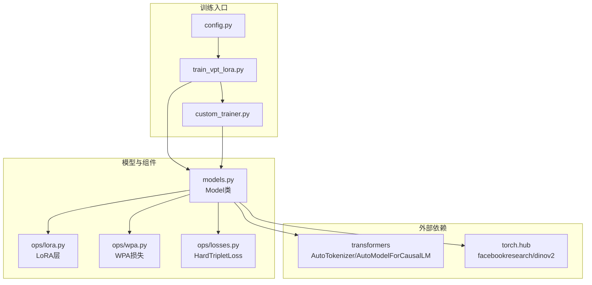

图表来源
- [models.py](file://models.py#L81-L269)
- [ops/lora.py](file://ops/lora.py#L1-L99)
- [ops/wpa.py](file://ops/wpa.py#L1-L110)
- [ops/losses.py](file://ops/losses.py#L279-L348)
- [train_vpt_lora.py](file://train_vpt_lora.py#L145-L187)
- [custom_trainer.py](file://custom_trainer.py#L34-L103)
- [config.py](file://config.py#L1-L16)

章节来源
- [README.md](file://README.md#L1-L20)
- [models.py](file://models.py#L81-L269)
- [train_vpt_lora.py](file://train_vpt_lora.py#L145-L187)
- [custom_trainer.py](file://custom_trainer.py#L34-L103)
- [config.py](file://config.py#L1-L16)

## 核心组件
- 视觉编码器（DINOv2）：加载预训练ViT变体，冻结参数，用于提取图像特征；通过prepare_tokens_with_masks与blocks堆叠实现可插拔的视觉提示注入。
- 语言模型（Qwen）：加载因果语言模型与分词器，冻结参数，作为语义推理与提示生成的主体。
- Q-Former（跨模态投影器）：将视觉tokens映射到语言嵌入空间，形成可学习的查询序列，实现跨模态对齐。
- 视觉提示（VPT）：在视觉编码器的若干后缀block中插入可学习提示向量，并通过MLP映射回视觉特征维度，实现动态视觉提示。
- 参数高效微调（LoRA）：在视觉编码器注意力的Q/K/V分支上叠加低秩适配，仅训练少量参数，保持主干稳定。
- 对比损失（HardTripletLoss）：在图像级特征上施加三元组损失，提升身份判别能力。
- 细粒度匹配（WPA）：基于最优传输的文本-图像块对齐损失，促进词与patch的细粒度对应。

章节来源
- [models.py](file://models.py#L81-L269)
- [ops/lora.py](file://ops/lora.py#L1-L99)
- [ops/losses.py](file://ops/losses.py#L279-L348)
- [ops/wpa.py](file://ops/wpa.py#L86-L110)

## 架构总览
VICP的视觉-语言协同以“先视觉、再语言”的流水线为核心：DINOv2输出图像级与patch级特征；Q-Former将视觉tokens对齐到语言嵌入空间；Qwen通过few-shot提示与内生推理生成语义规则；VPT动态注入视觉提示，引导视觉编码器聚焦身份敏感区域；LoRA在注意力中引入低秩扰动，增强可塑性；WPA在patch层面强化细粒度对齐；HardTripletLoss在图像级特征上约束身份判别。

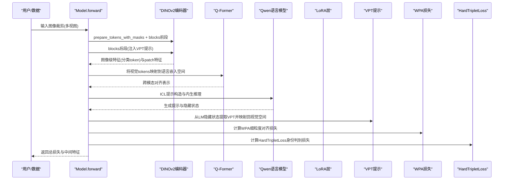

图表来源
- [models.py](file://models.py#L159-L269)
- [ops/wpa.py](file://ops/wpa.py#L86-L110)
- [ops/losses.py](file://ops/losses.py#L279-L348)

## 详细组件分析

### 视觉编码器（DINOv2）与LoRA集成
- 加载与冻结：使用torch.hub加载指定DINOv2变体，两套实例分别用于特征提取与对比学习的无梯度基准。
- 可插拔LoRA：对最后若干block的注意力Q/K/V线性层替换为LoRA层，仅训练低秩矩阵，大幅降低参数量与计算开销。
- 数据流：prepare_tokens_with_masks构建输入，随后按前后段顺序通过blocks，后段注入VPT提示。

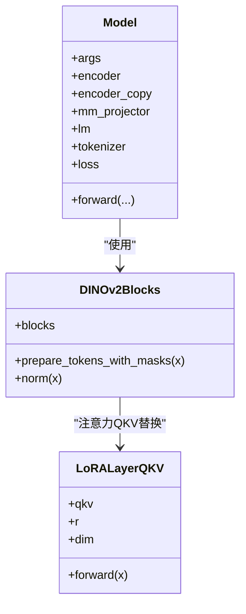

图表来源
- [models.py](file://models.py#L81-L124)
- [ops/lora.py](file://ops/lora.py#L58-L99)

章节来源
- [models.py](file://models.py#L81-L124)
- [ops/lora.py](file://ops/lora.py#L1-L99)

### Q-Former跨模态对齐
- 结构：将输入的视觉tokens重塑为二维序列，经投影进入Q-Former隐藏维，使用TransformerDecoder与可学习查询进行交叉注意力，最终输出与语言模型隐藏维一致的跨模态表示。
- 作用：将视觉tokens对齐到语言嵌入空间，为后续ICL与提示注入提供统一表征。

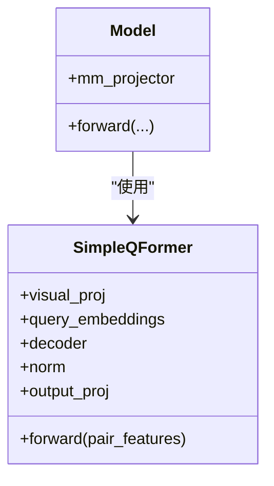

图表来源
- [models.py](file://models.py#L8-L80)

章节来源
- [models.py](file://models.py#L8-L80)

### 语言模型（Qwen）与内生推理
- 冻结主干：LM与Tokenizer加载后冻结参数，避免破坏预训练语义。
- ICL与提示注入：通过构造few-shot示例与标签，将图像特征嵌入到LM输入中，利用LM的内生推理生成提示；随后从LM隐藏状态提取VPT并映射回视觉空间，实现动态视觉提示。

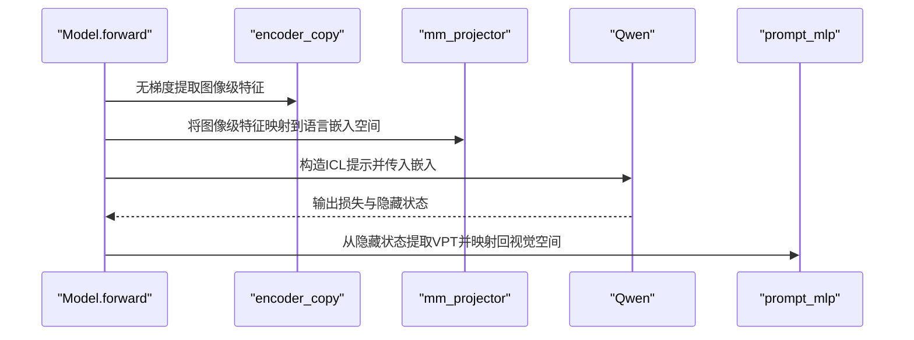

图表来源
- [models.py](file://models.py#L159-L225)
- [ops/lora.py](file://ops/lora.py#L1-L99)

章节来源
- [models.py](file://models.py#L159-L225)

### VPT（视觉提示调优）与动态注入
- 提示生成：从LM隐藏状态末层抽取VPT，经MLP映射回视觉特征维度。
- 注入策略：在视觉编码器的后若干block中，将提示向量拼接至序列，逐层引导注意力关注身份敏感区域。
- 优势：无需重训练视觉主干，仅通过提示实现泛化。

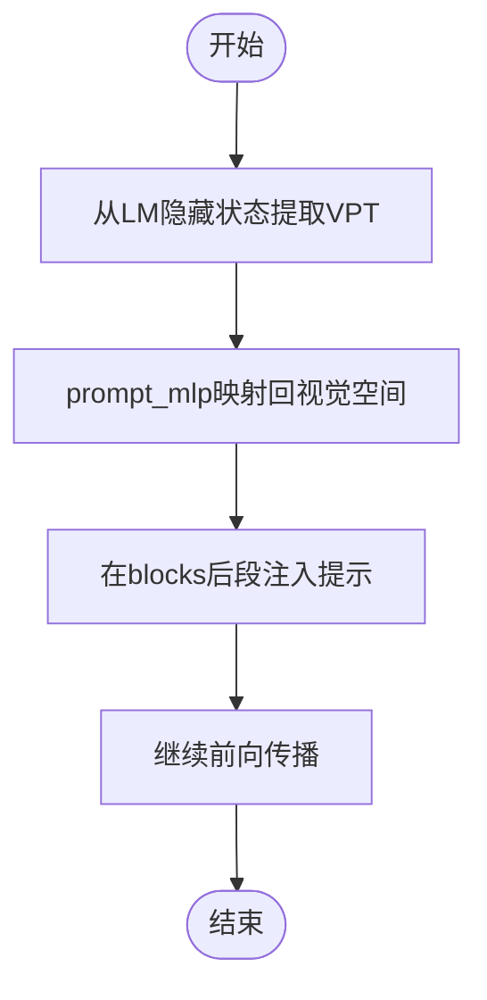

图表来源
- [models.py](file://models.py#L221-L245)

章节来源
- [models.py](file://models.py#L221-L245)

### LoRA（低秩适配）与VPT的协同
- LoRA：在注意力Q/K/V分支叠加低秩扰动，仅训练少量参数，保持视觉主干稳定。
- VPT：通过提示动态改变视觉特征分布，二者互补：前者增强可塑性，后者引导注意力焦点。
- 集成点：在encoder.blocks[-4:]替换QKV为LoRA层，同时在后段注入VPT。

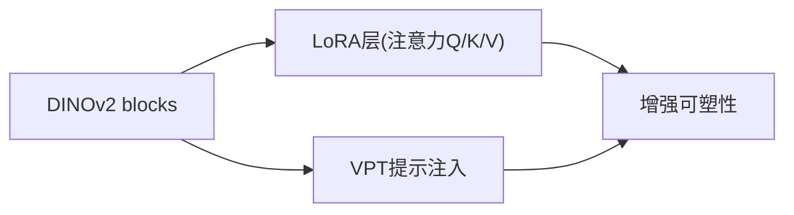

图表来源
- [models.py](file://models.py#L93-L100)
- [ops/lora.py](file://ops/lora.py#L58-L99)

章节来源
- [models.py](file://models.py#L93-L100)
- [ops/lora.py](file://ops/lora.py#L58-L99)

### WPA（Word-Patch Alignment）损失函数
- 目标：在patch级别促进文本与图像块的细粒度匹配，提升跨模态对齐质量。
- 方法：计算归一化嵌入间的余弦距离，使用IPOT（迭代概率传输）求解最优传输，基于代价矩阵与传输矩阵计算距离并按正负样本平均差值得到ot_loss。
- 使用：在sample_pair采样的正负样本对上计算，平衡正负对的匹配距离。

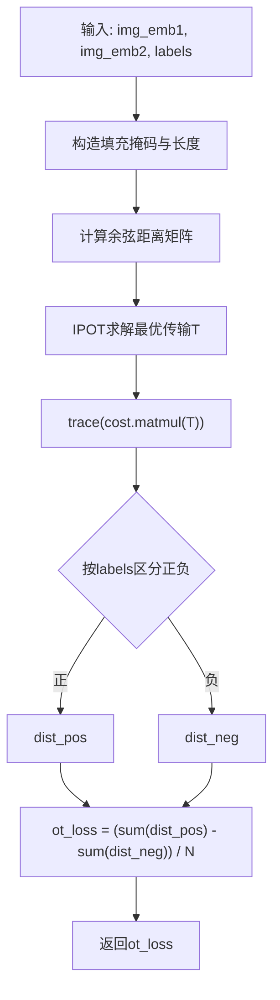

图表来源
- [ops/wpa.py](file://ops/wpa.py#L1-L110)

章节来源
- [ops/wpa.py](file://ops/wpa.py#L86-L110)

### 对比损失（HardTripletLoss）
- 目标：在图像级特征上强化身份判别，使同一身份的样本更接近，不同身份的样本更远离。
- 特点：支持“最困难三元组”策略，仅考虑最难正负对，提高优化效率与鲁棒性。

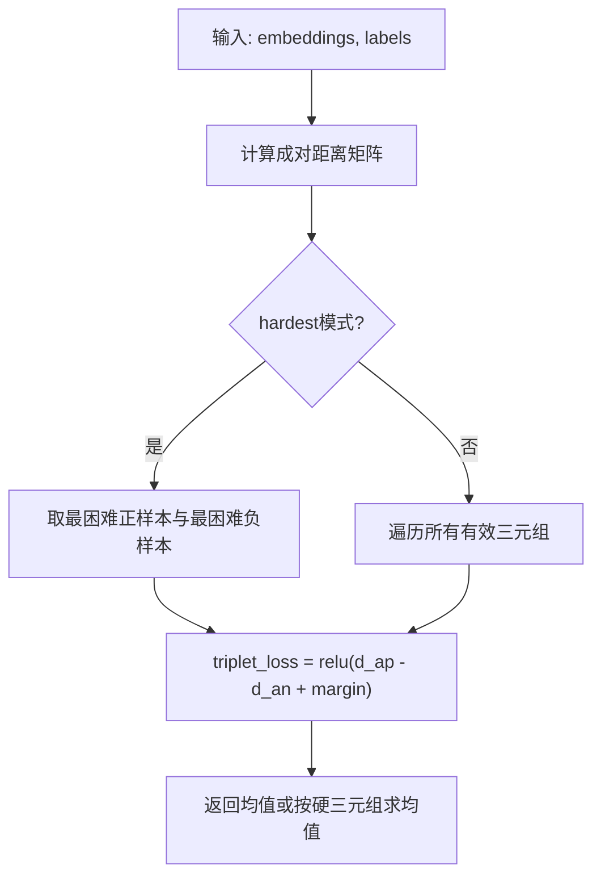

图表来源
- [ops/losses.py](file://ops/losses.py#L279-L348)

章节来源
- [ops/losses.py](file://ops/losses.py#L279-L348)

### 训练与评估流程
- 训练入口：train_vpt_lora.py构建数据集、模型与自定义Trainer，设置超参与权重系数。
- 自定义Trainer：收集额外损失（ot_loss、id_loss、icl_loss、std），并在日志中聚合展示。
- 评估：在验证阶段提取类别内提示，对测试集进行特征提取与Rank-1/Rank-5/mAP评估。

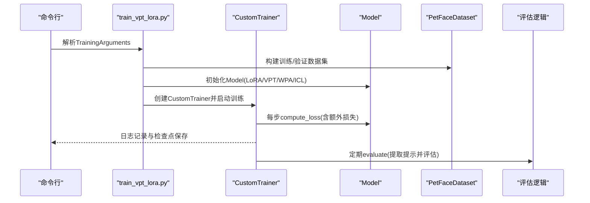

图表来源
- [train_vpt_lora.py](file://train_vpt_lora.py#L145-L187)
- [custom_trainer.py](file://custom_trainer.py#L34-L103)

章节来源
- [train_vpt_lora.py](file://train_vpt_lora.py#L145-L187)
- [custom_trainer.py](file://custom_trainer.py#L34-L103)

## 依赖分析
- 模块耦合
  - Model对DINOv2与Qwen存在强依赖，但通过冻结参数与LoRA/VPT实现低耦合增量更新。
  - Q-Former与LM隐藏维对齐，耦合度中等，但通过可选输出投影降低耦合风险。
  - WPA与TripletLoss分别作用于patch与图像级特征，耦合度低，便于独立优化。
- 外部依赖
  - transformers：AutoTokenizer/AutoModelForCausalLM提供语言模型与分词能力。
  - torch.hub：加载DINOv2视觉编码器。
- 循环依赖
  - 未发现循环导入；各模块职责清晰，接口边界明确。

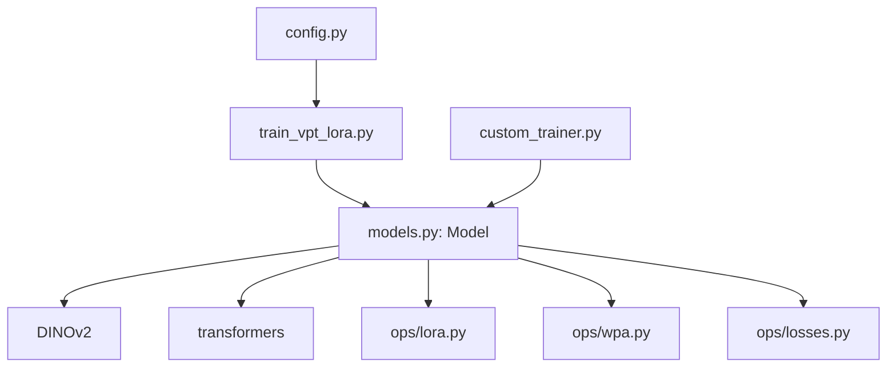

图表来源
- [models.py](file://models.py#L81-L269)
- [ops/lora.py](file://ops/lora.py#L1-L99)
- [ops/wpa.py](file://ops/wpa.py#L1-L110)
- [ops/losses.py](file://ops/losses.py#L279-L348)
- [train_vpt_lora.py](file://train_vpt_lora.py#L145-L187)
- [custom_trainer.py](file://custom_trainer.py#L34-L103)
- [config.py](file://config.py#L1-L16)

## 性能考量
- 计算与内存
  - 冻结主干参数显著降低训练成本；LoRA仅引入低秩矩阵，参数量可控。
  - VPT通过MLP映射回视觉空间，计算开销与提示维度线性相关。
  - WPA在patch级别计算代价较高，建议批内采样与合理batch size平衡精度与速度。
- 数值稳定性
  - LoRA初始化采用kaiming均匀与零初始化，有助于稳定训练。
  - WPA中余弦归一化与IPOT迭代过程需注意数值精度与掩码处理。
- 训练收敛
  - ICL与VPT提示的联合使用可能带来不稳定，建议逐步增加权重系数并监控std指标。

[本节为通用指导，不直接分析具体文件]

## 故障排查指南
- LoRA层替换失败
  - 现象：注意力Q/K/V维度不匹配或报错。
  - 排查：确认DINOv2变体与qkv线性层维度一致；检查LoRA层初始化参数是否正确。
  - 参考路径：[ops/lora.py](file://ops/lora.py#L58-L99)
- ICL提示构造异常
  - 现象：输入ID与图像特征形状不匹配。
  - 排查：核对mm_projector输出维度与LM隐藏维一致；检查tokenizer的特殊token映射。
  - 参考路径：[models.py](file://models.py#L159-L225)
- WPA损失NaN或不稳定
  - 现象：ot_loss为NaN或剧烈波动。
  - 排查：检查输入张量是否归一化；确认填充掩码与长度计算正确；适当降低beta或迭代次数。
  - 参考路径：[ops/wpa.py](file://ops/wpa.py#L86-L110)
- 训练日志缺失额外损失
  - 现象：ot_loss/id_loss/icl_loss/std未显示。
  - 排查：确认CustomTrainer回调已注册；检查extra_losses列表与Model输出键一致。
  - 参考路径：[custom_trainer.py](file://custom_trainer.py#L25-L60), [models.py](file://models.py#L257-L269)

章节来源
- [ops/lora.py](file://ops/lora.py#L58-L99)
- [models.py](file://models.py#L159-L225)
- [ops/wpa.py](file://ops/wpa.py#L86-L110)
- [custom_trainer.py](file://custom_trainer.py#L25-L60)

## 结论
VICP通过“视觉-语言协同+参数高效微调+细粒度对齐”的组合，实现了对新类别对象的零样本泛化。DINOv2提供强大的视觉先验，Qwen负责语义推理，Q-Former完成跨模态对齐，LoRA与VPT分别从可塑性与提示角度增强模型表现，WPA在patch层面强化细粒度匹配。该架构在保持主干稳定的同时，以最小参数增量获得显著泛化收益，具备良好的工程落地价值。

[本节为总结，不直接分析具体文件]

## 附录
- 关键超参建议
  - LoRA秩r：根据显存与收敛情况调整，通常在64~256之间折中。
  - VPT提示数：建议与层数乘积适配，避免过多导致过拟合。
  - ICL样本数与批次：平衡计算与提示质量，建议从较小规模开始。
  - WPA权重：与ID损失权重共同调节，避免WPA主导导致退化。
- 数据集配置
  - Amazon分类划分与根路径在config.py中定义，训练时按split选择训练/验证类别。

章节来源
- [config.py](file://config.py#L1-L16)
- [train_vpt_lora.py](file://train_vpt_lora.py#L131-L144)