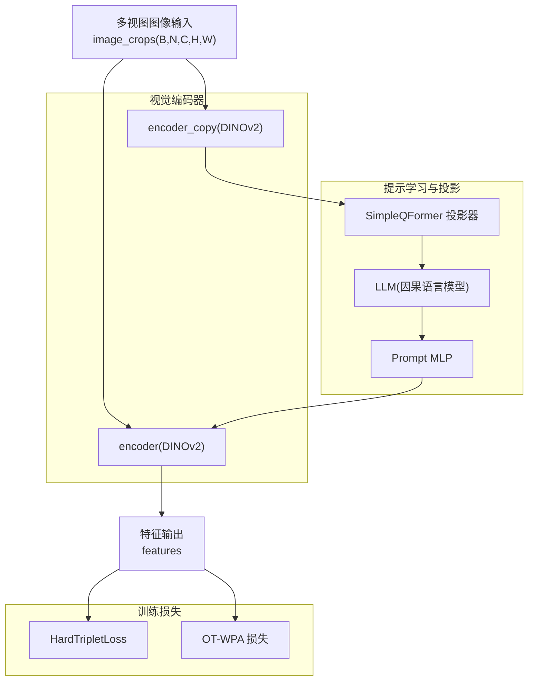
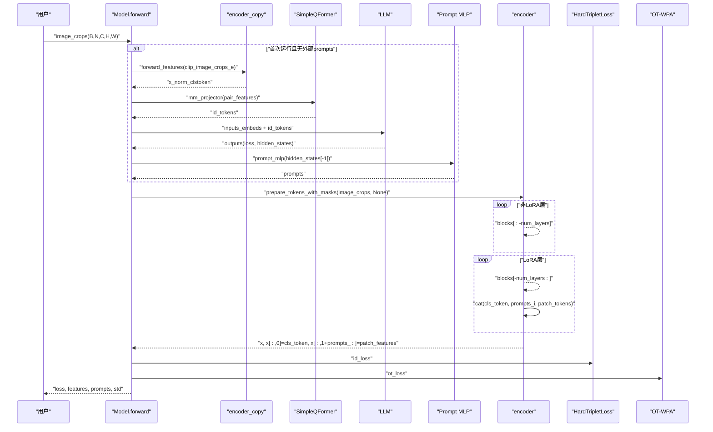
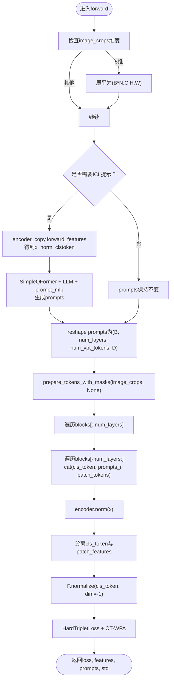
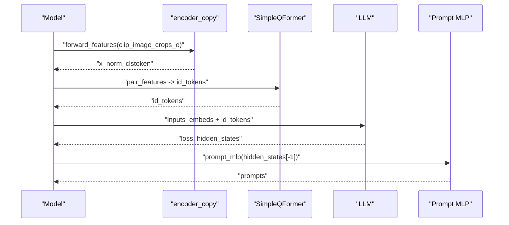
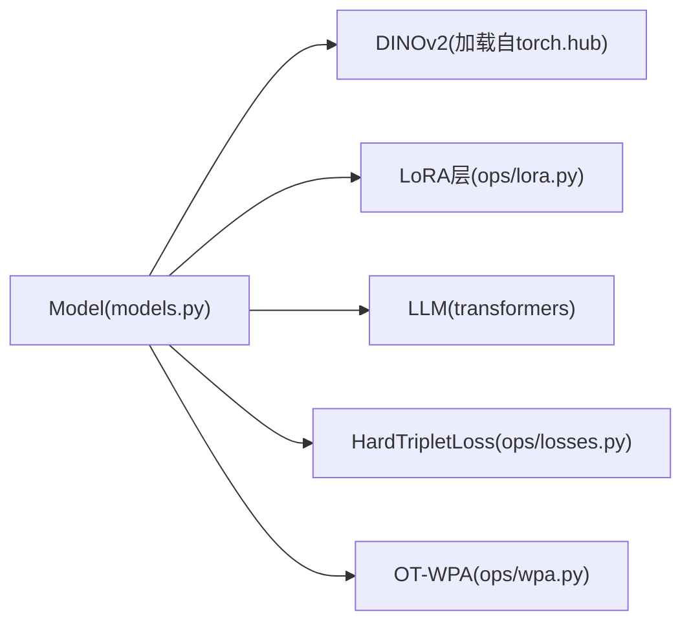

# 视觉编码器

<cite>
**本文引用的文件列表**
- [models.py](file://models.py)
- [ops/lora.py](file://ops/lora.py)
- [ops/wpa.py](file://ops/wpa.py)
- [ops/losses.py](file://ops/losses.py)
- [ops/evaluation.py](file://ops/evaluation.py)
- [README.md](file://README.md)
</cite>

## 目录
1. [简介](#简介)
2. [项目结构](#项目结构)
3. [核心组件](#核心组件)
4. [架构总览](#架构总览)
5. [详细组件分析](#详细组件分析)
6. [依赖关系分析](#依赖关系分析)
7. [性能考量](#性能考量)
8. [故障排查指南](#故障排查指南)
9. [结论](#结论)

## 简介
本文件围绕VICP系统中的视觉编码器实现进行深入解析，重点阐述基于DINOv2的视觉编码器如何通过两个实例self.encoder与self.encoder_copy分别承担图像特征提取与ICL（In-Context Learning）任务；详细说明prepare_tokens_with_masks在输入预处理阶段的作用；结合Model类初始化逻辑，解释DINOv2模型加载方式、参数冻结策略（requires_grad_(False)）、LoRA微调注入位置，以及在多视图图像输入（image_crops）下的前向传播流程。同时给出特征图（patch_features）与类别令牌（cls_token）分离的技术细节，并分析其在细粒度识别任务中的优势。最后提供常见问题（如维度不匹配、显存溢出）的排查建议与解决思路。

## 项目结构
- 核心模型定义位于models.py，其中包含Model类及内部使用的SimpleQFormer投影器。
- 视觉编码器采用DINOv2，通过torch.hub加载，使用LoRA对注意力QKV进行低秩适配。
- ICL阶段使用另一个独立的DINOv2实例（encoder_copy）进行无梯度特征提取，随后通过LLM进行提示学习生成动态视觉提示（VPT）。
- 训练损失包括三部分：ICL损失、ID判别损失（HardTripletLoss）、以及跨视图一致性损失（OT-Wasserstein Pairwise Alignment）。
- 评估脚本展示了如何从模型输出中提取归一化后的特征用于下游相似度计算。



图表来源
- [models.py](file://models.py#L81-L269)
- [ops/lora.py](file://ops/lora.py#L58-L99)
- [ops/wpa.py](file://ops/wpa.py#L86-L110)
- [ops/losses.py](file://ops/losses.py#L279-L392)

章节来源
- [models.py](file://models.py#L81-L269)
- [README.md](file://README.md#L1-L73)

## 核心组件
- DINOv2视觉编码器（self.encoder）
  - 通过torch.hub加载指定变体（如vitb14），并设置为eval模式，冻结所有参数（requires_grad_(False)）。
  - 在最后四层Transformer块中，将注意力QKV替换为LoRA适配层，仅训练低秩参数以降低计算开销。
- DINOv2副本（self.encoder_copy）
  - 与主编码器相同配置，但专门用于ICL阶段的无梯度特征提取，避免对主编码器参数造成影响。
- SimpleQFormer投影器（mm_projector）
  - 将成对的视觉token映射到LLM的词嵌入空间，作为ICL任务的视觉提示。
- LLM与提示生成
  - 使用AutoModelForCausalLM加载预训练LLM，冻结参数；通过ICL构造的文本提示与视觉特征拼接，生成可学习的视觉提示（VPT）并通过prompt_mlp映射回视觉特征空间。
- 训练损失
  - HardTripletLoss用于ID判别任务；
  - OT-WPA（最优传输-成对对齐）用于增强跨视图一致性。

章节来源
- [models.py](file://models.py#L81-L124)
- [ops/lora.py](file://ops/lora.py#L58-L99)
- [ops/losses.py](file://ops/losses.py#L279-L392)
- [ops/wpa.py](file://ops/wpa.py#L86-L110)

## 架构总览
下图展示了从多视图图像输入到最终特征输出的关键路径，包括ICL提示生成、LoRA注入、动态提示插入与特征提取。



图表来源
- [models.py](file://models.py#L159-L269)
- [ops/lora.py](file://ops/lora.py#L58-L99)
- [ops/wpa.py](file://ops/wpa.py#L86-L110)

## 详细组件分析

### 组件A：Model类与DINOv2加载、参数冻结与LoRA注入
- DINOv2加载与冻结
  - 通过torch.hub.load加载指定变体，随后对两个实例均执行eval()与requires_grad_(False)，确保视觉编码器参数不参与训练。
- LoRA注入位置
  - 对encoder.blocks[-4:]中的注意力QKV线性层替换为LoRALayerQKV，仅训练低秩适配矩阵，显著降低参数量与显存占用。
- LLM与投影器
  - 加载LLM与分词器，冻结LLM参数；SimpleQFormer将成对特征映射至LLM隐藏维，作为ICL视觉提示。
- 提示生成与映射
  - 通过ICL构造的文本提示与视觉特征拼接后送入LLM，利用最后一层隐藏状态的末尾部分生成VPT，再经prompt_mlp映射回视觉特征空间。

```mermaid
classDiagram
class Model {
+args
+encoder
+encoder_copy
+lm
+tokenizer
+mm_projector
+query_embeddings
+prompt_mlp
+loss
+hidden_size
+num_layers
+forward(image_crops, labels, prompts)
+sample_pair(labels)
}
class SimpleQFormer {
+visual_proj
+query_embeddings
+decoder
+norm
+output_proj
+forward(pair_features)
}
class LoRALayerQKV {
+qkv
+r
+dim
+forward(x)
}
Model --> SimpleQFormer : "mm_projector"
Model --> LoRALayerQKV : "blocks[-4 : ].attn.qkv"
```

图表来源
- [models.py](file://models.py#L81-L124)
- [ops/lora.py](file://ops/lora.py#L58-L99)

章节来源
- [models.py](file://models.py#L81-L124)
- [ops/lora.py](file://ops/lora.py#L58-L99)

### 组件B：prepare_tokens_with_masks输入预处理与多视图前向传播
- 输入形状与展平
  - 若image_crops为5维(B,N,C,H,W)，则先展平为(B*N,C,H,W)以适配DINOv2输入。
- ICL阶段（无梯度）
  - 使用encoder_copy提取“x_norm_clstoken”作为图像特征，用于构造ICL任务的视觉提示。
- 动态提示注入
  - 将VPT按层拼接到cls_token与patch_tokens之间，逐层通过对应block，形成“带提示”的特征序列。
- 特征分离
  - 归一化后的cls_token作为全局身份特征（features）；
  - 去除cls_token与提示后的其余tokens作为patch_features，用于OT-WPA一致性约束。



图表来源
- [models.py](file://models.py#L159-L269)

章节来源
- [models.py](file://models.py#L159-L269)

### 组件C：特征图（patch_features）与类别令牌（cls_token）分离技术细节
- cls_token与patch_tokens的索引切分
  - 归一化后的x[:,0]即为cls_token，作为最终的身份特征；
  - 去除cls_token与提示后剩余部分x[:,1+prompts_:]作为patch_features，用于OT-WPA一致性损失。
- 细粒度识别优势
  - patch_features保留了局部区域的判别信息，有助于区分同一类别的不同个体或细粒度差异；
  - cls_token作为全局语义表征，与HardTripletLoss共同提升判别能力；
  - 二者结合在跨视图一致性（OT-WPA）下进一步强化了跨视角的对齐与鲁棒性。

章节来源
- [models.py](file://models.py#L231-L269)
- [ops/wpa.py](file://ops/wpa.py#L86-L110)

### 组件D：ICL（In-Context Learning）与提示生成流程
- ICL数据构造
  - 从encoder_copy提取的特征中随机采样正负样本对，构造“是/否”标签，拼接为文本提示；
  - 将成对特征经SimpleQFormer映射到LLM隐藏维，作为视觉提示。
- LLM提示学习
  - 将文本提示与视觉提示拼接后送入LLM，利用其上下文理解能力生成提示表示；
  - 通过prompt_mlp将提示映射回视觉特征空间，作为动态视觉提示（VPT）。
- ICL损失
  - 通过LLM的交叉熵损失作为ICL损失项，引导模型学会从少量示例中抽取身份规则。



图表来源
- [models.py](file://models.py#L169-L225)
- [ops/lora.py](file://ops/lora.py#L58-L99)

章节来源
- [models.py](file://models.py#L169-L225)

### 组件E：多视图图像输入（image_crops）前向传播
- 多视图输入
  - 支持(B,N,C,H,W)格式，内部自动展平为(B*N,C,H,W)；
  - prompts按批次随机采样并与当前样本对齐，确保每张图使用对应的动态提示。
- 前向传播
  - prepare_tokens_with_masks负责将图像转换为patch tokens序列；
  - 非LoRA层直接前向传播，LoRA层逐层将VPT拼接回序列；
  - 最终分离cls_token与patch_features，分别用于ID损失与OT-WPA。

章节来源
- [models.py](file://models.py#L159-L269)

## 依赖关系分析
- Model依赖
  - DINOv2编码器（torch.hub加载）、LoRA层（ops/lora.py）、LLM（transformers库）、损失函数（ops/losses.py）、OT-WPA（ops/wpa.py）。
- 耦合与内聚
  - Model内部高度内聚，将视觉编码、提示学习、损失计算整合在一个forward中；
  - LoRA层与编码器块绑定，耦合度高但可控，便于参数高效更新。
- 外部依赖
  - transformers（AutoTokenizer/AutoModelForCausalLM）；
  - torch.hub（DINOv2模型加载）。



图表来源
- [models.py](file://models.py#L81-L124)
- [ops/lora.py](file://ops/lora.py#L58-L99)
- [ops/losses.py](file://ops/losses.py#L279-L392)
- [ops/wpa.py](file://ops/wpa.py#L86-L110)

章节来源
- [models.py](file://models.py#L81-L124)
- [ops/lora.py](file://ops/lora.py#L58-L99)
- [ops/losses.py](file://ops/losses.py#L279-L392)
- [ops/wpa.py](file://ops/wpa.py#L86-L110)

## 性能考量
- 参数冻结与LoRA微调
  - 通过requires_grad_(False)冻结DINOv2参数，仅训练LoRA低秩适配矩阵，显著降低显存与计算成本。
- ICL阶段无梯度
  - encoder_copy在ICL阶段使用with torch.no_grad()，避免额外反向传播开销。
- 批次与视图
  - 多视图输入需注意(B,N,C,H,W)与(B*N,C,H,W)之间的内存与时间开销，合理设置num_icl_bs与num_icl_samples。
- 混合精度与优化
  - 可结合AMP与合适的batch size、梯度裁剪策略，平衡收敛速度与稳定性。

[本节为通用性能建议，无需特定文件来源]

## 故障排查指南
- 维度不匹配
  - 症状：forward_features返回的x_norm_clstoken与后续拼接或投影维度不一致。
  - 排查要点：
    - 确认image_crops是否为(B,N,C,H,W)，并在forward中正确展平为(B*N,C,H,W)；
    - 确认encoder.embed_dim与SimpleQFormer的输入维度一致；
    - 确认prompt_mlp的输出维度与encoder.embed_dim一致。
  - 参考路径
    - [models.py](file://models.py#L159-L269)
    - [ops/lora.py](file://ops/lora.py#L58-L99)

- 显存溢出
  - 症状：训练时OOM。
  - 解决方案：
    - 减少num_icl_bs与num_icl_samples；
    - 降低num_vpt_tokens或num_layers；
    - 使用更小的vision_model变体（如vitb14相对vits14更小）；
    - 关闭不必要的中间变量缓存（如use_cache=False）。
  - 参考路径
    - [models.py](file://models.py#L159-L269)
    - [README.md](file://README.md#L1-L73)

- ICL提示无效或不稳定
  - 症状：ICL损失不下降或prompts生成异常。
  - 排查要点：
    - 确认tokenizer中存在“yes/no”等特殊token；
    - 检查SimpleQFormer输出维度与LLM隐藏维一致；
    - 确认prompt_mlp权重初始化与映射正确。
  - 参考路径
    - [models.py](file://models.py#L169-L225)
    - [ops/lora.py](file://ops/lora.py#L58-L99)

- 跨视图一致性不足
  - 症状：OT-WPA损失不收敛或波动大。
  - 排查要点：
    - 确认patch_features提取正确（去除cls_token与提示后）；
    - 检查compute_wpa输入维度与掩码设置；
    - 调整ot_loss_weight权重，观察对整体loss的影响。
  - 参考路径
    - [models.py](file://models.py#L231-L269)
    - [ops/wpa.py](file://ops/wpa.py#L86-L110)

## 结论
VICP系统通过双DINOv2编码器与LoRA微调，实现了高效的视觉编码与提示学习。self.encoder与self.encoder_copy分别承担主干特征提取与ICL无梯度特征提取，配合SimpleQFormer与LLM完成动态视觉提示生成。prepare_tokens_with_masks在输入预处理中将图像转换为patch tokens序列，随后通过LoRA层逐层注入VPT，最终分离cls_token与patch_features，分别用于ID判别与跨视图一致性约束。该设计在细粒度识别任务中兼顾了全局语义与局部判别能力，具有良好的泛化潜力。