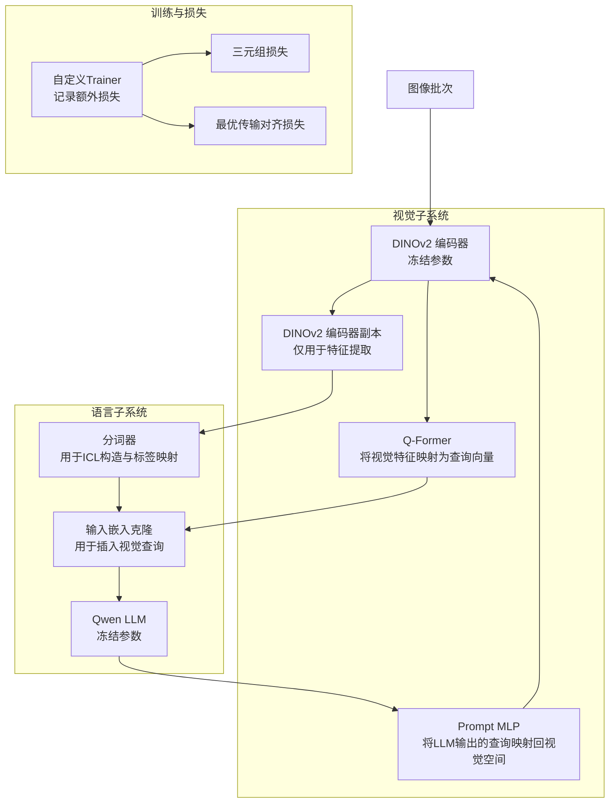
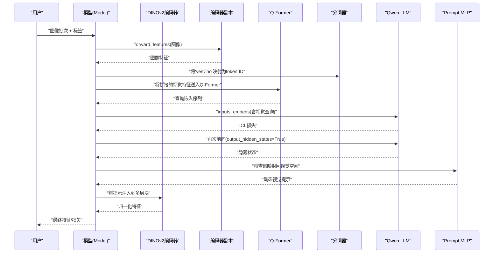
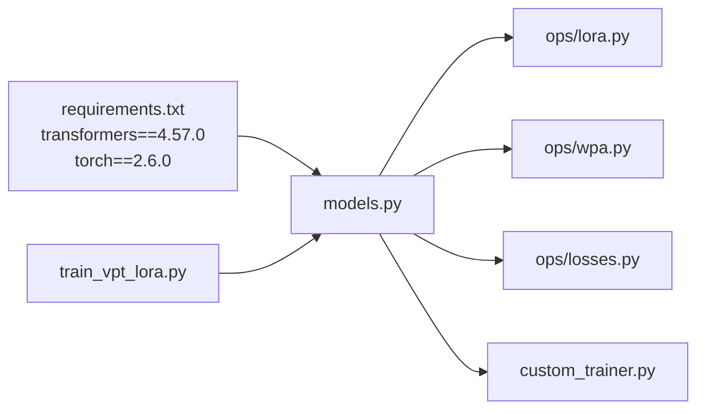

# 语言模型集成

<cite>
**本文引用的文件**
- [models.py](file://models.py)
- [train_vpt_lora.py](file://train_vpt_lora.py)
- [ops/losses.py](file://ops/losses.py)
- [ops/lora.py](file://ops/lora.py)
- [ops/wpa.py](file://ops/wpa.py)
- [custom_trainer.py](file://custom_trainer.py)
- [README.md](file://README.md)
- [requirements.txt](file://requirements.txt)
</cite>

## 目录
1. [简介](#简介)
2. [项目结构](#项目结构)
3. [核心组件](#核心组件)
4. [架构总览](#架构总览)
5. [详细组件分析](#详细组件分析)
6. [依赖分析](#依赖分析)
7. [性能考虑](#性能考虑)
8. [故障排查指南](#故障排查指南)
9. [结论](#结论)
10. [附录](#附录)

## 简介
本文件围绕Qwen大语言模型（LLM）在VICP架构中的集成与协同机制展开，重点解析以下方面：
- AutoModelForCausalLM.from_pretrained(args.llm_model)的加载流程与参数冻结策略
- tokenizer在文本-图像对齐任务中的作用，以及在ICL损失计算中如何将“yes”/“no”标签映射为token ID并构建输入序列
- forward方法中input_ids的构造与inputs_embeds的拼接逻辑，解释语言模型如何接收来自Q-Former的视觉嵌入作为上下文提示
- lm.get_input_embeddings()克隆机制与梯度截断策略，以及对端到端训练稳定性的意义
- 输出隐藏状态的提取与MLP投影过程，潜在兼容性问题与调试建议

## 项目结构
VICP采用“视觉编码器 + Q-Former + LLM”的三层协同结构：视觉编码器负责提取图像特征；Q-Former将视觉特征映射为与LLM词嵌入维度一致的查询向量；LLM以这些查询作为上下文提示，生成语义化的身份规则并指导视觉编码器的动态提示注入。

图表来源
- [models.py](file://models.py#L81-L269)
- [train_vpt_lora.py](file://train_vpt_lora.py#L132-L187)
- [ops/losses.py](file://ops/losses.py#L279-L348)
- [ops/wpa.py](file://ops/wpa.py#L86-L110)
- [custom_trainer.py](file://custom_trainer.py#L34-L103)

章节来源
- [models.py](file://models.py#L81-L269)
- [train_vpt_lora.py](file://train_vpt_lora.py#L132-L187)
- [README.md](file://README.md#L1-L20)

## 核心组件
- 视觉编码器与LoRA适配
  - 使用DINOv2作为骨干网络，前4个block替换为LoRA适配层，其余保持冻结，以降低训练开销并保留预训练表征能力。
- Q-Former模块
  - 将拼接后的两帧视觉特征重塑为视觉token，经线性投影后送入TransformerDecoder，使用可学习查询向量与视觉记忆进行交叉注意力，输出与LLM词嵌入维度一致的查询序列。
- LLM与tokenizer
  - 从预训练权重加载Qwen LLM与对应分词器，二者均冻结参数，通过inputs_embeds接收视觉查询，不参与直接优化。
- Prompt MLP
  - 将LLM最后一层隐藏状态的查询部分映射回视觉空间，作为动态视觉提示注入到DINOv2的多层块中。
- 训练与损失
  - 自定义Trainer记录额外损失（ID、OT、ICL），ID损失采用HardTripletLoss，OT损失采用最优传输对齐。

章节来源
- [models.py](file://models.py#L81-L124)
- [ops/losses.py](file://ops/losses.py#L279-L348)
- [ops/wpa.py](file://ops/wpa.py#L86-L110)
- [custom_trainer.py](file://custom_trainer.py#L34-L103)

## 架构总览
VICP的端到端流程如下：
- 图像批次进入DINOv2编码器，得到归一化特征；同时用另一个编码器副本提取用于ICL构造的图像特征。
- ICL阶段：基于“yes”/“no”标签映射为token ID，构造包含占位符位置的input_ids，将Q-Former输出的视觉查询嵌入按占位符位置克隆到inputs_embeds中，调用LLM的inputs_embeds接口进行前向，得到ICL损失。
- Prompt阶段：再次调用LLM，开启output_hidden_states，取最后一层隐藏状态的末尾查询序列，经Prompt MLP映射回视觉空间，作为动态提示注入到DINOv2的若干层中，完成视觉-语言对齐与身份判别。

图表来源
- [models.py](file://models.py#L159-L269)

章节来源
- [models.py](file://models.py#L159-L269)

## 详细组件分析

### AutoModelForCausalLM.from_pretrained(args.llm_model) 加载与参数冻结
- 加载流程
  - 通过transformers库加载指定的Qwen模型权重，初始化LM与对应的tokenizer。
- 参数冻结策略
  - 在模型初始化时，将LM与tokenizer的requires_grad设置为False，确保它们在训练过程中不被更新，从而稳定语言先验并减少显存占用。
- 与视觉编码器的交互
  - LM不直接参与视觉特征提取，而是通过inputs_embeds接收来自Q-Former的视觉查询嵌入，作为上下文提示，间接影响视觉编码器的提示注入。

章节来源
- [models.py](file://models.py#L104-L108)

### tokenizer在ICL损失中的角色与标签映射
- 标签到token ID的映射
  - 使用tokenizer将“yes”和“no”分别映射为对应的token ID，建立1:1映射关系，用于ICL构造中的标签占位。
- 输入序列构造
  - 在ICL阶段，构造包含占位符位置的input_ids，其中占位符位置用于后续插入视觉查询嵌入；非占位符位置填充为0，随后在inputs_embeds中按占位符位置进行替换，形成最终的混合嵌入序列。
- 标签掩码
  - 对于占位符以外的位置，使用特定值作为忽略标签，以便在LLM前向时忽略这些位置的损失计算。

章节来源
- [models.py](file://models.py#L179-L205)

### forward方法中input_ids构造与inputs_embeds拼接
- 占位符与视觉查询的拼接
  - 通过Q-Former将拼接后的两帧图像特征映射为(B, num_id_tokens, hidden_size)的查询嵌入，再将其reshape为(B*num_id_tokens, hidden_size)，与占位符位置一一对应。
  - 使用lm.get_input_embeddings()获取词嵌入矩阵，并对input_ids对应的嵌入进行克隆，随后将占位符位置的嵌入替换为视觉查询嵌入，形成inputs_embeds。
- 上下文感知提示生成
  - 在第二次前向中，将inputs_embeds扩展为包含可学习查询嵌入的长序列，使LLM能够输出上下文相关的提示（prompt），并通过Prompt MLP映射回视觉空间，作为动态视觉提示注入到DINOv2的多层块中。

章节来源
- [models.py](file://models.py#L212-L224)

### lm.get_input_embeddings()克隆机制与梯度截断
- 克隆机制
  - 通过get_input_embeddings()(input_ids)获取词嵌入后进行clone操作，确保对占位符位置的替换不会影响原始词嵌入张量，避免反向传播中的意外梯度流动。
- 梯度截断
  - 由于LM与tokenizer参数冻结，且通过inputs_embeds直接传入嵌入，未直接对词嵌入进行反向传播，从而天然避免了词嵌入层面的梯度回传；同时，Prompt MLP的权重在训练中更新，但其输入来自冻结LLM的隐藏状态，进一步保证了训练稳定性。
- 对端到端训练稳定性的影响
  - 冻结LLM与tokenizer，结合Prompt MLP的轻量级投影，使得视觉-语言对齐主要由可训练的视觉侧模块驱动，降低了语言先验对视觉任务的干扰，提升了收敛稳定性。

章节来源
- [models.py](file://models.py#L104-L108)
- [models.py](file://models.py#L212-L224)

### 输出隐藏状态提取与MLP投影过程
- 隐藏状态提取
  - 在第二次前向中启用output_hidden_states=True，从最后一层隐藏状态中取出末尾的查询序列，这些查询代表LLM对当前视觉内容生成的上下文提示。
- MLP投影
  - 将查询序列经Prompt MLP映射回视觉空间维度，随后按层拼接到DINOv2的多层块中，实现动态视觉提示的注入。
- 潜在兼容性问题
  - 不同LLM的词嵌入维度与视觉编码器的隐藏维度需一致或通过投影对齐；若维度不匹配，应在Q-Former或Prompt MLP处增加线性变换。
  - 若LLM的pad_token或特殊token与项目约定冲突，需在tokenizer配置或输入构造中规避。
- 调试策略
  - 打印inputs_embeds的形状与dtype，确认占位符位置替换是否正确。
  - 检查Prompt MLP输出与DINOv2块输入的维度一致性。
  - 在训练早期观察ICL损失与ID/OT损失的变化趋势，判断提示注入是否有效。

章节来源
- [models.py](file://models.py#L221-L240)
- [ops/lora.py](file://ops/lora.py#L58-L99)

### ICL损失与最优传输对齐损失
- ICL损失
  - 基于“yes”/“no”标签构造少量示例，通过LLM的inputs_embeds接口进行前向，得到损失；该损失用于引导LLM从少量示例中学习身份判别规则。
- 最优传输对齐损失（OT）
  - 通过cosine距离与IPOT算法计算两组patch特征之间的最优传输距离，并据此计算正负样本对的差异，作为对齐约束，提升跨视图与跨域的一致性。
- 三元组损失（ID）
  - 采用HardTripletLoss，最大化同类间相似度并最小化异类间相似度，强化身份判别能力。

章节来源
- [models.py](file://models.py#L168-L178)
- [ops/wpa.py](file://ops/wpa.py#L86-L110)
- [ops/losses.py](file://ops/losses.py#L279-L348)
- [custom_trainer.py](file://custom_trainer.py#L34-L103)

## 依赖分析
- 外部依赖
  - transformers与torch版本固定，确保LLM与视觉模型的兼容性。
- 组件耦合
  - Model与ops模块松耦合：损失函数与提示对齐通过独立模块实现，便于替换与扩展。
  - LoRA适配与Prompt MLP共同构成视觉侧的可训练子模块，与冻结的LLM形成清晰的职责边界。

图表来源
- [requirements.txt](file://requirements.txt#L1-L2)
- [models.py](file://models.py#L81-L124)
- [ops/lora.py](file://ops/lora.py#L58-L99)
- [ops/wpa.py](file://ops/wpa.py#L86-L110)
- [ops/losses.py](file://ops/losses.py#L279-L348)
- [custom_trainer.py](file://custom_trainer.py#L34-L103)
- [train_vpt_lora.py](file://train_vpt_lora.py#L132-L187)

章节来源
- [requirements.txt](file://requirements.txt#L1-L2)
- [models.py](file://models.py#L81-L124)

## 性能考虑
- 显存与计算开销
  - 冻结LLM与tokenizer显著降低显存占用；LoRA适配仅在视觉编码器的关键层引入少量可训练参数。
- 训练稳定性
  - 通过Prompt MLP将LLM的提示映射回视觉空间，避免直接微调LLM参数，提高训练稳定性。
- 数据并行与混合精度
  - 训练脚本支持fp16/bf16与分布式训练，建议根据硬件条件选择合适的精度与批大小。

[本节为通用建议，无需具体文件引用]

## 故障排查指南
- ICL构造异常
  - 症状：ICL损失为NaN或不稳定
  - 排查：检查tokenizer是否正确映射“yes”/“no”，确认input_ids占位符位置与视觉查询数量一致；核对inputs_embeds的dtype与设备。
- 维度不匹配
  - 症状：Prompt MLP或DINOv2块报错
  - 排查：确认Q-Former输出维度与LM词嵌入维度一致；若不一致，在Q-Former或Prompt MLP处增加线性投影。
- 训练不收敛
  - 症状：ID/OT损失不下降
  - 排查：检查LoRA秩设置与学习率；确认提示注入是否生效（对比有无提示时的特征分布）；适当调整ICL样本数与权重。

章节来源
- [models.py](file://models.py#L179-L224)
- [ops/lora.py](file://ops/lora.py#L58-L99)
- [ops/wpa.py](file://ops/wpa.py#L86-L110)

## 结论
VICP通过“冻结LLM + 冻结tokenizer + 可训练视觉侧模块”的设计，实现了视觉-语言的高效协同：Q-Former将视觉特征映射为与LLM词嵌入对齐的查询，LLM以这些查询为上下文提示生成身份规则，Prompt MLP将提示映射回视觉空间并注入到DINOv2中，最终在ID判别与跨域泛化上取得良好效果。该方案在保持语言先验稳定的同时，将优化集中在视觉侧，兼顾了性能与稳定性。

[本节为总结性内容，无需具体文件引用]

## 附录
- 关键路径参考
  - LLM加载与冻结：[models.py](file://models.py#L104-L108)
  - ICL标签映射与输入构造：[models.py](file://models.py#L179-L205)
  - inputs_embeds拼接与提示生成：[models.py](file://models.py#L212-L224)
  - Prompt MLP与视觉注入：[models.py](file://models.py#L221-L240)
  - 训练脚本与参数配置：[train_vpt_lora.py](file://train_vpt_lora.py#L132-L187)
  - 三元组损失与最优传输损失：[ops/losses.py](file://ops/losses.py#L279-L348)、[ops/wpa.py](file://ops/wpa.py#L86-L110)
  - 自定义Trainer日志与评估：[custom_trainer.py](file://custom_trainer.py#L34-L103)