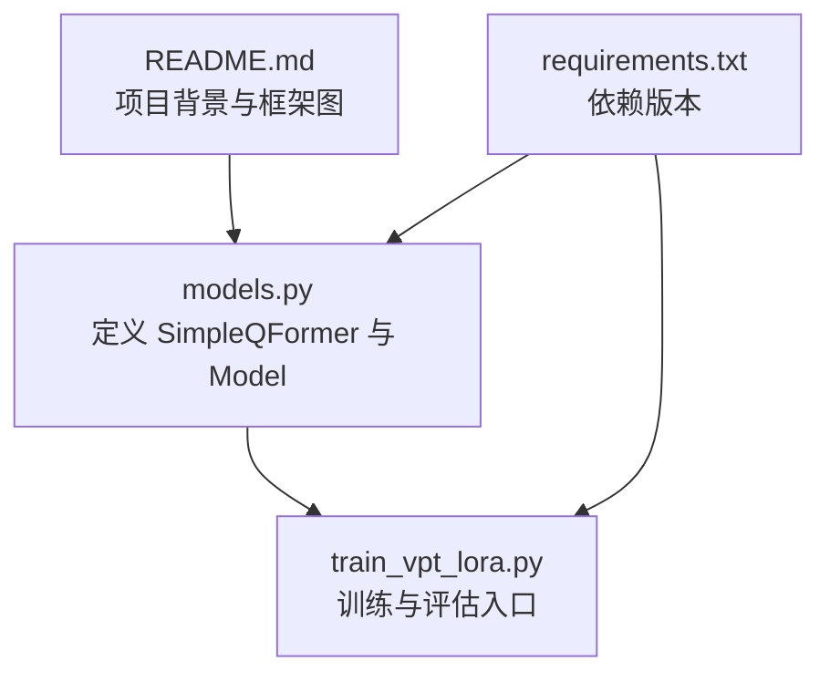
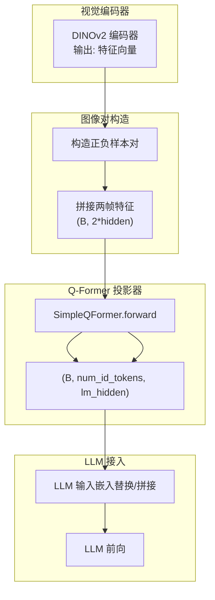
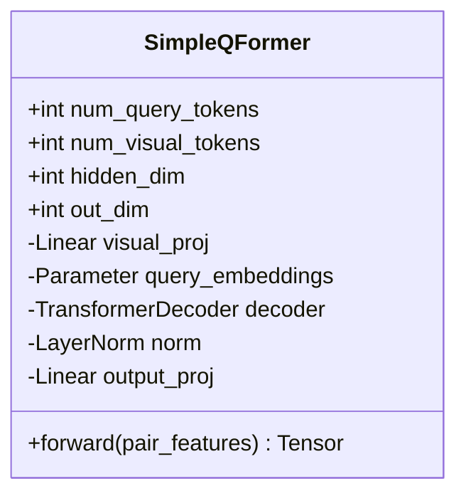
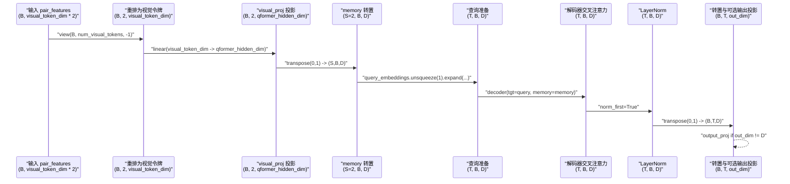
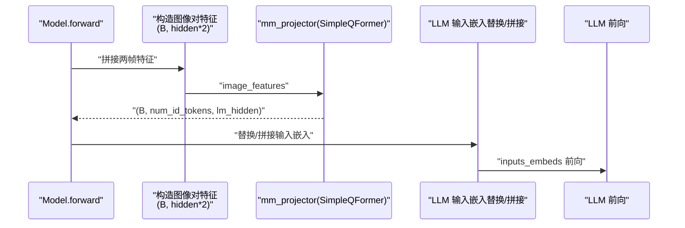
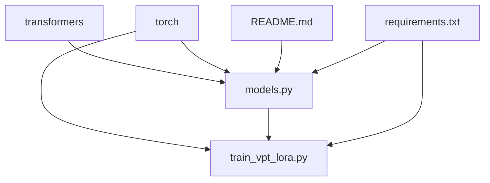

# Q-Former机制

<cite>
**本文引用的文件**
- [models.py](file://models.py)
- [README.md](file://README.md)
- [requirements.txt](file://requirements.txt)
- [train_vpt_lora.py](file://train_vpt_lora.py)
</cite>

## 目录
1. [简介](#简介)
2. [项目结构](#项目结构)
3. [核心组件](#核心组件)
4. [架构总览](#架构总览)
5. [详细组件分析](#详细组件分析)
6. [依赖关系分析](#依赖关系分析)
7. [性能考量](#性能考量)
8. [故障排查指南](#故障排查指南)
9. [结论](#结论)
10. [附录](#附录)

## 简介
本文件围绕 SimpleQFormer 类在视觉-语言特征对齐中的核心作用进行系统化解析，重点说明：
- 如何将拼接的图像对特征（pair_features）重塑为两个视觉令牌，并通过 visual_proj 线性层投影到 Q-Former 隐藏维度；
- 可学习查询嵌入 query_embeddings 的初始化方式及其在 Transformer 解码器中的作用机制；
- 结合 decoder 堆栈的交叉注意力实现，解释从视觉令牌到查询向量的特征转换流程；
- norm 层与 output_proj 输出投影的设计目的；
- 基于 models.py 中 mm_projector = SimpleQFormer(...) 的实例化参数，说明其与 LLM 嵌入空间的兼容性设计；
- forward 方法中数据流的逐步分解（张量形状变化与转置操作的意义）；
- 结合 Model 类中 image_features = self.mm_projector(image_features) 的调用上下文，展示 Q-Former 在整个模型前向传播中的集成方式；
- 常见问题（如维度不匹配）的调试方法与性能优化建议。

## 项目结构
本仓库围绕“视觉-语言特征对齐”展开，关键模块包括：
- models.py：定义 SimpleQFormer、Model 及其前向传播逻辑；
- train_vpt_lora.py：训练入口与评估流程；
- README.md：项目背景与框架图；
- requirements.txt：依赖版本约束。

图表来源
- [models.py](file://models.py#L1-L120)
- [train_vpt_lora.py](file://train_vpt_lora.py#L1-L120)
- [README.md](file://README.md#L1-L73)
- [requirements.txt](file://requirements.txt#L1-L2)

章节来源
- [models.py](file://models.py#L1-L120)
- [README.md](file://README.md#L1-L73)
- [requirements.txt](file://requirements.txt#L1-L2)

## 核心组件
本节聚焦 SimpleQFormer 的设计与实现，以及它在 Model 中的集成方式。

- SimpleQFormer 的职责
  - 输入：拼接后的图像对特征，形状为 (B, visual_token_dim * num_visual_tokens)；
  - 输出：(B, num_query_tokens, out_dim)，其中 out_dim 默认等于 Q-Former 隐藏维度；
  - 关键步骤：将输入重排为 (B, num_visual_tokens, visual_token_dim)，经 visual_proj 投影到 Q-Former 隐藏维度，再通过 Transformer 解码器与可学习查询向量进行交叉注意力，最终经 norm 与可选的 output_proj 返回。

- 可学习查询嵌入 query_embeddings
  - 初始化：形状为 (num_query_tokens, qformer_hidden_dim)，使用较小的标准差进行随机初始化；
  - 作用：作为解码器的“目标序列”，与视觉令牌构成交叉注意力的“查询侧”。

- Transformer 解码器与交叉注意力
  - 使用 nn.TransformerDecoderLayer 构建堆栈，batch_first=False，norm_first=True；
  - 解码器以 query_embeddings 为 tgt，以视觉令牌为 memory，执行交叉注意力；
  - 输出维度保持为 (T, B, D)，随后按需进行转置与投影。

- 形状与转置的意义
  - 将 (B, S, D) 转置为 (S, B, D) 以满足解码器的时序优先假设；
  - 将 (T, B, D) 再转置回 (B, T, D) 以便后续与 LLM 嵌入空间对齐。

- 与 LLM 嵌入空间的兼容性
  - 实例化时将 qformer_hidden_dim 与 out_dim 设为与 LLM 隐藏维度一致，保证输出可以直接用于下游 LLM 的输入嵌入替换或拼接。

章节来源
- [models.py](file://models.py#L8-L80)
- [models.py](file://models.py#L110-L120)

## 架构总览
下图展示了 Q-Former 在整体模型中的位置与数据流：

图表来源
- [models.py](file://models.py#L110-L120)
- [models.py](file://models.py#L209-L217)

## 详细组件分析

### SimpleQFormer 类分析
SimpleQFormer 是一个轻量级的 Q-Former，负责将拼接的图像对特征映射到 LLM 的嵌入空间，并通过可学习查询与视觉令牌进行交叉注意力对齐。

图表来源
- [models.py](file://models.py#L8-L80)

章节来源
- [models.py](file://models.py#L8-L80)

### forward 方法数据流与形状变化
以下序列图展示 SimpleQFormer.forward 的关键步骤与张量形状变换：

图表来源
- [models.py](file://models.py#L56-L80)

章节来源
- [models.py](file://models.py#L56-L80)

### 从视觉令牌到查询向量的特征转换流程
- 视觉令牌生成：将拼接的两帧特征 reshape 为 (B, 2, visual_token_dim)，经 visual_proj 投影到 Q-Former 隐藏维度；
- 查询向量生成：将可学习查询嵌入扩展为 (T, B, D)，作为解码器的“目标序列”；
- 交叉注意力对齐：解码器以查询向量为“查询侧”，视觉令牌为“键/值侧”，完成跨模态对齐；
- 归一化与输出：经 LayerNorm 与可选的输出投影，得到与 LLM 嵌入空间兼容的表示。

章节来源
- [models.py](file://models.py#L32-L55)
- [models.py](file://models.py#L56-L80)

### 可学习查询嵌入的初始化与作用
- 初始化方式：形状为 (num_query_tokens, qformer_hidden_dim)，使用较小标准差的高斯噪声初始化，有助于稳定训练初期的注意力权重；
- 作用机制：在 batch 维度上广播为 (T, B, D)，参与解码器的自注意力与交叉注意力，驱动视觉令牌的信息聚合到查询向量中。

章节来源
- [models.py](file://models.py#L35-L40)
- [models.py](file://models.py#L68-L70)

### norm 层与 output_proj 的设计目的
- LayerNorm：采用 norm_first=True，先归一化再残差连接，提升训练稳定性；
- output_proj：当 out_dim 与 qformer_hidden_dim 不一致时进行线性投影，确保输出维度与 LLM 嵌入维度一致，便于无缝接入下游模型。

章节来源
- [models.py](file://models.py#L39-L55)

### 与 LLM 嵌入空间的兼容性设计
- 实例化参数选择：
  - visual_token_dim：与视觉编码器的 embed_dim 对齐；
  - num_visual_tokens：固定为 2，对应图像对；
  - qformer_hidden_dim/out_dim：与 LLM config.hidden_size 对齐；
- 作用：使 SimpleQFormer 的输出直接适配 LLM 的输入嵌入维度，无需额外适配层。

章节来源
- [models.py](file://models.py#L110-L120)

### 在 Model 前向传播中的集成方式
- 图像对构造：将正负样本对的特征拼接为 (B, hidden_size * 2)；
- Q-Former 前向：mm_projector(image_features) 返回 (B, num_id_tokens, lm_hidden)；
- LLM 接入：将返回的查询向量替换或拼接到 LLM 的输入嵌入中，完成视觉-语言联合推理。

图表来源
- [models.py](file://models.py#L209-L217)
- [models.py](file://models.py#L110-L120)

章节来源
- [models.py](file://models.py#L209-L217)
- [models.py](file://models.py#L110-L120)

## 依赖关系分析
- 外部库依赖
  - transformers：加载 LLM 与分词器；
  - torch：深度学习张量运算与神经网络模块；
  - torch.nn：线性层、LayerNorm、TransformerDecoder 等；
- 内部模块依赖
  - train_vpt_lora.py 通过 from models import Model 引入模型定义；
  - README.md 提供项目背景与框架图，辅助理解整体目标。

图表来源
- [models.py](file://models.py#L1-L10)
- [requirements.txt](file://requirements.txt#L1-L2)
- [README.md](file://README.md#L1-L73)
- [train_vpt_lora.py](file://train_vpt_lora.py#L1-L40)

章节来源
- [models.py](file://models.py#L1-L10)
- [requirements.txt](file://requirements.txt#L1-L2)
- [README.md](file://README.md#L1-L73)
- [train_vpt_lora.py](file://train_vpt_lora.py#L1-L40)

## 性能考量
- 计算复杂度
  - 视觉令牌数 S 固定为 2，查询数 T 由 num_id_tokens 控制；解码器堆栈层数为常数，整体复杂度近似线性于 B*T*D；
- 内存占用
  - 主要消耗在中间张量（memory、query、decoder 输出）与 LLM 的输入嵌入拼接；
- 优化建议
  - 使用 fp16/bf16 训练以降低显存与计算开销；
  - 控制 num_id_tokens 与 num_vpt_tokens 的规模，平衡表达能力与效率；
  - 在推理阶段冻结视觉编码器与 LLM 参数，仅训练 Q-Former 与提示映射层；
  - 合理设置 dropout 与 batch_first=False 的内存访问模式，避免不必要的拷贝。

[本节为通用性能讨论，不直接分析具体文件]

## 故障排查指南
- 维度不匹配
  - 症状：forward 报错或输出形状异常；
  - 排查要点：
    - 确认输入 pair_features 的通道数是否为 visual_token_dim * num_visual_tokens；
    - 确认 visual_proj 的输入维度与 visual_token_dim 一致；
    - 确认 qformer_hidden_dim 与 LLM config.hidden_size 一致，否则需启用 output_proj；
  - 参考路径：
    - [models.py](file://models.py#L56-L80)
    - [models.py](file://models.py#L110-L120)

- 形状转置错误
  - 症状：解码器报错或注意力维度不匹配；
  - 排查要点：
    - 确认 memory 为 (S, B, D)，query 为 (T, B, D)；
    - 确认输出后转置为 (B, T, D)；
  - 参考路径：
    - [models.py](file://models.py#L62-L74)

- LLM 嵌入维度不兼容
  - 症状：替换/拼接输入嵌入时报错；
  - 排查要点：
    - 确认 mm_projector 的 out_dim 与 LLM config.hidden_size 一致；
    - 若不一致，检查是否启用了 output_proj；
  - 参考路径：
    - [models.py](file://models.py#L110-L120)
    - [models.py](file://models.py#L51-L55)

- 训练不稳定
  - 症状：梯度爆炸/消失或损失震荡；
  - 排查要点：
    - 检查 query_embeddings 初始化尺度与学习率；
    - 检查 LayerNorm 与激活函数配置；
    - 控制 num_layers 与 num_heads，避免过深/过宽导致不稳定；
  - 参考路径：
    - [models.py](file://models.py#L35-L50)

## 结论
SimpleQFormer 通过将拼接的图像对特征重塑为两个视觉令牌，并利用可学习查询嵌入与视觉令牌进行交叉注意力对齐，实现了视觉-语言特征的有效对齐。其与 LLM 嵌入空间的兼容性设计（通过与 LLM 隐藏维度一致的 out_dim）使得 Q-Former 能够无缝集成到下游 LLM 中，完成从视觉表征到语义嵌入的转换。在实际应用中，应重点关注维度一致性、转置顺序与投影层配置，以确保稳定高效的训练与推理。

[本节为总结性内容，不直接分析具体文件]

## 附录
- 训练与评估入口
  - 训练脚本通过 MyTrainTask 调用 Model 完成端到端训练与评估；
  - 评估阶段会复用训练中学习到的提示映射，对测试集进行特征提取与指标计算。

章节来源
- [train_vpt_lora.py](file://train_vpt_lora.py#L145-L295)