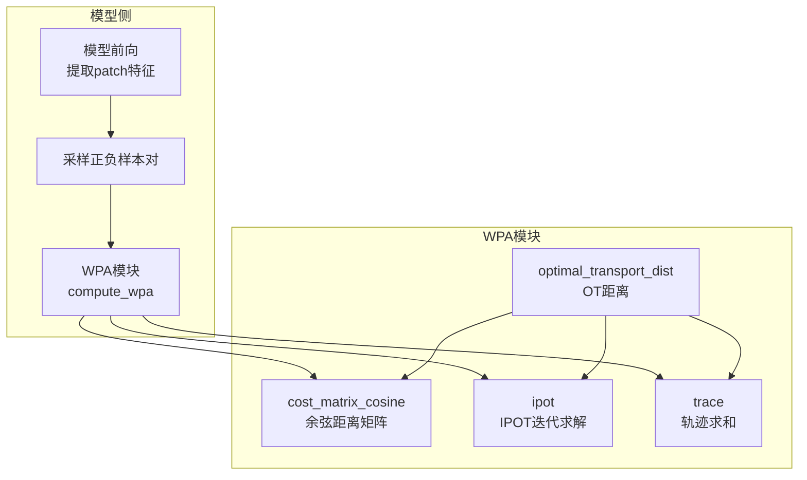
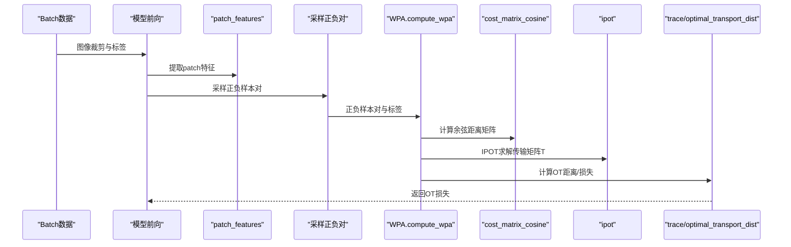
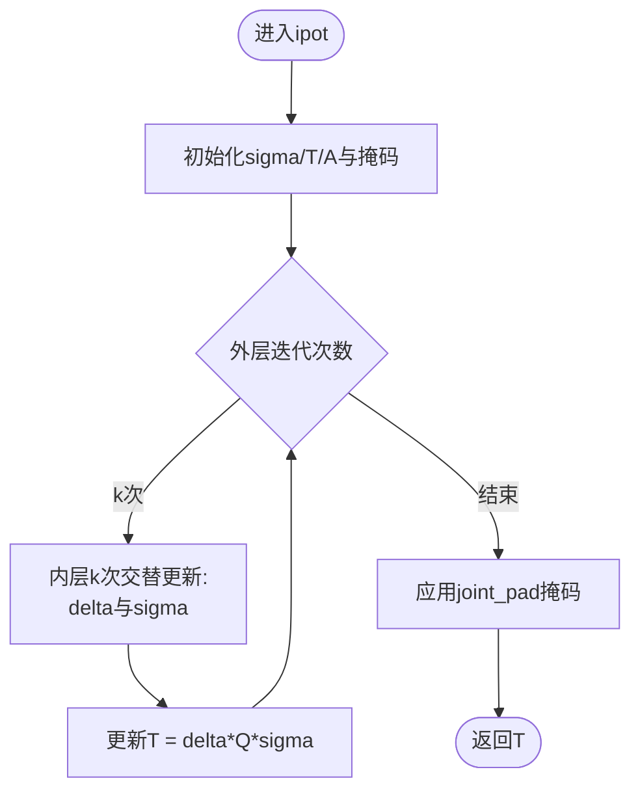
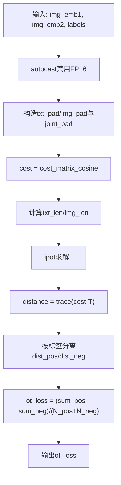
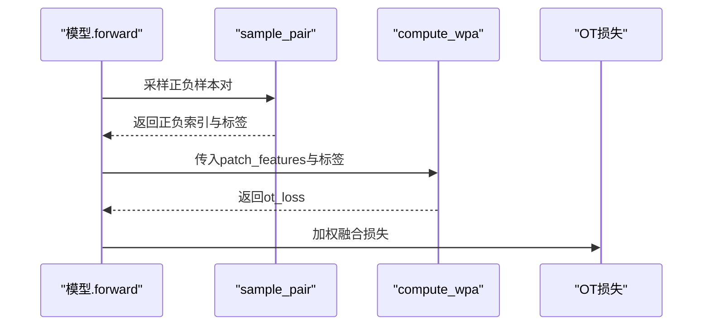
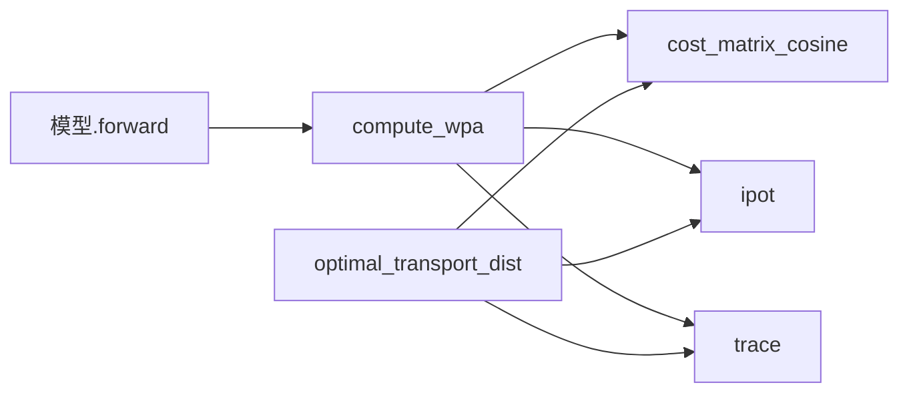

# Word-Patch Alignment机制

<cite>
**本文引用的文件**
- [ops/wpa.py](file://ops/wpa.py)
- [models.py](file://models.py)
- [README.md](file://README.md)
</cite>

## 目录
1. [简介](#简介)
2. [项目结构](#项目结构)
3. [核心组件](#核心组件)
4. [架构总览](#架构总览)
5. [详细组件分析](#详细组件分析)
6. [依赖关系分析](#依赖关系分析)
7. [性能考量](#性能考量)
8. [故障排查指南](#故障排查指南)
9. [结论](#结论)
10. [附录](#附录)

## 简介
本文件围绕 ops/wpa.py 中实现的 Word-Patch Alignment（WPA）细粒度对齐机制展开系统化解析。WPA 的目标是通过最优传输（Optimal Transport, OT）在“词嵌入”与“图像块特征”之间建立语义对齐，从而提升跨模态一致性与判别能力。本文从 cost_matrix_cosine 出发，解释余弦距离矩阵的计算原理与在图像块相似性度量中的意义；随后深入 ipot 函数中迭代普鲁克问题（Iterative Proportional Optimal Transport, IPOT）的实现细节，包括 sigma 初始化、A 矩阵指数衰减、T 传输矩阵更新循环以及掩码处理策略；结合 optimal_transport_dist 与 compute_wpa，说明最优传输距离如何用于区分正负样本对，并最终形成 OT 损失。最后给出从 patch_features 输入到 OT 损失输出的完整数据流示例，涵盖精度控制（autocast）、掩码处理与数值稳定性技巧，并提供调试建议与性能瓶颈分析。

## 项目结构
该仓库围绕视觉-语言跨模态学习构建，WPA 作为损失模块之一被模型主流程调用。关键路径如下：
- 模型前向传播在提取 patch 特征后，调用 WPA 计算 OT 损失，参与总体损失加权融合。
- WPA 模块提供余弦距离矩阵计算、IPOT 迭代求解与 OT 距离计算，并在 compute_wpa 中完成正负样本分离与损失聚合。

图表来源
- [models.py](file://models.py#L226-L256)
- [ops/wpa.py](file://ops/wpa.py#L12-L110)

章节来源
- [README.md](file://README.md#L1-L20)
- [models.py](file://models.py#L226-L256)
- [ops/wpa.py](file://ops/wpa.py#L12-L110)

## 核心组件
- 余弦距离矩阵计算：cost_matrix_cosine 将两个批次张量按通道维进行归一化后计算余弦相似，再转换为余弦距离，用于衡量词与图像块之间的成对相似性。
- IPOT 迭代求解：ipot 基于指数衰减核 A 和双侧归一化变量 sigma、delta，通过交替更新得到传输矩阵 T，并在联合掩码下保持稀疏与零填充。
- OT 距离与损失：optimal_transport_dist 使用 cost 与 T 计算 trace(cost·T)，compute_wpa 则按标签分离正负样本距离并计算平均差值作为 OT 损失。

章节来源
- [ops/wpa.py](file://ops/wpa.py#L12-L110)

## 架构总览
WPA 在模型训练中的位置与调用链如下所示：

图表来源
- [models.py](file://models.py#L226-L256)
- [ops/wpa.py](file://ops/wpa.py#L12-L110)

## 详细组件分析

### 余弦距离矩阵 cost_matrix_cosine
- 功能：对两组特征（如文本与图像块）在通道维进行 L2 归一化，然后通过矩阵乘法得到余弦相似，再转换为余弦距离。
- 数学意义：余弦距离越小，表示两个向量越接近；在 WPA 中，它衡量词与图像块之间的相似性，用于构造成本矩阵。
- 关键点：
  - 归一化时使用较小的 eps，保证数值稳定。
  - 输入维度断言确保批大小与通道数匹配。
- 复杂度：对每个样本，计算复杂度约为 O(Lx·Ly·D)，其中 Lx、Ly 为序列长度，D 为特征维度。

章节来源
- [ops/wpa.py](file://ops/wpa.py#L12-L23)

### IPOT 迭代求解器 ipot
- 功能：基于指数衰减核 A = exp(-C^T / β) 与双侧归一化变量 sigma、delta，通过 k 次交替更新得到传输矩阵 T，并在联合掩码下屏蔽填充区域。
- 初始化与掩码：
  - sigma 初始化为均匀分布并按每批样本长度归一。
  - A 由代价矩阵 C 的转置经指数衰减生成。
  - 对 x_pad、joint_pad、A、T 应用掩码，确保填充位置为零。
- 更新循环：
  - 内层 k 次迭代交替更新 delta 与 sigma，外层 iteration 次迭代更新 T。
  - 每轮更新引入 x_mask/y_mask 与大系数缩放，防止除零并维持数值稳定。
- 输出：返回满足行/列约束的传输矩阵 T，并再次应用 joint_pad 掩码。

图表来源
- [ops/wpa.py](file://ops/wpa.py#L34-L64)

章节来源
- [ops/wpa.py](file://ops/wpa.py#L34-L64)

### OT 距离与 optimal_transport_dist
- 功能：计算最优传输距离，即 trace(cost·T)。该距离用于衡量词与图像块之间的对齐程度。
- 实现要点：
  - 先用 cost_matrix_cosine 得到 cost，再构造联合掩码 joint_pad 并填充零。
  - 计算非填充元素个数 txt_len、img_len 作为行/列总量。
  - 调用 ipot 求解 T，并计算 trace(cost·T) 作为 OT 距离。
- 注意：cost 与 T 在计算过程中均 detach，避免反向传播影响 IPOT 迭代过程。

章节来源
- [ops/wpa.py](file://ops/wpa.py#L66-L84)

### 正负样本分离与 OT 损失 compute_wpa
- 功能：在给定两个批次的 patch 特征与标签的情况下，计算 OT 损失。
- 数据流：
  - 使用 autocast 禁用混合精度，确保数值稳定。
  - 构造全零掩码 txt_pad、img_pad（此处未使用实际 pad，仅占位）。
  - 计算 cost_matrix_cosine，构造 joint_pad 并填充零。
  - 计算 txt_len、img_len，调用 ipot 得到 T。
  - 计算 OT 距离 distance = trace(cost·T)。
  - 按标签分离正负样本距离 dist_pos、dist_neg。
  - OT 损失为 (dist_pos.sum() - dist_neg.sum()) / (dist_pos.size(0) + dist_neg.size(0))。
- 数学逻辑：OT 距离越小，表示对齐越好；正样本对的 OT 距离应更小，负样本对更大，因此通过正负距离差的平均值形成监督信号。

图表来源
- [ops/wpa.py](file://ops/wpa.py#L86-L110)

章节来源
- [ops/wpa.py](file://ops/wpa.py#L86-L110)

### 在模型中的集成与调用
- 模型在前向中提取 patch_features 后，会采样正负样本对，并调用 compute_wpa 计算 OT 损失。
- OT 损失与其它损失（如 ID 损失）共同参与总体损失加权融合。

图表来源
- [models.py](file://models.py#L226-L256)
- [ops/wpa.py](file://ops/wpa.py#L86-L110)

章节来源
- [models.py](file://models.py#L226-L256)

## 依赖关系分析
- compute_wpa 依赖 cost_matrix_cosine、ipot、trace。
- optimal_transport_dist 同样依赖 cost_matrix_cosine、ipot、trace。
- 模型前向在需要时调用 compute_wpa 以获得 OT 损失。

图表来源
- [ops/wpa.py](file://ops/wpa.py#L12-L110)
- [models.py](file://models.py#L226-L256)

章节来源
- [ops/wpa.py](file://ops/wpa.py#L12-L110)
- [models.py](file://models.py#L226-L256)

## 性能考量
- 计算复杂度：
  - cost_matrix_cosine 对每个样本为 O(Lx·Ly·D)。
  - ipot 外层 iteration 次，内层 k 次交替更新，每次涉及矩阵乘与广播操作，整体近似 O(iter·k·M·N·D)。
- 内存占用：
  - cost、A、T、Q、sigma、delta 等中间张量均为批维×序列维×序列维或批维×序列维×通道维，需注意序列长度与批大小的乘积。
- 数值稳定性：
  - 归一化时使用 eps；在 delta/sigma 更新中引入 x_mask/y_mask 与大系数缩放，避免除零。
  - autocast 禁用以避免 FP16 导致的梯度不稳定。
- 批处理与掩码：
  - 使用 joint_pad 屏蔽填充，减少无效计算。
- 可优化方向：
  - 若序列较长，可考虑分块计算 cost 或降低 k、iteration 以换取速度。
  - 对于大规模数据，可采用更高效的 OT 近似方法（如 Sinkhorn）替代 IPOT，但需评估对对齐质量的影响。

[本节为通用性能讨论，不直接分析具体文件]

## 故障排查指南
- 形状不匹配：
  - 确认输入张量的批大小与通道维一致；cost_matrix_cosine 有断言保护。
- 填充掩码错误：
  - joint_pad 由 txt_pad 与 img_pad 构造，若掩码为全 False，可能导致 cost 未正确屏蔽；检查 txt_pad、img_pad 的构造与传递。
- 数值异常：
  - 若出现 NaN 或 Inf，检查 eps 是否过小、mask 是否正确、以及是否启用了 autocast。
- IPOT 收敛性：
  - 若 T 不收敛或不稳定，尝试调整 beta、iteration、k；增大 x_mask/y_mask 的缩放系数以增强数值稳定性。
- 混合精度：
  - compute_wpa 显式禁用 autocast，若仍出现数值问题，确认上游特征已归一化且无极端值。

章节来源
- [ops/wpa.py](file://ops/wpa.py#L12-L23)
- [ops/wpa.py](file://ops/wpa.py#L34-L64)
- [ops/wpa.py](file://ops/wpa.py#L86-L110)

## 结论
WPA 通过余弦距离矩阵刻画词与图像块的相似性，并借助 IPOT 迭代求解器得到传输矩阵，最终以 OT 距离衡量对齐程度。compute_wpa 将正负样本对的距离分离并计算平均差值作为 OT 损失，从而在训练中引导模型学习更精细的跨模态对齐。该机制在模型前向中被集成，与其他损失共同优化，有助于提升跨类别泛化能力。

[本节为总结性内容，不直接分析具体文件]

## 附录

### 完整数据流示例（从 patch_features 到 OT 损失）
- 输入：patch_features1、patch_features2、labels（正负样本对标签）
- 步骤：
  1) autocast 禁用，构造 txt_pad、img_pad（全零占位），计算 cost = cost_matrix_cosine(patch_features1, patch_features2)。
  2) 构造 joint_pad 并填充零，计算 txt_len、img_len。
  3) 调用 ipot(cost.detach(), txt_len, txt_pad, img_len, img_pad, joint_pad, β, iteration, k) 得到 T。
  4) 计算 distance = trace(cost·T)，按标签分离 dist_pos、dist_neg。
  5) ot_loss = (dist_pos.sum() - dist_neg.sum()) / (dist_pos.size(0) + dist_neg.size(0))。
- 输出：ot_loss（标量）

章节来源
- [ops/wpa.py](file://ops/wpa.py#L86-L110)