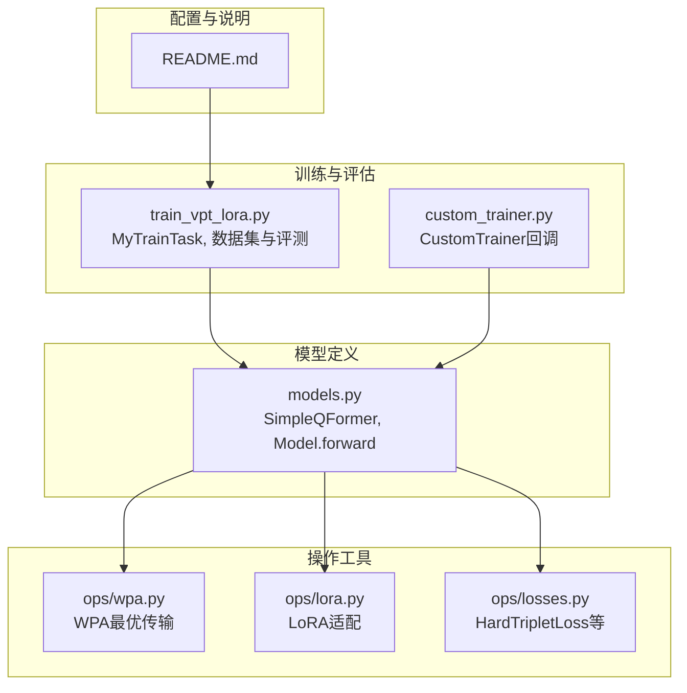
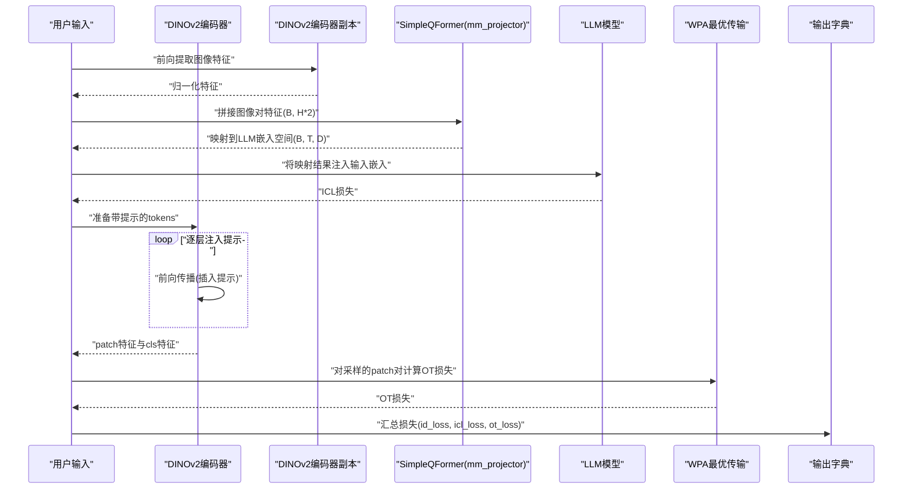
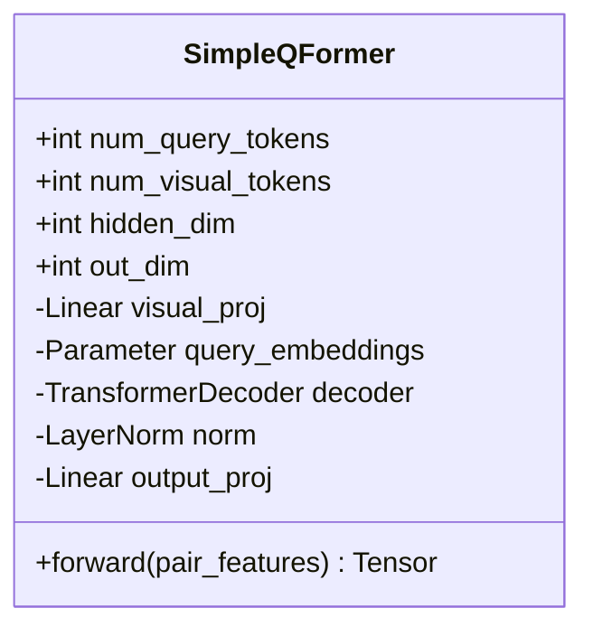
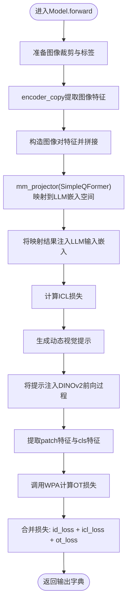
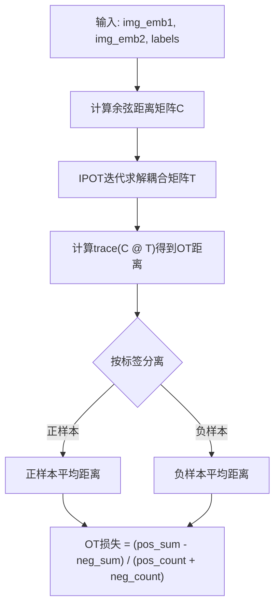
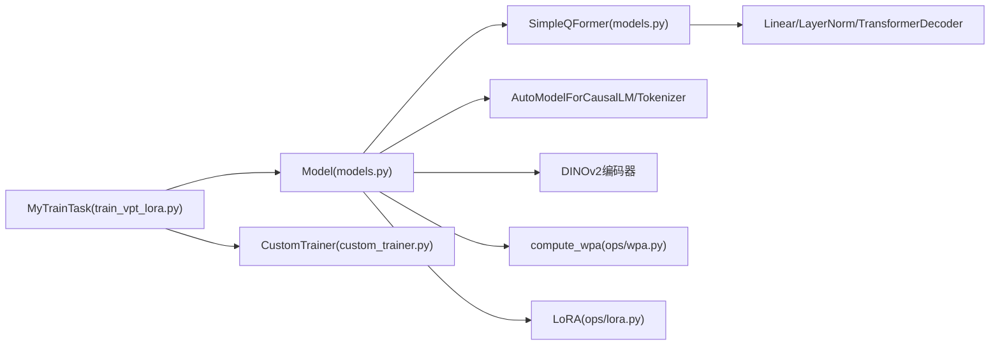

# 跨模态对齐

<cite>
**本文引用的文件**
- [models.py](file://models.py)
- [ops/wpa.py](file://ops/wpa.py)
- [ops/losses.py](file://ops/losses.py)
- [ops/lora.py](file://ops/lora.py)
- [train_vpt_lora.py](file://train_vpt_lora.py)
- [custom_trainer.py](file://custom_trainer.py)
- [README.md](file://README.md)
</cite>

## 目录
1. [简介](#简介)
2. [项目结构](#项目结构)
3. [核心组件](#核心组件)
4. [架构总览](#架构总览)
5. [详细组件分析](#详细组件分析)
6. [依赖关系分析](#依赖关系分析)
7. [性能考量](#性能考量)
8. [故障排查指南](#故障排查指南)
9. [结论](#结论)
10. [附录](#附录)

## 简介
本文件围绕Q-Former在视觉-语言特征对齐中的核心作用展开，重点基于SimpleQFormer类的实现，系统阐述其如何将拼接的图像对特征（pair_features）重塑为视觉令牌，并通过可学习查询（query_embeddings）与Transformer解码器实现交叉注意力机制；进一步解释visual_proj线性投影层、decoder解码器堆栈及output_proj输出投影的数学原理与参数配置；结合forward方法中image_features = self.mm_projector(image_features)的实际调用，展示从DINOv2特征到LLM嵌入空间的转换流程；同时整合ops/wpa.py中的Word-Patch Alignment（WPA）机制，解释最优传输（Optimal Transport）算法如何通过余弦距离矩阵和IPOT迭代实现细粒度的图像块匹配，并最终形成OT损失。最后提供完整的数据流图示例，从视觉特征输入到跨模态对齐输出的全过程，并附带性能优化建议。

## 项目结构
该仓库采用“模型定义 + 训练与评估 + 操作工具”的分层组织方式：
- 模型定义：models.py包含SimpleQFormer与主模型Model的实现，负责视觉-语言对齐与提示注入。
- 训练与评估：train_vpt_lora.py与custom_trainer.py负责训练循环、日志聚合与评估指标计算。
- 操作工具：ops目录下包含WPA最优传输、LoRA适配、损失函数等辅助模块。
- 配置与说明：README.md提供框架说明与使用指引。

图表来源
- [models.py](file://models.py#L1-L291)
- [ops/wpa.py](file://ops/wpa.py#L1-L110)
- [ops/losses.py](file://ops/losses.py#L1-L416)
- [ops/lora.py](file://ops/lora.py#L1-L99)
- [train_vpt_lora.py](file://train_vpt_lora.py#L1-L295)
- [custom_trainer.py](file://custom_trainer.py#L1-L156)
- [README.md](file://README.md#L1-L73)

章节来源
- [models.py](file://models.py#L1-L291)
- [train_vpt_lora.py](file://train_vpt_lora.py#L1-L295)
- [custom_trainer.py](file://custom_trainer.py#L1-L156)
- [README.md](file://README.md#L1-L73)

## 核心组件
本节聚焦于SimpleQFormer与Model两个核心组件，解释其在跨模态对齐中的职责与交互。

- SimpleQFormer
  - 输入：拼接后的图像对特征（B, visual_token_dim * num_visual_tokens）
  - 输出：(B, num_query_tokens, out_dim)
  - 关键模块：
    - visual_proj：将视觉令牌映射到Q-Former隐藏维度
    - query_embeddings：可学习查询向量
    - decoder：多层Transformer解码器，执行与视觉令牌的交叉注意力
    - output_proj：若输出维度不同于隐藏维度，则进行线性投影

- Model
  - 使用DINOv2作为视觉编码器，冻结参数并替换MLP投影为SimpleQFormer
  - 在forward中完成以下流程：
    - 通过encoder_copy提取图像特征
    - 构造图像对特征（每对2个视觉令牌），经mm_projector（即SimpleQFormer）映射到LLM嵌入空间
    - 将映射结果注入到LLM输入嵌入中，得到ICL任务的损失
    - 通过prompt_mlp与query_embeddings生成动态视觉提示，注入到DINOv2前向过程中
    - 基于patch特征调用WPA最优传输计算OT损失，并与ID损失、ICL损失融合

章节来源
- [models.py](file://models.py#L8-L80)
- [models.py](file://models.py#L81-L269)

## 架构总览
下图展示了从输入图像到跨模态对齐输出的整体流程，包括DINOv2特征提取、Q-Former对齐、提示注入与WPA最优传输。

图表来源
- [models.py](file://models.py#L159-L269)
- [ops/wpa.py](file://ops/wpa.py#L86-L110)

章节来源
- [models.py](file://models.py#L159-L269)
- [ops/wpa.py](file://ops/wpa.py#L1-L110)

## 详细组件分析

### SimpleQFormer组件分析
SimpleQFormer将拼接的图像对特征重塑为视觉令牌，并通过可学习查询与Transformer解码器实现交叉注意力，最终输出与LLM嵌入空间对齐的表示。

图表来源
- [models.py](file://models.py#L8-L80)

- 数学原理与参数配置
  - 视觉令牌重塑：将(B, visual_token_dim * num_visual_tokens)重排为(B, num_visual_tokens, visual_token_dim)，随后经visual_proj映射至隐藏维度D。
  - 可学习查询：(T, D)的query_embeddings按批次复制为(B, T, D)，作为解码器目标序列。
  - 交叉注意力：解码器以query为tgt，以视觉令牌为memory，执行多头交叉注意力，输出(B, T, D)。
  - 输出投影：若out_dim != D，则经output_proj线性变换到目标维度。

- 复杂度与性能
  - 时间复杂度：O(B*T*S*D)，其中S为num_visual_tokens，T为num_query_tokens。
  - 内存占用：主要由注意力矩阵(B*T*S)与中间激活构成，可通过减少S或T降低内存。
  - 建议：合理设置num_visual_tokens与num_query_tokens，避免过大导致显存溢出。

章节来源
- [models.py](file://models.py#L56-L80)

### Model.forward中的数据流
Model.forward串联了特征提取、对齐、提示注入与损失计算，关键步骤如下：

图表来源
- [models.py](file://models.py#L159-L269)
- [ops/wpa.py](file://ops/wpa.py#L86-L110)

- 关键调用路径
  - 图像对特征构造与映射：见forward中对mm_projector的调用与后续嵌入替换逻辑。
  - 动态提示注入：通过query_embeddings与prompt_mlp生成提示，并在DINOv2前向中逐层插入。
  - WPA损失：对采样的patch对计算OT损失，用于增强细粒度对齐。

章节来源
- [models.py](file://models.py#L159-L269)

### WPA最优传输与OT损失
WPA通过余弦距离矩阵与IPOT迭代实现细粒度图像块匹配，并最终形成OT损失。

图表来源
- [ops/wpa.py](file://ops/wpa.py#L12-L110)

- 数学原理
  - 余弦距离：利用归一化向量的点积构造距离矩阵，衡量图像块间的相似性。
  - IPOT：通过指数映射与迭代更新，求解最优耦合矩阵T，使耦合代价最小化。
  - OT损失：对正样本与负样本的距离分别求和，再做差值归一化，形成可微分的对比学习损失。

- 参数与稳定性
  - beta、iteration、k：控制收敛速度与数值稳定性，通常beta取较小正值，iteration足够大以收敛。
  - 自动混合精度：compute_wpa内部启用autocast，避免半精度下的数值不稳定。

章节来源
- [ops/wpa.py](file://ops/wpa.py#L12-L110)

### 与LoRA适配与提示注入的关系
- LoRA适配：对DINOv2的QKV层进行低秩适配，仅训练少量参数，提升效率与泛化。
- 提示注入：通过query_embeddings与prompt_mlp生成提示，动态引导视觉编码器关注身份相关区域。

章节来源
- [models.py](file://models.py#L81-L124)
- [ops/lora.py](file://ops/lora.py#L1-L99)

## 依赖关系分析
- SimpleQFormer依赖于PyTorch的nn.Linear、nn.TransformerDecoder与nn.LayerNorm。
- Model依赖于transformers.AutoModelForCausalLM与AutoTokenizer，以及DINOv2视觉编码器。
- WPA模块独立于主模型，仅依赖torch.nn.functional与torch张量操作。
- 训练脚本MyTrainTask依赖CustomTrainer进行日志与评估。

图表来源
- [models.py](file://models.py#L1-L291)
- [ops/wpa.py](file://ops/wpa.py#L1-L110)
- [ops/lora.py](file://ops/lora.py#L1-L99)
- [train_vpt_lora.py](file://train_vpt_lora.py#L1-L295)
- [custom_trainer.py](file://custom_trainer.py#L1-L156)

章节来源
- [models.py](file://models.py#L1-L291)
- [ops/wpa.py](file://ops/wpa.py#L1-L110)
- [ops/lora.py](file://ops/lora.py#L1-L99)
- [train_vpt_lora.py](file://train_vpt_lora.py#L1-L295)
- [custom_trainer.py](file://custom_trainer.py#L1-L156)

## 性能考量
- 显存与吞吐
  - 控制num_visual_tokens与num_query_tokens，避免过大的S与T导致注意力矩阵爆炸。
  - 使用fp16/bf16训练，配合梯度累积与混合精度，平衡精度与速度。
- 计算效率
  - 将encoder_copy与encoder并行或缓存中间特征，减少重复计算。
  - 对WPA计算使用autocast，避免半精度下的数值问题。
- 训练稳定性
  - 合理设置ot_loss_weight与icl_loss_weight，避免某一损失主导训练。
  - 使用HardTripletLoss稳定ID损失优化，防止退化。

[本节为通用指导，不直接分析具体文件]

## 故障排查指南
- Q-Former输出维度不匹配
  - 现象：输出形状与LLM嵌入维度不一致。
  - 排查：确认out_dim与lm.config.hidden_size是否一致，必要时启用output_proj。
  - 参考：SimpleQFormer初始化与forward逻辑。
- WPA损失NaN或不稳定
  - 现象：OT损失出现NaN或剧烈波动。
  - 排查：检查输入特征是否归一化，beta、iteration、k参数是否合适；确认labels与采样是否正确。
  - 参考：WPA模块的cost_matrix_cosine与ipot实现。
- 训练不收敛或退化
  - 现象：id_loss与ot_loss震荡或停滞。
  - 排查：调整ot_loss_weight与icl_loss_weight，检查LoRA秩r是否过小；核对DINOv2提示注入位置。
  - 参考：Model.forward中的损失融合与提示注入流程。

章节来源
- [models.py](file://models.py#L56-L80)
- [ops/wpa.py](file://ops/wpa.py#L12-L110)
- [ops/losses.py](file://ops/losses.py#L279-L348)

## 结论
SimpleQFormer通过将拼接的图像对特征重塑为视觉令牌，并借助可学习查询与Transformer解码器实现跨模态对齐，成功将DINOv2特征映射到LLM嵌入空间。结合WPA最优传输，系统实现了细粒度的图像块匹配与OT损失，进一步强化了跨模态一致性。训练脚本与自定义Trainer确保了多损失的稳定聚合与高效评测。整体设计在保持轻量化的同时，有效提升了跨类别泛化能力。

[本节为总结性内容，不直接分析具体文件]

## 附录
- 关键实现路径参考
  - SimpleQFormer初始化与forward：[models.py](file://models.py#L8-L80)
  - Model.forward中的对齐与损失：[models.py](file://models.py#L159-L269)
  - WPA最优传输与OT损失：[ops/wpa.py](file://ops/wpa.py#L12-L110)
  - 训练与评测入口：[train_vpt_lora.py](file://train_vpt_lora.py#L1-L295)
  - 自定义Trainer回调：[custom_trainer.py](file://custom_trainer.py#L1-L156)
  - README框架说明：[README.md](file://README.md#L1-L73)