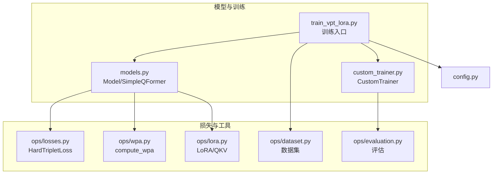
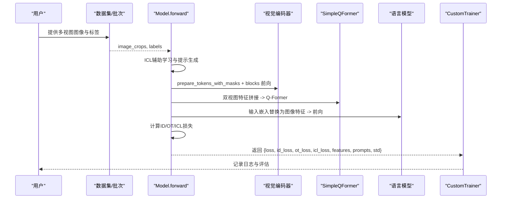
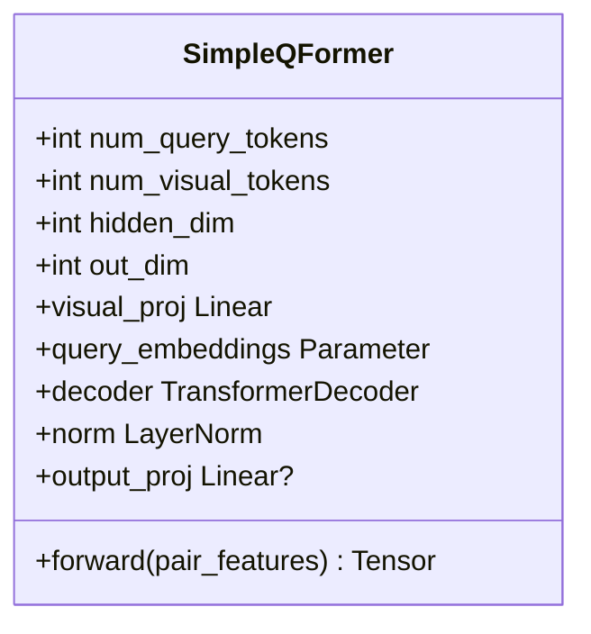
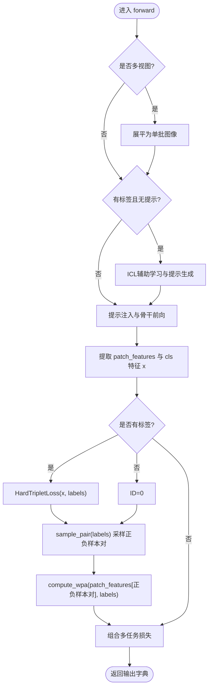
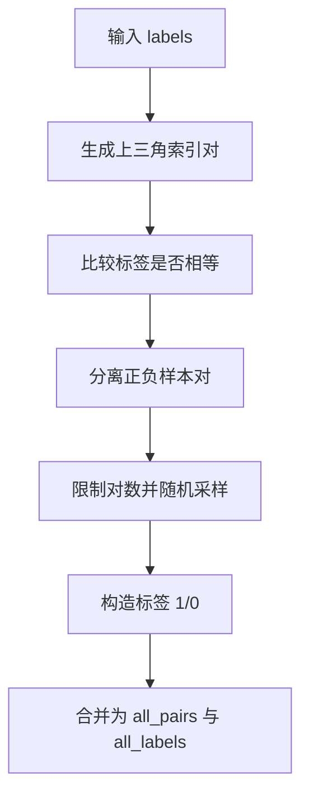
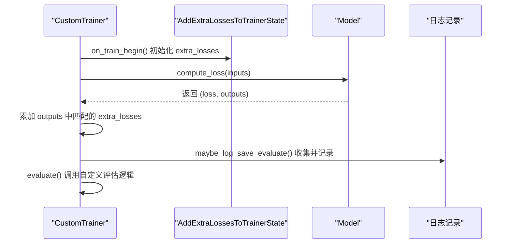
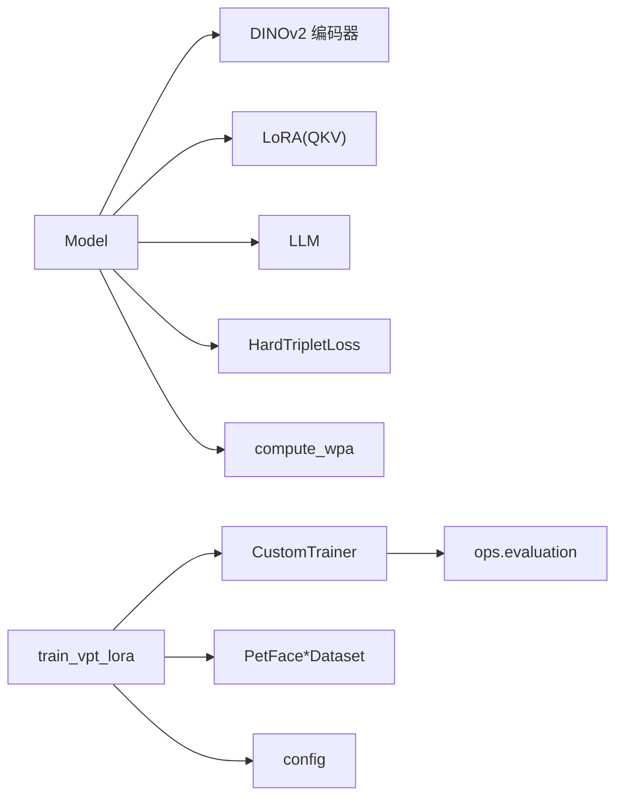

# 模型实现细节

<cite>
**本文引用的文件列表**
- [models.py](file://models.py)
- [custom_trainer.py](file://custom_trainer.py)
- [ops/losses.py](file://ops/losses.py)
- [ops/wpa.py](file://ops/wpa.py)
- [ops/lora.py](file://ops/lora.py)
- [ops/dataset.py](file://ops/dataset.py)
- [ops/evaluation.py](file://ops/evaluation.py)
- [train_vpt_lora.py](file://train_vpt_lora.py)
- [config.py](file://config.py)
</cite>

## 目录
1. [简介](#简介)
2. [项目结构](#项目结构)
3. [核心组件](#核心组件)
4. [架构总览](#架构总览)
5. [详细组件分析](#详细组件分析)
6. [依赖关系分析](#依赖关系分析)
7. [性能考量](#性能考量)
8. [故障排查指南](#故障排查指南)
9. [结论](#结论)
10. [附录](#附录)

## 简介
本文件深入解析 models.py 中的 Model 类与 SimpleQFormer 的实现细节，涵盖：
- 初始化逻辑：视觉编码器加载、LoRA 参数替换、语言模型集成、Q-Former 投影器与可提示嵌入的构建。
- 前向传播流程：多视图图像输入处理、ICL 辅助学习与提示生成、视觉骨干前向、提示注入、ID/OT/ICL 多任务损失计算。
- 关键方法：sample_pair 正负样本对采样、forward 主流程、以及与 CustomTrainer 的集成。
- 训练与评估：CustomTrainer 扩展 Hugging Face Trainer 的额外损失记录与自定义评估逻辑。
- 张量维度变换与数据流：通过图示展示关键中间张量形状变化，帮助理解多任务损失与特征投影过程。

## 项目结构
该仓库采用模块化组织，核心文件如下：
- models.py：定义 SimpleQFormer 与 Model，包含多任务损失与前向流程。
- ops/*：损失、LoRA、WPA OT 距离、数据集与评估工具。
- custom_trainer.py：扩展 Trainer，支持额外损失记录与自定义评估。
- train_vpt_lora.py：训练入口，构造模型、优化器与 Trainer 子类。
- config.py：数据集配置。

图表来源
- [models.py](file://models.py#L1-L291)
- [custom_trainer.py](file://custom_trainer.py#L1-L156)
- [ops/losses.py](file://ops/losses.py#L1-L416)
- [ops/wpa.py](file://ops/wpa.py#L1-L110)
- [ops/lora.py](file://ops/lora.py#L1-L99)
- [ops/dataset.py](file://ops/dataset.py#L1-L178)
- [ops/evaluation.py](file://ops/evaluation.py#L1-L482)
- [train_vpt_lora.py](file://train_vpt_lora.py#L1-L295)
- [config.py](file://config.py#L1-L16)

章节来源
- [models.py](file://models.py#L1-L291)
- [custom_trainer.py](file://custom_trainer.py#L1-L156)
- [train_vpt_lora.py](file://train_vpt_lora.py#L1-L295)

## 核心组件
- SimpleQFormer：将拼接后的双视图特征重塑为两个视觉 token，经线性投影进入 Transformer 解码器，返回查询嵌入序列，用于后续与语言模型对齐。
- Model：封装视觉编码器（DINOv2）、LoRA 注入的注意力层、语言模型（LLM）与 Q-Former 投影器；实现 ICL 辅助学习、提示生成、ID/OT/ICL 多任务损失与输出字典。

章节来源
- [models.py](file://models.py#L8-L80)
- [models.py](file://models.py#L81-L291)

## 架构总览
下图展示了从输入图像到多任务损失的端到端流程，包括 ICL 辅助学习、提示生成、视觉骨干前向与损失计算。

图表来源
- [models.py](file://models.py#L159-L269)
- [custom_trainer.py](file://custom_trainer.py#L43-L120)

## 详细组件分析

### SimpleQFormer 类设计与实现
- 设计目标：最小化 Q-Former，学习可查询嵌入与视觉 token 的交叉注意力，将拼接的双视图特征映射到 LLM 维度空间。
- 关键点：
  - 输入形状：(B, hidden_size * 2)，其中 hidden_size 来自视觉编码器。
  - 重构成 (B, 2, hidden_size)，线性投影至 Q-Former 隐藏维 (D)。
  - 使用可学习查询嵌入 (T, D)，与视觉 token 作为解码器目标进行交叉注意力。
  - 输出形状：(B, T, out_dim)，默认与 LLM 隐藏维相同。
- 维度变换要点：
  - reshape: (B, hidden_size*2) -> (B, 2, hidden_size)
  - proj: (B, 2, hidden_size) -> (B, 2, D)
  - transpose: (B, 2, D) -> (S=2, B, D)
  - query: (T, D) -> (T, B, D)
  - cross-attn: (T, B, D) -> (T, B, D)
  - transpose: (T, B, D) -> (B, T, D)
  - output_proj: (B, T, D) -> (B, T, out_dim)

图表来源
- [models.py](file://models.py#L8-L80)

章节来源
- [models.py](file://models.py#L8-L80)

### Model 类初始化与组件装配
- 视觉编码器加载与冻结：使用 DINOv2，复制一份用于 ICL 特征提取，均设置 requires_grad=False。
- LoRA 注入：对编码器最后 4 层的注意力 QKV 层替换为 LoRA 版本，r=128。
- 损失函数：HardTripletLoss（ hardest=True, margin=0.1）。
- LLM 集成：加载因果语言模型与分词器，冻结参数。
- Q-Former 投影器：将双视图特征映射到 LLM 维度，num_id_tokens 控制查询数。
- 可提示嵌入：query_embeddings，尺寸为 (num_vpt_tokens * num_layers, LLM_hidden_size)。
- Prompt MLP：将 LLM 输出的提示映射回视觉隐藏维，初始化为零权重。

章节来源
- [models.py](file://models.py#L81-L124)

### 前向传播流程与多任务损失
- 输入处理：
  - 支持多视图输入 (B, nview, C, H, W)，若 nview > 1 则展平为单批图像。
- ICL 辅助学习与提示生成：
  - 从 encoder_copy 提取前 num_examples 的图像特征，构造问答式输入（yes/no 对应正负样本判断），将图像特征通过 Q-Former 投影后替换到输入嵌入对应位置，得到 icl_loss。
  - 基于 LLM 输出 hidden_states 的末层，截取最后 num_vpt_tokens * num_layers 的提示，经 prompt_mlp 映射为视觉提示。
- 视觉骨干前向与提示注入：
  - prepare_tokens_with_masks + 前若干层 blocks 直接前向。
  - 最后 num_layers 层中，按层将提示拼接到 cls token 之后，形成“提示注入”。
  - 归一化后取 cls token 作为全局特征 x，同时保留 patch_features 用于 OT 损失。
- 损失计算：
  - ID 损失：HardTripletLoss(x, labels)。
  - OT 损失：compute_wpa(patch_features[正负样本对], labels)。
  - ICL 损失：来自 ICL 辅助学习的 LM loss。
  - 总损失：icl_loss * icl_weight + id_loss + ot_loss * ot_weight。
- 输出字典：包含 loss、id_loss、ot_loss、icl_loss、features、prompts、std（每维标准差的均值）。

图表来源
- [models.py](file://models.py#L159-L269)
- [ops/wpa.py](file://ops/wpa.py#L86-L110)
- [ops/losses.py](file://ops/losses.py#L279-L348)

章节来源
- [models.py](file://models.py#L159-L269)
- [ops/wpa.py](file://ops/wpa.py#L1-L110)
- [ops/losses.py](file://ops/losses.py#L1-L416)

### 关键方法详解

#### sample_pair：构建正负样本对
- 输入：标签向量 labels。
- 步骤：
  - 生成上三角索引对 (i, j)，i != j。
  - 按标签相等与否划分正负样本对。
  - 限制最大对数（例如 128），随机采样保证正负平衡。
  - 为正负对分别标注 1/0。
  - 合并为 all_pairs 与 all_labels。
- 输出：正负样本对索引与标签。

图表来源
- [models.py](file://models.py#L125-L156)

章节来源
- [models.py](file://models.py#L125-L156)

#### forward：主流程与多任务损失
- ICL 流程：抽取 encoder_copy 的特征，构造问答式输入，替换输入嵌入中的图像特征，得到 icl_loss，并生成 prompts。
- 提示注入：将 prompts 重塑为 (B, num_layers, num_vpt_tokens, D)，随机采样与当前图像批大小一致，逐层拼接至 cls token 之后。
- 视觉骨干前向：prepare_tokens_with_masks + blocks 前向，归一化后取 cls token 作为特征 x，同时保存 patch_features。
- 损失：ID/OT/ICL 组合，返回包含 loss、id_loss、ot_loss、icl_loss、features、prompts、std 的字典。

章节来源
- [models.py](file://models.py#L159-L269)

### SimpleQFormer 在特征投影中的作用
- 将双视图拼接特征 (B, hidden_size*2) 重塑为 (B, 2, hidden_size)，经线性投影到 Q-Former 隐藏维 (D)。
- 通过可学习查询与视觉 token 的交叉注意力，输出 (B, T, D)，T 由 num_id_tokens 决定。
- 该输出被用于替换 LLM 输入嵌入中的占位符，从而将视觉信息注入语言模型，支撑 ICL 与提示生成。

章节来源
- [models.py](file://models.py#L8-L80)

### 与 CustomTrainer 的集成
- 自定义 Trainer：继承 Trainer，新增回调 AddExtraLossesToTrainerState，在训练开始时初始化额外损失张量。
- compute_loss：当模型输出为字典时，遍历输出键，将匹配 extra_losses 的项累加到 Trainer 的状态张量中（支持多卡平均）。
- 日志记录：_maybe_log_save_evaluate 会收集 loss、学习率、梯度范数以及 extra_losses，并进行平均与清零。
- evaluate：自定义评估逻辑，基于 ops.evaluation 的验证指标（如 AUC/ACC 或 ReID 的 rank1/rank5/mAP），并在训练循环中定期触发。
- 自定义采样器：在 MyTrainTask 中实现按类别均衡采样的 OrderedSampler，提升训练稳定性。

图表来源
- [custom_trainer.py](file://custom_trainer.py#L25-L120)

章节来源
- [custom_trainer.py](file://custom_trainer.py#L1-L156)
- [train_vpt_lora.py](file://train_vpt_lora.py#L145-L205)

## 依赖关系分析
- Model 依赖：
  - 视觉编码器：DINOv2（来自 torch hub），冻结参数。
  - LoRA：对注意力 QKV 进行低秩适配，r=128。
  - LLM：AutoModelForCausalLM，冻结参数。
  - 损失：HardTripletLoss。
  - OT 距离：compute_wpa。
- CustomTrainer 依赖：
  - Trainer 回调系统，用于记录额外损失。
  - 评估工具：ops.evaluation 的验证与 ReID 评估函数。
- 数据与配置：
  - 数据集：PetFaceTrainDataset/PetFaceEvalDataset。
  - 配置：data_config。

图表来源
- [models.py](file://models.py#L81-L124)
- [ops/lora.py](file://ops/lora.py#L58-L99)
- [ops/losses.py](file://ops/losses.py#L279-L348)
- [ops/wpa.py](file://ops/wpa.py#L86-L110)
- [custom_trainer.py](file://custom_trainer.py#L1-L156)
- [train_vpt_lora.py](file://train_vpt_lora.py#L145-L205)
- [ops/dataset.py](file://ops/dataset.py#L1-L178)
- [config.py](file://config.py#L1-L16)

章节来源
- [models.py](file://models.py#L81-L124)
- [ops/lora.py](file://ops/lora.py#L1-L99)
- [ops/losses.py](file://ops/losses.py#L1-L416)
- [ops/wpa.py](file://ops/wpa.py#L1-L110)
- [custom_trainer.py](file://custom_trainer.py#L1-L156)
- [train_vpt_lora.py](file://train_vpt_lora.py#L145-L205)
- [ops/dataset.py](file://ops/dataset.py#L1-L178)
- [config.py](file://config.py#L1-L16)

## 性能考量
- 计算开销：
  - LoRA 注入显著降低微调参数量，加速训练与推理。
  - ICL 辅助学习引入额外前向，建议控制 num_icl_bs 与 num_icl_samples。
  - OT 损失 compute_wpa 使用 Sinkhorn/IPOT 近似最优传输，注意批大小与迭代次数。
- 内存与显存：
  - 多视图输入需展平，注意批大小与分辨率对显存的影响。
  - Q-Former 查询数（num_id_tokens）与 LLM 隐藏维决定中间张量规模。
- 训练稳定性：
  - CustomTrainer 的自定义采样器有助于类别均衡，减少长尾问题。
  - 训练日志中 std（每维标准差的均值）可用于监控特征分布稳定性。

## 故障排查指南
- ICL 输入构造异常：
  - 确认 tokenizer 中 yes/no 的 token id 是否存在，以及输入 ids 替换逻辑是否正确。
- OT 损失 NaN/Inf：
  - 检查 patch_features 是否为 NaN，必要时在 compute_wpa 前做归一化或掩码。
- 提示注入错误：
  - 确认 prompts 的形状与 num_layers、num_vpt_tokens 匹配，拼接位置是否正确。
- 训练日志缺失：
  - 确认 extra_losses 名称与 Model 输出键一致，且 Trainer 已注册回调。
- 数据采样不均衡：
  - 检查自定义采样器的 label_to_indices 构造与批量生成逻辑。

章节来源
- [models.py](file://models.py#L159-L269)
- [custom_trainer.py](file://custom_trainer.py#L43-L120)
- [train_vpt_lora.py](file://train_vpt_lora.py#L252-L281)

## 结论
本实现通过 SimpleQFormer 将双视图特征投影到 LLM 维度，结合 ICL 辅助学习与提示生成，实现了视觉-语言对齐与可提示的视觉骨干。Model 的多任务损失（ID、OT、ICL）在 CustomTrainer 的支持下得以完整记录与评估，配合自定义采样器与评估流程，形成一套完整的多视图身份识别与跨模态学习框架。建议在实际部署中关注 ICL 与 OT 的批大小与迭代次数，以平衡性能与稳定性。

## 附录

### 代码片段路径示例（不含具体代码内容）
- 初始化与组件装配：[models.py](file://models.py#L81-L124)
- ICL 与提示生成：[models.py](file://models.py#L168-L225)
- 提示注入与骨干前向：[models.py](file://models.py#L226-L245)
- ID/OT/ICL 损失组合：[models.py](file://models.py#L246-L269)
- sample_pair 实现：[models.py](file://models.py#L125-L156)
- CustomTrainer 额外损失记录：[custom_trainer.py](file://custom_trainer.py#L43-L85)
- CustomTrainer 自定义评估：[custom_trainer.py](file://custom_trainer.py#L104-L119)
- 训练入口与 Trainer 子类：[train_vpt_lora.py](file://train_vpt_lora.py#L145-L186)
- 数据集与配置：[ops/dataset.py](file://ops/dataset.py#L92-L160), [config.py](file://config.py#L1-L16)