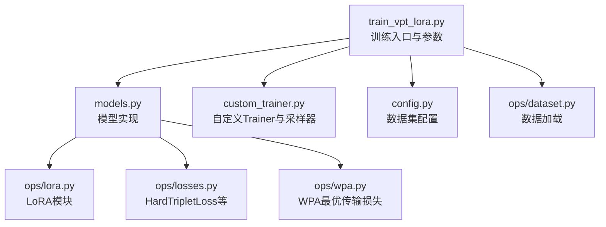
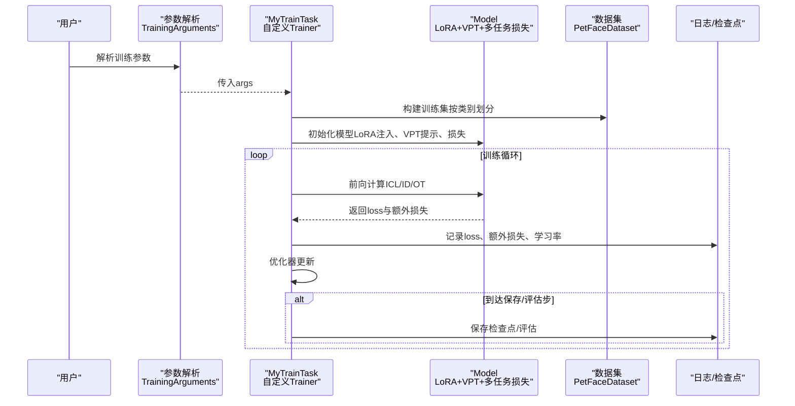
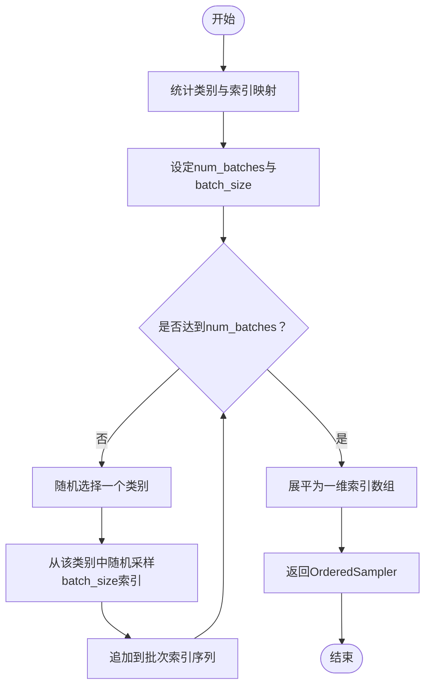
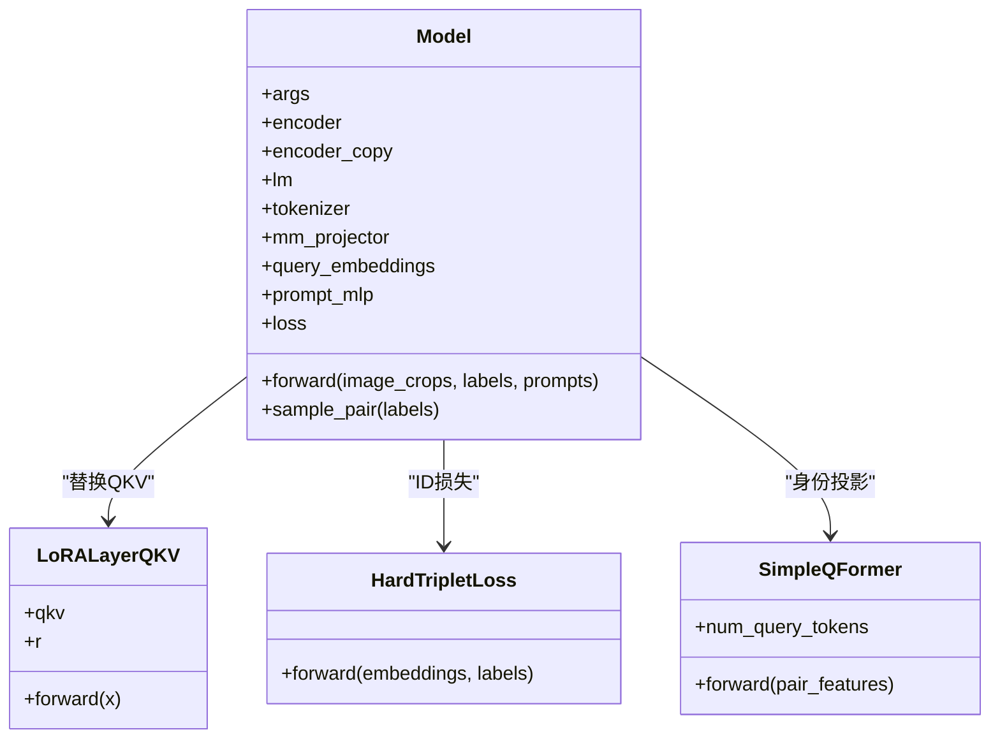
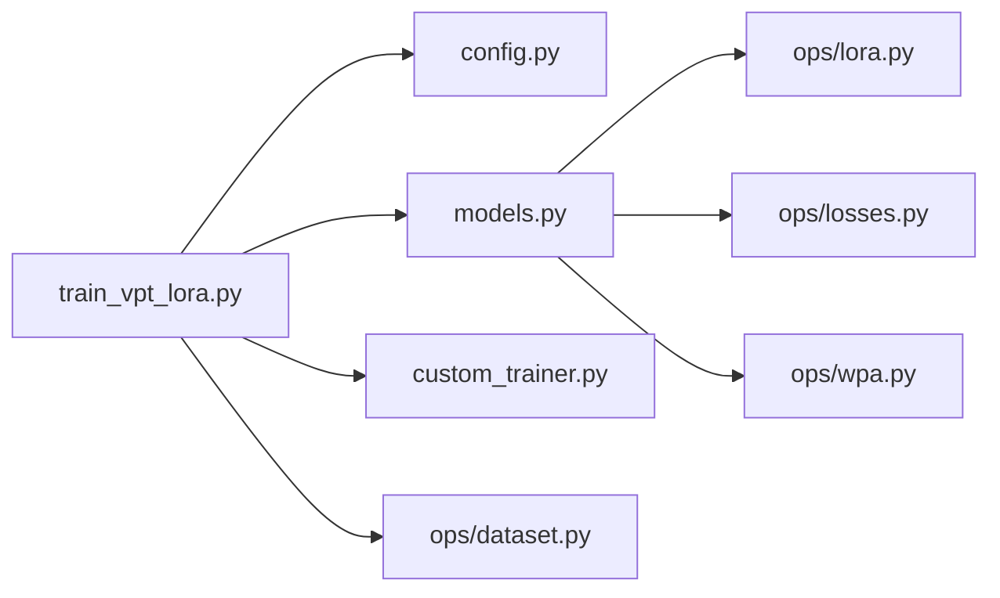

# 训练流程配置

<cite>
**本文引用的文件**
- [train_vpt_lora.py](file://train_vpt_lora.py)
- [config.py](file://config.py)
- [custom_trainer.py](file://custom_trainer.py)
- [models.py](file://models.py)
- [ops/dataset.py](file://ops/dataset.py)
- [ops/lora.py](file://ops/lora.py)
- [ops/losses.py](file://ops/losses.py)
- [ops/wpa.py](file://ops/wpa.py)
- [README.md](file://README.md)
</cite>

## 目录
1. [简介](#简介)
2. [项目结构](#项目结构)
3. [核心组件](#核心组件)
4. [架构总览](#架构总览)
5. [详细组件分析](#详细组件分析)
6. [依赖关系分析](#依赖关系分析)
7. [性能考虑](#性能考虑)
8. [故障排查指南](#故障排查指南)
9. [结论](#结论)
10. [附录：完整训练命令与参数说明](#附录完整训练命令与参数说明)

## 简介
本文件面向首次使用VICP进行训练的用户，系统性讲解训练参数配置、数据集结构、训练命令、自定义采样器工作机制以及日志监控与检查点管理。重点围绕train_vpt_lora.py中的TrainingArguments数据类参数、config.py的数据集配置结构（类别划分与训练/测试分离策略）、LoRA与VPT提示词长度（num_id_tokens、num_vpt_tokens）等，并结合模型前向逻辑解释各损失项权重与作用。

## 项目结构
- 训练入口与参数：train_vpt_lora.py
- 数据集配置：config.py
- 自定义Trainer与采样器：custom_trainer.py
- 模型实现（LoRA注入、VPT提示、多任务损失）：models.py
- 数据加载与评估数据集：ops/dataset.py
- LoRA模块与损失函数：ops/lora.py、ops/losses.py
- WPA最优传输对齐损失：ops/wpa.py
- 使用说明与示例命令：README.md

图表来源
- [train_vpt_lora.py](file://train_vpt_lora.py#L131-L143)
- [models.py](file://models.py#L81-L124)
- [custom_trainer.py](file://custom_trainer.py#L34-L156)
- [config.py](file://config.py#L3-L15)
- [ops/dataset.py](file://ops/dataset.py#L12-L160)
- [ops/lora.py](file://ops/lora.py#L58-L99)
- [ops/losses.py](file://ops/losses.py#L279-L348)
- [ops/wpa.py](file://ops/wpa.py#L86-L110)

章节来源
- [train_vpt_lora.py](file://train_vpt_lora.py#L131-L143)
- [config.py](file://config.py#L3-L15)

## 核心组件
- TrainingArguments（训练参数扩展）
  - dataset_name：选择数据集键名（如amazon），决定根目录、类别列表与划分
  - cluster_index：聚类划分索引；-1表示全类别训练；否则按该索引排除对应split作为验证集
  - vision_model：视觉编码器名称（默认dinov2_vitb14）
  - llm_model：语言模型名称（默认Qwen/Qwen3-0.6B）
  - num_id_tokens：用于身份特征投影的查询令牌数（影响Q-Former输出维度）
  - num_vpt_tokens：VPT提示词长度（每层num_vpt_tokens个，共num_layers层）
  - num_icl_samples：少样本示例数（用于引导LLM生成身份规则）
  - num_icl_bs：少样本批次大小
  - icl_loss_weight：ICL损失权重
  - ot_loss_weight：WPA最优传输对齐损失权重
- 数据集配置（config.py）
  - splits：多折划分的类别集合
  - classes：所有类别列表
  - root：数据根路径
  - transform：可选的全局变换（当前amazon配置未启用）
- 自定义Trainer（custom_trainer.py）
  - 注入额外损失到日志与状态
  - 自定义训练采样器（OrderedSampler）以稳定类别均衡采样
- 模型（models.py）
  - LoRA注入至视觉编码器的QKV层
  - VPT提示词与Q-Former身份投影
  - 多任务损失：ICL、ID（HardTriplet）、OT（WPA）

章节来源
- [train_vpt_lora.py](file://train_vpt_lora.py#L131-L143)
- [config.py](file://config.py#L3-L15)
- [custom_trainer.py](file://custom_trainer.py#L25-L100)
- [models.py](file://models.py#L81-L124)

## 架构总览
训练流程从参数解析开始，构建数据集与模型，随后通过自定义Trainer执行训练循环，期间计算多任务损失并通过OrderedSampler保证类别均衡采样。评估阶段使用Re-ID指标（Rank-1、Rank-5、mAP）进行跨域/跨类别泛化验证。

图表来源
- [train_vpt_lora.py](file://train_vpt_lora.py#L145-L186)
- [custom_trainer.py](file://custom_trainer.py#L34-L100)
- [models.py](file://models.py#L159-L269)
- [ops/dataset.py](file://ops/dataset.py#L12-L43)

## 详细组件分析

### 参数配置详解（TrainingArguments）
- dataset_name
  - 作用：选择config.py中的数据集键名，决定root、classes与splits
  - 推荐：使用已提供的键名（如amazon）
- cluster_index
  - 作用：控制类别划分策略；-1为全类别训练；非-1时按该索引排除对应split作为验证集
  - 推荐：在多折划分场景下设置为0..k-1进行交叉验证
- vision_model
  - 作用：指定视觉编码器（如dinov2_vitb14）
  - 推荐：与预训练权重兼容的名称
- llm_model
  - 作用：指定语言模型（如Qwen/Qwen3-0.6B）
  - 推荐：与分词器兼容的名称
- num_id_tokens
  - 作用：Q-Former查询令牌数，决定身份特征投影维度
  - 推荐：根据下游类别数量与显存预算调整（通常16~64）
- num_vpt_tokens
  - 作用：每层VPT提示词数量，共num_layers层
  - 推荐：8~32（过小影响提示表达力，过大增加显存与计算开销）
- num_icl_samples
  - 作用：少样本示例数，用于引导LLM生成身份规则
  - 推荐：32~128（平衡效果与速度）
- num_icl_bs
  - 作用：少样本批次大小
  - 推荐：与num_icl_samples配合，确保能覆盖所需样本
- icl_loss_weight
  - 作用：ICL损失权重
  - 推荐：从0.0开始尝试，逐步增大到0.1~1.0观察效果
- ot_loss_weight
  - 作用：WPA最优传输对齐损失权重
  - 推荐：从0.001~0.1起步，结合ID损失调参

章节来源
- [train_vpt_lora.py](file://train_vpt_lora.py#L131-L143)
- [models.py](file://models.py#L111-L124)

### 数据集配置（config.py）
- 结构设计
  - splits：多折划分的类别集合，用于交叉验证或类别隔离
  - classes：所有类别列表
  - root：数据根目录，训练/验证/测试文件均在此目录下组织
  - transform：当前amazon配置未启用
- 类别划分与训练/测试分离策略
  - 训练集：当cluster_index=-1时，使用全部classes；否则排除第cluster_index个split作为验证集
  - 测试集：评估阶段会遍历剩余类别，使用Re-ID测试集（见ops/dataset.py中的PetFaceReIDEvalDataset）
- 数据组织约定
  - split/<类别>/train.csv：训练样本文件名列表
  - split/<类别>/verification.csv：验证/匹配样本对
  - split/<类别>/test.txt：Re-ID测试序列（按行记录图像路径）

章节来源
- [config.py](file://config.py#L3-L15)
- [ops/dataset.py](file://ops/dataset.py#L66-L91)
- [ops/dataset.py](file://ops/dataset.py#L92-L160)

### 自定义采样器（OrderedSampler）工作机制
- 目标
  - 在固定步数内，按类别均匀采样，避免某些类别被过度采样或欠采样，提升训练稳定性
- 工作原理
  - 统计训练集中每个类别的样本索引映射
  - 生成固定数量的批次索引序列（num_batches × batch_size），按类别随机抽取并拼接
  - 通过OrderedSampler顺序返回这些索引，使DataLoader按固定顺序迭代
- 对训练稳定性的影响
  - 提升类别均衡性，减少长尾类别消失
  - 降低因随机采样导致的波动，便于收敛观测
- 注意事项
  - num_batches需足够大以覆盖训练周期
  - batch_size由per_device_train_batch_size、gradient_accumulation_steps与进程数共同决定

图表来源
- [train_vpt_lora.py](file://train_vpt_lora.py#L252-L281)
- [custom_trainer.py](file://custom_trainer.py#L121-L156)

章节来源
- [train_vpt_lora.py](file://train_vpt_lora.py#L252-L281)
- [custom_trainer.py](file://custom_trainer.py#L121-L156)

### 模型前向与损失（models.py）
- LoRA注入
  - 将LoRA层替换视觉编码器最后若干块的QKV线性层，仅训练低秩适配参数
- VPT提示
  - 通过可学习的query_embeddings生成每层的提示向量，经prompt_mlp映射后插入视觉特征序列
- ICL（In-Context Learning）损失
  - 使用少量正/负样本对引导LLM学习身份规则，计算分类损失
- ID损失（HardTripletLoss）
  - 强化同类别内相似性与跨类别差异性
- OT损失（WPA最优传输对齐）
  - 通过最优传输度量对齐patch级语义分布，增强判别能力

图表来源
- [models.py](file://models.py#L81-L124)
- [models.py](file://models.py#L159-L269)
- [ops/lora.py](file://ops/lora.py#L58-L99)
- [ops/losses.py](file://ops/losses.py#L279-L348)

章节来源
- [models.py](file://models.py#L81-L124)
- [models.py](file://models.py#L159-L269)
- [ops/lora.py](file://ops/lora.py#L58-L99)
- [ops/losses.py](file://ops/losses.py#L279-L348)
- [ops/wpa.py](file://ops/wpa.py#L86-L110)

### 评估与日志（custom_trainer.py）
- 日志记录
  - 记录主损失与额外损失（icl_loss、id_loss、ot_loss、std），并输出学习率与梯度范数
- 评估流程
  - 评估阶段遍历测试类别，提取特征并计算Rank-1、Rank-5、mAP
- 检查点保存与恢复
  - 支持按步数或评估间隔保存，支持从断点恢复继续训练

章节来源
- [custom_trainer.py](file://custom_trainer.py#L60-L100)
- [custom_trainer.py](file://custom_trainer.py#L104-L119)
- [train_vpt_lora.py](file://train_vpt_lora.py#L188-L251)

## 依赖关系分析
- 训练入口依赖
  - 参数解析：HfArgumentParser(TrainingArguments)
  - 数据集：PetFaceDataset（来自config.py的classes/splits/root）
  - 模型：Model（LoRA注入、VPT提示、多任务损失）
  - Trainer：CustomTrainer（自定义日志、评估、采样器）
- 模块间耦合
  - train_vpt_lora.py与config.py强耦合（数据集键名与划分）
  - models.py与ops/*模块弱耦合（LoRA、损失、WPA）
  - custom_trainer.py与train_vpt_lora.py弱耦合（继承关系）

图表来源
- [train_vpt_lora.py](file://train_vpt_lora.py#L145-L186)
- [models.py](file://models.py#L81-L124)
- [custom_trainer.py](file://custom_trainer.py#L34-L100)
- [ops/lora.py](file://ops/lora.py#L58-L99)
- [ops/losses.py](file://ops/losses.py#L279-L348)
- [ops/wpa.py](file://ops/wpa.py#L86-L110)
- [ops/dataset.py](file://ops/dataset.py#L12-L43)

章节来源
- [train_vpt_lora.py](file://train_vpt_lora.py#L145-L186)
- [models.py](file://models.py#L81-L124)
- [custom_trainer.py](file://custom_trainer.py#L34-L100)

## 性能考虑
- 显存与吞吐
  - num_vpt_tokens与num_id_tokens越大，显存占用越高；建议从较小值起步
  - fp16开启可显著降低显存占用，但需注意数值稳定性
- 批大小与梯度累积
  - per_device_train_batch_size与gradient_accumulation_steps共同决定有效batch_size
  - dataloader_num_workers与persistent_workers可提升数据加载效率
- 学习率与调度
  - lr_scheduler_type设为constant时，学习率保持不变；可根据收敛情况切换warmup或余弦调度
- ICL与OT损失权重
  - 过大可能导致模型偏向ICL或OT，建议逐步增减并观察ID损失变化

[本节为通用建议，不直接分析具体文件]

## 故障排查指南
- 训练不收敛或震荡
  - 检查icl_loss_weight与ot_loss_weight是否过大
  - 调整num_vpt_tokens与num_id_tokens，避免提示过多导致不稳定
- 类别不平衡导致某类别消失
  - 确认使用了OrderedSampler并合理设置num_batches
  - 检查cluster_index与splits配置是否符合预期
- 评估指标异常
  - 确认eval阶段使用的测试集格式（test.txt）与类别划分一致
  - 检查特征归一化与mAP计算逻辑
- 检查点无法恢复
  - 确认output_dir存在且权限正确
  - 检查resume_from_checkpoint路径是否指向有效目录

章节来源
- [train_vpt_lora.py](file://train_vpt_lora.py#L252-L281)
- [custom_trainer.py](file://custom_trainer.py#L60-L100)
- [ops/dataset.py](file://ops/dataset.py#L66-L91)

## 结论
通过合理配置TrainingArguments与config.py，结合LoRA与VPT提示策略，VICP可在新类别上实现良好的泛化。稳定的自定义采样器与完善的日志/检查点机制有助于训练过程的可控性与可复现性。建议从推荐范围入手，逐步微调以获得最佳性能。

[本节为总结性内容，不直接分析具体文件]

## 附录：完整训练命令与参数说明

- 完整训练命令示例（来自README）
  - 输出目录、日志策略、DDP设置、梯度裁剪、保存与评估频率、最大步数、混合精度、批大小、学习率、权重衰减、类别划分、输出目录等
- 关键参数说明
  - logging_strategy、save_strategy、eval_strategy：控制日志/保存/评估的触发策略
  - dataloader_*：数据加载器行为（workers、pin_memory、drop_last、persistent_workers）
  - gradient_accumulation_steps：梯度累积步数
  - max_grad_norm：梯度裁剪阈值
  - save_steps、eval_steps：保存与评估间隔
  - max_steps：最大训练步数
  - fp16：混合精度开关
  - per_device_train_batch_size：单设备批大小
  - dataset_name：数据集键名
  - lr_scheduler_type：学习率调度类型
  - learning_rate、weight_decay：学习率与权重衰减
  - cluster_index：类别划分索引
  - output_dir：检查点保存目录

章节来源
- [README.md](file://README.md#L24-L54)