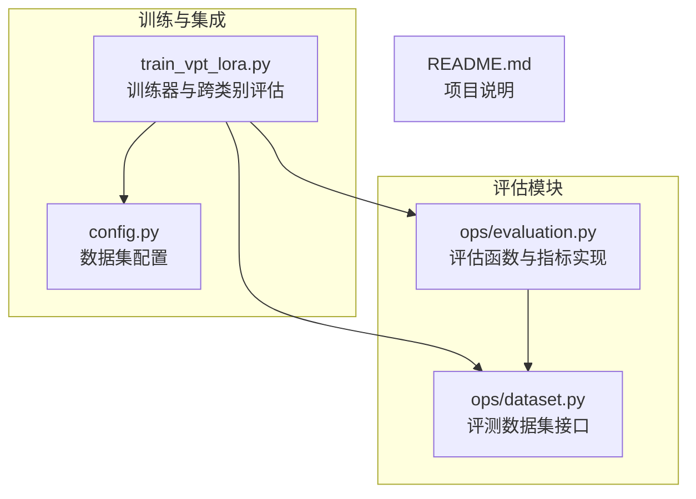
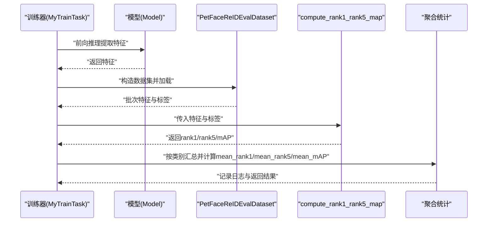
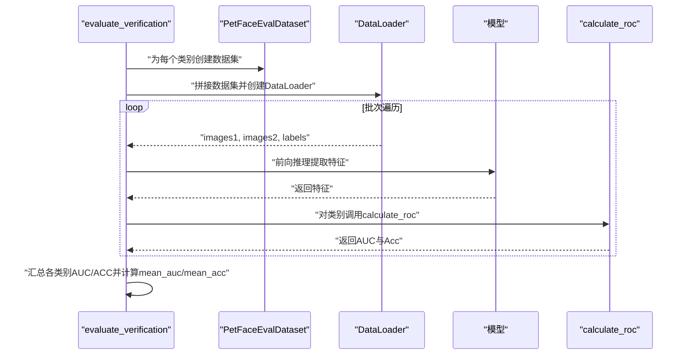
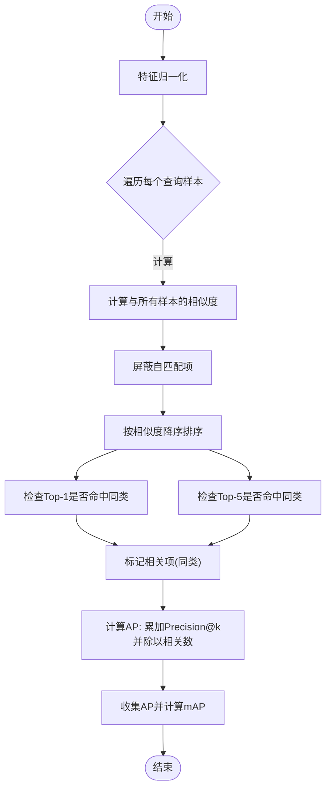
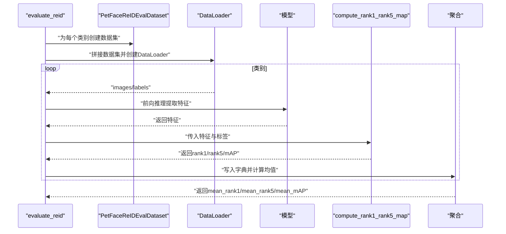
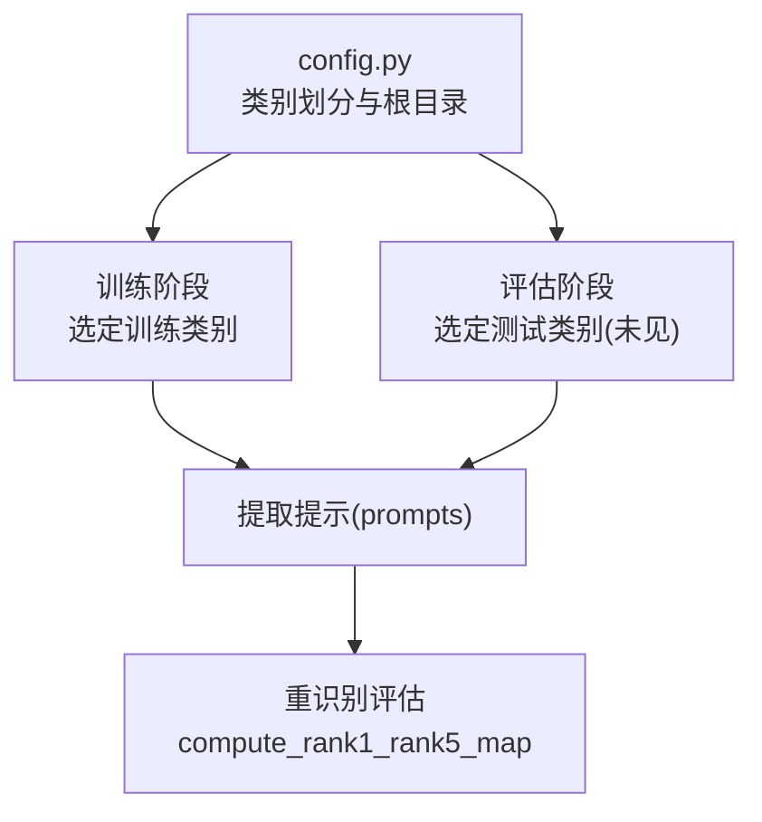
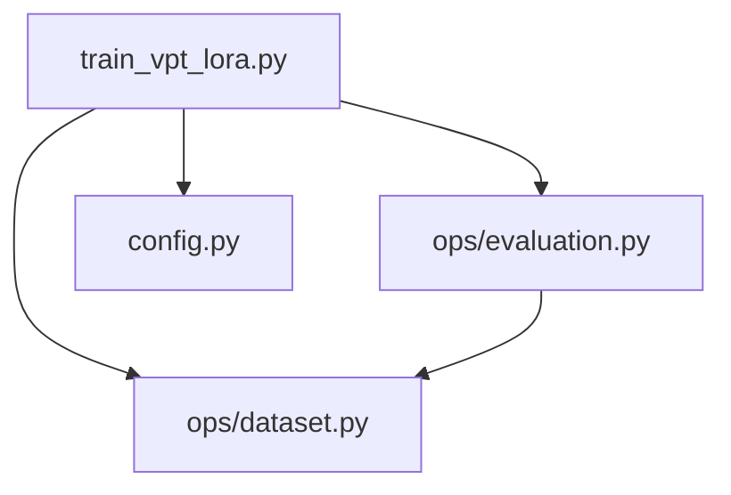

# 评估方法与指标

<cite>
**本文引用的文件列表**
- [ops/evaluation.py](file://ops/evaluation.py)
- [ops/dataset.py](file://ops/dataset.py)
- [train_vpt_lora.py](file://train_vpt_lora.py)
- [config.py](file://config.py)
- [README.md](file://README.md)
</cite>

## 目录
1. [简介](#简介)
2. [项目结构](#项目结构)
3. [核心组件](#核心组件)
4. [架构总览](#架构总览)
5. [详细组件分析](#详细组件分析)
6. [依赖关系分析](#依赖关系分析)
7. [性能考量](#性能考量)
8. [故障排查指南](#故障排查指南)
9. [结论](#结论)

## 简介
本文件系统性介绍VICP框架的模型评估体系，重点围绕以下目标展开：
- 解释evaluate_verification函数的实现逻辑，说明其如何在多个测试类别上执行验证任务。
- 定义评估指标：Rank-1/Rank-5准确率、mAP（平均精度均值）的计算原理与业务意义。
- 基于compute_rank1_rank5_map函数说明相似度矩阵构建、排序与精度计算的全过程。
- 描述跨类别评估策略，即在未见类别上的泛化能力测试方法。
- 提供评估结果的日志输出格式解析，并说明如何解读mean_rank1、mean_mAP等聚合指标。
- 包含评估过程中可能遇到的性能瓶颈与优化建议。

## 项目结构
本仓库与评估相关的核心文件包括：
- 评估与数据集模块：ops/evaluation.py、ops/dataset.py
- 训练与评估集成：train_vpt_lora.py
- 数据配置：config.py
- 项目说明：README.md

图表来源
- [ops/evaluation.py](file://ops/evaluation.py#L165-L223)
- [ops/dataset.py](file://ops/dataset.py#L45-L91)
- [train_vpt_lora.py](file://train_vpt_lora.py#L188-L250)
- [config.py](file://config.py#L1-L16)

章节来源
- [README.md](file://README.md#L1-L73)
- [config.py](file://config.py#L1-L16)

## 核心组件
本节聚焦评估体系中的关键函数与数据结构，帮助读者快速理解评估流程与指标含义。

- evaluate_verification：面向“验证”任务（如人脸/宠物面部匹配），在多个类别上加载数据、提取特征、计算阈值与ROC曲线下面积（AUC）及准确率，并返回各类别与聚合指标。
- compute_rank1_rank5_map：面向“重识别”任务，基于特征相似度进行排序，计算Rank-1、Rank-5与mAP三项指标。
- evaluate_reid：封装重识别评估流程，按类别分别调用compute_rank1_rank5_map并汇总mean_rank1、mean_rank5、mean_mAP。
- PetFaceEvalDataset/PetFaceReIDEvalDataset：提供验证与重识别评测所需的数据接口，支持多类别拼接与批处理加载。
- 数据配置：config.py中定义了数据集划分与根目录，用于训练与评估时选择训练/测试类别。

章节来源
- [ops/evaluation.py](file://ops/evaluation.py#L165-L223)
- [ops/evaluation.py](file://ops/evaluation.py#L361-L432)
- [ops/evaluation.py](file://ops/evaluation.py#L433-L482)
- [ops/dataset.py](file://ops/dataset.py#L45-L91)
- [config.py](file://config.py#L1-L16)

## 架构总览
下图展示了从模型到评估函数的整体调用链路，以及数据集与配置的作用位置。

图表来源
- [train_vpt_lora.py](file://train_vpt_lora.py#L188-L250)
- [ops/evaluation.py](file://ops/evaluation.py#L361-L432)
- [ops/dataset.py](file://ops/dataset.py#L66-L91)

## 详细组件分析

### evaluate_verification：多类别验证任务
该函数用于在多个测试类别上执行“验证”任务（例如判断两张图像是否来自同一主体）。其主要流程如下：
- 为每个类别构建PetFaceEvalDataset，使用Compose变换进行标准化与尺寸调整。
- 将多个类别的数据集拼接为ConcatDataset，通过DataLoader以较大batch_size与高并发num_workers进行批量推理。
- 对每张输入图像，调用模型提取特征并做翻转增强后归一化，得到两路特征并堆叠为样本对。
- 对每个类别，使用calculate_roc计算阈值扫描下的TPR/FPR/AUC与准确率，并汇总mean_auc与mean_acc。

图表来源
- [ops/evaluation.py](file://ops/evaluation.py#L165-L223)
- [ops/dataset.py](file://ops/dataset.py#L45-L65)

章节来源
- [ops/evaluation.py](file://ops/evaluation.py#L165-L223)

### compute_rank1_rank5_map：相似度矩阵构建与排序
该函数是重识别评估的核心，负责：
- 特征归一化（cosine相似度）。
- 对每个查询样本，计算与所有样本的相似度，排除自匹配项（将对角置为负无穷）。
- 对相似度进行降序排序，统计Top-1与Top-5命中情况。
- 计算每个查询的Precision@k并在相关项处累加，最终求得Average Precision（AP），再对所有查询取均值得到mAP。

图表来源
- [ops/evaluation.py](file://ops/evaluation.py#L361-L432)

章节来源
- [ops/evaluation.py](file://ops/evaluation.py#L361-L432)

### evaluate_reid：跨类别评估与聚合
该函数在未见类别上进行重识别评估，流程要点：
- 为每个类别单独加载PetFaceReIDEvalDataset，提取特征并调用compute_rank1_rank5_map。
- 将每个类别的rank1/rank5/mAP结果写入字典，最后计算mean_rank1、mean_rank5、mean_mAP作为整体指标。

图表来源
- [ops/evaluation.py](file://ops/evaluation.py#L433-L482)
- [ops/dataset.py](file://ops/dataset.py#L66-L91)

章节来源
- [ops/evaluation.py](file://ops/evaluation.py#L433-L482)

### 跨类别评估策略：未见类别泛化测试
跨类别评估通过以下方式实现：
- 使用config.py中定义的类别划分，训练阶段在一部分集合上训练，评估阶段在另一部分集合上测试，从而模拟“未见类别”的泛化能力。
- 在train_vpt_lora.py中，MyTrainTask.evaluate会自动筛选未见类别，为每个类别单独提取提示（prompts），然后加载对应类别的PetFaceReIDEvalDataset进行特征提取与指标计算。

图表来源
- [config.py](file://config.py#L1-L16)
- [train_vpt_lora.py](file://train_vpt_lora.py#L188-L250)

章节来源
- [config.py](file://config.py#L1-L16)
- [train_vpt_lora.py](file://train_vpt_lora.py#L188-L250)

### 评估指标定义与业务意义
- Rank-1准确率：对于每个查询样本，若其最相似的非自匹配样本属于同一类别，则计为正确；最终正确率即为Rank-1准确率。衡量检索排序的首要准确性。
- Rank-5准确率：若Top-5内存在同类样本，则计为正确；用于评估排序质量的稳健性。
- mAP（平均精度均值）：对每个查询，计算其在相关项位置的Precision@k并求平均，再对所有查询取均值。mAP综合考虑排序位置与相关性分布，是衡量排序质量的综合性指标。

章节来源
- [ops/evaluation.py](file://ops/evaluation.py#L361-L432)

## 依赖关系分析
评估模块与数据集、训练器之间的依赖关系如下：

图表来源
- [ops/evaluation.py](file://ops/evaluation.py#L165-L223)
- [ops/dataset.py](file://ops/dataset.py#L45-L91)
- [train_vpt_lora.py](file://train_vpt_lora.py#L188-L250)
- [config.py](file://config.py#L1-L16)

章节来源
- [ops/evaluation.py](file://ops/evaluation.py#L165-L223)
- [ops/dataset.py](file://ops/dataset.py#L45-L91)
- [train_vpt_lora.py](file://train_vpt_lora.py#L188-L250)
- [config.py](file://config.py#L1-L16)

## 性能考量
- 批处理与并行：DataLoader的batch_size与num_workers直接影响吞吐量。较大的batch_size与充足的num_workers可显著缩短推理时间，但需注意显存与CPU内存限制。
- 特征归一化与相似度计算：compute_rank1_rank5_map对每个查询样本都会计算与全部样本的相似度，复杂度约为O(N^2)。当N较大时，建议：
  - 采用分块或近似最近邻（ANN）方法降低计算开销。
  - 使用半精度（fp16）与GPU加速，减少浮点运算与内存拷贝。
- 自匹配屏蔽：通过将对角置为极小值避免自匹配影响，确保排序正确性。
- I/O与数据预处理：Compose变换与多进程加载应尽量避免阻塞，必要时可提前缓存或使用更快的存储介质。

[本节为通用性能建议，不直接分析具体文件，故无章节来源]

## 故障排查指南
- 评估结果异常偏低
  - 检查特征归一化是否启用，以及是否正确屏蔽自匹配项。
  - 确认标签与特征维度一致，且类别划分与config.py一致。
- 内存不足或显存溢出
  - 适当减小batch_size或num_workers，或切换到更高显存设备。
  - 使用半精度（fp16）与禁用梯度计算（eval模式）。
- 数据加载卡顿
  - 检查num_workers与persistent_workers设置，确认磁盘I/O与路径正确。
- 结果不稳定
  - 多次运行取均值，或增加类别内样本数量以提升统计稳定性。

[本节为通用排查建议，不直接分析具体文件，故无章节来源]

## 结论
VICP的评估体系围绕两类典型任务设计：验证（Verification）与重识别（ReID）。前者通过阈值扫描与ROC曲线评估二分类判别能力，后者通过Rank-1、Rank-5与mAP综合评估排序质量与泛化能力。跨类别评估通过config.py的类别划分与train_vpt_lora.py的未见类别测试流程，有效模拟真实场景下的泛化表现。结合compute_rank1_rank5_map的相似度矩阵构建与排序逻辑，可清晰定位模型在不同类别与不同难度条件下的优劣，并为后续优化提供明确方向。