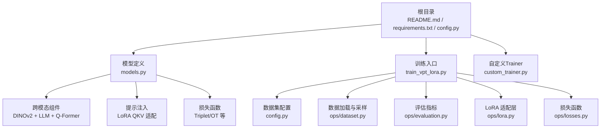
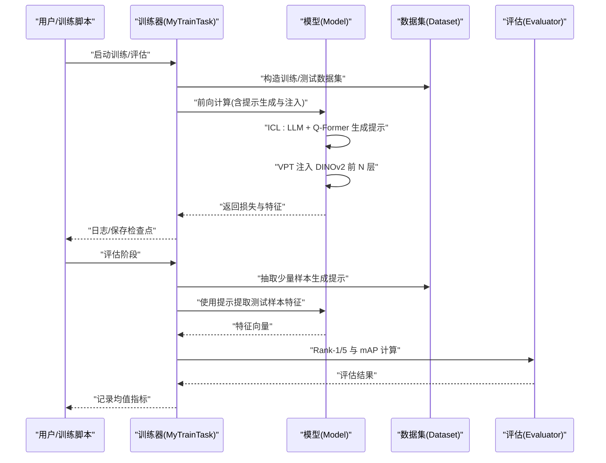
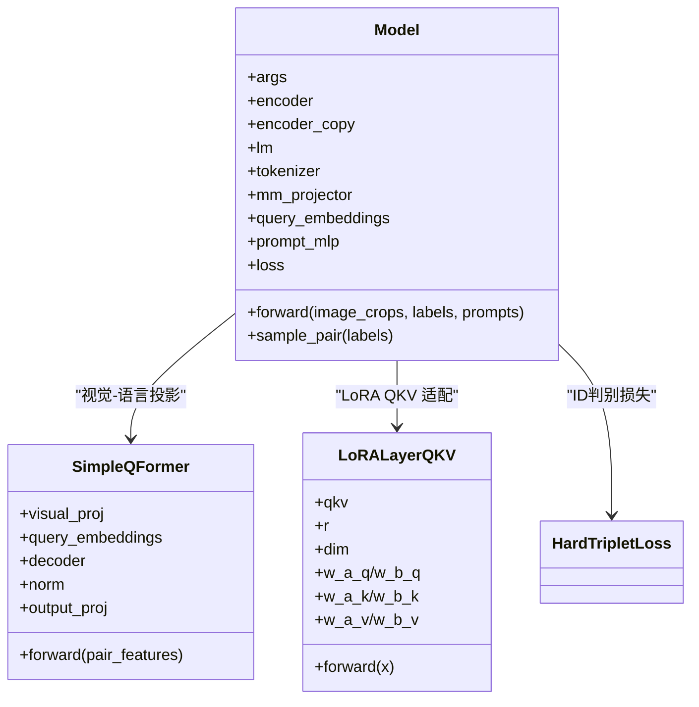
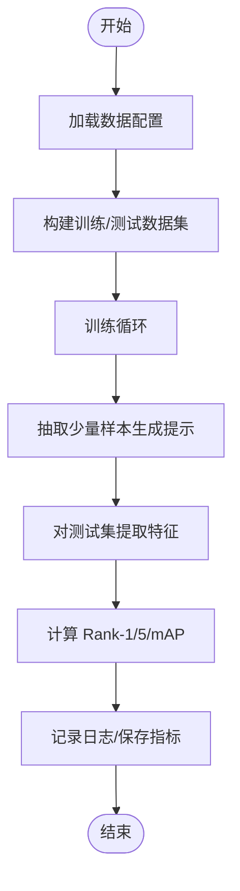
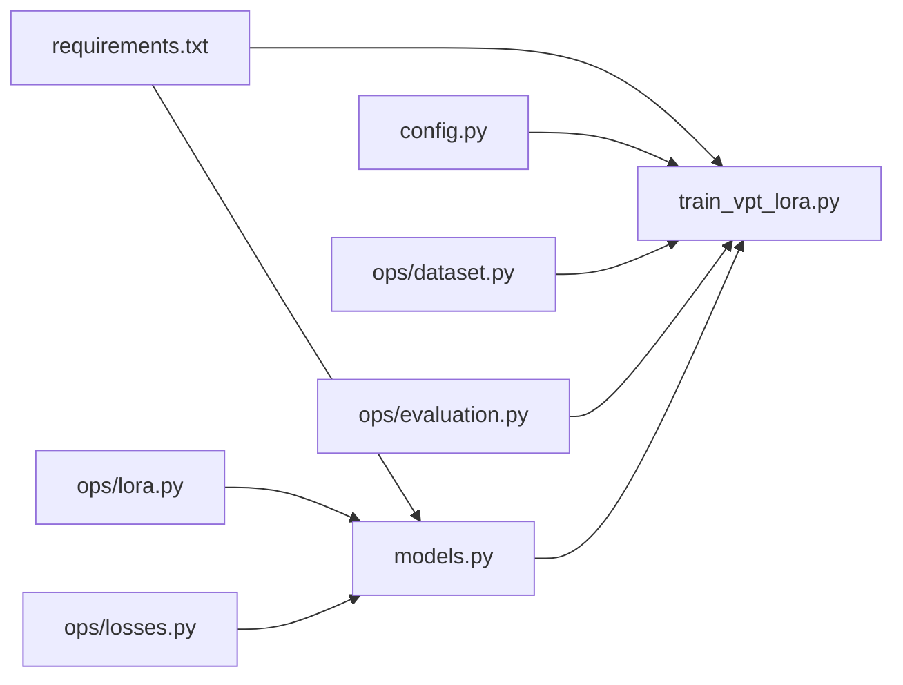

# 项目概述

<cite>
**本文引用的文件列表**
- [README.md](file://README.md)
- [requirements.txt](file://requirements.txt)
- [config.py](file://config.py)
- [models.py](file://models.py)
- [ops/lora.py](file://ops/lora.py)
- [ops/losses.py](file://ops/losses.py)
- [ops/dataset.py](file://ops/dataset.py)
- [ops/evaluation.py](file://ops/evaluation.py)
- [custom_trainer.py](file://custom_trainer.py)
- [train_vpt_lora.py](file://train_vpt_lora.py)
</cite>

## 目录
1. [简介](#简介)
2. [项目结构](#项目结构)
3. [核心组件](#核心组件)
4. [架构总览](#架构总览)
5. [详细组件分析](#详细组件分析)
6. [依赖关系分析](#依赖关系分析)
7. [性能考量](#性能考量)
8. [故障排查指南](#故障排查指南)
9. [结论](#结论)
10. [附录](#附录)

## 简介
VICP 是一个面向通用物体再识别（通用跨类别、少样本、无需参数微调）的框架，提出“视觉上下文提示”（Visual In-Context Prompting, VICP）。其核心思想是：通过语言模型（LLM）从少量正负示例中归纳语义身份规则，再由 DINOv2 视觉编码器基于动态视觉提示提取判别性特征，从而实现对未见过类别的直接泛化。项目提供了训练脚本、数据集配置、评估指标与工具，并在 ShopID10K 等基准上验证了跨类别泛化的有效性。

- 项目目标与创新点
  - 无需参数微调即可适配新类别，强调“零样本/少样本”泛化能力
  - 将 LLM 的语义推理与 DINOv2 的视觉先验结合，形成跨模态提示机制
  - 引入 ShopID10K 数据集用于评测跨域、多视角下的再识别性能

- 背景知识导航
  - 物体再识别（Re-ID）：在不同摄像头或视角下识别同一物体实例的任务
  - 自监督学习：通过无标注数据学习不变特征表示，减少对标注数据的依赖
  - 提示学习（Prompting）：通过自然语言或视觉提示引导模型聚焦关键判别特征

- 参考资料与开源许可
  - 论文与摘要链接见 README 中的论文条目
  - 开源许可：仓库未显式声明许可证；请遵循发布者声明与学术使用规范

**章节来源**
- [README.md](file://README.md#L1-L73)

## 项目结构
项目采用模块化组织，围绕“模型定义、训练流程、数据与评估、LoRA 适配、损失函数”五大方面展开：
- 根目录：训练入口、配置与说明
- ops 子目录：数据加载、评估指标、LoRA 适配层、损失函数
- models.py：核心模型（DINOv2 + LLM + Q-Former + 视觉提示）
- custom_trainer.py：基于 Transformers Trainer 的定制训练器
- train_vpt_lora.py：训练任务封装、数据划分与评估流程

**图表来源**
- [README.md](file://README.md#L1-L73)
- [config.py](file://config.py#L1-L16)
- [models.py](file://models.py#L1-L291)
- [ops/dataset.py](file://ops/dataset.py#L1-L178)
- [ops/evaluation.py](file://ops/evaluation.py#L1-L482)
- [ops/lora.py](file://ops/lora.py#L1-L99)
- [ops/losses.py](file://ops/losses.py#L1-L416)
- [custom_trainer.py](file://custom_trainer.py#L1-L156)
- [train_vpt_lora.py](file://train_vpt_lora.py#L1-L295)

**章节来源**
- [README.md](file://README.md#L1-L73)
- [requirements.txt](file://requirements.txt#L1-L2)
- [config.py](file://config.py#L1-L16)
- [models.py](file://models.py#L1-L291)
- [ops/dataset.py](file://ops/dataset.py#L1-L178)
- [ops/evaluation.py](file://ops/evaluation.py#L1-L482)
- [ops/lora.py](file://ops/lora.py#L1-L99)
- [ops/losses.py](file://ops/losses.py#L1-L416)
- [custom_trainer.py](file://custom_trainer.py#L1-L156)
- [train_vpt_lora.py](file://train_vpt_lora.py#L1-L295)

## 核心组件
- 模型主体（Model）
  - 使用 DINOv2 作为视觉编码器，冻结权重并仅对最后若干块进行低秩适配（LoRA QKV）
  - 使用 LLM（如 Qwen）进行语义推理，Q-Former 将两帧图像的视觉特征映射到 LLM 的词嵌入空间
  - 通过 ICL（In-Context Learning）生成提示，随后用可学习的视觉提示向量（VPT）动态注入 DINOv2 前 N 层
  - 结合三元组损失（HardTripletLoss）与 OT（Wasserstein Pairwise Alignment）损失提升判别性
- 训练入口（train_vpt_lora.py）
  - 定义训练参数、数据划分（按类别聚簇）、构建数据集与优化器
  - 在评估阶段，先从测试集抽取少量样本生成提示，再对全量测试样本进行特征提取与指标计算
- 数据与评估（ops/dataset.py, ops/evaluation.py）
  - 提供 ReID 评测所需的数据集接口（训练、验证、测试）
  - 实现 Rank-1/5 与 mAP 的高效计算，支持多类别平均指标
- LoRA 适配（ops/lora.py）
  - 对 DINOv2 的 QKV 线性层进行低秩分解，仅训练少量参数以注入提示
- 损失函数（ops/losses.py）
  - 提供多种对比学习与三元组损失，支撑判别性特征学习

**章节来源**
- [models.py](file://models.py#L81-L291)
- [train_vpt_lora.py](file://train_vpt_lora.py#L131-L295)
- [ops/dataset.py](file://ops/dataset.py#L1-L178)
- [ops/evaluation.py](file://ops/evaluation.py#L360-L482)
- [ops/lora.py](file://ops/lora.py#L1-L99)
- [ops/losses.py](file://ops/losses.py#L279-L416)

## 架构总览
VICP 的整体流程分为“提示生成阶段”和“特征提取与判别阶段”。提示生成阶段利用 LLM 与 Q-Former 从少量示例中学习身份规则，并生成视觉提示；特征提取阶段将提示注入 DINOv2，得到判别性特征，再通过损失函数进行优化。

**图表来源**
- [train_vpt_lora.py](file://train_vpt_lora.py#L145-L251)
- [models.py](file://models.py#L159-L269)
- [ops/evaluation.py](file://ops/evaluation.py#L360-L482)

## 详细组件分析

### 模型组件（Model）
- 组件职责
  - 冻结 DINOv2 主干，仅对最后若干块替换为 LoRA QKV 适配层
  - 使用 Q-Former 将两帧图像的视觉特征映射至 LLM 的嵌入空间
  - 通过 ICL 生成提示，再经可学习的提示映射层将提示投影回视觉特征维度，注入 DINOv2
  - 计算三元组损失与 OT 损失，融合 ICL 损失，形成多任务优化
- 关键流程
  - ICL 生成：从少量样本构造正负对，喂给 LLM 得到提示序列
  - 提示注入：将提示拼接进 DINOv2 的 token 序列，逐层影响注意力
  - 特征提取：归一化 CLS 特征作为最终判别特征
- 复杂度与性能
  - ICL 与提示注入引入额外计算，但仅在少量样本上执行，不影响主干推理
  - LoRA 参数量小，训练成本低，适合快速提示注入

**图表来源**
- [models.py](file://models.py#L81-L291)
- [ops/lora.py](file://ops/lora.py#L58-L99)
- [ops/losses.py](file://ops/losses.py#L279-L416)

**章节来源**
- [models.py](file://models.py#L81-L291)

### 训练与评估流程（train_vpt_lora.py）
- 训练参数与数据划分
  - 支持按类别聚簇划分训练/测试集合，便于跨类别评估
  - 使用自定义采样策略保证每批次来自同一身份的概率更高
- 评估流程
  - 先从测试集中抽取少量样本生成提示，再对全量测试样本提取特征
  - 使用翻转一致性增强与归一化，计算 Rank-1/5 与 mAP

**图表来源**
- [train_vpt_lora.py](file://train_vpt_lora.py#L145-L251)
- [ops/evaluation.py](file://ops/evaluation.py#L360-L482)

**章节来源**
- [train_vpt_lora.py](file://train_vpt_lora.py#L131-L295)
- [ops/evaluation.py](file://ops/evaluation.py#L360-L482)

### 数据与评估（ops/dataset.py, ops/evaluation.py）
- 数据集接口
  - 提供训练、验证、测试三类数据集，支持按身份采样与多视角读取
- 评估指标
  - Rank-1/5 与 mAP 的高效实现，支持多类别平均
  - 提供 ReID 与 Verification 的评估入口

**章节来源**
- [ops/dataset.py](file://ops/dataset.py#L1-L178)
- [ops/evaluation.py](file://ops/evaluation.py#L360-L482)

### LoRA 适配（ops/lora.py）
- 设计要点
  - 对 Q/K/V 分别进行低秩分解，仅训练少量参数
  - 通过加性方式叠加到原始 QKV 输出，保持主干稳定性
- 适用场景
  - 在不改动视觉主干的前提下，注入提示能力，降低训练成本

**章节来源**
- [ops/lora.py](file://ops/lora.py#L1-L99)

### 损失函数（ops/losses.py）
- 三元组损失（HardTripletLoss）
  - 选择每对中最难的正负样本组合，提升判别边界
- 其他损失
  - 提供 ArcFace、CosFace、AdaFace、SupConLoss 等，便于扩展

**章节来源**
- [ops/losses.py](file://ops/losses.py#L279-L416)

## 依赖关系分析
- 运行时依赖
  - PyTorch 与 Transformers 版本要求明确，确保与 DINOv2 与 LLM 的兼容性
- 模块间耦合
  - train_vpt_lora.py 依赖 config.py、ops/* 与 models.py
  - models.py 依赖 ops/lora.py 与 ops/losses.py
  - 评估模块独立于训练模块，通过统一的特征接口对接

**图表来源**
- [requirements.txt](file://requirements.txt#L1-L2)
- [train_vpt_lora.py](file://train_vpt_lora.py#L1-L295)
- [models.py](file://models.py#L1-L291)
- [config.py](file://config.py#L1-L16)
- [ops/dataset.py](file://ops/dataset.py#L1-L178)
- [ops/evaluation.py](file://ops/evaluation.py#L1-L482)
- [ops/lora.py](file://ops/lora.py#L1-L99)
- [ops/losses.py](file://ops/losses.py#L1-L416)

**章节来源**
- [requirements.txt](file://requirements.txt#L1-L2)
- [train_vpt_lora.py](file://train_vpt_lora.py#L1-L295)
- [models.py](file://models.py#L1-L291)

## 性能考量
- 训练效率
  - 仅对 DINOv2 最后若干块进行 LoRA 适配，显著降低训练参数量
  - ICL 仅在少量样本上执行，避免对主干推理造成明显开销
- 推理效率
  - 提示生成与注入发生在训练阶段；推理阶段仅需 DINOv2 + 归一化，计算开销较小
- 泛化能力
  - 通过 LLM 的语义推理与视觉提示的动态注入，实现对新类别的零/少样本泛化
- 评估指标
  - Rank-1/5 与 mAP 是 ReID 的标准指标，支持跨类别与跨域评测

[本节为通用性能讨论，不直接分析具体文件]

## 故障排查指南
- 训练报错：CUDA OOM 或显存不足
  - 降低 batch size 或启用梯度累积；检查是否正确设置 dtype
- 数据读取异常
  - 确认数据路径与 split 文件格式；检查类别名与文件夹命名一致性
- 指标异常偏低
  - 检查提示生成是否成功（ICL 损失应非零）；确认评估阶段是否正确使用提示
- 权重初始化问题
  - LoRA 初始化为小随机数，若收敛缓慢可适当调整学习率

**章节来源**
- [train_vpt_lora.py](file://train_vpt_lora.py#L188-L251)
- [ops/dataset.py](file://ops/dataset.py#L1-L178)
- [ops/evaluation.py](file://ops/evaluation.py#L360-L482)
- [ops/lora.py](file://ops/lora.py#L1-L99)

## 结论
VICP 通过“视觉上下文提示”的跨模态设计，将 LLM 的语义推理与 DINOv2 的视觉先验有机结合，在无需参数微调的情况下实现了对新类别的泛化。项目提供了完整的训练、评估与数据接口，具备良好的可复现性与扩展性。建议在实际部署中关注提示生成质量与特征归一化策略，以进一步提升跨类别再识别的鲁棒性。

[本节为总结性内容，不直接分析具体文件]

## 附录
- 安装与运行
  - 安装依赖后，参考 README 中的训练命令与数据集链接进行训练与评估
- 引用信息
  - 请在使用本代码或相关工作时引用 ICCV 2025 论文

**章节来源**
- [README.md](file://README.md#L1-L73)