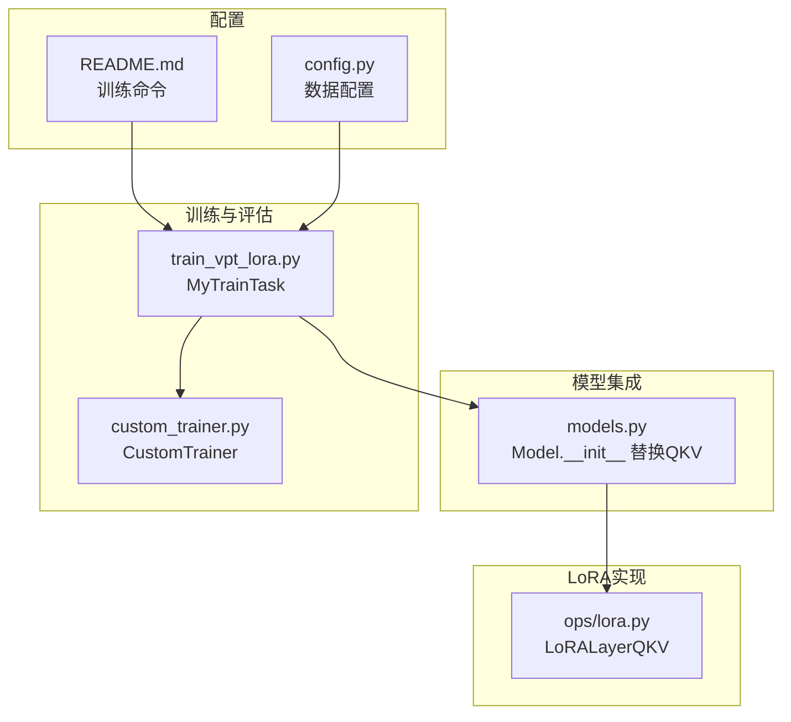
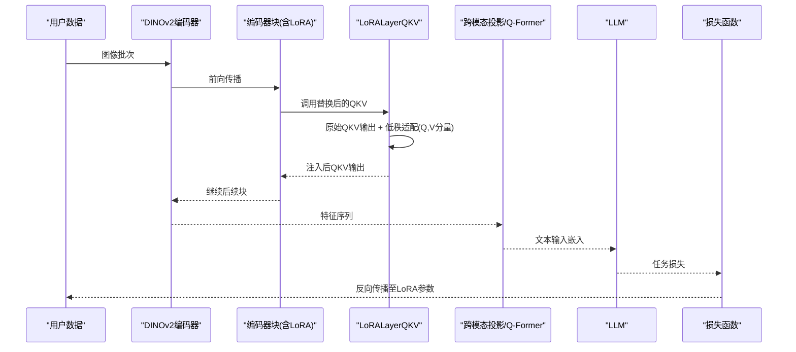
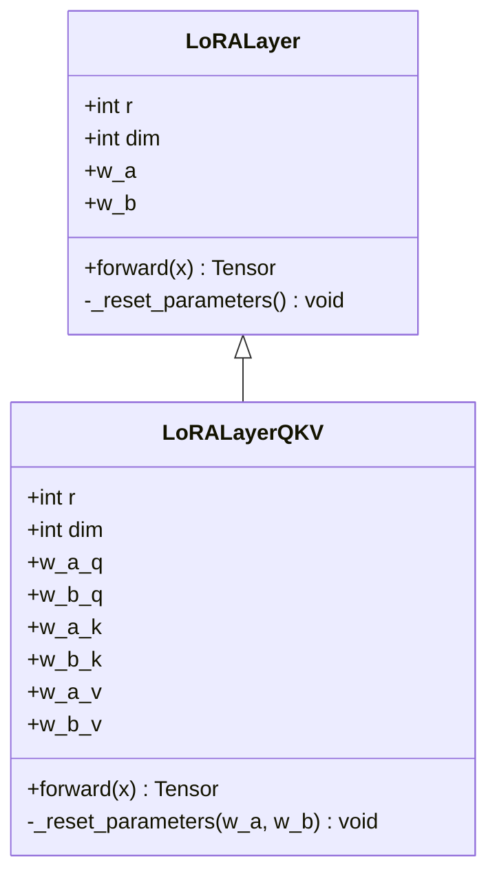
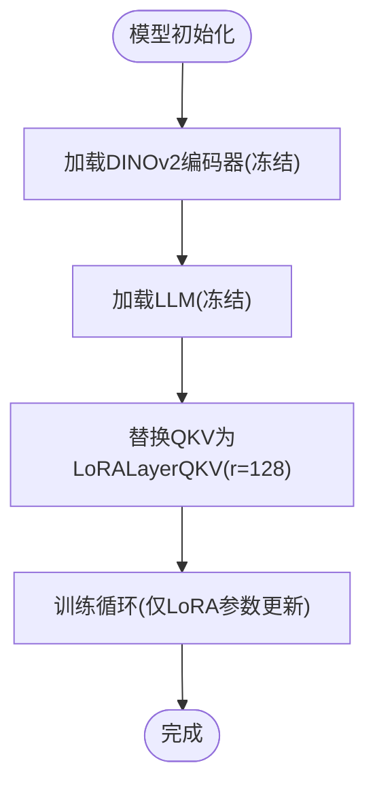
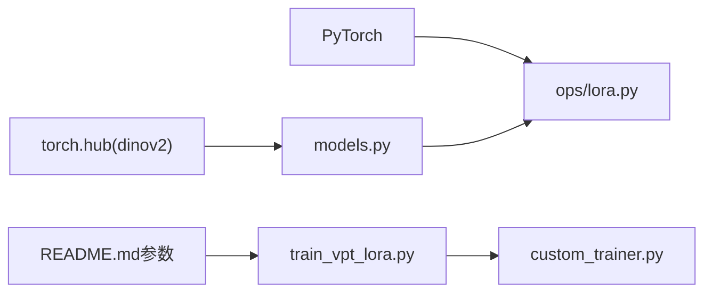

# LoRA微调技术

<cite>
**本文引用的文件列表**
- [ops/lora.py](file://ops/lora.py)
- [models.py](file://models.py)
- [README.md](file://README.md)
- [train_vpt_lora.py](file://train_vpt_lora.py)
- [custom_trainer.py](file://custom_trainer.py)
- [config.py](file://config.py)
</cite>

## 目录
1. [简介](#简介)
2. [项目结构](#项目结构)
3. [核心组件](#核心组件)
4. [架构总览](#架构总览)
5. [详细组件分析](#详细组件分析)
6. [依赖关系分析](#依赖关系分析)
7. [性能考量](#性能考量)
8. [故障排查指南](#故障排查指南)
9. [结论](#结论)
10. [附录](#附录)

## 简介
本文件围绕VICP框架中的LoRA（Low-Rank Adaptation）实现展开，重点解析ops/lora.py中LoRALayerQKV类如何对DINOv2的QKV注意力层进行低秩矩阵注入，说明w_a_q/w_b_q等可训练参数的初始化策略（Kaiming均匀初始化与零初始化），以及在前向传播中与原始QKV输出的叠加方式。同时结合models.py中的模型集成逻辑，阐述LoRA模块如何实现参数高效微调：仅更新少量适配层而冻结主干网络。文档还提供实际训练中LoRA秩（r）的选择建议、梯度更新路径分析，以及与其他微调方法（如全参数微调）的性能对比要点，并给出显存占用优化与训练稳定性技巧，最后引用README.md中的训练命令示例说明配置方式。

## 项目结构
- 核心LoRA实现位于ops/lora.py，定义了通用LoRA层与面向QKV分解的LoRA层。
- 模型集成与冻结主干逻辑位于models.py，其中通过替换DINOv2块中的QKV线性层为LoRALayerQKV实现低秩注入。
- 训练入口与参数配置位于train_vpt_lora.py与custom_trainer.py，README.md提供训练命令示例。
- 数据集与类别划分配置位于config.py。



图表来源
- [ops/lora.py](file://ops/lora.py#L58-L99)
- [models.py](file://models.py#L81-L120)
- [train_vpt_lora.py](file://train_vpt_lora.py#L145-L186)
- [custom_trainer.py](file://custom_trainer.py#L34-L103)
- [README.md](file://README.md#L24-L54)
- [config.py](file://config.py#L1-L16)

章节来源
- [ops/lora.py](file://ops/lora.py#L1-L99)
- [models.py](file://models.py#L81-L120)
- [README.md](file://README.md#L24-L54)

## 核心组件
- LoRALayerQKV：对DINOv2注意力Q/K/V三个投影分别注入低秩适配，使用独立的w_a_q/w_b_q、w_a_k/w_b_k、w_a_v/w_b_v参数，前向时仅对Q和V分量叠加低秩输出，K保持不变。
- 初始化策略：w_a采用Kaiming均匀初始化，w_b采用零初始化，保证初始时低秩分支为零映射，训练初期不改变原QKV输出。
- 冻结主干：在模型构建阶段，将DINOv2编码器与LLM均设置为eval并requires_grad_(False)，仅LoRA适配层参与训练。

章节来源
- [ops/lora.py](file://ops/lora.py#L58-L99)
- [models.py](file://models.py#L81-L120)

## 架构总览
下图展示了LoRA在VICP中的端到端工作流：图像输入经DINOv2编码器提取特征，其中最后若干块的QKV被LoRALayerQKV替换；随后通过跨模态投影与提示生成，最终用于下游任务损失计算。



图表来源
- [models.py](file://models.py#L81-L120)
- [ops/lora.py](file://ops/lora.py#L58-L99)

## 详细组件分析

### LoRALayerQKV类实现与前向叠加
- 参数结构：
  - w_a_q/w_b_q：Q分支低秩适配
  - w_a_k/w_b_k：K分支低秩适配
  - w_a_v/w_b_v：V分支低秩适配
- 初始化策略：
  - w_a使用Kaiming均匀初始化，w_b使用零初始化，确保初始阶段低秩分支为恒等扰动或零映射。
- 前向叠加：
  - 先计算原始QKV输出，再分别计算各分支低秩输出，最后仅将低秩输出加到Q和V分量上，K分量保持不变。



图表来源
- [ops/lora.py](file://ops/lora.py#L58-L99)

章节来源
- [ops/lora.py](file://ops/lora.py#L58-L99)

### 模型集成与参数高效微调
- 主干冻结：DINOv2与LLM在构造时均设置为eval且requires_grad_(False)，确保主干参数不参与训练。
- LoRA注入：遍历DINOv2最后若干块，将block.attn.qkv替换为LoRALayerQKV(r=128)，仅该适配层参数参与更新。
- 结果：显著减少可训练参数规模，实现参数高效微调。



图表来源
- [models.py](file://models.py#L81-L120)

章节来源
- [models.py](file://models.py#L81-L120)

### 训练流程与损失
- 训练入口：train_vpt_lora.py中的MyTrainTask负责构建数据集、模型、优化器与自定义Trainer。
- 自定义Trainer：custom_trainer.py扩展了标准Trainer，支持记录额外损失项并在日志中汇总。
- 损失构成：模型返回的多任务损失（如ID损失、OT损失、ICL损失等）由Trainer统一处理。

```mermaid
sequenceDiagram
participant CLI as "命令行"
participant TR as "MyTrainTask"
participant MD as "Model"
participant CT as "CustomTrainer"
participant OPT as "Adam优化器"
CLI->>TR : 解析训练参数
TR->>MD : 构建模型(冻结主干+注入LoRA)
TR->>OPT : 创建优化器(仅LoRA参数)
TR->>CT : 初始化自定义Trainer
CT->>CT : 训练循环(记录额外损失)
CT-->>CLI : 日志与检查点
```

图表来源
- [train_vpt_lora.py](file://train_vpt_lora.py#L145-L186)
- [custom_trainer.py](file://custom_trainer.py#L34-L103)

章节来源
- [train_vpt_lora.py](file://train_vpt_lora.py#L145-L186)
- [custom_trainer.py](file://custom_trainer.py#L34-L103)

## 依赖关系分析
- LoRA实现依赖PyTorch的nn.Linear与初始化工具，LoRALayerQKV在forward中直接叠加低秩输出到Q/V分量。
- 模型集成依赖torch.hub加载DINOv2，并通过替换QKV实现LoRA注入。
- 训练配置通过README.md中的命令行参数传入，train_vpt_lora.py读取TrainingArguments并构建优化器。



图表来源
- [ops/lora.py](file://ops/lora.py#L1-L99)
- [models.py](file://models.py#L81-L120)
- [README.md](file://README.md#L24-L54)
- [train_vpt_lora.py](file://train_vpt_lora.py#L145-L186)
- [custom_trainer.py](file://custom_trainer.py#L34-L103)

章节来源
- [ops/lora.py](file://ops/lora.py#L1-L99)
- [models.py](file://models.py#L81-L120)
- [README.md](file://README.md#L24-L54)
- [train_vpt_lora.py](file://train_vpt_lora.py#L145-L186)
- [custom_trainer.py](file://custom_trainer.py#L34-L103)

## 性能考量
- 秩选择建议：
  - 在当前实现中，r=128用于DINOv2的LoRA注入。通常可从较小值（如32/64）开始，逐步增大以观察验证集性能提升趋势，避免过拟合与显存压力。
  - 对于更大模型或更高分辨率输入，可适当提高r，但需权衡显存与收敛速度。
- 显存优化：
  - 使用混合精度训练（README.md中启用fp16），可显著降低显存占用。
  - 控制梯度累积步数与批大小，避免单卡OOM。
  - 仅保留LoRA适配层的参数，主干冻结，可将可训练参数规模控制在百万级以内。
- 训练稳定性：
  - 初始学习率不宜过高，结合常数学习率调度（README.md中lr_scheduler_type=constant）。
  - 若出现不稳定，可尝试减小学习率或增加权重衰减（weight_decay）。
  - 合理设置最大梯度范数（max_grad_norm），防止爆炸梯度。
- 与其他微调方法对比：
  - 全参数微调：参数量大、显存占用高、收敛慢，适合资源充足场景；LoRA微调：参数量小、显存占用低、收敛快，适合资源受限与快速迭代。
  - 在相同数据与任务上，LoRA可在多数情况下达到接近全参数微调的性能，同时具备更好的泛化与迁移能力。

章节来源
- [models.py](file://models.py#L81-L120)
- [README.md](file://README.md#L24-L54)
- [train_vpt_lora.py](file://train_vpt_lora.py#L145-L186)

## 故障排查指南
- LoRA未生效：
  - 确认是否正确替换QKV为LoRALayerQKV，且r设置合理。
  - 检查模型是否冻结主干参数，确保只有LoRA参数参与更新。
- 显存不足：
  - 减小批大小或增大梯度累积步数；开启混合精度；关闭不必要的日志与调试。
- 训练不收敛：
  - 降低学习率；检查损失函数与正则项；确认数据增强与采样策略有效。
- 训练不稳定：
  - 设置合理的max_grad_norm；检查学习率调度；必要时启用梯度裁剪。

章节来源
- [models.py](file://models.py#L81-L120)
- [README.md](file://README.md#L24-L54)
- [train_vpt_lora.py](file://train_vpt_lora.py#L145-L186)
- [custom_trainer.py](file://custom_trainer.py#L34-L103)

## 结论
LoRALayerQKV通过在DINOv2注意力Q/V分量上注入低秩适配，实现了参数高效的微调方案。配合主干冻结与混合精度训练，可在有限资源下快速收敛并取得良好性能。通过合理选择秩r、学习率与正则项，LoRA在大多数场景下可替代全参数微调，兼顾效率与效果。

## 附录
- 训练命令示例（来自README.md）：
  - 输出目录、日志策略、数据加载器参数、梯度裁剪、保存策略、评估策略、最大步数、混合精度、批量大小、学习率、权重衰减、集群索引、输出目录等均可通过命令行参数配置。
- 数据配置：
  - config.py定义了数据集根目录、类别划分与训练集拆分，便于多类别训练与交叉验证。

章节来源
- [README.md](file://README.md#L24-L54)
- [config.py](file://config.py#L1-L16)