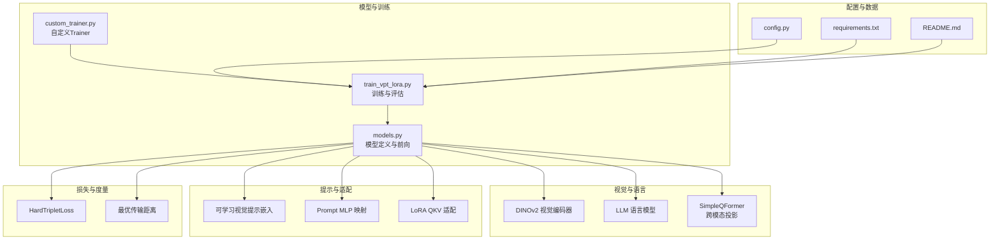
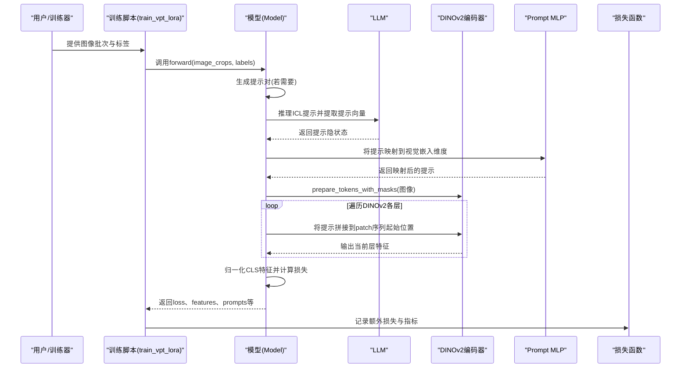
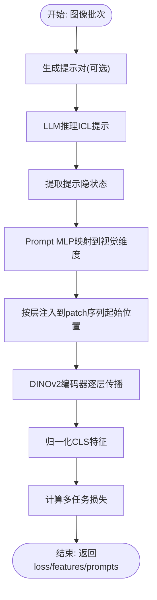
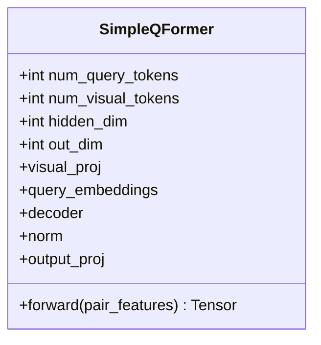
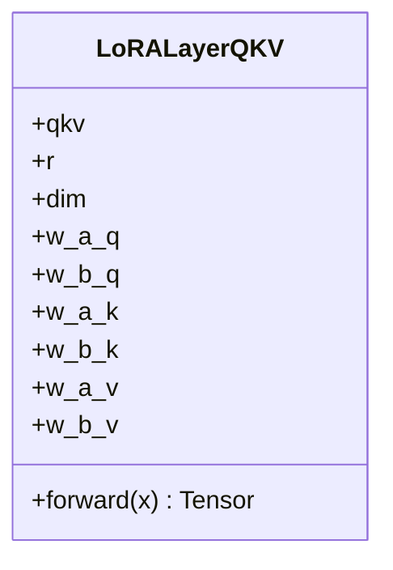
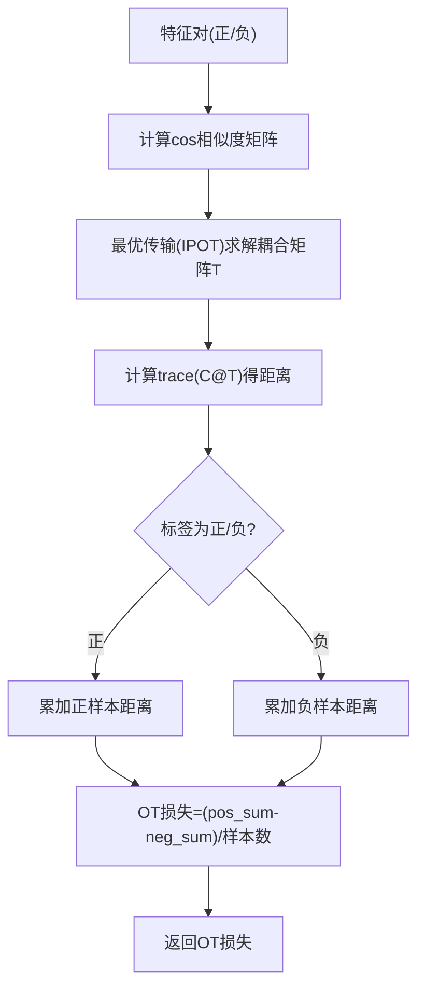
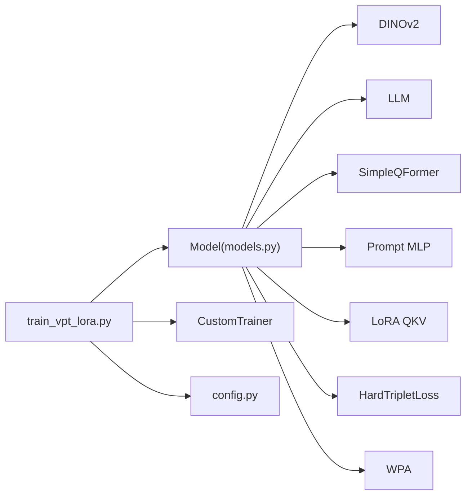

# VPT提示学习机制

<cite>
**本文引用的文件列表**
- [models.py](file://models.py)
- [train_vpt_lora.py](file://train_vpt_lora.py)
- [ops/lora.py](file://ops/lora.py)
- [ops/wpa.py](file://ops/wpa.py)
- [ops/losses.py](file://ops/losses.py)
- [custom_trainer.py](file://custom_trainer.py)
- [README.md](file://README.md)
- [config.py](file://config.py)
- [requirements.txt](file://requirements.txt)
</cite>

## 目录
1. [简介](#简介)
2. [项目结构](#项目结构)
3. [核心组件](#核心组件)
4. [架构总览](#架构总览)
5. [详细组件分析](#详细组件分析)
6. [依赖关系分析](#依赖关系分析)
7. [性能考量](#性能考量)
8. [故障排查指南](#故障排查指南)
9. [结论](#结论)
10. [附录](#附录)

## 简介
本文件围绕VICP中的视觉提示调优（VPT, Visual Prompt Tuning）机制展开，系统阐述可学习视觉提示嵌入（learnable prompt embeddings）如何在模型前向过程中注入到DINOv2的输入序列中，解释提示向量的初始化方式、优化过程以及在不同任务场景下的动态调整机制。结合模型架构，说明提示嵌入与图像patch嵌入的拼接方式及其在Transformer编码器中的传播路径；讨论VPT如何通过少量可学习参数引导模型关注身份敏感特征，提升对新类别（未见过类别）的泛化能力；并给出提示数量与位置（浅层/深层）的配置建议及对训练效率与识别精度的影响分析。

## 项目结构
- 核心模型与训练入口：
  - models.py：定义了融合DINOv2视觉编码器、LLM语义推理与可学习提示的完整模型结构。
  - train_vpt_lora.py：训练脚本，包含数据集、训练参数、评估流程与提示动态生成逻辑。
- 运维与辅助模块：
  - ops/lora.py：LoRA适配层，用于在DINOv2注意力子层中注入低秩参数以增强可训练性。
  - ops/wpa.py：最优传输距离计算，用于约束patch级特征分布一致性。
  - ops/losses.py：三元组损失（HardTripletLoss），用于身份判别特征学习。
  - custom_trainer.py：自定义训练器，支持额外损失日志与分布式训练。
- 配置与文档：
  - config.py：数据集划分与根目录配置。
  - README.md：项目背景、框架图与训练命令。
  - requirements.txt：依赖版本约束。

图表来源
- [models.py](file://models.py#L81-L269)
- [train_vpt_lora.py](file://train_vpt_lora.py#L131-L295)
- [ops/lora.py](file://ops/lora.py#L58-L99)
- [ops/wpa.py](file://ops/wpa.py#L86-L110)
- [ops/losses.py](file://ops/losses.py#L279-L348)
- [custom_trainer.py](file://custom_trainer.py#L34-L156)
- [config.py](file://config.py#L1-L16)
- [README.md](file://README.md#L1-L73)
- [requirements.txt](file://requirements.txt#L1-L2)

章节来源
- [models.py](file://models.py#L81-L269)
- [train_vpt_lora.py](file://train_vpt_lora.py#L131-L295)
- [README.md](file://README.md#L1-L73)

## 核心组件
- 可学习视觉提示嵌入（VPT）：
  - 在模型初始化时创建形状为“层数×提示数×隐藏维度”的可学习参数，作为每层Transformer块的动态提示。
  - 通过LLM的输出隐状态提取提示向量，并经由Prompt MLP映射到视觉嵌入维度，再按层注入到DINOv2的输入序列中。
- 提示注入策略：
  - 将提示向量与CLS token后的首个patch拼接，插入到原始patch序列的起始位置，随后进入对应层的Transformer块。
- 跨模态投影（SimpleQFormer）：
  - 将两路视觉token对经线性投影后，使用可学习查询与交叉注意力聚合，得到与LLM隐藏维度一致的表示，用于下游任务。
- LoRA适配：
  - 对DINOv2最后若干层的QKV进行低秩适配，降低参数规模并提升微调效率。
- 损失函数：
  - 三元组损失（HardTripletLoss）用于身份判别特征学习；
  - 最优传输距离（WPA）用于约束patch级特征分布一致性，提升泛化。

章节来源
- [models.py](file://models.py#L119-L124)
- [models.py](file://models.py#L221-L241)
- [ops/lora.py](file://ops/lora.py#L58-L99)
- [ops/losses.py](file://ops/losses.py#L279-L348)
- [ops/wpa.py](file://ops/wpa.py#L86-L110)

## 架构总览
下图展示了VPT在模型前向过程中的关键步骤：从图像输入到提示生成、提示注入、视觉编码与特征归一化，再到损失计算与日志记录。

图表来源
- [models.py](file://models.py#L159-L269)
- [train_vpt_lora.py](file://train_vpt_lora.py#L188-L251)

## 详细组件分析

### 可学习视觉提示嵌入（VPT）与提示注入
- 初始化方式：
  - 在模型初始化阶段创建形状为“层数×提示数×隐藏维度”的可学习参数，用于在不同层注入动态提示。
  - 提示向量通过LLM的输出隐状态提取，并经Prompt MLP映射到视觉嵌入维度，确保与DINOv2的patch嵌入维度匹配。
- 注入位置与方式：
  - 在进入最后一段Transformer块之前，将提示向量拼接到原始patch序列的起始位置（紧随CLS token之后），形成新的序列输入。
  - 每一层的提示向量独立，允许在不同深度上引导模型关注不同的身份敏感特征。
- 动态调整机制：
  - 训练期间，提示向量通过反向传播进行优化；同时，提示向量会根据批次随机选择，以增强泛化。
  - 训练脚本在评估阶段固定提示，通过前后翻转图像增强特征稳定性。

图表来源
- [models.py](file://models.py#L159-L269)
- [models.py](file://models.py#L221-L241)

章节来源
- [models.py](file://models.py#L119-L124)
- [models.py](file://models.py#L221-L241)
- [train_vpt_lora.py](file://train_vpt_lora.py#L188-L251)

### SimpleQFormer跨模态投影
- 输入：两路视觉token对（每路2个token），经线性投影至Q-Former隐藏维度。
- 结构：可学习查询与交叉注意力，输出形状为(B, num_id_tokens, out_dim)。
- 作用：将视觉信息转换为与LLM一致的语义空间，便于后续ICL提示生成与对齐。

图表来源
- [models.py](file://models.py#L8-L80)

章节来源
- [models.py](file://models.py#L8-L80)

### LoRA适配与参数高效微调
- 对DINOv2最后若干层的QKV子层进行低秩适配，仅训练少量参数，显著降低计算与内存开销。
- 通过在Q与V分量添加低秩增量，保持主干网络预训练权重稳定。

图表来源
- [ops/lora.py](file://ops/lora.py#L58-L99)

章节来源
- [ops/lora.py](file://ops/lora.py#L58-L99)
- [models.py](file://models.py#L93-L100)

### 损失函数与度量
- HardTripletLoss：基于“最困难正样本”与“最困难负样本”的三元组损失，强化身份判别特征。
- WPA（最优传输距离）：通过最优传输衡量两组patch特征分布差异，约束同一身份样本的特征集中，不同身份样本的特征分离。
- 训练脚本中记录额外损失与指标，便于监控训练过程。

图表来源
- [ops/wpa.py](file://ops/wpa.py#L66-L110)
- [ops/losses.py](file://ops/losses.py#L279-L348)

章节来源
- [ops/wpa.py](file://ops/wpa.py#L86-L110)
- [ops/losses.py](file://ops/losses.py#L279-L348)
- [custom_trainer.py](file://custom_trainer.py#L34-L103)

## 依赖关系分析
- 模型依赖：
  - DINOv2视觉编码器：提供图像patch嵌入与Transformer编码链。
  - LLM：提供语义推理能力与提示生成，其嵌入维度决定提示向量的输出维度。
  - LoRA适配：仅对部分注意力子层进行参数注入，降低训练成本。
- 数据与配置：
  - 训练脚本通过参数类传递提示数量、ICL样本数、权重等超参数。
  - 评估阶段固定提示，采用前后翻转增强特征鲁棒性。

图表来源
- [models.py](file://models.py#L81-L269)
- [train_vpt_lora.py](file://train_vpt_lora.py#L131-L295)
- [custom_trainer.py](file://custom_trainer.py#L34-L156)
- [config.py](file://config.py#L1-L16)

章节来源
- [models.py](file://models.py#L81-L269)
- [train_vpt_lora.py](file://train_vpt_lora.py#L131-L295)
- [custom_trainer.py](file://custom_trainer.py#L34-L156)
- [config.py](file://config.py#L1-L16)

## 性能考量
- 训练效率：
  - 使用LoRA适配仅训练少量参数，显著降低显存占用与计算开销。
  - 通过Prompt MLP将提示映射到视觉维度，避免直接修改主干网络结构。
  - ICL提示生成与提示注入在前向过程中完成，不引入额外推理延迟。
- 识别精度：
  - VPT通过少量可学习参数引导模型关注身份敏感特征，有助于在未见类别上取得更好泛化。
  - 评估阶段固定提示并采用数据增强（如前后翻转）提升特征稳定性。
- 超参数影响：
  - 提示数量（num_vpt_tokens）与层数（num_layers）共同决定提示的表达能力与注入深度。
  - ICL样本数（num_icl_samples）与批次大小（num_icl_bs）影响提示质量与稳定性。
  - 三元组损失与WPA损失的权重平衡影响身份判别与分布一致性之间的权衡。

[本节为通用性能讨论，无需特定文件引用]

## 故障排查指南
- 训练不稳定或梯度异常：
  - 检查LoRA秩（r）设置是否过大导致数值不稳定；适当减小秩或增大正则。
  - 关注HardTripletLoss的标签分布，避免极端类别不平衡导致的NaN。
- 提示质量差或收敛慢：
  - 增大ICL样本数与批次大小，提高提示生成的稳定性。
  - 调整提示数量与层数，避免过多提示导致信息冗余。
- 评估指标异常：
  - 确认评估阶段固定提示且前后翻转增强已启用。
  - 检查数据加载与归一化流程，确保特征归一化一致。

章节来源
- [ops/lora.py](file://ops/lora.py#L58-L99)
- [ops/losses.py](file://ops/losses.py#L279-L348)
- [train_vpt_lora.py](file://train_vpt_lora.py#L188-L251)

## 结论
VICP通过VPT机制，在不修改DINOv2主干的前提下，利用少量可学习提示向量引导模型关注身份敏感特征，结合LLM的语义推理能力与跨模态投影，实现了对未见类别的良好泛化。提示向量在不同层注入，既保留了浅层的全局上下文，又增强了深层的身份判别能力。通过LoRA适配与多任务损失，系统在训练效率与识别精度之间取得了良好平衡。合理配置提示数量与位置，可在保证训练效率的同时进一步提升识别性能。

[本节为总结性内容，无需特定文件引用]

## 附录

### 参数与配置建议
- 提示数量（num_vpt_tokens）：
  - 建议从较小值（如2–8）开始，逐步增加观察验证集表现；过大的提示数量可能导致过拟合与训练不稳定。
- 层数位置（浅层/深层）：
  - 浅层注入更利于全局上下文引导，深层注入更利于身份特征细化；可根据任务复杂度选择1–3层注入。
- ICL相关：
  - num_icl_samples与num_icl_bs应与批次规模匹配，确保提示生成稳定；权重（icl_loss_weight）可按需调节。
- 损失权重：
  - id_loss与ot_loss权重需协同调优，避免某一损失主导训练方向。

章节来源
- [train_vpt_lora.py](file://train_vpt_lora.py#L131-L143)
- [models.py](file://models.py#L221-L241)