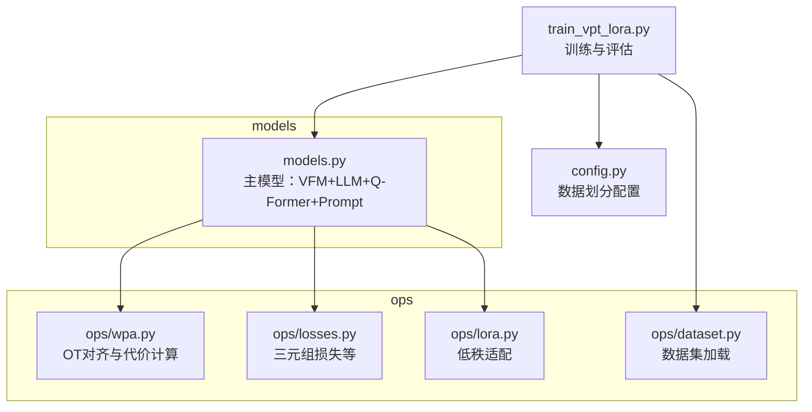
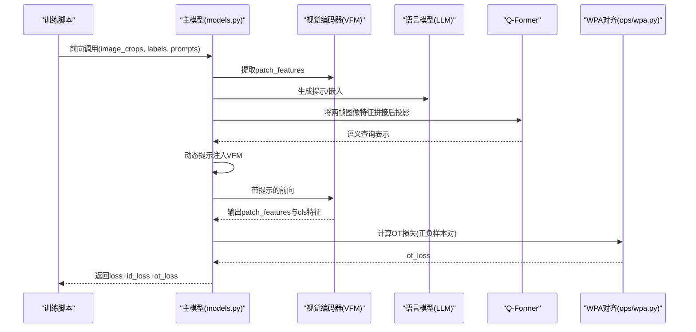
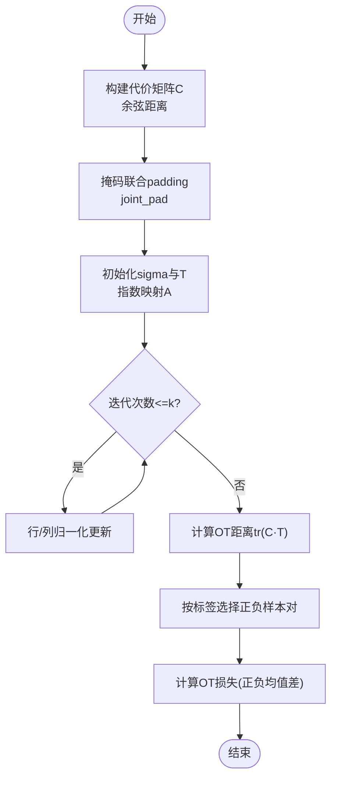
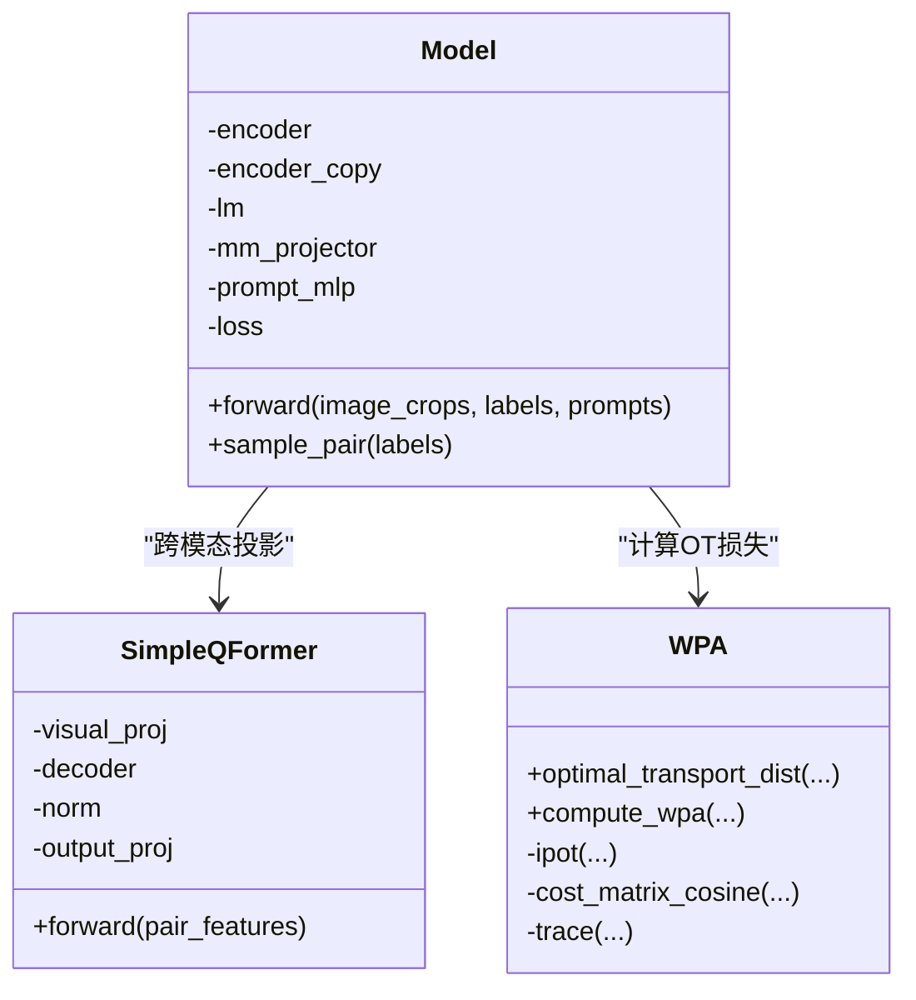
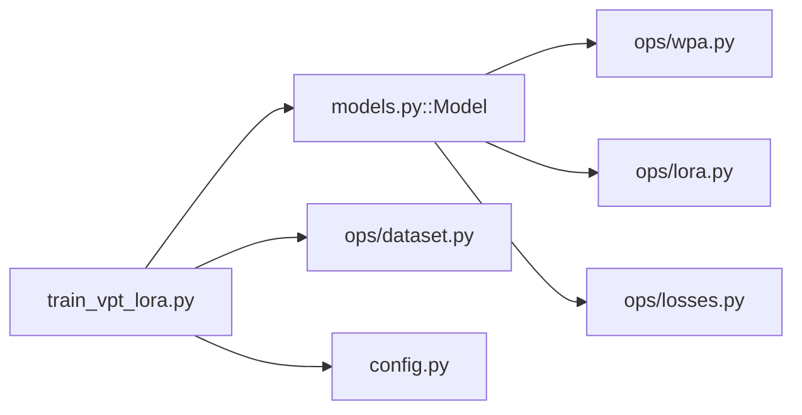

# WPA对齐机制

<cite>
**本文引用的文件列表**
- [ops/wpa.py](file://ops/wpa.py)
- [models.py](file://models.py)
- [ops/losses.py](file://ops/losses.py)
- [train_vpt_lora.py](file://train_vpt_lora.py)
- [ops/lora.py](file://ops/lora.py)
- [ops/dataset.py](file://ops/dataset.py)
- [README.md](file://README.md)
- [config.py](file://config.py)
</cite>

## 目录
1. [简介](#简介)
2. [项目结构](#项目结构)
3. [核心组件](#核心组件)
4. [架构总览](#架构总览)
5. [详细组件分析](#详细组件分析)
6. [依赖分析](#依赖分析)
7. [性能考量](#性能考量)
8. [故障排查指南](#故障排查指南)
9. [结论](#结论)
10. [附录](#附录)

## 简介
本文件围绕WPA（Word-Patch Alignment，词-补丁对齐）模块展开，系统阐述其如何通过语义概念（来自LLM）与图像局部区域（来自VFM）之间的最优传输（Optimal Transport, OT）建立细粒度对齐关系。文档重点解释：
- ops/wpa.py中对齐算法的数学建模：代价矩阵构建、Sinkhorn迭代求解、以及对齐权重的反向传播机制。
- 结合models.py中的跨模态融合逻辑，说明对齐结果如何指导视觉特征提取，强化身份判别性特征的学习。
- 探讨WPA在减少标注依赖、提升跨域泛化方面的实际价值。
- 提供调试对齐热力图的可视化方法与典型应用场景示例。

## 项目结构
该仓库采用“模块化+分层”的组织方式：
- ops：包含优化传输、损失函数、LoRA适配、数据集等工具模块。
- models.py：定义主模型结构，集成LLM与VFM，实现跨模态提示与对齐损失。
- 训练与评估脚本：train_vpt_lora.py负责训练、验证与指标计算。
- 配置与数据：config.py提供数据划分配置；ops/dataset.py提供数据加载器。

图表来源
- [ops/wpa.py](file://ops/wpa.py#L1-L110)
- [models.py](file://models.py#L1-L291)
- [ops/losses.py](file://ops/losses.py#L1-L416)
- [ops/lora.py](file://ops/lora.py#L1-L99)
- [ops/dataset.py](file://ops/dataset.py#L1-L178)
- [train_vpt_lora.py](file://train_vpt_lora.py#L1-L295)
- [config.py](file://config.py#L1-L16)

章节来源
- [README.md](file://README.md#L1-L73)
- [config.py](file://config.py#L1-L16)

## 核心组件
- WPA对齐模块（ops/wpa.py）
  - 代价矩阵构建：使用余弦距离衡量语义嵌入与图像补丁嵌入之间的相似度。
  - Sinkhorn迭代求解：通过指数映射与行/列归一化实现OT双随机矩阵的迭代收敛。
  - 对齐权重与损失：基于OT距离构造正负样本对的对比学习损失，用于引导视觉特征学习。
- 主模型（models.py）
  - 通过LLM生成语义提示，经Q-Former聚合为可与视觉特征对齐的语义表征。
  - 将动态视觉提示注入VFM的注意力中，得到更强调身份判别性的视觉特征。
  - 在有标签时，调用WPA计算OT损失，与ID损失共同优化。

章节来源
- [ops/wpa.py](file://ops/wpa.py#L1-L110)
- [models.py](file://models.py#L1-L291)

## 架构总览
下图展示了从输入图像到对齐损失的端到端流程，以及与主模型的耦合点。

图表来源
- [models.py](file://models.py#L160-L269)
- [ops/wpa.py](file://ops/wpa.py#L86-L110)

## 详细组件分析

### WPA对齐算法的数学建模与实现
- 代价矩阵构建
  - 使用余弦距离衡量语义嵌入与图像补丁嵌入之间的相似度，形成代价矩阵C。
  - 支持批处理，维度为[B, Lx, Ly]，其中Lx、Ly分别为语义序列长度与图像补丁数。
- Sinkhorn迭代求解（指数OT）
  - 通过指数映射A = exp(-C/beta)构造初始转移矩阵。
  - 迭代更新行/列归一化因子，使T趋近双随机矩阵。
  - 支持padding掩码，保证对齐仅发生在有效位置。
- OT距离与损失
  - 距离定义为tr(C·T)，即代价与最优传输权重的内积。
  - 正负样本对分别计算平均距离差，作为对比学习损失项。

图表来源
- [ops/wpa.py](file://ops/wpa.py#L12-L110)

章节来源
- [ops/wpa.py](file://ops/wpa.py#L12-L110)

### 反向传播与梯度流
- 关键点
  - 代价矩阵C由语义嵌入与图像嵌入的余弦距离构成，梯度可回传至两者。
  - Sinkhorn迭代过程中，T的梯度可通过链式法则回传至C，从而驱动C的参数更新。
  - 在compute_wpa中，对C进行detach以减少计算开销，但对T的detach仍允许梯度回传至输入嵌入。
- 实践建议
  - 若需要更稳定的梯度，可在代价计算或Sinkhorn迭代中加入数值稳定项（如eps）。
  - 对beta、迭代次数、k等超参数进行网格搜索，平衡收敛速度与对齐质量。

章节来源
- [ops/wpa.py](file://ops/wpa.py#L34-L110)

### 跨模态融合与对齐指导的视觉特征提取
- 融合路径
  - 图像裁剪经VFM提取patch_features与cls特征。
  - 通过LLM与Q-Former将两帧图像的视觉特征拼接后映射为语义查询表示。
  - 将语义查询作为动态提示注入VFM的注意力中，得到增强的身份判别性特征。
- 对齐指导
  - 通过对齐损失约束patch_features与语义查询的一致性，促使视觉特征更聚焦于身份敏感区域。
  - 在无标签场景，也可通过自监督策略（如triplet loss）与OT损失协同优化。

图表来源
- [models.py](file://models.py#L81-L269)
- [ops/wpa.py](file://ops/wpa.py#L12-L110)

章节来源
- [models.py](file://models.py#L160-L269)

### 典型应用场景与可视化调试
- 应用场景
  - 跨域商品重识别：在未见过类别上，通过少量示例（正/负对）引导VFM提取身份判别特征。
  - 减少标注依赖：OT损失与ID损失共同优化，降低对大规模标注的依赖。
- 可视化方法
  - 对齐热力图：将T（最优传输权重）在语义序列与图像补丁之间进行可视化，观察对齐强度分布。
  - 特征散点图：对同一类别的patch_features进行降维（如PCA/T-SNE），观察聚类与分离情况。
  - 损失曲线：记录ot_loss与id_loss随训练步数的变化，评估对齐效果与收敛稳定性。

章节来源
- [models.py](file://models.py#L248-L269)
- [ops/wpa.py](file://ops/wpa.py#L86-L110)

## 依赖分析
- 组件耦合
  - 主模型依赖WPA模块计算OT损失；同时依赖LoRA模块对VFM进行轻量参数调整。
  - 训练脚本依赖主模型输出的多任务损失，进行端到端优化。
- 外部依赖
  - VFM（DINOv2）与LLM（Qwen系列）作为骨干网络，提供强大的预训练先验。
  - 数据集模块提供多视图与跨域测试支持。

图表来源
- [train_vpt_lora.py](file://train_vpt_lora.py#L145-L295)
- [models.py](file://models.py#L81-L269)
- [ops/wpa.py](file://ops/wpa.py#L1-L110)
- [ops/lora.py](file://ops/lora.py#L1-L99)
- [ops/losses.py](file://ops/losses.py#L279-L348)
- [ops/dataset.py](file://ops/dataset.py#L1-L178)
- [config.py](file://config.py#L1-L16)

章节来源
- [train_vpt_lora.py](file://train_vpt_lora.py#L145-L295)
- [models.py](file://models.py#L81-L269)

## 性能考量
- 计算复杂度
  - 代价矩阵构建：O(B·Lx·Ly·D)（D为嵌入维度）。
  - Sinkhorn迭代：每轮O(B·Lx·Ly)，整体受迭代次数影响。
- 内存与显存
  - 对齐权重T的存储为O(B·Lx·Ly)，在高分辨率图像或长序列时需控制Lx、Ly规模。
- 数值稳定性
  - 在代价矩阵与指数映射中加入小常数以避免除零与溢出。
  - 对padding位置进行掩码，避免无效对齐干扰。

[本节为通用性能讨论，不直接分析具体文件]

## 故障排查指南
- 对齐权重全零或NaN
  - 检查padding掩码是否正确设置，joint_pad是否覆盖了无效位置。
  - 检查beta与迭代次数是否过大/过小，必要时调整超参数。
- OT损失不下降或震荡
  - 观察正负样本对比例是否均衡，适当增加采样规模或调整权重。
  - 检查语义嵌入与图像嵌入的尺度一致性，必要时归一化。
- 训练不稳定
  - 降低ot_loss_weight，避免对齐主导训练过程。
  - 使用混合精度训练时，注意WPA内部的autocast设置与数值范围。

章节来源
- [ops/wpa.py](file://ops/wpa.py#L34-L110)
- [models.py](file://models.py#L248-L269)

## 结论
WPA通过语义概念与图像局部区域之间的最优传输，实现了细粒度对齐，显著增强了身份判别性特征的学习能力。结合LLM与VFM的跨模态融合，VICP在减少标注依赖、提升跨域泛化方面具有明确优势。通过合理的超参数调优与可视化调试，可以进一步提升对齐质量与下游任务性能。

[本节为总结性内容，不直接分析具体文件]

## 附录
- 训练命令与参数
  - 参考训练脚本中的参数设置，包括ot_loss_weight、num_id_tokens、num_vpt_tokens等。
- 数据划分
  - config.py提供多类别划分，便于跨域评估与消融实验。

章节来源
- [README.md](file://README.md#L24-L73)
- [train_vpt_lora.py](file://train_vpt_lora.py#L132-L143)
- [config.py](file://config.py#L1-L16)