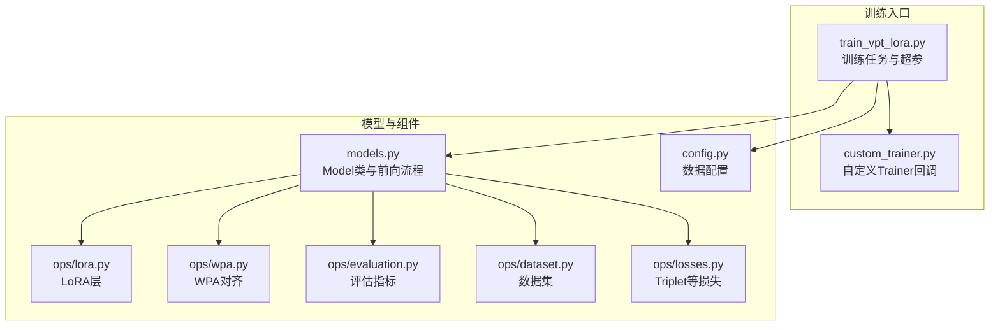
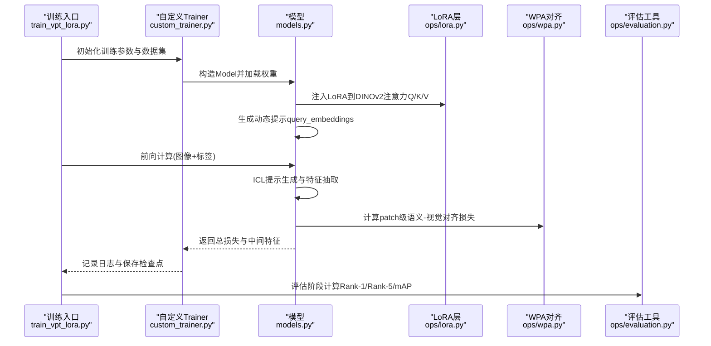
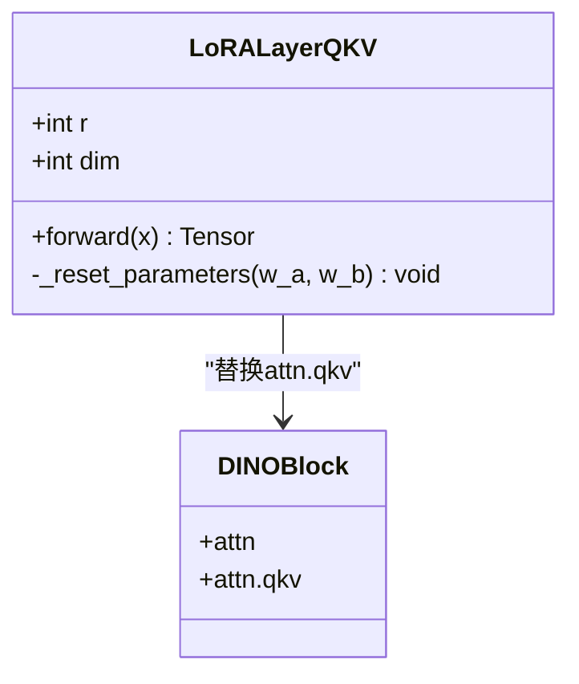
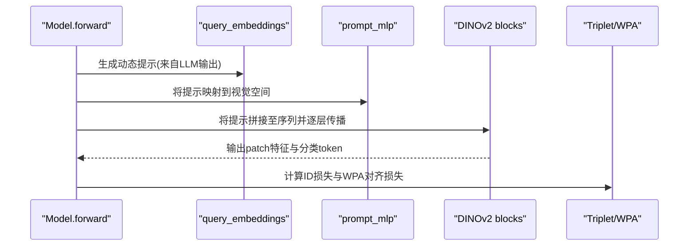
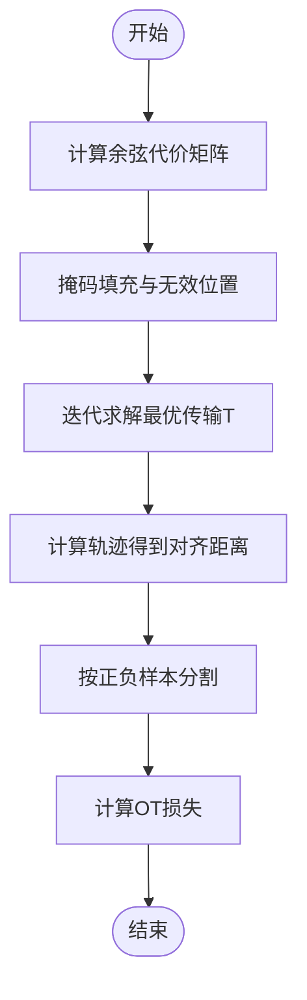
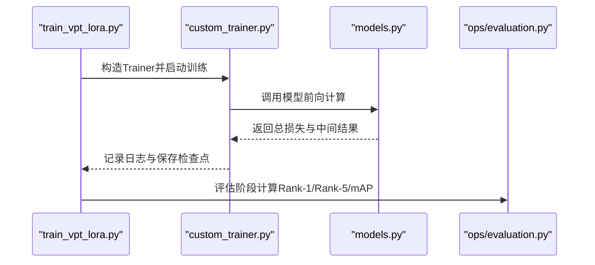
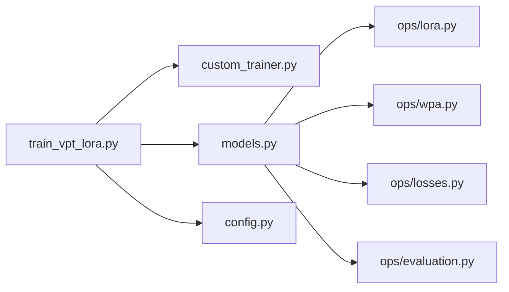

# 高级特性与扩展

<cite>
**本文引用的文件**
- [README.md](file://README.md)
- [config.py](file://config.py)
- [models.py](file://models.py)
- [ops/lora.py](file://ops/lora.py)
- [ops/wpa.py](file://ops/wpa.py)
- [ops/evaluation.py](file://ops/evaluation.py)
- [ops/dataset.py](file://ops/dataset.py)
- [ops/losses.py](file://ops/losses.py)
- [train_vpt_lora.py](file://train_vpt_lora.py)
- [custom_trainer.py](file://custom_trainer.py)
</cite>

## 目录
1. [简介](#简介)
2. [项目结构](#项目结构)
3. [核心组件](#核心组件)
4. [架构总览](#架构总览)
5. [详细组件分析](#详细组件分析)
6. [依赖关系分析](#依赖关系分析)
7. [性能考量](#性能考量)
8. [故障排查指南](#故障排查指南)
9. [结论](#结论)
10. [附录](#附录)

## 简介
本文件聚焦VICP框架的三大高级特性：LoRA微调、VPT提示学习与WPA对齐机制。文档从代码层面解析这些特性的实现方式、注入位置、优化策略与数据流，并结合训练脚本与评估指标，给出性能增益与工程实践建议。目标读者包括希望深入理解模型内部机制的高级用户与需要快速上手的工程师。

## 项目结构
- 核心模块
  - 模型定义与前向流程：models.py
  - 训练入口与任务封装：train_vpt_lora.py、custom_trainer.py
  - LoRA与WPA实现：ops/lora.py、ops/wpa.py
  - 数据集与评估工具：ops/dataset.py、ops/evaluation.py
  - 其他损失函数：ops/losses.py
  - 数据配置：config.py
- 关键特性分布
  - LoRA：在DINOv2注意力层注入低秩适配矩阵，仅训练少量参数以实现高效梯度更新
  - VPT：在视觉编码器的多层块中注入可学习提示嵌入，通过LLM生成动态提示并引导视觉特征提取
  - WPA：基于最优传输理论，对齐文本语义与图像patch，构建语义-视觉对应关系

**图表来源**
- [train_vpt_lora.py](file://train_vpt_lora.py#L1-L295)
- [custom_trainer.py](file://custom_trainer.py#L1-L156)
- [models.py](file://models.py#L1-L291)
- [ops/lora.py](file://ops/lora.py#L1-L99)
- [ops/wpa.py](file://ops/wpa.py#L1-L110)
- [ops/evaluation.py](file://ops/evaluation.py#L1-L482)
- [ops/dataset.py](file://ops/dataset.py#L1-L178)
- [ops/losses.py](file://ops/losses.py#L1-L416)
- [config.py](file://config.py#L1-L16)

**章节来源**
- [README.md](file://README.md#L1-L73)
- [train_vpt_lora.py](file://train_vpt_lora.py#L1-L295)
- [models.py](file://models.py#L1-L291)

## 核心组件
- LoRA微调（低秩适配）
  - 在DINOv2的注意力QKV线性层中注入独立的低秩适配子层，仅训练少量参数，实现参数高效的梯度更新
- VPT提示学习（视觉提示）
  - 使用可学习的query_embeddings作为视觉提示，注入到DINOv2的多个编码器层中，通过LLM生成动态提示并引导视觉特征提取
- WPA对齐（语义-图像对齐）
  - 基于最优传输理论，计算文本与图像patch之间的代价矩阵，通过迭代算法求解最优传输，得到语义-视觉对齐的匹配度

**章节来源**
- [ops/lora.py](file://ops/lora.py#L1-L99)
- [models.py](file://models.py#L1-L291)
- [ops/wpa.py](file://ops/wpa.py#L1-L110)

## 架构总览
下图展示VICP在训练阶段的关键交互：训练入口负责构造模型与数据集，模型在前向过程中完成LoRA注入、VPT提示注入与WPA对齐，并输出多路损失与特征；评估阶段使用标准化特征与相似度计算进行指标评估。

**图表来源**
- [train_vpt_lora.py](file://train_vpt_lora.py#L1-L295)
- [custom_trainer.py](file://custom_trainer.py#L1-L156)
- [models.py](file://models.py#L1-L291)
- [ops/lora.py](file://ops/lora.py#L1-L99)
- [ops/wpa.py](file://ops/wpa.py#L1-L110)
- [ops/evaluation.py](file://ops/evaluation.py#L1-L482)

## 详细组件分析

### LoRA微调：LoRALayerQKV在DINOv2注意力中的注入
- 注入位置
  - 在DINOv2的最后若干个编码器块中，将原始注意力QKV线性层替换为LoRALayerQKV，分别对Q、K、V三个分支注入低秩适配
- 实现要点
  - 低秩适配矩阵以独立的线性层形式存在，前向时先计算原QKV输出，再叠加低秩适配项，最终返回增强后的Q/K/V通道
  - 参数初始化采用特定策略，保证适配矩阵在训练初期不会破坏预训练权重的稳定性
- 性能影响
  - 仅训练低秩参数，显著降低参数量与内存占用，同时保持对注意力机制的有效调节

**图表来源**
- [ops/lora.py](file://ops/lora.py#L58-L99)
- [models.py](file://models.py#L81-L120)

**章节来源**
- [ops/lora.py](file://ops/lora.py#L1-L99)
- [models.py](file://models.py#L81-L120)

### VPT提示学习：可学习提示嵌入的注入与优化
- 注入位置
  - 在DINOv2的多个编码器层中，将提示嵌入query_embeddings拼接到序列开头或指定位置，随后逐层传播
  - 提示通过LLM生成的动态提示向量经投影映射到视觉特征空间
- 优化方式
  - 训练时冻结预训练视觉编码器与LLM，仅优化提示嵌入与少量投影参数
  - 通过对比学习与三元组损失约束身份判别特征，提升提示对身份敏感特征的引导效果
- 效果
  - 动态提示使模型在未见类别上仍能提取ID判别特征，减少对大规模标注数据的依赖

**图表来源**
- [models.py](file://models.py#L120-L270)
- [ops/losses.py](file://ops/losses.py#L279-L348)

**章节来源**
- [models.py](file://models.py#L120-L270)
- [ops/losses.py](file://ops/losses.py#L279-L348)

### WPA对齐：最优传输理论下的语义-图像对应
- 理论基础
  - 使用余弦距离构建代价矩阵，通过迭代算法求解最优传输，衡量文本与图像patch之间的匹配程度
- 实现流程
  - 计算两组特征间的余弦距离，掩码处理填充与无效位置
  - 迭代求解最优传输矩阵，计算轨迹得到对齐距离
  - 基于正负样本标签计算OT损失，引导语义与视觉对齐

**图表来源**
- [ops/wpa.py](file://ops/wpa.py#L1-L110)

**章节来源**
- [ops/wpa.py](file://ops/wpa.py#L1-L110)

### 训练与评估流水线
- 训练入口
  - 定义训练参数、数据集与优化器，使用自定义Trainer记录额外损失
- 前向流程
  - 生成ICL提示，抽取视觉特征，计算ID损失与WPA对齐损失，汇总为总损失
- 评估指标
  - 使用标准化特征与相似度计算Rank-1、Rank-5与mAP，评估跨域泛化能力

**图表来源**
- [train_vpt_lora.py](file://train_vpt_lora.py#L1-L295)
- [custom_trainer.py](file://custom_trainer.py#L1-L156)
- [ops/evaluation.py](file://ops/evaluation.py#L360-L482)

**章节来源**
- [train_vpt_lora.py](file://train_vpt_lora.py#L1-L295)
- [custom_trainer.py](file://custom_trainer.py#L1-L156)
- [ops/evaluation.py](file://ops/evaluation.py#L360-L482)

## 依赖关系分析
- 组件耦合
  - 模型对LoRA与WPA的依赖通过前向流程耦合，LoRA仅影响注意力Q/K/V，WPA作用于patch特征
  - 训练入口与自定义Trainer通过回调聚合额外损失，便于统一监控
- 外部依赖
  - DINOv2视觉编码器、LLM（如Qwen）用于特征抽取与提示生成
  - 数据集与评估工具提供标准化的数据加载与指标计算

**图表来源**
- [train_vpt_lora.py](file://train_vpt_lora.py#L1-L295)
- [custom_trainer.py](file://custom_trainer.py#L1-L156)
- [models.py](file://models.py#L1-L291)
- [ops/lora.py](file://ops/lora.py#L1-L99)
- [ops/wpa.py](file://ops/wpa.py#L1-L110)
- [ops/losses.py](file://ops/losses.py#L1-L416)
- [ops/evaluation.py](file://ops/evaluation.py#L1-L482)
- [config.py](file://config.py#L1-L16)

**章节来源**
- [train_vpt_lora.py](file://train_vpt_lora.py#L1-L295)
- [models.py](file://models.py#L1-L291)

## 性能考量
- 参数效率
  - LoRA仅训练低秩参数，大幅降低训练成本与显存占用，适合在有限资源下进行快速微调
- 计算开销
  - WPA对齐涉及代价矩阵与迭代求解，建议在小批量或离线阶段使用，训练阶段可适当降低频率
- 泛化能力
  - VPT通过动态提示引导身份敏感特征，结合WPA对齐，有效提升未见类别上的ReID性能
- 工程建议
  - 使用混合精度训练，合理设置梯度累积步数与学习率调度
  - 在验证阶段使用标准化特征与mAP评估，关注跨域与跨光照场景的鲁棒性

[本节为通用性能讨论，不直接分析具体文件]

## 故障排查指南
- 训练不稳定
  - 检查LoRA秩大小与初始化策略，过大的秩可能导致预训练权重被过度扰动
  - 调整WPA损失权重，避免对主任务产生干扰
- 特征质量差
  - 确认提示嵌入是否正确拼接至序列，检查投影映射维度一致性
  - 核对数据预处理与归一化，确保输入图像与特征尺度一致
- 指标异常
  - 使用评估工具的标准化流程，确认Rank-1/Rank-5/mAP计算逻辑与标签一致性

**章节来源**
- [ops/lora.py](file://ops/lora.py#L1-L99)
- [models.py](file://models.py#L120-L270)
- [ops/evaluation.py](file://ops/evaluation.py#L360-L482)

## 结论
VICP通过LoRA微调、VPT提示学习与WPA对齐的协同，实现了在少量标注甚至无标注条件下对新类别的快速泛化。LoRA保证了参数效率，VPT提供了强大的动态提示能力，WPA则建立了语义与视觉的强对齐关系。结合标准化评估指标与工程化的训练流程，该框架在跨域ReID任务中展现出显著优势。

[本节为总结性内容，不直接分析具体文件]

## 附录

### 高级调优技巧与实验配置建议
- LoRA相关
  - 秩大小选择：从较小秩开始，逐步增大以平衡拟合能力与稳定性
  - 初始化策略：保持适配矩阵初始化接近零，避免对预训练权重造成剧烈扰动
- VPT相关
  - 提示长度与层数：根据任务复杂度调整每层提示数量，避免过多导致信息冗余
  - 提示投影：确保投影维度与视觉编码器一致，必要时使用零初始化以稳定训练
- WPA相关
  - 代价函数与掩码：确保填充与无效位置被正确掩码，避免对齐误差
  - 迭代参数：根据收敛情况调整迭代次数与温度系数，平衡速度与精度
- 训练与评估
  - 学习率与调度：在冻结预训练权重时，采用恒定或Warmup+常数策略
  - 批大小与梯度累积：在显存受限时提高累积步数，保持有效批大小
  - 评估指标：优先关注mAP与跨域Rank指标，综合评估泛化能力

[本节为通用建议，不直接分析具体文件]